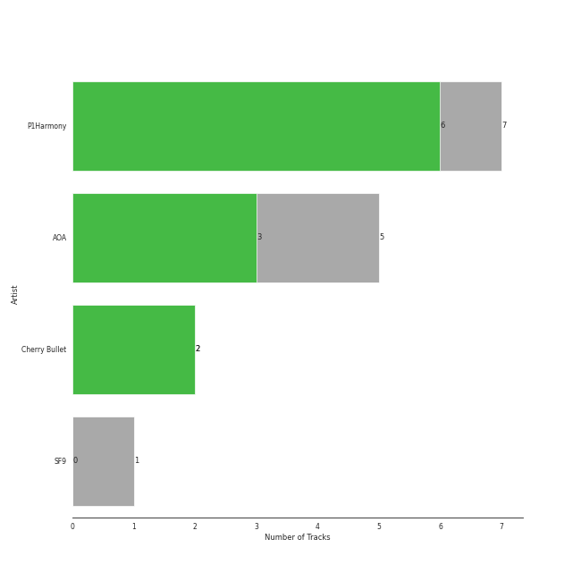
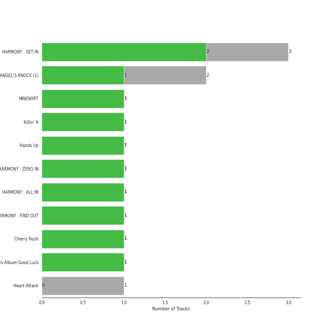
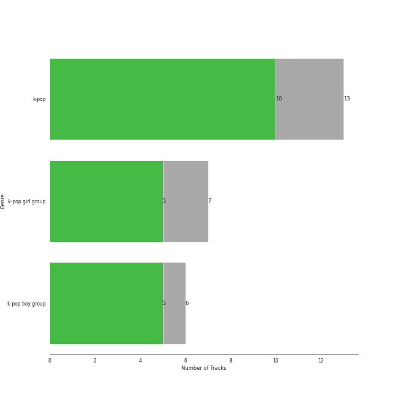
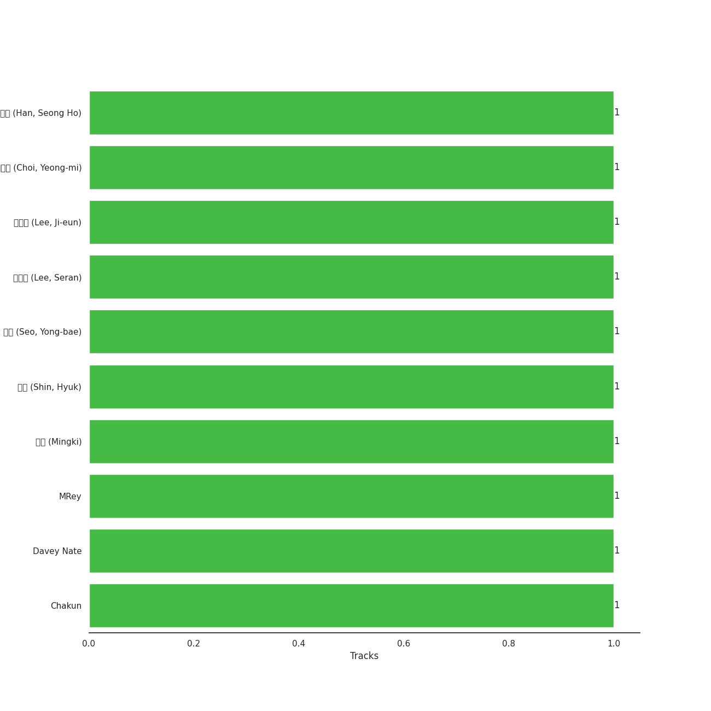

# FNC ENTERTAINMENT

14 songs

[See Track Features](audio_features.md)

[See Clusters](clusters/overview.md)

Appears as:
- FNC ENTERTAINMENT (13 tracks)
- FNC Entertainment (1 tracks)

## Top Artists

| Art | Tracks | 💚 | Artist | 🔗 |
|:---|---:|---:|:---|:---|
|  | 7 | 6 | [P1Harmony](../../artists/p1harmony/overview.md) | [🔗](https://open.spotify.com/artist/3JjvsPeGMbDJqsphe2z8xU) |
|  | 5 | 3 | AOA | [🔗](https://open.spotify.com/artist/54gWVQFHf8IIqbjxAoOarN) |
|  | 2 | 2 | Cherry Bullet | [🔗](https://open.spotify.com/artist/3IJCdgkBZbieocLZ4e94GZ) |

## Top Albums

| Art | Tracks | 💚 | Album | Release Date | 🔗 |
|:---|---:|---:|:---|:---|:---|
|  | 3 | 2 | HARMONY : SET IN | 2022-11-30 | [🔗](https://open.spotify.com/album/1JDHisMjuJ1QkhcXiiLnnX) |
|  | 2 | 1 | AOA 1st Album ANGEL'S KNOCK (1) | 2017-01-02 | [🔗](https://open.spotify.com/album/4AltTzzJMv0bER1rj3oUln) |
|  | 1 | 1 | MINISKIRT | 2014-01-16 | [🔗](https://open.spotify.com/album/6esB2DBt46m38ZycDPsn8D) |
|  | 1 | 1 | Killin' It | 2024-02-05 | [🔗](https://open.spotify.com/album/7FbyxnCCfB4t8N8qwHrHi6) |
|  | 1 | 1 | Hands Up | 2020-02-11 | [🔗](https://open.spotify.com/album/5HyrUteikoFGu38bAf7zYc) |
|  | 1 | 1 | HARMONY : ZERO IN | 2022-07-20 | [🔗](https://open.spotify.com/album/73CTPjApMDvFsycjbbROji) |
|  | 1 | 1 | HARMONY : ALL IN | 2023-06-08 | [🔗](https://open.spotify.com/album/67nhgkEfNwdqQt7QFYHw0B) |
|  | 1 | 1 | DISHARMONY : FIND OUT | 2022-01-03 | [🔗](https://open.spotify.com/album/13kHQp4zyK5jBpsFZmTvHz) |
|  | 1 | 1 | Cherry Rush | 2021-01-20 | [🔗](https://open.spotify.com/album/0W9GrOL1veUcQdbPvgjj9i) |
|  | 1 | 1 | AOA 4th Mini Album Good Luck | 2016-05-16 | [🔗](https://open.spotify.com/album/3D4EskjAYfo91G4BN7XcbB) |

See all 11 albums

| Art | Tracks | 💚 | Album | Release Date | 🔗 |
|:---|---:|---:|:---|:---|:---|
|  | 1 | 0 | Heart Attack | 2015-06-22 | [🔗](https://open.spotify.com/album/1VTC6SmzvyPnWsEuQ0clrb) |

## Genres

| Tracks | 💚 | Genre |
|---:|---:|:---|
| 14 | 11 | [k-pop](../../genres/k-pop/overview.md) |
| 7 | 6 | [k-pop boy group](../../genres/k-pop_boy_group/overview.md) |
| 7 | 5 | [k-pop girl group](../../genres/k-pop_girl_group/overview.md) |

## Top Producers

| Art | Producer | Tracks | Credit Types |
|:---|:---|---:|:---|
| | 한성호 (Han, Seong Ho) | 2 | Lyricist |
| | 밍키 (Mingki) | 2 | Arranger, Lyricist, Songwriter |
| | Chakun | 2 | Lyricist, Songwriter |
|  | Jimin | 1 | Lyricist |
| | [용배 (Seo, Yong-bae)](../../producers/용배_(seo,_yong-bae)/overview.md) | 1 | Arranger, Lyricist, Songwriter |
| | 이스란 (Lee, Seran) | 1 | Lyricist |
| | 이상호 (Lee, Sang-Ho) | 1 | Arranger, Lyricist, Songwriter |
| | MRey | 1 | Arranger, Songwriter |
| | [김도훈 (Kim, Do-hoon)](../../producers/김도훈_(kim,_do-hoon)/overview.md) | 1 | Lyricist, Songwriter |
| | Brave Brothers | 1 | Arranger, Lyricist, Songwriter |

View all

| Art | Producer | Tracks | Credit Types |
|:---|:---|---:|:---|
| | 이정민 (Lee, Jung-Min) | 1 | Arranger |
| | 최영미 (Choi, Yeong-mi) | 1 | Lyricist |
| | Davey Nate | 1 | Songwriter |
| | 코끼리왕국 (ElephantKingdom) | 1 | Arranger, Songwriter |
| | 신혁 (Shin, Hyuk) | 1 | Arranger, Songwriter |
| | 이지은 (Lee, Ji-eun) | 1 | Lyricist |

## Tracks released under FNC ENTERTAINMENT

| Art | Track | Album | Artists | Label | Rank | 💚 | 🔗 |
|:---|:---|:---|:---|:---|---:|:---|:---|
|  | JUMP | HARMONY : ALL IN | [P1Harmony](../../artists/p1harmony/overview.md) | [FNC ENTERTAINMENT](.) | 336 | 💚 | [🔗](https://open.spotify.com/track/4vTXBC7QOjEbi8DcJvCNE2) |
|  | Love So Sweet | Cherry Rush | Cherry Bullet | [FNC ENTERTAINMENT](.) | 455 | 💚 | [🔗](https://open.spotify.com/track/0Z2DbHevn9qtSKAWcYB2tM) |
|  | Do It Like This | DISHARMONY : FIND OUT | [P1Harmony](../../artists/p1harmony/overview.md) | [FNC ENTERTAINMENT](.) | 778 | 💚 | [🔗](https://open.spotify.com/track/0aW4RWeGekBfU2NhREc5kL) |
|  | Miniskirt | MINISKIRT | AOA | [FNC ENTERTAINMENT](.) | nan | 💚 | [🔗](https://open.spotify.com/track/6Yj8kVuVR3UPxx9r5eFEoV) |
|  | Heart Attack | Heart Attack | AOA | [FNC ENTERTAINMENT](.) | nan | | [🔗](https://open.spotify.com/track/7pm5uhK7xiEM9fQvuCE78l) |
|  | Good Luck | AOA 4th Mini Album Good Luck | AOA | [FNC ENTERTAINMENT](.) | nan | 💚 | [🔗](https://open.spotify.com/track/577ckDBuyYNGeqetUhbv7d) |
|  | Bing Bing | AOA 1st Album ANGEL'S KNOCK (1) | AOA | [FNC ENTERTAINMENT](.) | nan | 💚 | [🔗](https://open.spotify.com/track/4fCUZbBdlcUY3KUqHdEoZK) |
|  | Excuse Me | AOA 1st Album ANGEL'S KNOCK (1) | AOA | [FNC ENTERTAINMENT](.) | nan | | [🔗](https://open.spotify.com/track/2Gq8bwrWXzc1gW9g2EnHTh) |
|  | Hands Up | Hands Up | Cherry Bullet | [FNC Entertainment](.) | nan | 💚 | [🔗](https://open.spotify.com/track/6KxACudfT4vVXnDUkjU6lN) |
|  | Doom Du Doom | HARMONY : ZERO IN | [P1Harmony](../../artists/p1harmony/overview.md) | [FNC ENTERTAINMENT](.) | nan | 💚 | [🔗](https://open.spotify.com/track/41tvdK0UNp3oNKWDPkg7FO) |

See all tracks

| Art | Track | Album | Artists | Label | Rank | 💚 | 🔗 |
|:---|:---|:---|:---|:---|---:|:---|:---|
|  | BFF (Best Friends Forever) | HARMONY : SET IN | [P1Harmony](../../artists/p1harmony/overview.md) | [FNC ENTERTAINMENT](.) | nan | 💚 | [🔗](https://open.spotify.com/track/4sJqthsQcuyjhYbJS1JExL) |
|  | Back Down | HARMONY : SET IN | [P1Harmony](../../artists/p1harmony/overview.md) | [FNC ENTERTAINMENT](.) | nan | 💚 | [🔗](https://open.spotify.com/track/7EP9G7AIKrywWGdYsYZzGv) |
|  | Secret Sauce | HARMONY : SET IN | [P1Harmony](../../artists/p1harmony/overview.md) | [FNC ENTERTAINMENT](.) | nan | | [🔗](https://open.spotify.com/track/31wuLarPgLZJSlohr7OCjj) |
|  | Killin' It | Killin' It | [P1Harmony](../../artists/p1harmony/overview.md) | [FNC ENTERTAINMENT](.) | nan | 💚 | [🔗](https://open.spotify.com/track/2E7qG81LXdZEfobhcrVm06) |

