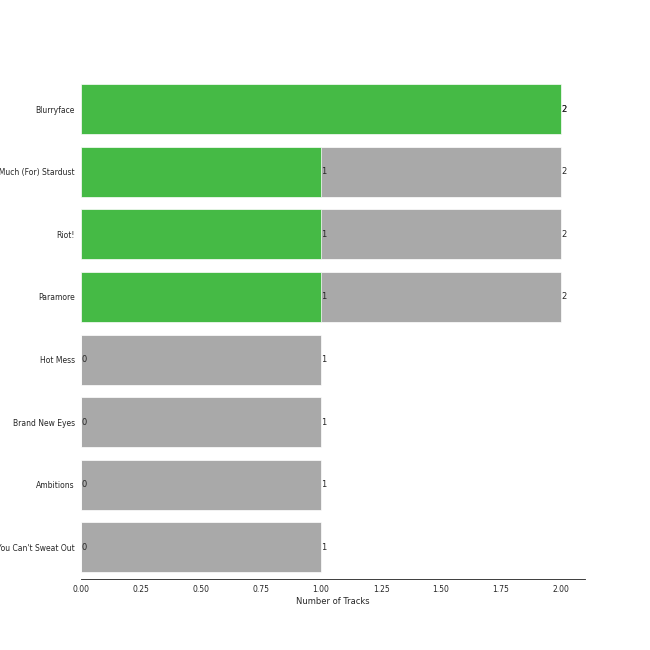

# Fueled By Ramen

12 songs

[See Track Features](audio_features.md)

[See Clusters](clusters/overview.md)

Appears as:
- Fueled By Ramen (10 tracks)
- Decaydance Records / Fueled By Ramen (1 tracks)
- Decaydance/Fueled By Ramen (1 tracks)

## Top Artists

| Art | Tracks | 💚 | Artist | 🔗 |
|:---|---:|---:|:---|:---|
|  | 5 | 2 | Paramore | [🔗](https://open.spotify.com/artist/74XFHRwlV6OrjEM0A2NCMF) |
|  | 2 | 2 | Twenty One Pilots | [🔗](https://open.spotify.com/artist/3YQKmKGau1PzlVlkL1iodx) |
|  | 2 | 1 | Fall Out Boy | [🔗](https://open.spotify.com/artist/4UXqAaa6dQYAk18Lv7PEgX) |
|  | 1 | 1 | ONE OK ROCK | [🔗](https://open.spotify.com/artist/7k73EtZwoPs516ZxE72KsO) |
|  | 1 | 0 | Leighton Meester | [🔗](https://open.spotify.com/artist/481VlDdXZAIRxnHyywNbXn) |
|  | 1 | 0 | Cobra Starship | [🔗](https://open.spotify.com/artist/2aYJ5LAta2ScCdfLhKgZOY) |
|  | 1 | 0 | Panic! At The Disco | [🔗](https://open.spotify.com/artist/20JZFwl6HVl6yg8a4H3ZqK) |

## Top Albums

| Art | Tracks | 💚 | Album | Release Date | 🔗 |
|:---|---:|---:|:---|:---|:---|
|  | 2 | 2 | Blurryface | 2015-05-15 | [🔗](https://open.spotify.com/album/3cQO7jp5S9qLBoIVtbkSM1) |
|  | 2 | 1 | So Much (For) Stardust | 2023-03-24 | [🔗](https://open.spotify.com/album/5rHd8n9uWIpq9w0PP5ZcI3) |
|  | 2 | 1 | Riot! | 2007-06-11 | [🔗](https://open.spotify.com/album/71rziY9eLo1tA2dBMxrwhc) |
|  | 2 | 1 | Paramore | 2013-04-05 | [🔗](https://open.spotify.com/album/4sgYpkIASM1jVlNC8Wp9oF) |
|  | 1 | 1 | Ambitions | 2017-01-13 | [🔗](https://open.spotify.com/album/0p1YL9nzIuKTonZH6Gq58i) |
|  | 1 | 0 | Hot Mess | 2009-07-07 | [🔗](https://open.spotify.com/album/41TUivD915ztiKgyu99H9T) |
|  | 1 | 0 | Brand New Eyes | 2009-09-28 | [🔗](https://open.spotify.com/album/27UqZoE1kV6sIV6uQcI28A) |
|  | 1 | 0 | A Fever You Can't Sweat Out | 2005-09-27 | [🔗](https://open.spotify.com/album/2YeOhhJg3OWpN0F1VYPxtW) |

## Genres

| Tracks | 💚 | Genre |
|---:|---:|:---|
| 10 | 5 | [pop](../../genres/pop/overview.md) |
| 10 | 5 | [modern rock](../../genres/modern_rock/overview.md) |
| 9 | 5 | [rock](../../genres/rock/overview.md) |
| 6 | 2 | pop punk |
| 5 | 2 | pop emo |
| 5 | 2 | pixie |
| 5 | 2 | candy pop |
| 2 | 2 | pov: indie |
| 2 | 1 | emo |
| 1 | 1 | j-rock |

See all 13 genres

| Tracks | 💚 | Genre |
|---:|---:|:---|
| 1 | 1 | j-pop |
| 1 | 0 | [post-teen pop](../../genres/post-teen_pop/overview.md) |
| 1 | 0 | neon pop punk |

## Top Producers

| Art | Producer | Tracks | Credit Types |
|:---|:---|---:|:---|
| | Neal Avron | 2 | Producer |
| | Tyler Joseph | 2 | Lyricist, Producer, Songwriter |
| | Hayley Williams | 2 | Songwriter |
| | Andy Hurley | 1 | Songwriter |
| | Ben Sabin | 1 | Producer |
| | Taylor York | 1 | Producer, Songwriter |
| | Joe Viers | 1 | Producer |
| | Adam Hawkins | 1 | Producer |
| | Andrew Kapner | 1 | Producer |
| | [Ricky Reed](../../producers/ricky_reed/overview.md) | 1 | Producer |

View all

| Art | Producer | Tracks | Credit Types |
|:---|:---|---:|:---|
| | Joe Trohman | 1 | Songwriter |
| | Josh Farro | 1 | Songwriter |
| | Mike Elizondo | 1 | Producer |
| | Justin Meldal-Johnsen | 1 | Producer |
| | Patrick Stump | 1 | Songwriter |
| | David Bendeth | 1 | Producer |
| | Colin Brittain | 1 | Producer |
| | Pete Wentz | 1 | Songwriter |
| | Jonathan Gerring | 1 | Producer |

## Tracks released under Fueled By Ramen

| Art | Track | Album | Artists | Label | Rank | 💚 | 🔗 |
|:---|:---|:---|:---|:---|---:|:---|:---|
|  | Misery Business | Riot! | Paramore | [Fueled By Ramen](.) | 253 | 💚 | [🔗](https://open.spotify.com/track/6SpLc7EXZIPpy0sVko0aoU) |
|  | I Write Sins Not Tragedies | A Fever You Can't Sweat Out | Panic! At The Disco | [Decaydance Records / Fueled By Ramen](.) | nan | | [🔗](https://open.spotify.com/track/4bPQs0PHn4xbipzdPfn6du) |
|  | That's What You Get | Riot! | Paramore | [Fueled By Ramen](.) | nan | | [🔗](https://open.spotify.com/track/1JdKrFyoU05abww0Zv0ayQ) |
|  | Good Girls Go Bad (feat. Leighton Meester) | Hot Mess | Cobra Starship, Leighton Meester | [Decaydance/Fueled By Ramen](.) | nan | | [🔗](https://open.spotify.com/track/7kMfu3KUydmrFVGEAhjtyl) |
|  | The Only Exception | Brand New Eyes | Paramore | [Fueled By Ramen](.) | nan | | [🔗](https://open.spotify.com/track/7JIuqL4ZqkpfGKQhYlrirs) |
|  | Ain't It Fun | Paramore | Paramore | [Fueled By Ramen](.) | nan | 💚 | [🔗](https://open.spotify.com/track/1j8z4TTjJ1YOdoFEDwJTQa) |
|  | Still into You | Paramore | Paramore | [Fueled By Ramen](.) | nan | | [🔗](https://open.spotify.com/track/1yjY7rpaAQvKwpdUliHx0d) |
|  | Ride | Blurryface | Twenty One Pilots | [Fueled By Ramen](.) | nan | 💚 | [🔗](https://open.spotify.com/track/2Z8WuEywRWYTKe1NybPQEW) |
|  | Stressed Out | Blurryface | Twenty One Pilots | [Fueled By Ramen](.) | nan | 💚 | [🔗](https://open.spotify.com/track/3CRDbSIZ4r5MsZ0YwxuEkn) |
|  | We Are | Ambitions | ONE OK ROCK | [Fueled By Ramen](.) | nan | 💚 | [🔗](https://open.spotify.com/track/57sk9X1fPLXRfkw74XNrmK) |

See all tracks

| Art | Track | Album | Artists | Label | Rank | 💚 | 🔗 |
|:---|:---|:---|:---|:---|---:|:---|:---|
|  | Heartbreak Feels So Good | So Much (For) Stardust | Fall Out Boy | [Fueled By Ramen](.) | nan | 💚 | [🔗](https://open.spotify.com/track/2DIo5VoBB6X1GzgpGbmMIF) |
|  | We Didn’t Start The Fire (Bonus Track) | So Much (For) Stardust | Fall Out Boy | [Fueled By Ramen](.) | nan | | [🔗](https://open.spotify.com/track/22H7neCMj03ifZXlix1B6h) |

