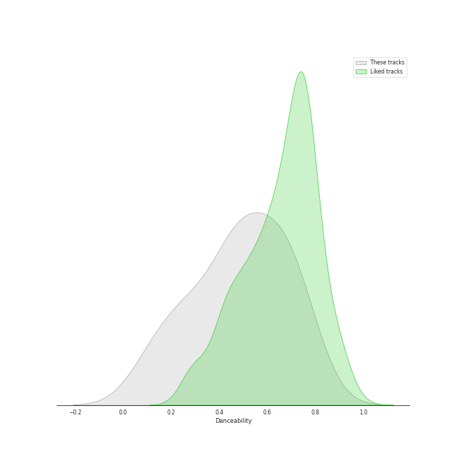
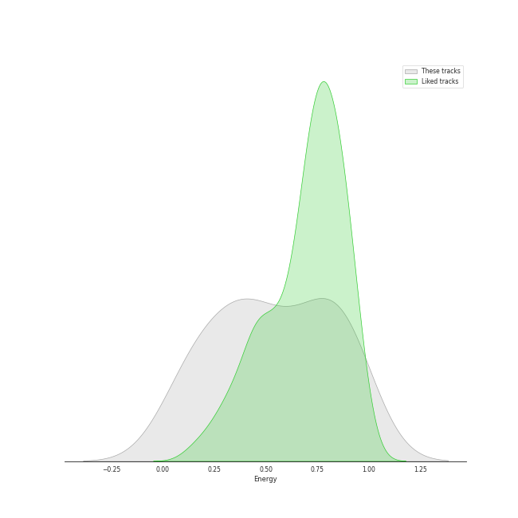
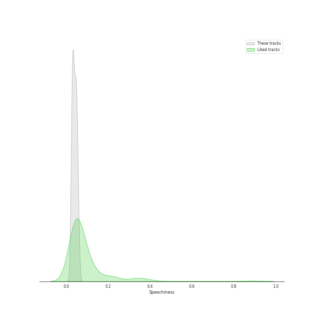
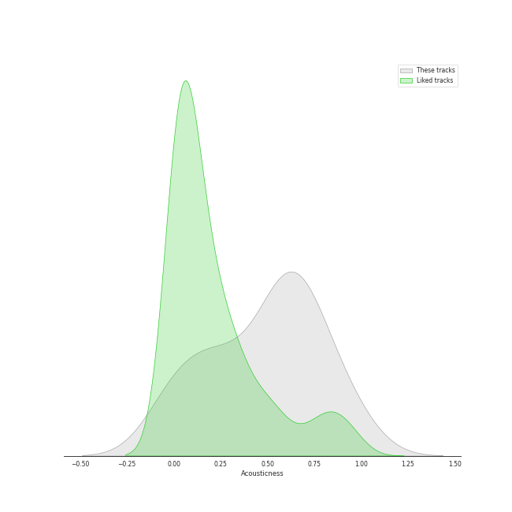
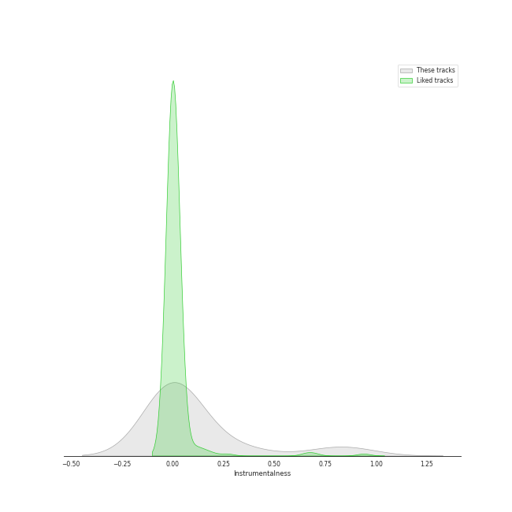
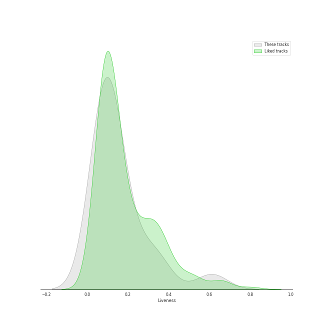
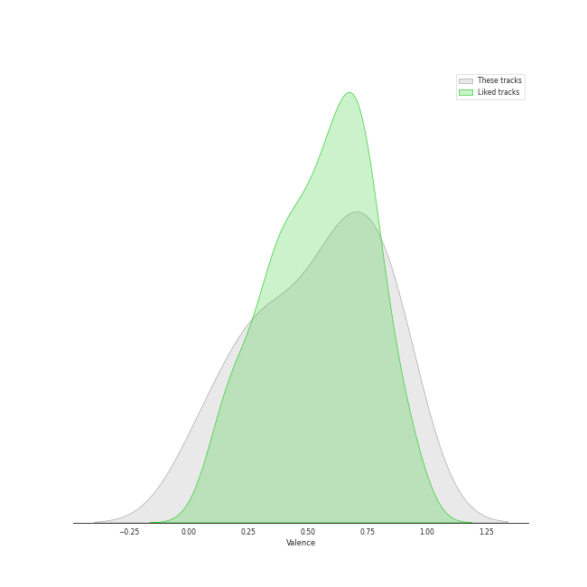

# Track Features for Geffen

## Danceability

| ​ | 10 most Danceable tracks | ​​ | 10 least Danceable tracks |
|:---|:---|:---|:---|
|  | Jingle Bell Rock (0.754) |  | White Christmas - 1947 Version (0.317) |
|  | Won't Get Fooled Again - Remix (0.702) |  | My Generation - Stereo Version (0.412) |
|  | A Holly Jolly Christmas - Single Version (0.683) |  | It's Beginning To Look Like Christmas (0.473) |
|  | Who Are You (0.651) |  | I'd Rather Go Blind (0.477) |
|  | Moonlight (0.642) |  | Smells Like Teen Spirit (0.502) |
|  | Come Go With Me (0.566) |  | Come Go With Me (0.566) |
|  | Smells Like Teen Spirit (0.502) |  | Moonlight (0.642) |
|  | I'd Rather Go Blind (0.477) |  | Who Are You (0.651) |
|  | It's Beginning To Look Like Christmas (0.473) |  | A Holly Jolly Christmas - Single Version (0.683) |
|  | My Generation - Stereo Version (0.412) |  | Won't Get Fooled Again - Remix (0.702) |

## Energy

| ​ | 10 most Energetic tracks | ​​ | 10 least Energetic tracks |
|:---|:---|:---|:---|
|  | Smells Like Teen Spirit (0.912) |  | White Christmas - 1947 Version (0.158) |
|  | Won't Get Fooled Again - Remix (0.841) |  | It's Beginning To Look Like Christmas (0.212) |
|  | My Generation - Stereo Version (0.782) |  | A Holly Jolly Christmas - Single Version (0.375) |
|  | Moonlight (0.706) |  | Jingle Bell Rock (0.424) |
|  | Who Are You (0.648) |  | I'd Rather Go Blind (0.433) |
|  | Come Go With Me (0.534) |  | Come Go With Me (0.534) |
|  | I'd Rather Go Blind (0.433) |  | Who Are You (0.648) |
|  | Jingle Bell Rock (0.424) |  | Moonlight (0.706) |
|  | A Holly Jolly Christmas - Single Version (0.375) |  | My Generation - Stereo Version (0.782) |
|  | It's Beginning To Look Like Christmas (0.212) |  | Won't Get Fooled Again - Remix (0.841) |

## Speechiness

| ​ | 10 most Speechy tracks | ​​ | 10 least Speechy tracks |
|:---|:---|:---|:---|
|  | My Generation - Stereo Version (0.058) |  | I'd Rather Go Blind (0.0247) |
|  | Smells Like Teen Spirit (0.0564) |  | A Holly Jolly Christmas - Single Version (0.0303) |
|  | Moonlight (0.052) |  | Jingle Bell Rock (0.0363) |
|  | Who Are You (0.0501) |  | White Christmas - 1947 Version (0.0381) |
|  | It's Beginning To Look Like Christmas (0.0496) |  | Come Go With Me (0.0409) |
|  | Won't Get Fooled Again - Remix (0.045) |  | Won't Get Fooled Again - Remix (0.045) |
|  | Come Go With Me (0.0409) |  | It's Beginning To Look Like Christmas (0.0496) |
|  | White Christmas - 1947 Version (0.0381) |  | Who Are You (0.0501) |
|  | Jingle Bell Rock (0.0363) |  | Moonlight (0.052) |
|  | A Holly Jolly Christmas - Single Version (0.0303) |  | Smells Like Teen Spirit (0.0564) |

## Acousticness

| ​ | 10 most Acoustic tracks | ​​ | 10 least Acoustic tracks |
|:---|:---|:---|:---|
|  | It's Beginning To Look Like Christmas (0.77) |  | Smells Like Teen Spirit (2.55e-05) |
|  | Come Go With Me (0.713) |  | Won't Get Fooled Again - Remix (0.256) |
|  | I'd Rather Go Blind (0.689) |  | Who Are You (0.262) |
|  | White Christmas - 1947 Version (0.673) |  | My Generation - Stereo Version (0.308) |
|  | Jingle Bell Rock (0.643) |  | Moonlight (0.518) |
|  | A Holly Jolly Christmas - Single Version (0.579) |  | A Holly Jolly Christmas - Single Version (0.579) |
|  | Moonlight (0.518) |  | Jingle Bell Rock (0.643) |
|  | My Generation - Stereo Version (0.308) |  | White Christmas - 1947 Version (0.673) |
|  | Who Are You (0.262) |  | I'd Rather Go Blind (0.689) |
|  | Won't Get Fooled Again - Remix (0.256) |  | Come Go With Me (0.713) |

## Instrumentalness

| ​ | 10 most Instrumental tracks | ​​ | 10 least Instrumental tracks |
|:---|:---|:---|:---|
|  | White Christmas - 1947 Version (0.353) |  | Moonlight (0.0) |
|  | Won't Get Fooled Again - Remix (0.235) |  | Jingle Bell Rock (0.0) |
|  | My Generation - Stereo Version (0.00822) |  | It's Beginning To Look Like Christmas (0.0) |
|  | Who Are You (0.0042) |  | Come Go With Me (0.0) |
|  | I'd Rather Go Blind (0.000195) |  | A Holly Jolly Christmas - Single Version (0.0) |
|  | Smells Like Teen Spirit (0.000173) |  | Smells Like Teen Spirit (0.000173) |
|  | A Holly Jolly Christmas - Single Version (0.0) |  | I'd Rather Go Blind (0.000195) |
|  | Come Go With Me (0.0) |  | Who Are You (0.0042) |
|  | It's Beginning To Look Like Christmas (0.0) |  | My Generation - Stereo Version (0.00822) |
|  | Jingle Bell Rock (0.0) |  | Won't Get Fooled Again - Remix (0.235) |

## Liveness

| ​ | 10 most Live tracks | ​​ | 10 least Live tracks |
|:---|:---|:---|:---|
|  | White Christmas - 1947 Version (0.338) |  | Won't Get Fooled Again - Remix (0.0584) |
|  | Moonlight (0.25) |  | Jingle Bell Rock (0.0652) |
|  | I'd Rather Go Blind (0.151) |  | Who Are You (0.0655) |
|  | It's Beginning To Look Like Christmas (0.136) |  | A Holly Jolly Christmas - Single Version (0.076) |
|  | Smells Like Teen Spirit (0.106) |  | My Generation - Stereo Version (0.0775) |
|  | Come Go With Me (0.0883) |  | Come Go With Me (0.0883) |
|  | My Generation - Stereo Version (0.0775) |  | Smells Like Teen Spirit (0.106) |
|  | A Holly Jolly Christmas - Single Version (0.076) |  | It's Beginning To Look Like Christmas (0.136) |
|  | Who Are You (0.0655) |  | I'd Rather Go Blind (0.151) |
|  | Jingle Bell Rock (0.0652) |  | Moonlight (0.25) |

## Valence

| ​ | 10 most Happy tracks | ​​ | 10 least Happy tracks |
|:---|:---|:---|:---|
|  | Moonlight (0.896) |  | White Christmas - 1947 Version (0.247) |
|  | A Holly Jolly Christmas - Single Version (0.888) |  | Won't Get Fooled Again - Remix (0.271) |
|  | Jingle Bell Rock (0.806) |  | Who Are You (0.49) |
|  | Smells Like Teen Spirit (0.72) |  | It's Beginning To Look Like Christmas (0.576) |
|  | My Generation - Stereo Version (0.705) |  | Come Go With Me (0.582) |
|  | I'd Rather Go Blind (0.611) |  | I'd Rather Go Blind (0.611) |
|  | Come Go With Me (0.582) |  | My Generation - Stereo Version (0.705) |
|  | It's Beginning To Look Like Christmas (0.576) |  | Smells Like Teen Spirit (0.72) |
|  | Who Are You (0.49) |  | Jingle Bell Rock (0.806) |
|  | Won't Get Fooled Again - Remix (0.271) |  | A Holly Jolly Christmas - Single Version (0.888) |

## Tempo

| ​ | 10 most Fast tracks | ​​ | 10 least Fast tracks |
|:---|:---|:---|:---|
|  | Who Are You (156.372) |  | I'd Rather Go Blind (82.52) |
|  | A Holly Jolly Christmas - Single Version (140.467) |  | My Generation - Stereo Version (96.732) |
|  | Moonlight (136.851) |  | It's Beginning To Look Like Christmas (96.94) |
|  | Won't Get Fooled Again - Remix (134.919) |  | Smells Like Teen Spirit (116.761) |
|  | White Christmas - 1947 Version (130.503) |  | Jingle Bell Rock (119.705) |
|  | Come Go With Me (129.69) |  | Come Go With Me (129.69) |
|  | Jingle Bell Rock (119.705) |  | White Christmas - 1947 Version (130.503) |
|  | Smells Like Teen Spirit (116.761) |  | Won't Get Fooled Again - Remix (134.919) |
|  | It's Beginning To Look Like Christmas (96.94) |  | Moonlight (136.851) |
|  | My Generation - Stereo Version (96.732) |  | A Holly Jolly Christmas - Single Version (140.467) |
