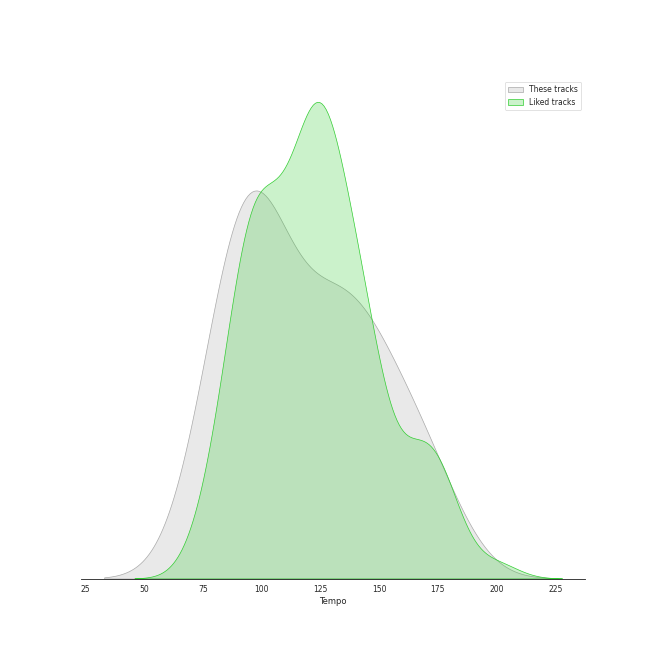

# Audio Features for Geffen

## Danceability

| 10 most Danceable tracks | 10 least Danceable tracks |
|:---|:---|
| Jingle Bell Rock (0.754) | White Christmas (0.317) |
| Won't Get Fooled Again - Remix (0.702) | My Generation - Stereo Version (0.412) |
| A Holly Jolly Christmas - Single Version (0.683) | It's Beginning To Look Like Christmas (0.473) |
| Who Are You (0.651) | I'd Rather Go Blind (0.477) |
| Come Go With Me (0.566) | Smells Like Teen Spirit (0.502) |
| Smells Like Teen Spirit (0.502) | Come Go With Me (0.566) |
| I'd Rather Go Blind (0.477) | Who Are You (0.651) |
| It's Beginning To Look Like Christmas (0.473) | A Holly Jolly Christmas - Single Version (0.683) |
| My Generation - Stereo Version (0.412) | Won't Get Fooled Again - Remix (0.702) |
| White Christmas (0.317) | Jingle Bell Rock (0.754) |

## Energy

| 10 most Energetic tracks | 10 least Energetic tracks |
|:---|:---|
| Smells Like Teen Spirit (0.912) | White Christmas (0.158) |
| Won't Get Fooled Again - Remix (0.841) | It's Beginning To Look Like Christmas (0.212) |
| My Generation - Stereo Version (0.782) | A Holly Jolly Christmas - Single Version (0.375) |
| Who Are You (0.648) | Jingle Bell Rock (0.424) |
| Come Go With Me (0.534) | I'd Rather Go Blind (0.433) |
| I'd Rather Go Blind (0.433) | Come Go With Me (0.534) |
| Jingle Bell Rock (0.424) | Who Are You (0.648) |
| A Holly Jolly Christmas - Single Version (0.375) | My Generation - Stereo Version (0.782) |
| It's Beginning To Look Like Christmas (0.212) | Won't Get Fooled Again - Remix (0.841) |
| White Christmas (0.158) | Smells Like Teen Spirit (0.912) |

## Speechiness

| 10 most Speechy tracks | 10 least Speechy tracks |
|:---|:---|
| My Generation - Stereo Version (0.058) | I'd Rather Go Blind (0.0247) |
| Smells Like Teen Spirit (0.0564) | A Holly Jolly Christmas - Single Version (0.0303) |
| Who Are You (0.0501) | Jingle Bell Rock (0.0363) |
| It's Beginning To Look Like Christmas (0.0496) | White Christmas (0.0381) |
| Won't Get Fooled Again - Remix (0.045) | Come Go With Me (0.0409) |
| Come Go With Me (0.0409) | Won't Get Fooled Again - Remix (0.045) |
| White Christmas (0.0381) | It's Beginning To Look Like Christmas (0.0496) |
| Jingle Bell Rock (0.0363) | Who Are You (0.0501) |
| A Holly Jolly Christmas - Single Version (0.0303) | Smells Like Teen Spirit (0.0564) |
| I'd Rather Go Blind (0.0247) | My Generation - Stereo Version (0.058) |

## Acousticness

| 10 most Acoustic tracks | 10 least Acoustic tracks |
|:---|:---|
| It's Beginning To Look Like Christmas (0.77) | Smells Like Teen Spirit (2.55e-05) |
| Come Go With Me (0.713) | Won't Get Fooled Again - Remix (0.256) |
| I'd Rather Go Blind (0.689) | Who Are You (0.262) |
| White Christmas (0.673) | My Generation - Stereo Version (0.308) |
| Jingle Bell Rock (0.643) | A Holly Jolly Christmas - Single Version (0.579) |
| A Holly Jolly Christmas - Single Version (0.579) | Jingle Bell Rock (0.643) |
| My Generation - Stereo Version (0.308) | White Christmas (0.673) |
| Who Are You (0.262) | I'd Rather Go Blind (0.689) |
| Won't Get Fooled Again - Remix (0.256) | Come Go With Me (0.713) |
| Smells Like Teen Spirit (2.55e-05) | It's Beginning To Look Like Christmas (0.77) |

## Instrumentalness

| 10 most Instrumental tracks | 10 least Instrumental tracks |
|:---|:---|
| White Christmas (0.353) | Jingle Bell Rock (0.0) |
| Won't Get Fooled Again - Remix (0.235) | It's Beginning To Look Like Christmas (0.0) |
| My Generation - Stereo Version (0.00822) | Come Go With Me (0.0) |
| Who Are You (0.0042) | A Holly Jolly Christmas - Single Version (0.0) |
| I'd Rather Go Blind (0.000195) | Smells Like Teen Spirit (0.000173) |
| Smells Like Teen Spirit (0.000173) | I'd Rather Go Blind (0.000195) |
| A Holly Jolly Christmas - Single Version (0.0) | Who Are You (0.0042) |
| Come Go With Me (0.0) | My Generation - Stereo Version (0.00822) |
| It's Beginning To Look Like Christmas (0.0) | Won't Get Fooled Again - Remix (0.235) |
| Jingle Bell Rock (0.0) | White Christmas (0.353) |

## Liveness

| 10 most Live tracks | 10 least Live tracks |
|:---|:---|
| White Christmas (0.338) | Won't Get Fooled Again - Remix (0.0584) |
| I'd Rather Go Blind (0.151) | Jingle Bell Rock (0.0652) |
| It's Beginning To Look Like Christmas (0.136) | Who Are You (0.0655) |
| Smells Like Teen Spirit (0.106) | A Holly Jolly Christmas - Single Version (0.076) |
| Come Go With Me (0.0883) | My Generation - Stereo Version (0.0775) |
| My Generation - Stereo Version (0.0775) | Come Go With Me (0.0883) |
| A Holly Jolly Christmas - Single Version (0.076) | Smells Like Teen Spirit (0.106) |
| Who Are You (0.0655) | It's Beginning To Look Like Christmas (0.136) |
| Jingle Bell Rock (0.0652) | I'd Rather Go Blind (0.151) |
| Won't Get Fooled Again - Remix (0.0584) | White Christmas (0.338) |

## Valence

| 10 most Happy tracks | 10 least Happy tracks |
|:---|:---|
| A Holly Jolly Christmas - Single Version (0.888) | White Christmas (0.247) |
| Jingle Bell Rock (0.806) | Won't Get Fooled Again - Remix (0.271) |
| Smells Like Teen Spirit (0.72) | Who Are You (0.49) |
| My Generation - Stereo Version (0.705) | It's Beginning To Look Like Christmas (0.576) |
| I'd Rather Go Blind (0.611) | Come Go With Me (0.582) |
| Come Go With Me (0.582) | I'd Rather Go Blind (0.611) |
| It's Beginning To Look Like Christmas (0.576) | My Generation - Stereo Version (0.705) |
| Who Are You (0.49) | Smells Like Teen Spirit (0.72) |
| Won't Get Fooled Again - Remix (0.271) | Jingle Bell Rock (0.806) |
| White Christmas (0.247) | A Holly Jolly Christmas - Single Version (0.888) |

## Tempo

| 10 most Fast tracks | 10 least Fast tracks |
|:---|:---|
| Who Are You (156.372) | I'd Rather Go Blind (82.52) |
| A Holly Jolly Christmas - Single Version (140.467) | My Generation - Stereo Version (96.732) |
| Won't Get Fooled Again - Remix (134.919) | It's Beginning To Look Like Christmas (96.94) |
| White Christmas (130.503) | Smells Like Teen Spirit (116.761) |
| Come Go With Me (129.69) | Jingle Bell Rock (119.705) |
| Jingle Bell Rock (119.705) | Come Go With Me (129.69) |
| Smells Like Teen Spirit (116.761) | White Christmas (130.503) |
| It's Beginning To Look Like Christmas (96.94) | Won't Get Fooled Again - Remix (134.919) |
| My Generation - Stereo Version (96.732) | A Holly Jolly Christmas - Single Version (140.467) |
| I'd Rather Go Blind (82.52) | Who Are You (156.372) |
