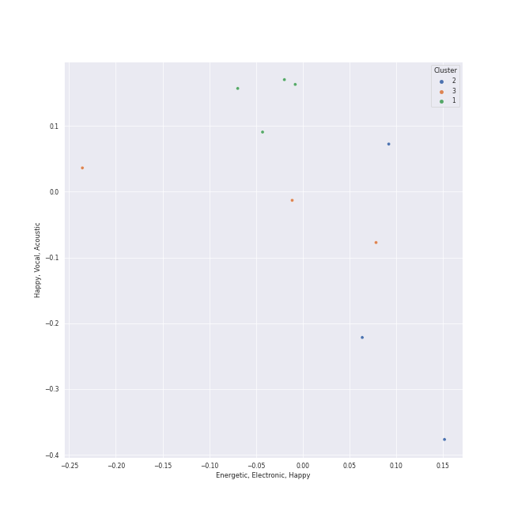

# Clusters in Geffen

## Cluster #1

3 tracks

| Art | Track | Album | Artists | Label | Rank | 💚 | 🔗 |
|:---|:---|:---|:---|:---|---:|:---|:---|
|  | Theme From Jurassic Park | Jurassic Park | John Williams | [Geffen*](../..) | nan | | [🔗](https://open.spotify.com/track/2TZbQZXOuR8osP2AK8yYMN) |
|  | Welcome To Jurassic Park | Jurassic Park | John Williams | [Geffen*](../..) | nan | | [🔗](https://open.spotify.com/track/7MW1YzseA4CGfrZMBLqQWK) |
|  | White Christmas - 1947 Version | Holiday Inn (Original Motion Picture Soundtrack) | Bing Crosby, Ken Darby Singers, John Scott Trotter & His Orchestra | [Geffen](../..) | nan | | [🔗](https://open.spotify.com/track/4so0Wek9Ig1p6CRCHuINwW) |
## Cluster #2

3 tracks

| Art | Track | Album | Artists | Label | Rank | 💚 | 🔗 |
|:---|:---|:---|:---|:---|---:|:---|:---|
|  | Moonlight | Red Moon In Venus | Kali Uchis | [Geffen Records](../..) | nan | 💚 | [🔗](https://open.spotify.com/track/0JmnkIqdlnUzPaf8sqBRs3) |
|  | A Holly Jolly Christmas - Single Version | Have A Holly Jolly Christmas | Burl Ives | [Geffen](../..) | nan | | [🔗](https://open.spotify.com/track/65Q2mv3UlVi9eO70OpsmSe) |
|  | Sweet Home Alabama | Second Helping (Expanded Edition) | Lynyrd Skynyrd | [Geffen*](../..) | nan | | [🔗](https://open.spotify.com/track/7e89621JPkKaeDSTQ3avtg) |
## Cluster #3

11 tracks

| Art | Track | Album | Artists | Label | Rank | 💚 | 🔗 |
|:---|:---|:---|:---|:---|---:|:---|:---|
|  | Won't Get Fooled Again - Remix | Who's Next (Expanded Edition) | [The Who](../../../../artists/the_who/overview.md) | [Geffen*](../..) | nan | 💚 | [🔗](https://open.spotify.com/track/1W1GpfPujmgp2vQqcpUhtU) |
|  | Who Are You | Who Are You | [The Who](../../../../artists/the_who/overview.md) | [Geffen](../..) | 499 | 💚 | [🔗](https://open.spotify.com/track/23IJ5wLRhEZ9DOuia5mPiZ) |
|  | My Generation - Stereo Version | My Generation (Stereo Version) | [The Who](../../../../artists/the_who/overview.md) | [Geffen](../..) | nan | 💚 | [🔗](https://open.spotify.com/track/4u9f8hqstB7iITDJNzKhQx) |
|  | Closing Time | 20th Century Masters: The Millennium Collection: Best Of Semisonic | Semisonic | [Geffen*](../..) | nan | 💚 | [🔗](https://open.spotify.com/track/1A5V1sxyCLpKJezp75tUXn) |
|  | I'd Rather Go Blind | Tell Mama | Etta James | [Geffen](../..) | nan | 💚 | [🔗](https://open.spotify.com/track/1kPBT8S2wJFNAyBMnGVZgL) |
|  | Stormy Weather | At Last! | Etta James | [Geffen*](../..) | 584 | 💚 | [🔗](https://open.spotify.com/track/2IdwQxhJn9ZE4zIotcCefR) |
|  | At Last | At Last! | Etta James | [Geffen*](../..) | nan | 💚 | [🔗](https://open.spotify.com/track/4Hhv2vrOTy89HFRcjU3QOx) |
|  | It's Beginning To Look Like Christmas | White Christmas | Bing Crosby | [Geffen](../..) | 678 | | [🔗](https://open.spotify.com/track/44mYhOVgerj2qPjkGDVA6n) |
|  | Come Go With Me | Come Go With Me: The Best Of The Del-Vikings | The Del-Vikings | [Geffen](../..) | nan | | [🔗](https://open.spotify.com/track/4IYyGIbMS5ZkxDXGfPIrXr) |
|  | Smells Like Teen Spirit | Nevermind (Remastered) | Nirvana | [Geffen](../..) | nan | | [🔗](https://open.spotify.com/track/5ghIJDpPoe3CfHMGu71E6T) |