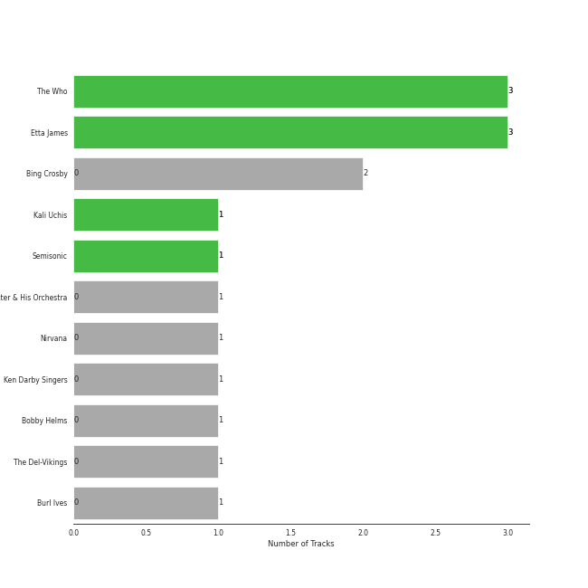
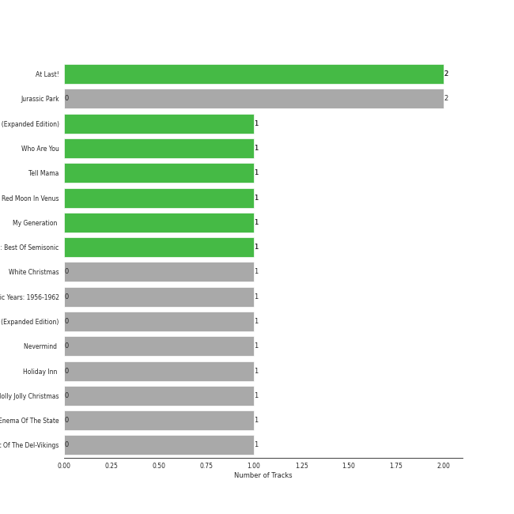
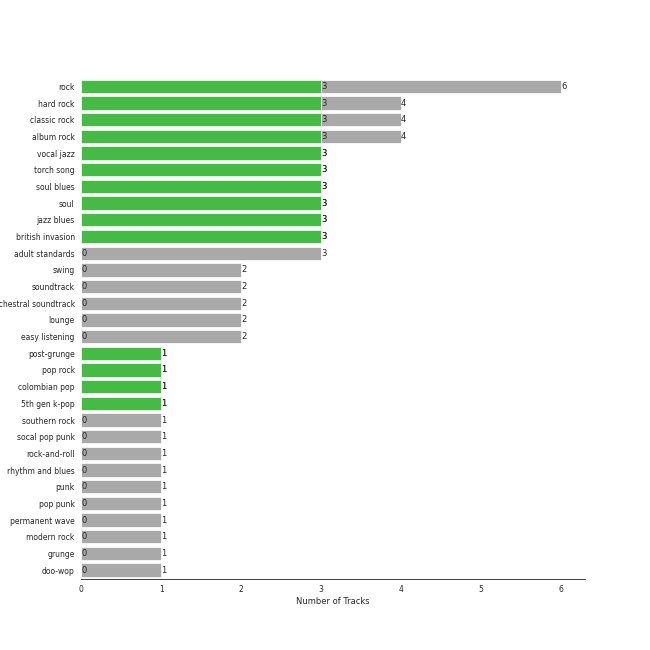
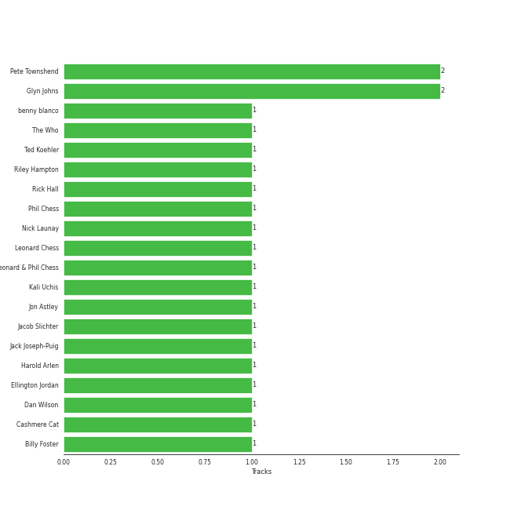

# Geffen

19 songs

[See Track Features](audio_features.md)

[See Clusters](clusters/overview.md)

Appears as:
- Geffen (10 tracks)
- Geffen* (7 tracks)
- Geffen Records (1 tracks)
- HYBE/Geffen (1 tracks)

## Top Artists

| Art | Rank | Tracks | 💚 | Artist | 🔗 |
|:---|---:|---:|---:|:---|:---|
|  | 342 | 3 | 3 | [The Who](../../artists/the_who/overview.md) | [🔗](https://open.spotify.com/artist/67ea9eGLXYMsO2eYQRui3w) |
|  | 370 | 3 | 3 | Etta James | [🔗](https://open.spotify.com/artist/0iOVhN3tnSvgDbcg25JoJb) |
|  | 251 | 1 | 1 | KATSEYE | [🔗](https://open.spotify.com/artist/3c0gDdb9lhnHGFtP4prQpn) |
|  | 432 | 1 | 1 | Kali Uchis | [🔗](https://open.spotify.com/artist/1U1el3k54VvEUzo3ybLPlM) |
|  | 432 | 1 | 1 | Semisonic | [🔗](https://open.spotify.com/artist/1TqQi97nqeiuOJrIFv5Sw0) |
|  | 403 | 2 | 0 | Bing Crosby | [🔗](https://open.spotify.com/artist/6ZjFtWeHP9XN7FeKSUe80S) |
|  | 360 | 2 | 0 | John Williams | [🔗](https://open.spotify.com/artist/3dRfiJ2650SZu6GbydcHNb) |
|  | 432 | 1 | 0 | John Scott Trotter & His Orchestra | [🔗](https://open.spotify.com/artist/735L650pvygCZZlPMyHqsN) |
|  | 432 | 1 | 0 | Nirvana | [🔗](https://open.spotify.com/artist/6olE6TJLqED3rqDCT0FyPh) |
|  | 432 | 1 | 0 | blink-182 | [🔗](https://open.spotify.com/artist/6FBDaR13swtiWwGhX1WQsP) |

See all 15 artists

| Art | Rank | Tracks | 💚 | Artist | 🔗 |
|:---|---:|---:|---:|:---|:---|
| | 432 | 1 | 0 | Ken Darby Singers | [🔗](https://open.spotify.com/artist/69UfPJgUmFFAVT740qGVZi) |
|  | 432 | 1 | 0 | Lynyrd Skynyrd | [🔗](https://open.spotify.com/artist/4MVyzYMgTwdP7Z49wAZHx0) |
|  | 432 | 1 | 0 | Bobby Helms | [🔗](https://open.spotify.com/artist/38EmEgXkgK51MT2tPY0EoC) |
|  | 432 | 1 | 0 | The Del-Vikings | [🔗](https://open.spotify.com/artist/10xLCBOlt2NhclsRmrOvX5) |
|  | 432 | 1 | 0 | Burl Ives | [🔗](https://open.spotify.com/artist/0MHgLfmQdutffmvWe5XBTN) |

## Top Albums

| Art | Rank | Tracks | 💚 | Album | Release Date | 🔗 |
|:---|---:|---:|---:|:---|:---|:---|
|  | 533 | 2 | 2 | At Last! | 1960 | [🔗](https://open.spotify.com/album/7rd4PorIOPjPTy7qdUeeCt) |
|  | 661 | 2 | 0 | Jurassic Park | 1993-05-25 | [🔗](https://open.spotify.com/album/1yyFmCMeNtuLWsLZAXPStf) |
|  | 661 | 1 | 1 | Who's Next (Expanded Edition) | 1971-08-14 | [🔗](https://open.spotify.com/album/53PBYiedQrASAs5sy63JqT) |
|  | 462 | 1 | 1 | Who Are You | 1978-08-18 | [🔗](https://open.spotify.com/album/7at3CV9Y9P57wsEXkfU0q8) |
|  | 314 | 1 | 1 | Touch | 2024-07-26 | [🔗](https://open.spotify.com/album/1hjqg3TuQ2YqooaPhxHwdv) |
|  | 661 | 1 | 1 | Tell Mama | 1968-04-18 | [🔗](https://open.spotify.com/album/4ReJ59T4YxC62WkfyVTWpr) |
|  | 661 | 1 | 1 | Red Moon In Venus | 2023-03-03 | [🔗](https://open.spotify.com/album/5OZ44LaqZbpP3m9B3oT8br) |
|  | 661 | 1 | 1 | My Generation (Stereo Version) | 1965-12-03 | [🔗](https://open.spotify.com/album/6Oc6Ok1Oawu8lRkjmD4mXy) |
|  | 661 | 1 | 1 | 20th Century Masters: The Millennium Collection: Best Of Semisonic | 2003-01-01 | [🔗](https://open.spotify.com/album/4JDBx5wQ82jb8PjLYPBP8L) |
|  | 608 | 1 | 0 | White Christmas | 1945-01-01 | [🔗](https://open.spotify.com/album/42KK3F8HTm1dyv5iFsCXdw) |

See all 17 albums

| Art | Rank | Tracks | 💚 | Album | Release Date | 🔗 |
|:---|---:|---:|---:|:---|:---|:---|
|  | 661 | 1 | 0 | The Classic Years: 1956-1962 | 1992-01-01 | [🔗](https://open.spotify.com/album/7yeVUGG3xvGjKwhM2FBItZ) |
|  | 661 | 1 | 0 | Second Helping (Expanded Edition) | 1974-04-15 | [🔗](https://open.spotify.com/album/54V1ljNtyzAm053oJqi0SH) |
|  | 661 | 1 | 0 | Nevermind (Remastered) | 1991-09-26 | [🔗](https://open.spotify.com/album/2guirTSEqLizK7j9i1MTTZ) |
|  | 661 | 1 | 0 | Holiday Inn (Original Motion Picture Soundtrack) | 1942-01-01 | [🔗](https://open.spotify.com/album/4ZZvKnA1YJ2KcwjMmHBinq) |
|  | 661 | 1 | 0 | Have A Holly Jolly Christmas | 1965-01-01 | [🔗](https://open.spotify.com/album/5r5iTtNflB2DAKO1t5ih8f) |
|  | 661 | 1 | 0 | Enema Of The State | 1999-06-01 | [🔗](https://open.spotify.com/album/652N05EcNH1a4bIlUixQE2) |
|  | 661 | 1 | 0 | Come Go With Me: The Best Of The Del-Vikings | 1997-01-01 | [🔗](https://open.spotify.com/album/35hzrbmJqylZoIRcatUfYx) |

## Genres

| Tracks | 💚 | Genre |
|---:|---:|:---|
| 6 | 3 | [rock](../../genres/rock/overview.md) |
| 4 | 3 | [hard rock](../../genres/hard_rock/overview.md) |
| 4 | 3 | [classic rock](../../genres/classic_rock/overview.md) |
| 4 | 3 | [album rock](../../genres/album_rock/overview.md) |
| 3 | 3 | [vocal jazz](../../genres/vocal_jazz/overview.md) |
| 3 | 3 | torch song |
| 3 | 3 | soul blues |
| 3 | 3 | [soul](../../genres/soul/overview.md) |
| 3 | 3 | jazz blues |
| 3 | 3 | [british invasion](../../genres/british_invasion/overview.md) |

See all 32 genres

| Tracks | 💚 | Genre |
|---:|---:|:---|
| 1 | 1 | post-grunge |
| 1 | 1 | [pop rock](../../genres/pop_rock/overview.md) |
| 1 | 1 | colombian pop |
| 1 | 1 | [5th gen k-pop](../../genres/5th_gen_k-pop/overview.md) |
| 3 | 0 | [adult standards](../../genres/adult_standards/overview.md) |
| 2 | 0 | swing |
| 2 | 0 | [soundtrack](../../genres/soundtrack/overview.md) |
| 2 | 0 | orchestral soundtrack |
| 2 | 0 | [lounge](../../genres/lounge/overview.md) |
| 2 | 0 | easy listening |
| 1 | 0 | southern rock |
| 1 | 0 | socal pop punk |
| 1 | 0 | rock-and-roll |
| 1 | 0 | rhythm and blues |
| 1 | 0 | punk |
| 1 | 0 | pop punk |
| 1 | 0 | [permanent wave](../../genres/permanent_wave/overview.md) |
| 1 | 0 | [modern rock](../../genres/modern_rock/overview.md) |
| 1 | 0 | grunge |
| 1 | 0 | doo-wop |
| 1 | 0 | american folk revival |
| 1 | 0 | alternative metal |

## Top Producers

| Art | Producer | Tracks | Credit Types |
|:---|:---|---:|:---|
| | Glyn Johns | 2 | Producer |
| | Pete Townshend | 2 | Lyricist, Songwriter |
| | Ellington Jordan | 1 | Songwriter |
| | Harold Arlen | 1 | Songwriter |
| | Jon Astley | 1 | Producer |
|  | Kali Uchis | 1 | Songwriter |
| | Leonard Chess | 1 | Producer |
| | Rick Hall | 1 | Arranger, Producer |
| | Billy Foster | 1 | Lyricist |
| | Jacob Slichter | 1 | Arranger |

View all

| Art | Producer | Tracks | Credit Types |
|:---|:---|---:|:---|
|  | [The Who](../../artists/the_who/overview.md) | 1 | Producer |
| | Dan Wilson | 1 | Lyricist, Songwriter |
| | Leonard & Phil Chess | 1 | Producer |
| | Cashmere Cat | 1 | Songwriter |
| | Phil Chess | 1 | Producer |
| | Ted Koehler | 1 | Lyricist |
|  | benny blanco | 1 | Songwriter |
| | Nick Launay | 1 | Producer |
| | Jack Joseph-Puig | 1 | Producer |
| | Riley Hampton | 1 | Arranger |

## Tracks released under Geffen

| Art | Track | Album | Artists | Label | Rank | 💚 | 🔗 |
|:---|:---|:---|:---|:---|---:|:---|:---|
|  | Touch | Touch | KATSEYE | [HYBE/Geffen](.) | 450 | 💚 | [🔗](https://open.spotify.com/track/6aJn7Cst74cj4lNIiPRgav) |
|  | Who Are You | Who Are You | [The Who](../../artists/the_who/overview.md) | [Geffen](.) | 688 | 💚 | [🔗](https://open.spotify.com/track/23IJ5wLRhEZ9DOuia5mPiZ) |
|  | Stormy Weather | At Last! | Etta James | [Geffen*](.) | 803 | 💚 | [🔗](https://open.spotify.com/track/2IdwQxhJn9ZE4zIotcCefR) |
|  | It's Beginning To Look Like Christmas | White Christmas | Bing Crosby | [Geffen](.) | 920 | | [🔗](https://open.spotify.com/track/44mYhOVgerj2qPjkGDVA6n) |
|  | White Christmas - 1947 Version | Holiday Inn (Original Motion Picture Soundtrack) | Bing Crosby, Ken Darby Singers, John Scott Trotter & His Orchestra | [Geffen](.) | 1009 | | [🔗](https://open.spotify.com/track/4so0Wek9Ig1p6CRCHuINwW) |
|  | At Last | At Last! | Etta James | [Geffen*](.) | 1009 | 💚 | [🔗](https://open.spotify.com/track/4Hhv2vrOTy89HFRcjU3QOx) |
|  | A Holly Jolly Christmas - Single Version | Have A Holly Jolly Christmas | Burl Ives | [Geffen](.) | 1009 | | [🔗](https://open.spotify.com/track/65Q2mv3UlVi9eO70OpsmSe) |
|  | My Generation - Stereo Version | My Generation (Stereo Version) | [The Who](../../artists/the_who/overview.md) | [Geffen](.) | 1009 | 💚 | [🔗](https://open.spotify.com/track/4u9f8hqstB7iITDJNzKhQx) |
|  | I'd Rather Go Blind | Tell Mama | Etta James | [Geffen](.) | 1009 | 💚 | [🔗](https://open.spotify.com/track/1kPBT8S2wJFNAyBMnGVZgL) |
|  | Won't Get Fooled Again - Remix | Who's Next (Expanded Edition) | [The Who](../../artists/the_who/overview.md) | [Geffen*](.) | 1009 | 💚 | [🔗](https://open.spotify.com/track/1W1GpfPujmgp2vQqcpUhtU) |

See all tracks

| Art | Track | Album | Artists | Label | Rank | 💚 | 🔗 |
|:---|:---|:---|:---|:---|---:|:---|:---|
|  | Sweet Home Alabama | Second Helping (Expanded Edition) | Lynyrd Skynyrd | [Geffen*](.) | 1009 | | [🔗](https://open.spotify.com/track/7e89621JPkKaeDSTQ3avtg) |
|  | Smells Like Teen Spirit | Nevermind (Remastered) | Nirvana | [Geffen](.) | 1009 | | [🔗](https://open.spotify.com/track/5ghIJDpPoe3CfHMGu71E6T) |
|  | Jingle Bell Rock | The Classic Years: 1956-1962 | Bobby Helms | [Geffen](.) | 1009 | | [🔗](https://open.spotify.com/track/3hBXvHLlTHvnbwrPbeoyAj) |
|  | Theme From Jurassic Park | Jurassic Park | John Williams | [Geffen*](.) | 1009 | | [🔗](https://open.spotify.com/track/2TZbQZXOuR8osP2AK8yYMN) |
|  | Welcome To Jurassic Park | Jurassic Park | John Williams | [Geffen*](.) | 1009 | | [🔗](https://open.spotify.com/track/7MW1YzseA4CGfrZMBLqQWK) |
|  | Come Go With Me | Come Go With Me: The Best Of The Del-Vikings | The Del-Vikings | [Geffen](.) | 1009 | | [🔗](https://open.spotify.com/track/4IYyGIbMS5ZkxDXGfPIrXr) |
|  | All The Small Things | Enema Of The State | blink-182 | [Geffen](.) | 1009 | | [🔗](https://open.spotify.com/track/2m1hi0nfMR9vdGC8UcrnwU) |
|  | Closing Time | 20th Century Masters: The Millennium Collection: Best Of Semisonic | Semisonic | [Geffen*](.) | 1009 | 💚 | [🔗](https://open.spotify.com/track/1A5V1sxyCLpKJezp75tUXn) |
|  | Moonlight | Red Moon In Venus | Kali Uchis | [Geffen Records](.) | 1009 | 💚 | [🔗](https://open.spotify.com/track/0JmnkIqdlnUzPaf8sqBRs3) |

