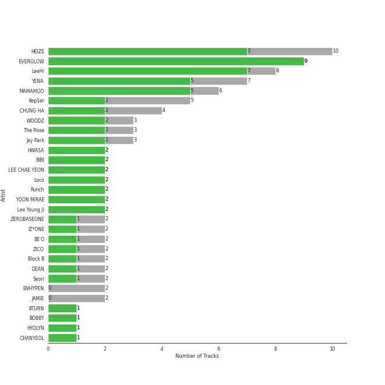
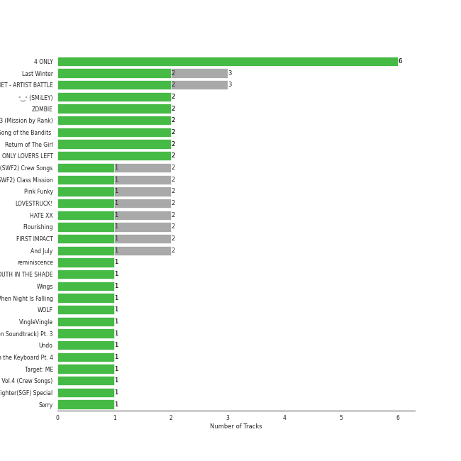

# Genie Music Corporation

96 songs

[See Track Features](audio_features.md)

[See Clusters](clusters/overview.md)

Appears as:
- Genie Music Corporation, Stone Music Entertainment (65 tracks)
- Genie Music Corporation (24 tracks)
- Genie Music Corporation;Stone Music Entertainment (7 tracks)

## Top Artists

| Art | Tracks | 💚 | Artist | 🔗 |
|:---|---:|---:|:---|:---|
|  | 8 | 7 | [LeeHi](../../artists/leehi/overview.md) | [🔗](https://open.spotify.com/artist/7cVZApDoQZpS447nHTsNqu) |
|  | 8 | 7 | [EVERGLOW](../../artists/everglow/overview.md) | [🔗](https://open.spotify.com/artist/3ZZzT0naD25RhY2uZvIKkJ) |
|  | 7 | 5 | [HEIZE](../../artists/heize/overview.md) | [🔗](https://open.spotify.com/artist/5dCvSnVduaFleCnyy98JMo) |
|  | 6 | 4 | YENA | [🔗](https://open.spotify.com/artist/49muoiIu4uea4PO8vueUNN) |
|  | 4 | 3 | The Rose | [🔗](https://open.spotify.com/artist/5na1LmEmK2VzNLje9snJYW) |
|  | 4 | 3 | [CHUNG HA](../../artists/chung_ha/overview.md) | [🔗](https://open.spotify.com/artist/2PSJ6YriU7JsFucxACpU7Y) |
|  | 5 | 2 | Kep1er | [🔗](https://open.spotify.com/artist/5R7AMwDeroq6Ls0COQYpS4) |
|  | 3 | 2 | WOODZ | [🔗](https://open.spotify.com/artist/6y9nlaoynxSvoTGY09Vdcy) |
|  | 3 | 2 | Jay Park | [🔗](https://open.spotify.com/artist/4XDi67ZENZcbfKnvMnTYsI) |
|  | 2 | 2 | [BIBI](../../artists/bibi/overview.md) | [🔗](https://open.spotify.com/artist/6UbmqUEgjLA6jAcXwbM1Z9) |

See all 73 artists

| Art | Tracks | 💚 | Artist | 🔗 |
|:---|---:|---:|:---|:---|
|  | 2 | 2 | LEE CHAE YEON | [🔗](https://open.spotify.com/artist/2nkZR6LwPxaAVtaVitNIPT) |
|  | 2 | 2 | Yoon Mirae | [🔗](https://open.spotify.com/artist/1Do4bSzfUl0KWL9r1fITu0) |
|  | 2 | 1 | [HWASA](../../artists/hwasa/overview.md) | [🔗](https://open.spotify.com/artist/7bmYpVgQub656uNTu6qGNQ) |
|  | 2 | 1 | IZ*ONE | [🔗](https://open.spotify.com/artist/5r1tUTxVSgvBHnoDuDODPH) |
|  | 2 | 1 | BE'O | [🔗](https://open.spotify.com/artist/5NUVwRESNqYBUTRbiATjy7) |
|  | 2 | 1 | ZICO | [🔗](https://open.spotify.com/artist/4XpUIb8uuNlIWVKmgKZXC0) |
|  | 2 | 1 | Block B | [🔗](https://open.spotify.com/artist/4RnezwRV7VBJUCI1S0AE5u) |
|  | 2 | 1 | DEAN | [🔗](https://open.spotify.com/artist/3eCd0TZrBPm2n9cDG6yWfF) |
|  | 1 | 1 | 8TURN | [🔗](https://open.spotify.com/artist/7tCg9aiVKZ5Cmhbfb7UoqM) |
|  | 1 | 1 | BOBBY | [🔗](https://open.spotify.com/artist/7ieMQQDR0bdBPz572mtxwS) |
|  | 1 | 1 | ZEROBASEONE | [🔗](https://open.spotify.com/artist/7cjg7EkeZy3OI5o9Qthc6n) |
|  | 1 | 1 | CHANYEOL | [🔗](https://open.spotify.com/artist/6jV25rzTKQ2zMgrqHha1V5) |
|  | 1 | 1 | [WJSN](../../artists/wjsn/overview.md) | [🔗](https://open.spotify.com/artist/6hhqsQZhtp9hfaZhSd0VSD) |
|  | 1 | 1 | EVNNE | [🔗](https://open.spotify.com/artist/6SYJFHPxXkr4SZJR8aLEml) |
|  | 1 | 1 | [ATEEZ](../../artists/ateez/overview.md) | [🔗](https://open.spotify.com/artist/68KmkJeZGfwe1OUaivBa2L) |
|  | 1 | 1 | Jessi | [🔗](https://open.spotify.com/artist/64k5e9kV9MdukXjFrR5R37) |
|  | 1 | 1 | NINGNING | [🔗](https://open.spotify.com/artist/5t1uryofgueHrjrryqX8vM) |
|  | 1 | 1 | Wonstein | [🔗](https://open.spotify.com/artist/5o615XColiSVMPDWlslKSk) |
|  | 1 | 1 | Solar | [🔗](https://open.spotify.com/artist/5cYcI546S8Lf97m4mNdYLD) |
|  | 1 | 1 | WOOSUNG | [🔗](https://open.spotify.com/artist/5LHu1iF8m0XtRBEJbbwSoo) |
|  | 1 | 1 | WINTER | [🔗](https://open.spotify.com/artist/3mPquBmMu97Iq9TpzQ6ayI) |
|  | 1 | 1 | CHANGMO | [🔗](https://open.spotify.com/artist/3hvinNZRzTLoREmqFiKr1b) |
| | 1 | 1 | En Butter | [🔗](https://open.spotify.com/artist/3X6XIt8zNXvrNzxb1R8TW5) |
|  | 1 | 1 | HOMIES | [🔗](https://open.spotify.com/artist/3PpfvyyncoZ79IgYe0Uls0) |
|  | 1 | 1 | JO YURI | [🔗](https://open.spotify.com/artist/3LFFf4EpKn2krneZ9vozyz) |
| | 1 | 1 | Overdose | [🔗](https://open.spotify.com/artist/32jdgEsyvdXqUoReMyR0gl) |
|  | 1 | 1 | pH-1 | [🔗](https://open.spotify.com/artist/2u7CP5T30c8ctenzXgEV1W) |
|  | 1 | 1 | KARINA | [🔗](https://open.spotify.com/artist/2qwDjeSYANOOBFU8jwtBXx) |
|  | 1 | 1 | Loco | [🔗](https://open.spotify.com/artist/2e4G04F77jxVuDYo44TCSm) |
|  | 1 | 1 | [Stray Kids](../../artists/stray_kids/overview.md) | [🔗](https://open.spotify.com/artist/2dIgFjalVxs4ThymZ67YCE) |
|  | 1 | 1 | Seori | [🔗](https://open.spotify.com/artist/2bWTIIQP9zaVc55RaMGu7e) |
|  | 1 | 1 | [ITZY](../../artists/itzy/overview.md) | [🔗](https://open.spotify.com/artist/2KC9Qb60EaY0kW4eH68vr3) |
|  | 1 | 1 | Punch | [🔗](https://open.spotify.com/artist/2FgZrgTMX6Sk0VNcOsEPmm) |
|  | 1 | 1 | TAEIL | [🔗](https://open.spotify.com/artist/1z0Hi3myYw4x32xCq0H3aq) |
|  | 1 | 1 | SURAN | [🔗](https://open.spotify.com/artist/1mORehSVEd7lcaT2d7Sl2K) |
|  | 1 | 1 | VERIVERY | [🔗](https://open.spotify.com/artist/1fWUcRSok57yRm8gPKj1Fc) |
|  | 1 | 1 | dj friz | [🔗](https://open.spotify.com/artist/0js3wKXyi7RL11sfOykRt1) |
|  | 1 | 1 | Lee Young Ji | [🔗](https://open.spotify.com/artist/0Y2AcMPMpeuPXtPQGVvRBq) |
|  | 1 | 1 | B.I | [🔗](https://open.spotify.com/artist/0UntV1Bw2hk3fbRrm9eMP6) |
|  | 1 | 1 | Coogie | [🔗](https://open.spotify.com/artist/0IznZPMUyaPGdqfP4oqBja) |
|  | 1 | 1 | PIXY | [🔗](https://open.spotify.com/artist/0CJkEzffVZLgav03xXeC9s) |
|  | 1 | 0 | MARK | [🔗](https://open.spotify.com/artist/70DFixYAFPv4Pf9kgSfR9O) |
|  | 1 | 0 | CHEETAH | [🔗](https://open.spotify.com/artist/6ftZYkensUYXNiMM7nFwhE) |
| | 1 | 0 | NINTYSIX | [🔗](https://open.spotify.com/artist/6PR5lyCpN2aFKgHUvY9B3O) |
|  | 1 | 0 | [ENHYPEN](../../artists/enhypen/overview.md) | [🔗](https://open.spotify.com/artist/5t5FqBwTcgKTaWmfEbwQY9) |
| | 1 | 0 | Jeon Ji Woo | [🔗](https://open.spotify.com/artist/5A0sx2B7umJPdXgpfghJDJ) |
|  | 1 | 0 | Seo Taiji and Boys | [🔗](https://open.spotify.com/artist/52Gsa9Zypqztm2DeNkQfCm) |
|  | 1 | 0 | Yeeun | [🔗](https://open.spotify.com/artist/4hMhbcPHd2nsZFhY1TNp8Y) |
|  | 1 | 0 | Lee Mujin | [🔗](https://open.spotify.com/artist/4Xj0peBt3EZHbdF20JmdWC) |
|  | 1 | 0 | Lee Hyori | [🔗](https://open.spotify.com/artist/4FjoOJAndC0s9ZJUo6VGc5) |
|  | 1 | 0 | BOYS PLANET | [🔗](https://open.spotify.com/artist/49pGKUCSjzaCfv8gdTWG98) |
|  | 1 | 0 | MINO | [🔗](https://open.spotify.com/artist/3ytV7vc4ZuwGgwaOuWvkk8) |
|  | 1 | 0 | AILEE | [🔗](https://open.spotify.com/artist/3uGFTJ7JMllvhgGpumieHF) |
|  | 1 | 0 | JAMIE | [🔗](https://open.spotify.com/artist/2YXlVLKq3X3soXd2aXUtIT) |
|  | 1 | 0 | [SEULGI](../../artists/seulgi/overview.md) | [🔗](https://open.spotify.com/artist/2QM5S4yO6xHgnNvF0nbZZq) |
|  | 1 | 0 | YUQI | [🔗](https://open.spotify.com/artist/22aCD8IrQZjcPgZw728QT6) |
|  | 1 | 0 | CIX | [🔗](https://open.spotify.com/artist/1lHfzEkKmmvdVDDDLKkcsd) |
| | 1 | 0 | LACHICA | [🔗](https://open.spotify.com/artist/0vqjEQRfmE1Sov92UQRJMp) |
|  | 1 | 0 | [MAMAMOO](../../artists/mamamoo/overview.md) | [🔗](https://open.spotify.com/artist/0XATRDCYuuGhk0oE7C0o5G) |
|  | 1 | 0 | Ugly Duck | [🔗](https://open.spotify.com/artist/0Qr4St9aCOLu41Nt5QZIz1) |
|  | 1 | 0 | [WENDY](../../artists/wendy/overview.md) | [🔗](https://open.spotify.com/artist/0FRUZvZNPzM3YJMABJxf2K) |
|  | 1 | 0 | THE NEW SIX | [🔗](https://open.spotify.com/artist/0DRiXmEOc6dJ6Rug3xi4HZ) |
|  | 1 | 0 | HYOYEON | [🔗](https://open.spotify.com/artist/0B3I6YgdnfXehUCpsO6oB8) |

## Top Albums

| Art | Tracks | 💚 | Album | Release Date | 🔗 |
|:---|---:|---:|:---|:---|:---|
|  | 6 | 6 | 4 ONLY | 2021-09-09 | [🔗](https://open.spotify.com/album/1DKgZeAYrjslAPZVMe6EFt) |
|  | 3 | 2 | BOYS PLANET - ARTIST BATTLE | 2023-04-06 | [🔗](https://open.spotify.com/album/1rIIbjGYbj2sRxAWZUfeoC) |
|  | 2 | 2 | ˣ‿ˣ (SMiLEY) | 2022-01-17 | [🔗](https://open.spotify.com/album/7qldKtsOWklzmwgll5NjCw) |
|  | 2 | 2 | Street Man Fighter Original Vol.3 (Mission by Rank) | 2022-09-06 | [🔗](https://open.spotify.com/album/54UUQN3j32n8TA2OJxTcHP) |
|  | 2 | 2 | Song of the Bandits (Music from The Netflix Series) | 2023-09-22 | [🔗](https://open.spotify.com/album/1TXOVlZGrd3KbphTcXN8vw) |
|  | 2 | 2 | Return of The Girl | 2021-12-01 | [🔗](https://open.spotify.com/album/28p4jKCNlbLUXaZ24iYLuD) |
|  | 2 | 2 | ONLY LOVERS LEFT | 2021-10-05 | [🔗](https://open.spotify.com/album/1u9nYBB0Qw5jyjkexe9Xk6) |
|  | 2 | 1 | HATE XX | 2023-06-27 | [🔗](https://open.spotify.com/album/3aYLtPSWEqmcLTCfM0ZYl7) |
|  | 2 | 1 | FIRST IMPACT | 2022-01-03 | [🔗](https://open.spotify.com/album/7pHyAucSgWoDNlFHfhQfVN) |
|  | 2 | 1 | And July | 2016-07-18 | [🔗](https://open.spotify.com/album/3xUWeFeLn6m3NXKr0FlT3E) |

See all 80 albums

| Art | Tracks | 💚 | Album | Release Date | 🔗 |
|:---|---:|---:|:---|:---|:---|
|  | 2 | 1 | ALL MY GIRLS | 2023-08-18 | [🔗](https://open.spotify.com/album/2yjigHf9lgspW2K5y99Qr0) |
|  | 1 | 1 | reminiscence | 2020-02-03 | [🔗](https://open.spotify.com/album/0zH0C0fkzAjhSnGKLOuxwX) |
|  | 1 | 1 | YOUTH IN THE SHADE | 2023-07-10 | [🔗](https://open.spotify.com/album/7fV7RChHagCcKRnAaDRXuX) |
|  | 1 | 1 | Wings | 2021-02-24 | [🔗](https://open.spotify.com/album/4knaQg3CtzHlA2m99NS7xW) |
|  | 1 | 1 | When Night Is Falling | 2021-07-07 | [🔗](https://open.spotify.com/album/3nOIsILeko2meMblKEGYZw) |
|  | 1 | 1 | WOLF | 2019-07-26 | [🔗](https://open.spotify.com/album/1V60S7FEby9fQwh5eVluj8) |
|  | 1 | 1 | Void | 2018-04-16 | [🔗](https://open.spotify.com/album/58njxSTVkyBNIuCpAmmAJc) |
|  | 1 | 1 | VingleVingle | 2023-04-05 | [🔗](https://open.spotify.com/album/10Ldh1KXu0ySjpfiX6qLXQ) |
|  | 1 | 1 | VINCENZO (Original Television Soundtrack) Pt. 3 | 2021-03-14 | [🔗](https://open.spotify.com/album/47ulDGfVUWUcUSWRQCzxr3) |
|  | 1 | 1 | Undo | 2022-06-30 | [🔗](https://open.spotify.com/album/2xR7YEyRweqClzs50bbW3J) |
|  | 1 | 1 | The Hyena on the Keyboard Pt. 4 | 2018-04-21 | [🔗](https://open.spotify.com/album/2fMMk4DD96UcAmSczUQ0kq) |
|  | 1 | 1 | Target: ME | 2023-09-19 | [🔗](https://open.spotify.com/album/3zgfK7IBAPDcroAqxzzMOy) |
|  | 1 | 1 | Street Man Fighter Original Vol.4 (Crew Songs) | 2022-09-20 | [🔗](https://open.spotify.com/album/7dwRGP1A80POqE3O9At5Vw) |
|  | 1 | 1 | Street Dance Girls Fighter(SGF) Special | 2022-01-04 | [🔗](https://open.spotify.com/album/4azL8fNPVZ8tmKqPyK1583) |
|  | 1 | 1 | Sorry | 2017-08-03 | [🔗](https://open.spotify.com/album/6D48tHXsa6LzoViDIACdkt) |
|  | 1 | 1 | SHOW ME THE MONEY 11 Episode 3 | 2022-12-17 | [🔗](https://open.spotify.com/album/5LsGOvNXMG46qugdghRGRF) |
|  | 1 | 1 | Remarriage and Desires (Original Soundtrack from The Netflix Series) | 2022-07-15 | [🔗](https://open.spotify.com/album/2YM9Oahck5kVuWGiFQK1dg) |
|  | 1 | 1 | RED | 2019-08-13 | [🔗](https://open.spotify.com/album/5CrMZwZuJcDpzFmMO35vxN) |
|  | 1 | 1 | PLAY | 2020-07-06 | [🔗](https://open.spotify.com/album/7tzaUrzvzQGfqvzsYzSODr) |
|  | 1 | 1 | Over The Moon | 2023-04-12 | [🔗](https://open.spotify.com/album/0WGMSrfOSPh1vctL94IWD3) |
|  | 1 | 1 | Our Blues, Pt. 10 (Original Television Soundtrack) | 2022-05-22 | [🔗](https://open.spotify.com/album/0mP330aRyX4P4ZjarRKnXO) |
|  | 1 | 1 | MOMMAE | 2015-05-22 | [🔗](https://open.spotify.com/album/1kgzGqeJbY7gwiheabVk1L) |
|  | 1 | 1 | Love War | 2023-01-16 | [🔗](https://open.spotify.com/album/3gWIe0cTPYqrI8xIYHjten) |
|  | 1 | 1 | Last Melody | 2021-05-25 | [🔗](https://open.spotify.com/album/4ZDUTnUO9CDFmwdCUCQ6dG) |
|  | 1 | 1 | LOVESTRUCK! | 2023-04-10 | [🔗](https://open.spotify.com/album/06qoehc4xjI7IW9J8jQFEX) |
|  | 1 | 1 | KINGDOM <FINAL : WHO IS THE KING?> | 2021-05-28 | [🔗](https://open.spotify.com/album/3n1NaviPQXfiVQ0TarnAf4) |
|  | 1 | 1 | HUSH RUSH | 2022-10-12 | [🔗](https://open.spotify.com/album/6ksAgHMbcJbfxwwO799483) |
|  | 1 | 1 | HUSH | 2019-08-19 | [🔗](https://open.spotify.com/album/7cGql7l8oRpjGmeDspBMZ2) |
|  | 1 | 1 | HOLO | 2020-07-23 | [🔗](https://open.spotify.com/album/5xq9sm0jGMMDu5LifpBBo1) |
|  | 1 | 1 | HER | 2014-07-24 | [🔗](https://open.spotify.com/album/5wHs7NGuapCYtY4wWsYMi3) |
|  | 1 | 1 | HAPPEN | 2021-05-20 | [🔗](https://open.spotify.com/album/4xOOB79WcZuOoVwK06No1s) |
|  | 1 | 1 | Guardian (Original Television Soundtrack), Pt. 1 | 2016-12-03 | [🔗](https://open.spotify.com/album/6Pr1DaOWfT6hEewhZMRyqg) |
|  | 1 | 1 | Gotta Go | 2019-01-02 | [🔗](https://open.spotify.com/album/3WgHekDElv10Kam9aCMwnx) |
|  | 1 | 1 | GLASSY | 2021-10-07 | [🔗](https://open.spotify.com/album/2WCMmZ8vXBnkVp97PzLeoA) |
|  | 1 | 1 | Flourishing | 2019-06-24 | [🔗](https://open.spotify.com/album/5rHnbSUBaflJgCLlZfDnzt) |
|  | 1 | 1 | First Sight | 2018-12-14 | [🔗](https://open.spotify.com/album/5M9f9Tze7sspUDrIAjdCgV) |
|  | 1 | 1 | FACE ME | 2020-01-07 | [🔗](https://open.spotify.com/album/4i3Q8eTqefwISi3WltwzAW) |
|  | 1 | 1 | EVERYTHING YOU WANTED | 2016-10-20 | [🔗](https://open.spotify.com/album/0c4LKBzh0ufU36AyuzZRc2) |
|  | 1 | 1 | Cold Blooded | 2021-10-12 | [🔗](https://open.spotify.com/album/4CTDrZw6m0dTJX17OCEbfZ) |
|  | 1 | 1 | BLOOM*IZ | 2020-02-17 | [🔗](https://open.spotify.com/album/5dm3PMCHxTSOdDFZ1hlfMm) |
|  | 1 | 1 | Abyss (Original Television Soundtrack), Pt. 1 | 2019-05-14 | [🔗](https://open.spotify.com/album/0OLyahO2nuY0qQKoykd7Vy) |
|  | 1 | 1 | ARRIVAL OF EVERGLOW | 2019-03-18 | [🔗](https://open.spotify.com/album/4qFVcLDapqLmjinahsk7U0) |
|  | 1 | 1 | <Queendom2> FINAL | 2022-05-27 | [🔗](https://open.spotify.com/album/5ZorEUDqewnEygf4FAOjhm) |
|  | 1 | 1 | 8TURNRISE | 2023-01-30 | [🔗](https://open.spotify.com/album/6fvrG4RkX06QBmmc9gA1OQ) |
|  | 1 | 1 | 1st Single 'S.i.R' | 2023-03-21 | [🔗](https://open.spotify.com/album/7eZ1MuD9GYRP35jumpZStH) |
|  | 1 | 0 | Worldwide | 2015-11-05 | [🔗](https://open.spotify.com/album/5vESroqrGYDxDPAwUceQxf) |
|  | 1 | 0 | Very Good | 2013-10-02 | [🔗](https://open.spotify.com/album/5AujjoJ3gAth9YnrIXa7Ww) |
|  | 1 | 0 | The King: Eternal Monarch (Original Television Soundtrack), Pt. 10 | 2020-05-16 | [🔗](https://open.spotify.com/album/02zl7wdcgbI0URRfMbzmF5) |
|  | 1 | 0 | Street Woman Fighter(SWF) Special | 2021-10-27 | [🔗](https://open.spotify.com/album/3iW6rZmhiSLNveTOrX26z6) |
|  | 1 | 0 | Spotify Singles - Holiday | 2021-11-17 | [🔗](https://open.spotify.com/album/5AVL4k3pesuk0jRkTeCOSm) |
|  | 1 | 0 | Show Me The Money 10 Episode 3 | 2021-11-20 | [🔗](https://open.spotify.com/album/5W1NIlh0lKO1nABgocreql) |
|  | 1 | 0 | Seotaiji and Boys | 1992-03-23 | [🔗](https://open.spotify.com/album/53OG0dLStOizLfNxsD3LPr) |
|  | 1 | 0 | School Rapper FINAL | 2017-04-01 | [🔗](https://open.spotify.com/album/1HlNyrcRkCbpi87jz6rY7y) |
|  | 1 | 0 | SMARTPHONE | 2022-08-03 | [🔗](https://open.spotify.com/album/0lbUf1aVf8xmveSuspuNW0) |
|  | 1 | 0 | Pandora : Beneath the Paradise, Pt. 3 (Original Television Soundtrack) | 2023-04-02 | [🔗](https://open.spotify.com/album/28afuQsobhUrDWQRaJWclH) |
|  | 1 | 0 | Melting | 2016-02-26 | [🔗](https://open.spotify.com/album/11hjJntrvmauDoga4Krr0U) |
|  | 1 | 0 | Magic Hour | 2023-09-25 | [🔗](https://open.spotify.com/album/4otUxxCM0HA9Deq2vBMJBk) |
|  | 1 | 0 | MONOCHROME | 2013-05-21 | [🔗](https://open.spotify.com/album/7Bhg7EOxBASEzLV3U6DnjK) |
|  | 1 | 0 | Lyricist | 2020-06-10 | [🔗](https://open.spotify.com/album/6igUyuDlRCyjoTtPXui6bT) |
|  | 1 | 0 | LULLABY | 2021-08-27 | [🔗](https://open.spotify.com/album/7knAHnDVbgtX05qgU0ZcgT) |
|  | 1 | 0 | I Need The Light | 2022-08-12 | [🔗](https://open.spotify.com/album/4RAx28on33NHM5FQiFhyvZ) |
|  | 1 | 0 | HOSPITAL PLAYLIST Season2 (Original Television Soundtrack), Pt. 1 | 2021-06-18 | [🔗](https://open.spotify.com/album/2pJhtrlZZvxFi818EMvKAY) |
|  | 1 | 0 | GOOD GIRL Episode 3 | 2020-06-19 | [🔗](https://open.spotify.com/album/2iY5eEAH23aCB9JGCNZO5k) |
|  | 1 | 0 | Dawn | 2018-10-05 | [🔗](https://open.spotify.com/album/0YZ0m6Z8xUurgzV9lXvflS) |
|  | 1 | 0 | DOUBLAST | 2022-06-20 | [🔗](https://open.spotify.com/album/0yMosWzriw3613d26x7MQK) |
|  | 1 | 0 | Chili | 2023-10-04 | [🔗](https://open.spotify.com/album/1vybbGeB3hmgVpEiTDZfgK) |
|  | 1 | 0 | COLOR*IZ | 2018-10-29 | [🔗](https://open.spotify.com/album/5Fl13rfH2DRRTo6OV4ecJY) |
|  | 1 | 0 | CIX 5th EP Album ‘OK’ Episode 1 : OK Not | 2022-08-22 | [🔗](https://open.spotify.com/album/0awixD0tmDTgB6JWfQxwO0) |
|  | 1 | 0 | BOYS PLANET - FINAL TOP9 BATTLE | 2023-04-21 | [🔗](https://open.spotify.com/album/5F3uLyGvCV3QINuGZkdOfS) |
|  | 1 | 0 | BOYHOOD | 2023-06-07 | [🔗](https://open.spotify.com/album/3k4xr3Bn9NfyX7O1nlK7Mg) |

## Genres

| Tracks | 💚 | Genre |
|---:|---:|:---|
| 66 | 48 | [k-pop](../../genres/k_pop/overview.md) |
| 21 | 15 | [korean r&b](../../genres/korean_r_b/overview.md) |
| 14 | 11 | [k-pop girl group](../../genres/k_pop_girl_group/overview.md) |
| 16 | 10 | [k-pop boy group](../../genres/k_pop_boy_group/overview.md) |
| 9 | 7 | [korean pop](../../genres/korean_pop/overview.md) |
| 5 | 3 | [k-rap](../../genres/k_rap/overview.md) |
| 3 | 3 | korean ost |
| 1 | 1 | [pop](../../genres/pop/overview.md) |
| 1 | 1 | korean trap |
| 2 | 0 | classic k-pop |

See all 13 genres

| Tracks | 💚 | Genre |
|---:|---:|:---|
| 1 | 0 | korean talent show |
| 1 | 0 | korean old school hip hop |
| 1 | 0 | [anime](../../genres/anime/overview.md) |

## Top Producers

| Art | Producer | Tracks | Credit Types |
|:---|:---|---:|:---|
| | Anna Timgren | 1 | Lyricist, Songwriter |
| | Dr.JO | 1 | Lyricist |
| | 희창 (Hee-chang) | 1 | Arranger, Songwriter |
| | VINCENZO | 1 | Arranger, Lyricist, Songwriter |
| | 김승수 (Kim, Seungsu) | 1 | Arranger, Lyricist, Songwriter |
| | 고현정 (Ko, Hyeonjeong) | 1 | Lyricist |
| | 서지음 (Seo, Ji Eum) | 1 | Lyricist |
| | THE HUB 88 | 1 | Songwriter |
| | 김지현 (Kim, Ji Hyun) | 1 | Producer |
| | 정은경 (Jung, Eun-Kyung) | 1 | Producer |

View all

| Art | Producer | Tracks | Credit Types |
|:---|:---|---:|:---|
|  | CHANGMO | 1 | Lyricist, Producer, Songwriter |
| | Fuxxy | 1 | Arranger, Lyricist, Songwriter |
| | 최현준 (Choi, Hyun-Joon) | 1 | Arranger, Lyricist, Songwriter |
| | 김재웅 (Kim, Jae-ung) | 1 | Lyricist, Songwriter |
| | 차유빈 (Cha, Yu-bin) | 1 | Lyricist |
| | Czaer | 1 | Producer |
| | hongsamman | 1 | Arranger, Songwriter |
| | R.Tee | 1 | Producer |
| | Noerio | 1 | Songwriter |
| | Jacob Aaron | 1 | Songwriter |
| | 윤원권 (Yoon, Won-kwon) | 1 | Producer |
| | Rick Bridges | 1 | Lyricist |

## Tracks released under Genie Music Corporation

| Art | Track | Album | Artists | Label | 💚 | 🔗 |
|:---|:---|:---|:---|:---|:---|:---|
|  | TIC TAC | 8TURNRISE | 8TURN | [Genie Music Corporation](.), [Stone Music Entertainment](../stone_music_entertainment) | 💚 | [🔗](https://open.spotify.com/track/60Oo6tKR0ckwZsRr95NrjL) |
|  | Gone | Pandora : Beneath the Paradise, Pt. 3 (Original Television Soundtrack) | AILEE | [Genie Music Corporation](.) | | [🔗](https://open.spotify.com/track/4Xfix99TcepR0aGFVW8kYN) |
|  | The Real | KINGDOM <FINAL : WHO IS THE KING?> | [ATEEZ](../../artists/ateez/overview.md) | [Genie Music Corporation](.), [Stone Music Entertainment](../stone_music_entertainment) | 💚 | [🔗](https://open.spotify.com/track/1uk5fYLx1f88DLte84Hl5j) |
|  | Limousine (Feat. MINO) (Prod. GRAY) | Show Me The Money 10 Episode 3 | BE'O, MINO | [Genie Music Corporation](.) | | [🔗](https://open.spotify.com/track/5g2Ik0WJG9rqu97nCLcQhV) |
|  | Cherry Blossom | 1st Single 'S.i.R' | BOBBY | [Genie Music Corporation](.), [Stone Music Entertainment](../stone_music_entertainment) | 💚 | [🔗](https://open.spotify.com/track/3yWQ5IlzWRPOdtYnQuywcO) |
|  | Jelly Pop | BOYS PLANET - FINAL TOP9 BATTLE | BOYS PLANET | [Genie Music Corporation](.) | | [🔗](https://open.spotify.com/track/6fJW5vgrTBrKksFKApn7v2) |
|  | Very Good | Very Good | Block B | [Genie Music Corporation](.), [Stone Music Entertainment](../stone_music_entertainment) | | [🔗](https://open.spotify.com/track/6svBgFCnXYst3N8OJJ1XAB) |
|  | JACKPOT | HER | Block B | [Genie Music Corporation](.), [Stone Music Entertainment](../stone_music_entertainment) | 💚 | [🔗](https://open.spotify.com/track/1T03TbRPcIMuqRLGKD5oRS) |
|  | Stay With Me | Guardian (Original Television Soundtrack), Pt. 1 | CHANYEOL, Punch | [Genie Music Corporation](.), [Stone Music Entertainment](../stone_music_entertainment) | 💚 | [🔗](https://open.spotify.com/track/1HYzRuWjmS9LXCkdVHi25K) |
|  | Gotta Go | Gotta Go | [CHUNG HA](../../artists/chung_ha/overview.md) | [Genie Music Corporation](.), [Stone Music Entertainment](../stone_music_entertainment) | 💚 | [🔗](https://open.spotify.com/track/1exnDFdC34GyBcaLt9ZJfX) |

See all tracks

| Art | Track | Album | Artists | Label | 💚 | 🔗 |
|:---|:---|:---|:---|:---|:---|:---|
|  | Snapping | Flourishing | [CHUNG HA](../../artists/chung_ha/overview.md) | [Genie Music Corporation](.), [Stone Music Entertainment](../stone_music_entertainment) | 💚 | [🔗](https://open.spotify.com/track/4IOxk5ep5ONrdlL0ZIy64v) |
|  | PLAY | PLAY | [CHUNG HA](../../artists/chung_ha/overview.md), CHANGMO | [Genie Music Corporation](.), [Stone Music Entertainment](../stone_music_entertainment) | 💚 | [🔗](https://open.spotify.com/track/1SdLedoEjrMRu5AnvK2EYk) |
|  | 458 | CIX 5th EP Album ‘OK’ Episode 1 : OK Not | CIX | [Genie Music Corporation](.), [Stone Music Entertainment](../stone_music_entertainment) | | [🔗](https://open.spotify.com/track/4FHnQdUyWz3clxy3d7loOY) |
|  | I Need The Light | I Need The Light | [ENHYPEN](../../artists/enhypen/overview.md) | [Genie Music Corporation](.), [Stone Music Entertainment](../stone_music_entertainment) | | [🔗](https://open.spotify.com/track/69mhZKG0nDbSK7NoINWEsE) |
|  | Bon Bon Chocolat | ARRIVAL OF EVERGLOW | [EVERGLOW](../../artists/everglow/overview.md) | [Genie Music Corporation](.), [Stone Music Entertainment](../stone_music_entertainment) | 💚 | [🔗](https://open.spotify.com/track/5XS0GCCIotaI6XtsYcIKeX) |
|  | Adios | HUSH | [EVERGLOW](../../artists/everglow/overview.md) | [Genie Music Corporation](.), [Stone Music Entertainment](../stone_music_entertainment) | 💚 | [🔗](https://open.spotify.com/track/0sq2QUCf3ykmfYxjCDWcir) |
|  | DUN DUN | reminiscence | [EVERGLOW](../../artists/everglow/overview.md) | [Genie Music Corporation](.), [Stone Music Entertainment](../stone_music_entertainment) | 💚 | [🔗](https://open.spotify.com/track/3ejAkJLWQSEJDqDXxK3efB) |
|  | FIRST | Last Melody | [EVERGLOW](../../artists/everglow/overview.md) | [Genie Music Corporation](.), [Stone Music Entertainment](../stone_music_entertainment) | 💚 | [🔗](https://open.spotify.com/track/021L6LlBBtr34BmFRHd9Ic) |
|  | Don’t Speak | Return of The Girl | [EVERGLOW](../../artists/everglow/overview.md) | [Genie Music Corporation](.), [Stone Music Entertainment](../stone_music_entertainment) | 💚 | [🔗](https://open.spotify.com/track/4rTXasoYr4RICJeGRk5cnD) |
|  | Pirate | Return of The Girl | [EVERGLOW](../../artists/everglow/overview.md) | [Genie Music Corporation](.), [Stone Music Entertainment](../stone_music_entertainment) | 💚 | [🔗](https://open.spotify.com/track/0Vu5tjvXZX3qtzRiezxLi1) |
|  | Make Me Feel | ALL MY GIRLS | [EVERGLOW](../../artists/everglow/overview.md) | [Genie Music Corporation](.), [Stone Music Entertainment](../stone_music_entertainment) | | [🔗](https://open.spotify.com/track/5bXiPL39Zz9ADxgB9CG4eF) |
|  | SLAY | ALL MY GIRLS | [EVERGLOW](../../artists/everglow/overview.md) | [Genie Music Corporation](.), [Stone Music Entertainment](../stone_music_entertainment) | 💚 | [🔗](https://open.spotify.com/track/32Ao6xLLir3dPOhQGvqgSB) |
|  | TROUBLE | Target: ME | EVNNE | [Genie Music Corporation](.), [Stone Music Entertainment](../stone_music_entertainment) | 💚 | [🔗](https://open.spotify.com/track/6MSRu5wksC0Esn63XOgmI3) |
|  | En Garde | BOYS PLANET - ARTIST BATTLE | En Butter | [Genie Music Corporation](.) | 💚 | [🔗](https://open.spotify.com/track/4GZvo0OL3BsRxNrj4TBeP3) |
|  | And July | And July | [HEIZE](../../artists/heize/overview.md), DEAN, dj friz | [Genie Music Corporation](.) | 💚 | [🔗](https://open.spotify.com/track/0Yz3F0UGDibDe8uU69zmjn) |
|  | Shut Up & Groove | And July | [HEIZE](../../artists/heize/overview.md), DEAN | [Genie Music Corporation](.) | | [🔗](https://open.spotify.com/track/1WT5I6vlWjYW2cnhR1UkVA) |
|  | First Sight | First Sight | [HEIZE](../../artists/heize/overview.md) | [Genie Music Corporation](.) | 💚 | [🔗](https://open.spotify.com/track/2g76vE59gdow7ynPQdzuaw) |
|  | Lyricist | Lyricist | [HEIZE](../../artists/heize/overview.md) | [Genie Music Corporation](.) | | [🔗](https://open.spotify.com/track/1eEHOnrNLP46aGKLb1LtMI) |
|  | HAPPEN | HAPPEN | [HEIZE](../../artists/heize/overview.md) | [Genie Music Corporation](.), [Stone Music Entertainment](../stone_music_entertainment) | 💚 | [🔗](https://open.spotify.com/track/1MtCOuTy3B6fU72LQPvg16) |
|  | Undo | Undo | [HEIZE](../../artists/heize/overview.md) | [Genie Music Corporation](.), [Stone Music Entertainment](../stone_music_entertainment) | 💚 | [🔗](https://open.spotify.com/track/6z1pJ3KUmQagUpMVqL62sa) |
|  | VingleVingle (Prod. R.Tee) | VingleVingle | [HEIZE](../../artists/heize/overview.md) | [Genie Music Corporation](.), [Stone Music Entertainment](../stone_music_entertainment) | 💚 | [🔗](https://open.spotify.com/track/4mSb6RA9eJnXuMWChHLpgn) |
|  | Chili | Chili | [HWASA](../../artists/hwasa/overview.md) | [Genie Music Corporation](.) | | [🔗](https://open.spotify.com/track/253P6uwLnelVQ6MdwXMIJk) |
|  | Weapon (With Newnion, FLOOR) (Prod.Czaer) | Street Dance Girls Fighter(SGF) Special | [ITZY](../../artists/itzy/overview.md) | [Genie Music Corporation](.) | 💚 | [🔗](https://open.spotify.com/track/6poVmpGU3y3jj1Z9xbbbH4) |
|  | La Vie en Rose | COLOR*IZ | IZ*ONE | [Genie Music Corporation](.) | | [🔗](https://open.spotify.com/track/3WfaJhCL4p2JbdffJjV6Va) |
|  | FIESTA | BLOOM*IZ | IZ*ONE | [Genie Music Corporation](.), [Stone Music Entertainment](../stone_music_entertainment) | 💚 | [🔗](https://open.spotify.com/track/6Ihdn6wW2UBhfTKWbP29KA) |
|  | GLASSY | GLASSY | JO YURI | [Genie Music Corporation](.), [Stone Music Entertainment](../stone_music_entertainment) | 💚 | [🔗](https://open.spotify.com/track/6PFfx4sEBWPuFqFB0mgX1D) |
|  | Sex Trip | MOMMAE | Jay Park | [Genie Music Corporation](.), [Stone Music Entertainment](../stone_music_entertainment) | 💚 | [🔗](https://open.spotify.com/track/6dJ4jLQMM8SXGYrM0eRCNm) |
|  | MOMMAE | Worldwide | Jay Park, Ugly Duck | [Genie Music Corporation](.), [Stone Music Entertainment](../stone_music_entertainment) | | [🔗](https://open.spotify.com/track/1LNlfvPQmB0cqYJQQskZ8x) |
|  | All I Wanna Do | EVERYTHING YOU WANTED | Jay Park | [Genie Music Corporation](.), [Stone Music Entertainment](../stone_music_entertainment) | 💚 | [🔗](https://open.spotify.com/track/2PcJoVkfjcbvoqBxV1Nj7y) |
|  | Cold Blooded | Cold Blooded | Jessi | [Genie Music Corporation](.), [Stone Music Entertainment](../stone_music_entertainment) | 💚 | [🔗](https://open.spotify.com/track/34JfHOd0fcefm4FSPSrIhF) |
|  | Sad Waltz | Song of the Bandits (Music from The Netflix Series) | KARINA | [Genie Music Corporation](.), [Stone Music Entertainment](../stone_music_entertainment) | 💚 | [🔗](https://open.spotify.com/track/6duXg0ED4OmOKWmZHWV8eG) |
|  | MVSK | FIRST IMPACT | Kep1er | [Genie Music Corporation](.), [Stone Music Entertainment](../stone_music_entertainment) | | [🔗](https://open.spotify.com/track/0dTEMO9G2uu9Vbu3f8Swto) |
|  | WA DA DA | FIRST IMPACT | Kep1er | [Genie Music Corporation](.), [Stone Music Entertainment](../stone_music_entertainment) | 💚 | [🔗](https://open.spotify.com/track/4gdiCHNbwugojBqr5Jt3pq) |
|  | Up! | DOUBLAST | Kep1er | [Genie Music Corporation](.), [Stone Music Entertainment](../stone_music_entertainment) | | [🔗](https://open.spotify.com/track/3XZAvh2NCDQYHgJei35VQ1) |
|  | Giddy | LOVESTRUCK! | Kep1er | [Genie Music Corporation](.), [Stone Music Entertainment](../stone_music_entertainment) | 💚 | [🔗](https://open.spotify.com/track/6blIAzkMKENKqAfMwj5cZQ) |
|  | Galileo | Magic Hour | Kep1er | [Genie Music Corporation](.), [Stone Music Entertainment](../stone_music_entertainment) | | [🔗](https://open.spotify.com/track/2nehY8ewjt4clnD40SclwM) |
|  | BAD GIRL (Prod. Czaer) | Street Woman Fighter(SWF) Special | LACHICA, [CHUNG HA](../../artists/chung_ha/overview.md) | [Genie Music Corporation](.) | | [🔗](https://open.spotify.com/track/4yCQYX8eKL1XYJmGglSV1A) |
|  | HUSH RUSH | HUSH RUSH | LEE CHAE YEON | [Genie Music Corporation](.), [Stone Music Entertainment](../stone_music_entertainment) | 💚 | [🔗](https://open.spotify.com/track/0P2LW3jbuJLpH2mwg0lLzn) |
|  | KNOCK | Over The Moon | LEE CHAE YEON | [Genie Music Corporation](.), [Stone Music Entertainment](../stone_music_entertainment) | 💚 | [🔗](https://open.spotify.com/track/6KiEF5zqzHiFjzdm8gChz7) |
|  | Bad Girls | MONOCHROME | Lee Hyori | [Genie Music Corporation](.) | | [🔗](https://open.spotify.com/track/2IrmdHJjwBH1pFIMcTJ1xq) |
|  | Rain and You | HOSPITAL PLAYLIST Season2 (Original Television Soundtrack), Pt. 1 | Lee Mujin | [Genie Music Corporation](.), [Stone Music Entertainment](../stone_music_entertainment) | | [🔗](https://open.spotify.com/track/4ribiWWnI451QMRdOgByIP) |
|  | NOT SORRY (Feat. pH-1) (Prod. by Slom) | SHOW ME THE MONEY 11 Episode 3 | Lee Young Ji, pH-1 | [Genie Music Corporation](.) | 💚 | [🔗](https://open.spotify.com/track/5UOY3OZib7H4KFwTfsT66g) |
|  | HOLO | HOLO | [LeeHi](../../artists/leehi/overview.md) | [Genie Music Corporation](.), [Stone Music Entertainment](../stone_music_entertainment) | 💚 | [🔗](https://open.spotify.com/track/4BSluGpjdLQihMmKgHXMxp) |
|  | Bye | 4 ONLY | [LeeHi](../../artists/leehi/overview.md) | [Genie Music Corporation](.), [Stone Music Entertainment](../stone_music_entertainment) | 💚 | [🔗](https://open.spotify.com/track/6ye2BBTpOipvPNjSPxgmRC) |
|  | Intentions | 4 ONLY | [LeeHi](../../artists/leehi/overview.md) | [Genie Music Corporation](.), [Stone Music Entertainment](../stone_music_entertainment) | 💚 | [🔗](https://open.spotify.com/track/7IN84szmayzO68enmVmKYv) |
|  | ONLY | 4 ONLY | [LeeHi](../../artists/leehi/overview.md) | [Genie Music Corporation](.), [Stone Music Entertainment](../stone_music_entertainment) | 💚 | [🔗](https://open.spotify.com/track/6TBJkXHPhu3EsMk1bshwuI) |
|  | Red Lipstick (feat. Yoonmirae) | 4 ONLY | [LeeHi](../../artists/leehi/overview.md), Yoon Mirae | [Genie Music Corporation](.), [Stone Music Entertainment](../stone_music_entertainment) | 💚 | [🔗](https://open.spotify.com/track/7nJc2Oxfn7xRX3eF4hltyl) |
|  | Savior (feat. B.I) | 4 ONLY | [LeeHi](../../artists/leehi/overview.md), B.I | [Genie Music Corporation](.), [Stone Music Entertainment](../stone_music_entertainment) | 💚 | [🔗](https://open.spotify.com/track/0DYvTdqBqW6erA1a7pFzVo) |
|  | Waterride | 4 ONLY | [LeeHi](../../artists/leehi/overview.md) | [Genie Music Corporation](.), [Stone Music Entertainment](../stone_music_entertainment) | 💚 | [🔗](https://open.spotify.com/track/7JXNH2xnA23vsGasejVfWr) |
|  | For You (Holiday Remix) - Spotify Singles Holiday | Spotify Singles - Holiday | [LeeHi](../../artists/leehi/overview.md) | [Genie Music Corporation](.), [Stone Music Entertainment](../stone_music_entertainment) | | [🔗](https://open.spotify.com/track/7I4DnQPWhzZvK79px5UhT5) |
|  | Don’t | The Hyena on the Keyboard Pt. 4 | Loco, [HWASA](../../artists/hwasa/overview.md) | [Genie Music Corporation](.), [Stone Music Entertainment](../stone_music_entertainment) | 💚 | [🔗](https://open.spotify.com/track/6KyafpXji3NKMmlmSokT9Y) |
|  | You’re the Best | Melting | [MAMAMOO](../../artists/mamamoo/overview.md) | [Genie Music Corporation](.), [Stone Music Entertainment](../stone_music_entertainment) | | [🔗](https://open.spotify.com/track/3BUZUCu1uHaTvroizwqLHt) |
|  | Drop | School Rapper FINAL | MARK, [SEULGI](../../artists/seulgi/overview.md) | [Genie Music Corporation](.) | | [🔗](https://open.spotify.com/track/5ruVKc6a9Gq2YxFeuiHPJu) |
|  | SuperCharger | BOYS PLANET - ARTIST BATTLE | NINTYSIX | [Genie Music Corporation](.) | | [🔗](https://open.spotify.com/track/6dh7woGX8OfRUFanTAGhp4) |
|  | Over Me | BOYS PLANET - ARTIST BATTLE | Overdose | [Genie Music Corporation](.) | 💚 | [🔗](https://open.spotify.com/track/59oJpXOayvcKGbTXbrZjzF) |
|  | Wings | Wings | PIXY | [Genie Music Corporation](.), [Stone Music Entertainment](../stone_music_entertainment) | 💚 | [🔗](https://open.spotify.com/track/12jfNawkTUb40C0iQ46u3W) |
|  | Into The Abyss | Abyss (Original Television Soundtrack), Pt. 1 | SURAN, Coogie | [Genie Music Corporation](.) | 💚 | [🔗](https://open.spotify.com/track/3aBbunGtgB2Ng5rIG7QtCj) |
|  | I Know - '92 TV Edit | Seotaiji and Boys | Seo Taiji and Boys | [Genie Music Corporation](.), [Stone Music Entertainment](../stone_music_entertainment) | | [🔗](https://open.spotify.com/track/28v5XsF5Weg0SeXK3xSKcV) |
|  | Wicked | Remarriage and Desires (Original Soundtrack from The Netflix Series) | Seori | [Genie Music Corporation](.), [Stone Music Entertainment](../stone_music_entertainment) | 💚 | [🔗](https://open.spotify.com/track/3B4u3uZGm7PCfhc18oTi1J) |
|  | Adrenaline | VINCENZO (Original Television Soundtrack) Pt. 3 | Solar | [Genie Music Corporation](.) | 💚 | [🔗](https://open.spotify.com/track/6ZQmJVUuXk1Q27d8vkmgm8) |
|  | HEYDAY (Prod. Czaer) | Street Man Fighter Original Vol.4 (Crew Songs) | [Stray Kids](../../artists/stray_kids/overview.md) | [Genie Music Corporation](.) | 💚 | [🔗](https://open.spotify.com/track/35sE2Ehvd1GzBzAIC0zFIu) |
|  | Bandit | Song of the Bandits (Music from The Netflix Series) | TAEIL | [Genie Music Corporation](.), [Stone Music Entertainment](../stone_music_entertainment) | 💚 | [🔗](https://open.spotify.com/track/3mQH4pXsnixxr8EDK7ZZVa) |
|  | Kick It 4 Now | BOYHOOD | THE NEW SIX | [Genie Music Corporation](.), [Stone Music Entertainment](../stone_music_entertainment) | | [🔗](https://open.spotify.com/track/5oyt64vcLF0MwDq5XNgx86) |
|  | Sorry | Sorry | The Rose | [Genie Music Corporation](.), [Stone Music Entertainment](../stone_music_entertainment) | 💚 | [🔗](https://open.spotify.com/track/7zmrZMinkTMJ2kZgM9Kqgp) |
|  | BABY | Void | The Rose | [Genie Music Corporation](.), [Stone Music Entertainment](../stone_music_entertainment) | 💚 | [🔗](https://open.spotify.com/track/2xzCH9be8QS7WTuboq1s3n) |
|  | She′s In The Rain | Dawn | The Rose | [Genie Music Corporation](.), [Stone Music Entertainment](../stone_music_entertainment) | | [🔗](https://open.spotify.com/track/2I0LNCqlQpAPJlwOEWaefE) |
|  | RED | RED | The Rose | [Genie Music Corporation](.), [Stone Music Entertainment](../stone_music_entertainment) | 💚 | [🔗](https://open.spotify.com/track/1JsBcVdlKZJmDPJWu4wJPC) |
|  | PHOTO | FACE ME | VERIVERY | [Genie Music Corporation](.), [Stone Music Entertainment](../stone_music_entertainment) | 💚 | [🔗](https://open.spotify.com/track/0GG5yUUUwoyV7I4qx54mmC) |
|  | ONCE AGAIN | Our Blues, Pt. 10 (Original Television Soundtrack) | WINTER, NINGNING | [Genie Music Corporation](.), [Stone Music Entertainment](../stone_music_entertainment) | 💚 | [🔗](https://open.spotify.com/track/5vsjD4VbQzkUUlvwFOhppn) |
|  | AURA | <Queendom2> FINAL | [WJSN](../../artists/wjsn/overview.md) | [Genie Music Corporation](.) | 💚 | [🔗](https://open.spotify.com/track/4jP982FpZoDv729D0X8BiN) |
|  | LULLABY | LULLABY | WOODZ | [Genie Music Corporation](.), [Stone Music Entertainment](../stone_music_entertainment) | | [🔗](https://open.spotify.com/track/4XqyWlYiTFZ627CuUzMOJP) |
|  | Sour candy | ONLY LOVERS LEFT | WOODZ | [Genie Music Corporation](.), [Stone Music Entertainment](../stone_music_entertainment) | 💚 | [🔗](https://open.spotify.com/track/2NM9WpMqPcIHPsV4EEyJJW) |
|  | WAITING | ONLY LOVERS LEFT | WOODZ | [Genie Music Corporation](.), [Stone Music Entertainment](../stone_music_entertainment) | 💚 | [🔗](https://open.spotify.com/track/4TMVuENexY9u0083CqMphE) |
|  | FACE | WOLF | WOOSUNG | [Genie Music Corporation](.), [Stone Music Entertainment](../stone_music_entertainment) | 💚 | [🔗](https://open.spotify.com/track/1cBdZdp3VuzMc0gsWSGQvy) |
|  | When Night Is Falling | When Night Is Falling | Wonstein | [Genie Music Corporation](.), [Stone Music Entertainment](../stone_music_entertainment) | 💚 | [🔗](https://open.spotify.com/track/3skyeuj2qNbbIuAP3Gv2dz) |
|  | Lxxk 2 U | ˣ‿ˣ (SMiLEY) | YENA | [Genie Music Corporation](.), [Stone Music Entertainment](../stone_music_entertainment) | 💚 | [🔗](https://open.spotify.com/track/5U7emXCoCl8EOEJUVNbguC) |
|  | SMILEY(Feat. BIBI) | ˣ‿ˣ (SMiLEY) | YENA, [BIBI](../../artists/bibi/overview.md) | [Genie Music Corporation](.), [Stone Music Entertainment](../stone_music_entertainment) | 💚 | [🔗](https://open.spotify.com/track/4zCIxSnVWpGNghERX4uWZF) |
|  | SMARTPHONE | SMARTPHONE | YENA | [Genie Music Corporation](.), [Stone Music Entertainment](../stone_music_entertainment) | | [🔗](https://open.spotify.com/track/3660VWl7PCUsXhZlakn0KY) |
|  | Love War (Feat. BE'O) | Love War | YENA, BE'O | [Genie Music Corporation](.), [Stone Music Entertainment](../stone_music_entertainment) | 💚 | [🔗](https://open.spotify.com/track/1UjN1QVbHnzJiqjkqzWmZK) |
|  | Hate Rodrigo (Feat. YUQI) | HATE XX | YENA, YUQI | [Genie Music Corporation](.), [Stone Music Entertainment](../stone_music_entertainment) | | [🔗](https://open.spotify.com/track/5ms7rcVKjBFUtoVh8hE0Y9) |
|  | WICKED LOVE | HATE XX | YENA | [Genie Music Corporation](.), [Stone Music Entertainment](../stone_music_entertainment) | 💚 | [🔗](https://open.spotify.com/track/7JduLib0OD7LheLRseXQWE) |
|  | WITCH | GOOD GIRL Episode 3 | Yeeun, Jeon Ji Woo, JAMIE, CHEETAH, HYOYEON | [Genie Music Corporation](.) | | [🔗](https://open.spotify.com/track/2NAJnW4wgLcmyplAPHqCRE) |
|  | LAW (Prod. Czaer) | Street Man Fighter Original Vol.3 (Mission by Rank) | Yoon Mirae, [BIBI](../../artists/bibi/overview.md) | [Genie Music Corporation](.) | 💚 | [🔗](https://open.spotify.com/track/0VES0jpNQEdRpD31gYDIMe) |
|  | In Bloom | YOUTH IN THE SHADE | ZEROBASEONE | [Genie Music Corporation](.), [Stone Music Entertainment](../stone_music_entertainment) | 💚 | [🔗](https://open.spotify.com/track/3F4lHPNHlvr3RpO4tpVOIs) |
|  | My Day Is Full Of You | The King: Eternal Monarch (Original Television Soundtrack), Pt. 10 | ZICO, [WENDY](../../artists/wendy/overview.md) | [Genie Music Corporation](.), [Stone Music Entertainment](../stone_music_entertainment) | | [🔗](https://open.spotify.com/track/2QWa5RjnIGFwraHDPqlhFh) |
|  | New thing (Prod. ZICO) (Feat. Homies) | Street Man Fighter Original Vol.3 (Mission by Rank) | ZICO, HOMIES | [Genie Music Corporation](.) | 💚 | [🔗](https://open.spotify.com/track/5mdWIwsJAzR97ShGkt8gcR) |

