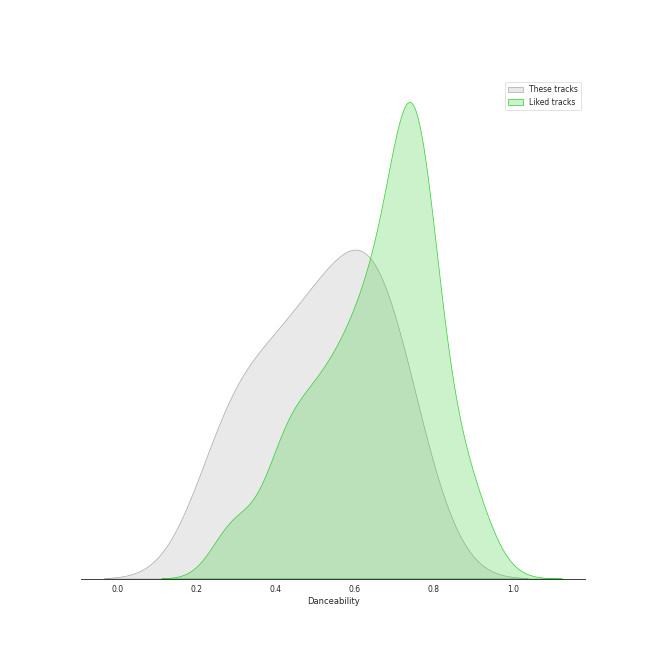
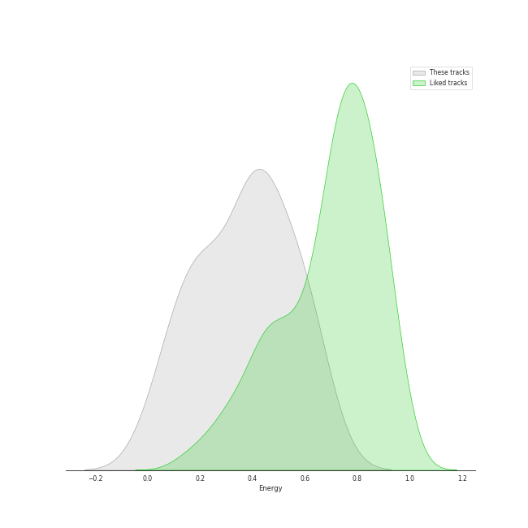
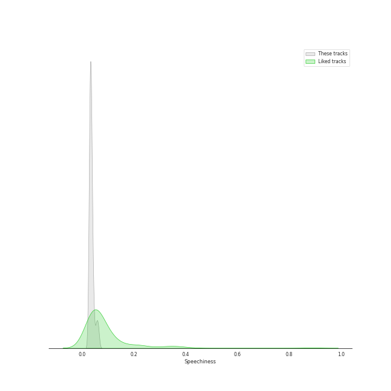
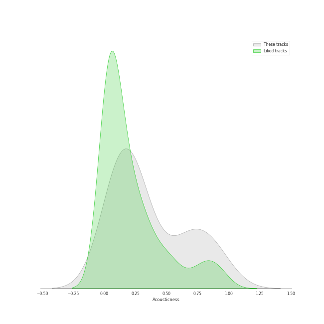
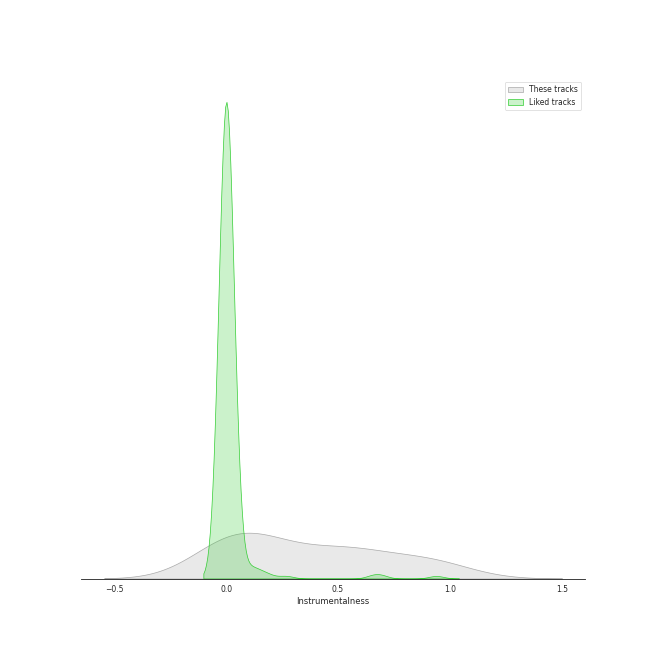
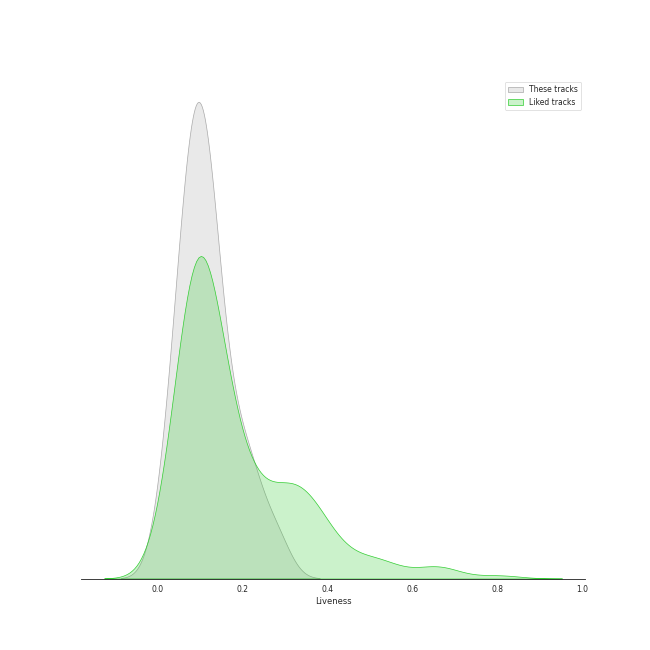
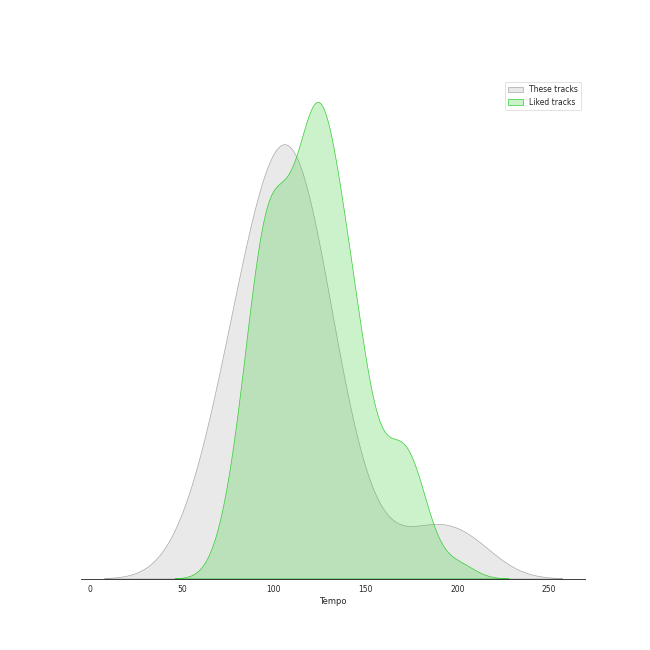

# Audio Features for GRP

## Danceability

| ​ | 10 most Danceable tracks | ​​ | 10 least Danceable tracks |
|:---|:---|:---|:---|
|  | Freedom At Midnight (0.78) |  | A Last Request (0.224) |
|  | Houston (0.726) |  | Kei's Song (0.299) |
|  | Passion Walk (0.698) |  | Pieces Of Time (0.333) |
|  | The Man With The Panama Hat (0.694) |  | The Last Goodbye (0.346) |
|  | Every Corner Of The World (0.66) |  | Deep Light (0.408) |
|  | Coconut Roads (0.659) |  | Del Sasser (0.418) |
|  | Every Step Of The Way (0.653) |  | Tropical Breeze (0.476) |
|  | Along Love's Highway (0.621) |  | 6-String Poet (0.502) |
|  | Morning Sojourn (0.614) |  | M.W.A. (Musicians With Attitude) (0.525) |
|  | Along The Milky Way (0.608) |  | South East Quarter (0.54) |

## Energy

| ​ | 10 most Energetic tracks | ​​ | 10 least Energetic tracks |
|:---|:---|:---|:---|
|  | El Camino Real (0.639) |  | Pieces Of Time (0.0496) |
|  | South East Quarter (0.628) |  | The Last Goodbye (0.0741) |
|  | M.W.A. (Musicians With Attitude) (0.594) |  | Deep Light (0.15) |
|  | Freedom At Midnight (0.584) |  | Kei's Song (0.219) |
|  | Every Corner Of The World (0.543) |  | 6-String Poet (0.23) |
|  | Along Love's Highway (0.54) |  | A Last Request (0.271) |
|  | Every Step Of The Way (0.51) |  | Along The Milky Way (0.352) |
|  | Coconut Roads (0.457) |  | Houston (0.387) |
|  | Passion Walk (0.45) |  | Tropical Breeze (0.395) |
|  | Morning Sojourn (0.411) |  | The Man With The Panama Hat (0.402) |

## Speechiness

| ​ | 10 most Speechy tracks | ​​ | 10 least Speechy tracks |
|:---|:---|:---|:---|
|  | M.W.A. (Musicians With Attitude) (0.0554) |  | Coconut Roads (0.0299) |
|  | The Man With The Panama Hat (0.0438) |  | Deep Light (0.0301) |
|  | The Last Goodbye (0.0436) |  | Along The Milky Way (0.0301) |
|  | Every Corner Of The World (0.0379) |  | Morning Sojourn (0.0302) |
|  | Pieces Of Time (0.0377) |  | Tropical Breeze (0.0303) |
|  | Along Love's Highway (0.0371) |  | Houston (0.0304) |
|  | A Last Request (0.0368) |  | Kei's Song (0.0309) |
|  | El Camino Real (0.0362) |  | Every Step Of The Way (0.0316) |
|  | 6-String Poet (0.0359) |  | Passion Walk (0.0321) |
|  | South East Quarter (0.0354) |  | Freedom At Midnight (0.0345) |

## Acousticness

| ​ | 10 most Acoustic tracks | ​​ | 10 least Acoustic tracks |
|:---|:---|:---|:---|
|  | The Last Goodbye (0.939) |  | Del Sasser (0.054) |
|  | Pieces Of Time (0.851) |  | Freedom At Midnight (0.074) |
|  | Deep Light (0.847) |  | El Camino Real (0.0804) |
|  | A Last Request (0.72) |  | The Man With The Panama Hat (0.104) |
|  | Kei's Song (0.625) |  | Every Step Of The Way (0.104) |
|  | Along Love's Highway (0.362) |  | Coconut Roads (0.136) |
|  | Passion Walk (0.289) |  | Along The Milky Way (0.153) |
|  | South East Quarter (0.276) |  | Houston (0.159) |
|  | Tropical Breeze (0.256) |  | M.W.A. (Musicians With Attitude) (0.191) |
|  | 6-String Poet (0.227) |  | Morning Sojourn (0.201) |

## Instrumentalness

| ​ | 10 most Instrumental tracks | ​​ | 10 least Instrumental tracks |
|:---|:---|:---|:---|
|  | Deep Light (0.956) |  | Every Corner Of The World (0.0) |
|  | Freedom At Midnight (0.937) |  | Along Love's Highway (0.0) |
|  | The Last Goodbye (0.881) |  | Kei's Song (0.00729) |
|  | 6-String Poet (0.841) |  | Along The Milky Way (0.0155) |
|  | M.W.A. (Musicians With Attitude) (0.638) |  | Passion Walk (0.0357) |
|  | A Last Request (0.563) |  | Pieces Of Time (0.0392) |
|  | Houston (0.554) |  | The Man With The Panama Hat (0.125) |
|  | Every Step Of The Way (0.545) |  | Del Sasser (0.16) |
|  | South East Quarter (0.54) |  | Morning Sojourn (0.222) |
|  | Coconut Roads (0.437) |  | El Camino Real (0.25) |

## Liveness

| ​ | 10 most Live tracks | ​​ | 10 least Live tracks |
|:---|:---|:---|:---|
|  | South East Quarter (0.278) |  | Freedom At Midnight (0.0168) |
|  | M.W.A. (Musicians With Attitude) (0.224) |  | Coconut Roads (0.0357) |
|  | Houston (0.211) |  | Every Corner Of The World (0.0482) |
|  | Del Sasser (0.185) |  | The Man With The Panama Hat (0.0568) |
|  | A Last Request (0.157) |  | Passion Walk (0.0581) |
|  | The Last Goodbye (0.15) |  | Along The Milky Way (0.0635) |
|  | Kei's Song (0.131) |  | El Camino Real (0.0714) |
|  | Pieces Of Time (0.125) |  | Morning Sojourn (0.0795) |
|  | 6-String Poet (0.102) |  | Tropical Breeze (0.0916) |
|  | Deep Light (0.101) |  | Every Step Of The Way (0.0951) |

## Valence

| ​ | 10 most Happy tracks | ​​ | 10 least Happy tracks |
|:---|:---|:---|:---|
|  | Freedom At Midnight (0.743) |  | Deep Light (0.0517) |
|  | The Man With The Panama Hat (0.722) |  | The Last Goodbye (0.0726) |
|  | Del Sasser (0.692) |  | Pieces Of Time (0.0776) |
|  | Passion Walk (0.674) |  | A Last Request (0.153) |
|  | M.W.A. (Musicians With Attitude) (0.669) |  | 6-String Poet (0.187) |
|  | Coconut Roads (0.655) |  | Kei's Song (0.245) |
|  | Every Corner Of The World (0.545) |  | Morning Sojourn (0.278) |
|  | South East Quarter (0.533) |  | Every Step Of The Way (0.31) |
|  | El Camino Real (0.507) |  | Along The Milky Way (0.312) |
|  | Along Love's Highway (0.457) |  | Tropical Breeze (0.351) |

## Tempo

| ​ | 10 most Fast tracks | ​​ | 10 least Fast tracks |
|:---|:---|:---|:---|
|  | M.W.A. (Musicians With Attitude) (203.958) |  | 6-String Poet (60.757) |
|  | A Last Request (179.86) |  | Pieces Of Time (76.03) |
|  | Kei's Song (144.886) |  | Along The Milky Way (82.022) |
|  | Del Sasser (132.147) |  | The Last Goodbye (89.055) |
|  | South East Quarter (127.941) |  | Along Love's Highway (90.068) |
|  | Houston (119.976) |  | Deep Light (96.712) |
|  | Freedom At Midnight (117.989) |  | Every Corner Of The World (100.442) |
|  | Passion Walk (116.36) |  | Every Step Of The Way (102.832) |
|  | El Camino Real (114.17) |  | The Man With The Panama Hat (103.266) |
|  | Morning Sojourn (113.026) |  | Coconut Roads (105.244) |
