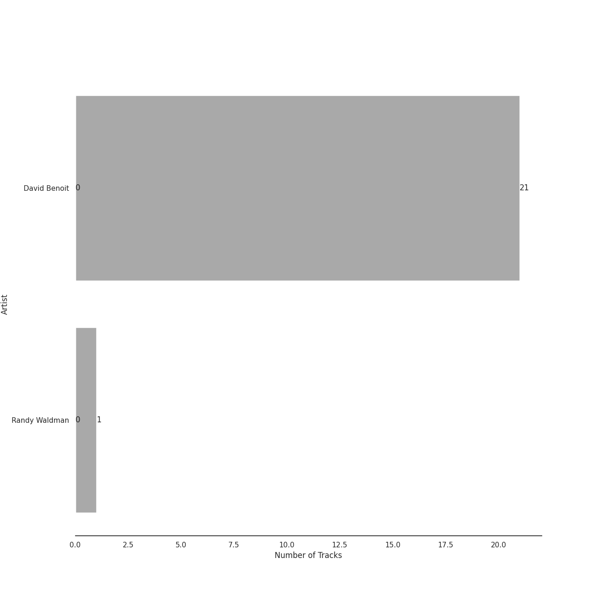
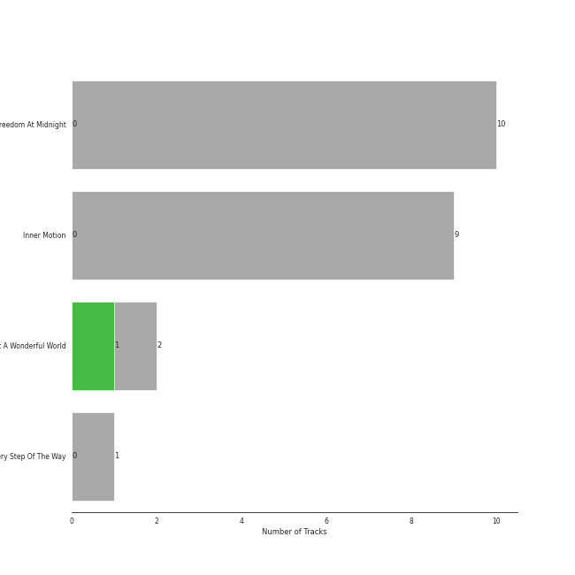
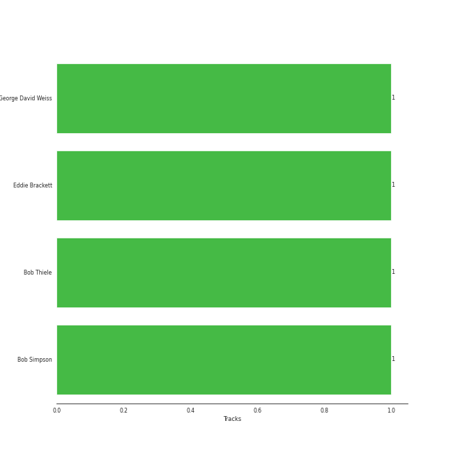

# GRP

22 songs

[See Track Features](audio_features.md)

[See Clusters](clusters/overview.md)

Appears as:
- GRP (22 tracks)

## Top Artists

| Art | Rank | Tracks | 💚 | Artist | 🔗 |
|:---|---:|---:|---:|:---|:---|
|  | 269 | 2 | 1 | Louis Armstrong | [🔗](https://open.spotify.com/artist/19eLuQmk9aCobbVDHc6eek) |
|  | 250 | 20 | 0 | David Benoit | [🔗](https://open.spotify.com/artist/1OLWM7nUNcTjZ9ct4DEPZu) |
|  | 419 | 1 | 0 | Randy Waldman | [🔗](https://open.spotify.com/artist/4DoFQoqKcSPw8CSzyh7trt) |

## Top Albums

| Art | Rank | Tracks | 💚 | Album | Release Date | 🔗 |
|:---|---:|---:|---:|:---|:---|:---|
|  | 615 | 10 | 0 | Freedom At Midnight | 1987-01-01 | [🔗](https://open.spotify.com/album/404TYwH2T33GbA9LdIT9fR) |
|  | 619 | 9 | 0 | Inner Motion | 1990-01-01 | [🔗](https://open.spotify.com/album/6azX9ZDZzVLjpQy6ytifne) |
|  | 619 | 2 | 1 | What A Wonderful World | 1968-01-01 | [🔗](https://open.spotify.com/album/6mmv0gwumlFGWDGJXF4yEv) |
|  | 619 | 1 | 0 | Every Step Of The Way | 1987 | [🔗](https://open.spotify.com/album/50HH21YU6PDn8XZXYGxWkg) |

## Genres

| Tracks | 💚 | Genre |
|---:|---:|:---|
| 2 | 1 | [vocal jazz](../../genres/vocal_jazz/overview.md) |
| 2 | 1 | swing |
| 2 | 1 | [soul](../../genres/soul/overview.md) |
| 2 | 1 | new orleans jazz |
| 2 | 1 | [lounge](../../genres/lounge/overview.md) |
| 2 | 1 | jazz trumpet |
| 2 | 1 | harlem renaissance |
| 2 | 1 | dixieland |
| 2 | 1 | [adult standards](../../genres/adult_standards/overview.md) |
| 20 | 0 | smooth jazz |

## Top Producers

| Art | Producer | Tracks | Credit Types |
|:---|:---|---:|:---|
| | Bob Simpson | 1 | Producer |
| | Bob Thiele | 1 | Producer, Songwriter |
| | George David Weiss | 1 | Songwriter |
| | Eddie Brackett | 1 | Producer |

## Tracks released under GRP

| Art | Track | Album | Artists | Label | Rank | 💚 | 🔗 |
|:---|:---|:---|:---|:---|---:|:---|:---|
|  | Del Sasser | Freedom At Midnight | David Benoit | [GRP](.) | 921 | | [🔗](https://open.spotify.com/track/07dVfTwBjqFK0AdNqnvTPV) |
|  | Dream A Little Dream Of Me | What A Wonderful World | Louis Armstrong | [GRP](.) | 934 | | [🔗](https://open.spotify.com/track/3HuJDcOWx0gE9Yng2uWY7K) |
|  | What A Wonderful World | What A Wonderful World | Louis Armstrong | [GRP](.) | 934 | 💚 | [🔗](https://open.spotify.com/track/29U7stRjqHU6rMiS8BfaI9) |
|  | Every Step Of The Way | Every Step Of The Way | David Benoit, Randy Waldman | [GRP](.) | 934 | | [🔗](https://open.spotify.com/track/5yhNKJlMmop5uhaHvL0RfU) |
|  | Along The Milky Way | Freedom At Midnight | David Benoit | [GRP](.) | 934 | | [🔗](https://open.spotify.com/track/5Niq6WMJ058uTNi83KBt9U) |
|  | Freedom At Midnight | Freedom At Midnight | David Benoit | [GRP](.) | 934 | | [🔗](https://open.spotify.com/track/57SYVRrrtPKBmOyvbcNnmU) |
|  | Kei's Song | Freedom At Midnight | David Benoit | [GRP](.) | 934 | | [🔗](https://open.spotify.com/track/40MaRkOGKqpxFuL1Jd73RW) |
|  | Morning Sojourn | Freedom At Midnight | David Benoit | [GRP](.) | 934 | | [🔗](https://open.spotify.com/track/3oxOqgZMER5Hsd4y5oTl2U) |
|  | Passion Walk | Freedom At Midnight | David Benoit | [GRP](.) | 934 | | [🔗](https://open.spotify.com/track/4tSRlUqyaYYVGbPgw7PyY1) |
|  | Pieces Of Time | Freedom At Midnight | David Benoit | [GRP](.) | 934 | | [🔗](https://open.spotify.com/track/53vRCplmNKbtL7D4psSBrN) |

See all tracks

| Art | Track | Album | Artists | Label | Rank | 💚 | 🔗 |
|:---|:---|:---|:---|:---|---:|:---|:---|
|  | The Last Goodbye | Freedom At Midnight | David Benoit | [GRP](.) | 934 | | [🔗](https://open.spotify.com/track/3iSet2m5A4p3G7T2j8wbdH) |
|  | The Man With The Panama Hat | Freedom At Midnight | David Benoit | [GRP](.) | 934 | | [🔗](https://open.spotify.com/track/5123iv6y44E6iMrtQslxNu) |
|  | Tropical Breeze | Freedom At Midnight | David Benoit | [GRP](.) | 934 | | [🔗](https://open.spotify.com/track/67KMcjY4qw46GWxsR2NIhY) |
|  | 6-String Poet | Inner Motion | David Benoit | [GRP](.) | 934 | | [🔗](https://open.spotify.com/track/2vp4iFA59viHbdNLCbQKtz) |
|  | A Last Request | Inner Motion | David Benoit | [GRP](.) | 934 | | [🔗](https://open.spotify.com/track/1eco6KISLwiyHzicppwSQF) |
|  | Along Love's Highway | Inner Motion | David Benoit | [GRP](.) | 934 | | [🔗](https://open.spotify.com/track/6QfdOlWT7J1b8y2EBLkV8M) |
|  | Coconut Roads | Inner Motion | David Benoit | [GRP](.) | 934 | | [🔗](https://open.spotify.com/track/0YXj7thzE6znoniGd662fi) |
|  | Deep Light | Inner Motion | David Benoit | [GRP](.) | 934 | | [🔗](https://open.spotify.com/track/4R3559LWLe3tuekjH1My0s) |
|  | El Camino Real | Inner Motion | David Benoit | [GRP](.) | 934 | | [🔗](https://open.spotify.com/track/1ebiRv1L7H4Y9OQcc5VVrj) |
|  | Houston | Inner Motion | David Benoit | [GRP](.) | 934 | | [🔗](https://open.spotify.com/track/2hFD5732Sz3FJ4ohjhKLG5) |
|  | M.W.A. (Musicians With Attitude) | Inner Motion | David Benoit | [GRP](.) | 934 | | [🔗](https://open.spotify.com/track/1dE0PS08MJrUkdtrG5hjpk) |
|  | South East Quarter | Inner Motion | David Benoit | [GRP](.) | 934 | | [🔗](https://open.spotify.com/track/04IcSgYzMaGKJsfYJ6cs8s) |

