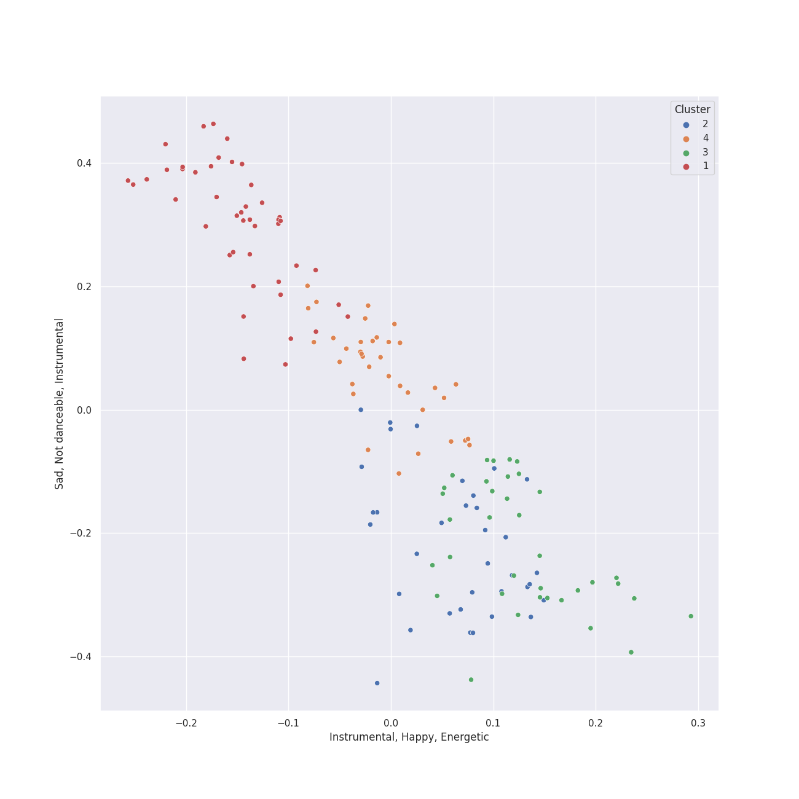

# Clusters in harmonia mundi

## Cluster #1

45 tracks

| Art | Track | Album | Artists | Label | Rank | 💚 | 🔗 |
|:---|:---|:---|:---|:---|---:|:---|:---|
|  | String Quartet No. 1 in C Major, Op. 49: III. Allegro molto | Shostakovich: String Quartets Nos. 1, 4, 6, 8, 9 & 11 | Dmitri Shostakovich, [Jerusalem Quartet](../../../../artists/jerusalem_quartet/overview.md) | [harmonia mundi](../..) | nan | | [🔗](https://open.spotify.com/track/5O8Iz6Mlz4oS0DP6YYyBQC) |
|  | String Quartet No. 4 in C Minor, Op. 18 No. 4: III. Menuetto (Allegro) - Trio | Beethoven: Complete String Quartets | [Ludwig van Beethoven](../../../../artists/ludwig_van_beethoven/overview.md), [Tokyo String Quartet](../../../../artists/tokyo_string_quartet/overview.md) | [harmonia mundi](../..) | nan | | [🔗](https://open.spotify.com/track/0FDBvZ6wjjGW15jlH3vVFt) |
|  | String Quartet No. 14 in C-Sharp Minor, Op. 131: III. Allegro moderato - Adagio - Piu vivace | Beethoven: Complete String Quartets | [Ludwig van Beethoven](../../../../artists/ludwig_van_beethoven/overview.md), [Tokyo String Quartet](../../../../artists/tokyo_string_quartet/overview.md) | [harmonia mundi](../..) | nan | | [🔗](https://open.spotify.com/track/0qAphY2YKqhNBrYaWucjQu) |
|  | String Quartet No. 12 in E-Flat Major, Op. 127: I. Maestoso - Allegro | Beethoven: Complete String Quartets | [Ludwig van Beethoven](../../../../artists/ludwig_van_beethoven/overview.md), [Tokyo String Quartet](../../../../artists/tokyo_string_quartet/overview.md) | [harmonia mundi](../..) | nan | | [🔗](https://open.spotify.com/track/1Oj4z7SesvJsdi52adQHkG) |
|  | String Quartet No. 7 In F Major, Op. 59 No. 1: II. Allegretto vivace e sempre scherzando | Beethoven: Complete String Quartets | [Ludwig van Beethoven](../../../../artists/ludwig_van_beethoven/overview.md), [Tokyo String Quartet](../../../../artists/tokyo_string_quartet/overview.md) | [harmonia mundi](../..) | nan | | [🔗](https://open.spotify.com/track/2T4zPGpKePodbDlA9LHMDj) |
|  | String Quartet No. 3 in D Major, Op. 18: I. Allegro | Beethoven: Complete String Quartets | [Ludwig van Beethoven](../../../../artists/ludwig_van_beethoven/overview.md), [Tokyo String Quartet](../../../../artists/tokyo_string_quartet/overview.md) | [harmonia mundi](../..) | nan | | [🔗](https://open.spotify.com/track/4UbcuUdeuzNJDajkn0ger7) |
|  | String Quartet No. 5 in A Major, Op. 18 No. 5: III. Andante cantabile | Beethoven: Complete String Quartets | [Ludwig van Beethoven](../../../../artists/ludwig_van_beethoven/overview.md), [Tokyo String Quartet](../../../../artists/tokyo_string_quartet/overview.md) | [harmonia mundi](../..) | nan | | [🔗](https://open.spotify.com/track/4WOEg6BxJIlMVx3mz8gJSw) |
|  | String Quartet No. 8 in E Minor, Op. 59 No. 2: IV. Finale (Presto) | Beethoven: Complete String Quartets | [Ludwig van Beethoven](../../../../artists/ludwig_van_beethoven/overview.md), [Tokyo String Quartet](../../../../artists/tokyo_string_quartet/overview.md) | [harmonia mundi](../..) | nan | | [🔗](https://open.spotify.com/track/4xgpjUdaUAFydWQDPeFFXY) |
|  | String Quartet No. 1 in F Major, Op. 18 No. 1: I. Allegro con brio | Beethoven: Complete String Quartets | [Ludwig van Beethoven](../../../../artists/ludwig_van_beethoven/overview.md), [Tokyo String Quartet](../../../../artists/tokyo_string_quartet/overview.md) | [harmonia mundi](../..) | nan | | [🔗](https://open.spotify.com/track/77ZbS58RGMl0RE3S9TLSXx) |
|  | String Quartet No. 14 in C-Sharp Minor, Op. 131: VII. Allegro | Beethoven: Complete String Quartets | [Ludwig van Beethoven](../../../../artists/ludwig_van_beethoven/overview.md), [Tokyo String Quartet](../../../../artists/tokyo_string_quartet/overview.md) | [harmonia mundi](../..) | nan | | [🔗](https://open.spotify.com/track/78BbLe00QHPhPvMoPgiqu7) |
## Cluster #2

35 tracks

| Art | Track | Album | Artists | Label | Rank | 💚 | 🔗 |
|:---|:---|:---|:---|:---|---:|:---|:---|
|  | String Quartet No. 22 in B-Flat Major, K. 589, "Prussian": III. Menuetto - Moderato | Mozart: String Quartets Nos. 4, 17 & 22 | [Wolfgang Amadeus Mozart](../../../../artists/wolfgang_amadeus_mozart/overview.md), [Jerusalem Quartet](../../../../artists/jerusalem_quartet/overview.md) | [harmonia mundi](../..) | nan | | [🔗](https://open.spotify.com/track/1LAbFa0OPRS6IuapkOySby) |
|  | String Quartet No. 17 in B-Flat Major, K. 458 "The Hunt": IV. Allegro assai | Mozart: String Quartets Nos. 4, 17 & 22 | [Wolfgang Amadeus Mozart](../../../../artists/wolfgang_amadeus_mozart/overview.md), [Jerusalem Quartet](../../../../artists/jerusalem_quartet/overview.md) | [harmonia mundi](../..) | nan | | [🔗](https://open.spotify.com/track/6AgF5rgvW3hRwe6A8KCcwl) |
|  | String Quartet No. 22 in B-Flat Major, K. 589, "Prussian": IV. Allegro assai | Mozart: String Quartets Nos. 4, 17 & 22 | [Wolfgang Amadeus Mozart](../../../../artists/wolfgang_amadeus_mozart/overview.md), [Jerusalem Quartet](../../../../artists/jerusalem_quartet/overview.md) | [harmonia mundi](../..) | nan | | [🔗](https://open.spotify.com/track/6Y8SmRRP56DkQoDt8op0xN) |
|  | String Quartet No. 9 in E-Flat Major, Op. 117: III. Allegretto | Shostakovich: String Quartets Nos. 1, 4, 6, 8, 9 & 11 | Dmitri Shostakovich, [Jerusalem Quartet](../../../../artists/jerusalem_quartet/overview.md) | [harmonia mundi](../..) | nan | | [🔗](https://open.spotify.com/track/57vPVZyYD3Cfxlpmqqdgl5) |
|  | String Quartet No.11 in F Minor, Op. 122: II. Scherzo (Allegretto) | Shostakovich: String Quartets Nos. 1, 4, 6, 8, 9 & 11 | Dmitri Shostakovich, [Jerusalem Quartet](../../../../artists/jerusalem_quartet/overview.md) | [harmonia mundi](../..) | nan | | [🔗](https://open.spotify.com/track/5axBmM6eFCRlBCXlBIZGJM) |
|  | String Quartet No. 1 in F Major, Op. 18 No. 1: III. Scherzo (Allegro molto) - Trio | Beethoven: String Quartets, Op. 18 | [Ludwig van Beethoven](../../../../artists/ludwig_van_beethoven/overview.md), [Jerusalem Quartet](../../../../artists/jerusalem_quartet/overview.md) | [harmonia mundi](../..) | nan | | [🔗](https://open.spotify.com/track/62gkGN2sOcxtVmoDGCeajT) |
|  | String Quartet No. 3 in D Major, Op. 18: IV. Presto | Beethoven: String Quartets, Op. 18 | [Ludwig van Beethoven](../../../../artists/ludwig_van_beethoven/overview.md), [Jerusalem Quartet](../../../../artists/jerusalem_quartet/overview.md) | [harmonia mundi](../..) | nan | | [🔗](https://open.spotify.com/track/6c3exNicyaeLcebTT2VaMQ) |
|  | String Quartet No. 6 in B-Flat Major, Op. 18 No. 6: I. Allegro con brio | Beethoven: String Quartets, Op. 18 | [Ludwig van Beethoven](../../../../artists/ludwig_van_beethoven/overview.md), [Jerusalem Quartet](../../../../artists/jerusalem_quartet/overview.md) | [harmonia mundi](../..) | nan | | [🔗](https://open.spotify.com/track/7FZJQ7bjH1grTUYdfxfD73) |
|  | String Quartet No. 4 in C Minor, Op. 18 No. 4: I. Allegro ma non tanto | Beethoven: String Quartets, Op. 18 | [Ludwig van Beethoven](../../../../artists/ludwig_van_beethoven/overview.md), [Jerusalem Quartet](../../../../artists/jerusalem_quartet/overview.md) | [harmonia mundi](../..) | nan | | [🔗](https://open.spotify.com/track/7yoDNO5NZYx8VwDWkYDLBr) |
|  | String Quartet No. 14 in C-Sharp Minor, Op. 131: V. Presto | Beethoven: Complete String Quartets | [Ludwig van Beethoven](../../../../artists/ludwig_van_beethoven/overview.md), [Tokyo String Quartet](../../../../artists/tokyo_string_quartet/overview.md) | [harmonia mundi](../..) | nan | | [🔗](https://open.spotify.com/track/5bMNqPkGepFdZU9WcN3oEk) |
## Cluster #3

36 tracks

| Art | Track | Album | Artists | Label | Rank | 💚 | 🔗 |
|:---|:---|:---|:---|:---|---:|:---|:---|
|  | String Quartet No. 4 in C Major, K. 157: II. Andante | Mozart: String Quartets Nos. 4, 17 & 22 | [Wolfgang Amadeus Mozart](../../../../artists/wolfgang_amadeus_mozart/overview.md), [Jerusalem Quartet](../../../../artists/jerusalem_quartet/overview.md) | [harmonia mundi](../..) | nan | | [🔗](https://open.spotify.com/track/4V6p7SY0ALq9I5iuOgkVNK) |
|  | String Quartet No. 6 in G Major, Op. 101: IV. Finale (Lento) - Allegretto | Shostakovich: String Quartets Nos. 1, 4, 6, 8, 9 & 11 | Dmitri Shostakovich, [Jerusalem Quartet](../../../../artists/jerusalem_quartet/overview.md) | [harmonia mundi](../..) | nan | | [🔗](https://open.spotify.com/track/3EcruCCCtRp7fi5K2YfAA5) |
|  | String Quartet No. 3 in D Major, Op. 18: II. Andante con moto | Beethoven: String Quartets, Op. 18 | [Ludwig van Beethoven](../../../../artists/ludwig_van_beethoven/overview.md), [Jerusalem Quartet](../../../../artists/jerusalem_quartet/overview.md) | [harmonia mundi](../..) | nan | | [🔗](https://open.spotify.com/track/0o3Mcv1JOPsrnc3wBROq2S) |
|  | String Quartet No. 6 in B-Flat Major, Op. 18 No. 6: IV. Adagio "La Malinconia" - Allegretto quasi allegro | Beethoven: String Quartets, Op. 18 | [Ludwig van Beethoven](../../../../artists/ludwig_van_beethoven/overview.md), [Jerusalem Quartet](../../../../artists/jerusalem_quartet/overview.md) | [harmonia mundi](../..) | nan | | [🔗](https://open.spotify.com/track/307vQS6VavTKNbzYSnYTt9) |
|  | String Quartet No. 9 in C Major, Op. 59 No. 3: III. Menuetto (Grazioso) | Beethoven: Complete String Quartets | [Ludwig van Beethoven](../../../../artists/ludwig_van_beethoven/overview.md), [Tokyo String Quartet](../../../../artists/tokyo_string_quartet/overview.md) | [harmonia mundi](../..) | nan | | [🔗](https://open.spotify.com/track/4SZyj0ohsPGbtfTxa7py32) |
|  | String Quartet No. 13 in B-Flat Major, Op. 130: V. Cavatina (Adagio molto espressivo) | Beethoven: Complete String Quartets | [Ludwig van Beethoven](../../../../artists/ludwig_van_beethoven/overview.md), [Tokyo String Quartet](../../../../artists/tokyo_string_quartet/overview.md) | [harmonia mundi](../..) | nan | | [🔗](https://open.spotify.com/track/4pA0GR1f9KsRNGX18Va5Qe) |
|  | String Quartet No. 11 in F Minor, Op. 95 "Serioso": I. Allegro con brio | Beethoven: Complete String Quartets | [Ludwig van Beethoven](../../../../artists/ludwig_van_beethoven/overview.md), [Tokyo String Quartet](../../../../artists/tokyo_string_quartet/overview.md) | [harmonia mundi](../..) | nan | | [🔗](https://open.spotify.com/track/74nIfi1gyjTbEzgMLBqrHo) |
|  | String Quintet No. 3, Op. 97: III. Larghetto | Dvorak: String Quintet, Op. 97 & String Sextet, Op. 48 | Antonín Dvořák, [Jerusalem Quartet](../../../../artists/jerusalem_quartet/overview.md), Veronika Hagen | [harmonia mundi](../..) | nan | | [🔗](https://open.spotify.com/track/4ZdgET0UACAG4mHLd8lZYu) |
|  | String Sextet, Op. 48: I. Allegro moderato | Dvorak: String Quintet, Op. 97 & String Sextet, Op. 48 | Antonín Dvořák, [Jerusalem Quartet](../../../../artists/jerusalem_quartet/overview.md), Veronika Hagen, Gary Hoffman | [harmonia mundi](../..) | nan | | [🔗](https://open.spotify.com/track/5Bn7rXQJDCOkR50kqlkkfv) |
|  | String Quartet in G Minor, Op. 10: IV. Très modéré | Debussy & Ravel: String Quartets | Claude Debussy, [Jerusalem Quartet](../../../../artists/jerusalem_quartet/overview.md) | [harmonia mundi](../..) | nan | | [🔗](https://open.spotify.com/track/4RQxDeNkibXjHkIkBXify8) |
## Cluster #4

36 tracks

| Art | Track | Album | Artists | Label | Rank | 💚 | 🔗 |
|:---|:---|:---|:---|:---|---:|:---|:---|
|  | String Quartet No. 4 in D Major, Op. 83: IV. Allegretto | Shostakovich: String Quartets Nos. 1, 4, 6, 8, 9 & 11 | Dmitri Shostakovich, [Jerusalem Quartet](../../../../artists/jerusalem_quartet/overview.md) | [harmonia mundi](../..) | nan | | [🔗](https://open.spotify.com/track/4qM31gOqZIt7skvz2kgaOC) |
|  | String Quartet No. 6 in G Major, Op. 101: II. Moderato con moto | Shostakovich: String Quartets Nos. 1, 4, 6, 8, 9 & 11 | Dmitri Shostakovich, [Jerusalem Quartet](../../../../artists/jerusalem_quartet/overview.md) | [harmonia mundi](../..) | nan | | [🔗](https://open.spotify.com/track/5BqEbEtqCpIrKRJh5c3Z3u) |
|  | String Quartet No. 1 in C Major, Op. 49: I. Moderato | Shostakovich: String Quartets Nos. 1, 4, 6, 8, 9 & 11 | Dmitri Shostakovich, [Jerusalem Quartet](../../../../artists/jerusalem_quartet/overview.md) | [harmonia mundi](../..) | nan | | [🔗](https://open.spotify.com/track/5VQz0yG8Lzvjj4RCbDLMrJ) |
|  | String Quartet No. 1 in F Major, Op. 18 No. 1: II. Adagio affettuoso ed appassionato | Beethoven: String Quartets, Op. 18 | [Ludwig van Beethoven](../../../../artists/ludwig_van_beethoven/overview.md), [Jerusalem Quartet](../../../../artists/jerusalem_quartet/overview.md) | [harmonia mundi](../..) | nan | | [🔗](https://open.spotify.com/track/74Din3wPGdlksjg6kz68Mw) |
|  | String Quartet No. 2 in G Major, Op. 18, No. 2: II. Adagio cantabile - Allegro | Beethoven: String Quartets, Op. 18 | [Ludwig van Beethoven](../../../../artists/ludwig_van_beethoven/overview.md), [Jerusalem Quartet](../../../../artists/jerusalem_quartet/overview.md) | [harmonia mundi](../..) | nan | | [🔗](https://open.spotify.com/track/7v0g3biHWMpypyv0hfxroQ) |
|  | String Quartet No. 8 in E Minor, Op. 59 No. 2: III. Allegretto | Beethoven: Complete String Quartets | [Ludwig van Beethoven](../../../../artists/ludwig_van_beethoven/overview.md), [Tokyo String Quartet](../../../../artists/tokyo_string_quartet/overview.md) | [harmonia mundi](../..) | nan | | [🔗](https://open.spotify.com/track/1e0KnK30nx7GxphZVx7DFI) |
|  | String Quartet No. 11 in F Minor, Op. 95 "Quartetto serioso": IV. Larghetto espressivo – Allegretto agitato – Allegro | Beethoven: Complete String Quartets | [Ludwig van Beethoven](../../../../artists/ludwig_van_beethoven/overview.md), [Tokyo String Quartet](../../../../artists/tokyo_string_quartet/overview.md) | [harmonia mundi](../..) | nan | | [🔗](https://open.spotify.com/track/51TlHN7aV2jUH1wNIJvgKS) |
|  | String Quartet No. 9 in C Major, Op. 59 No. 3: I. Introduzione (Andante con moto - Allegro vivace) | Beethoven: Complete String Quartets | [Ludwig van Beethoven](../../../../artists/ludwig_van_beethoven/overview.md), [Tokyo String Quartet](../../../../artists/tokyo_string_quartet/overview.md) | [harmonia mundi](../..) | nan | | [🔗](https://open.spotify.com/track/5bUQPchwRlyhMMNP7OYrcW) |
|  | String Quartet No. 9 in C Major, Op. 59 No. 3: II. Andante con moto quasi Allegretto | Beethoven: Complete String Quartets | [Ludwig van Beethoven](../../../../artists/ludwig_van_beethoven/overview.md), [Tokyo String Quartet](../../../../artists/tokyo_string_quartet/overview.md) | [harmonia mundi](../..) | nan | | [🔗](https://open.spotify.com/track/5xvIM6UKaNka26RyNahIVi) |
|  | Quatuor en Fa Majeur, M. 35: II. Assez vif, très rythmé | Debussy & Ravel: String Quartets | Maurice Ravel, [Jerusalem Quartet](../../../../artists/jerusalem_quartet/overview.md) | [harmonia mundi](../..) | nan | | [🔗](https://open.spotify.com/track/766aJRX19tPpWsqp4n59xJ) |