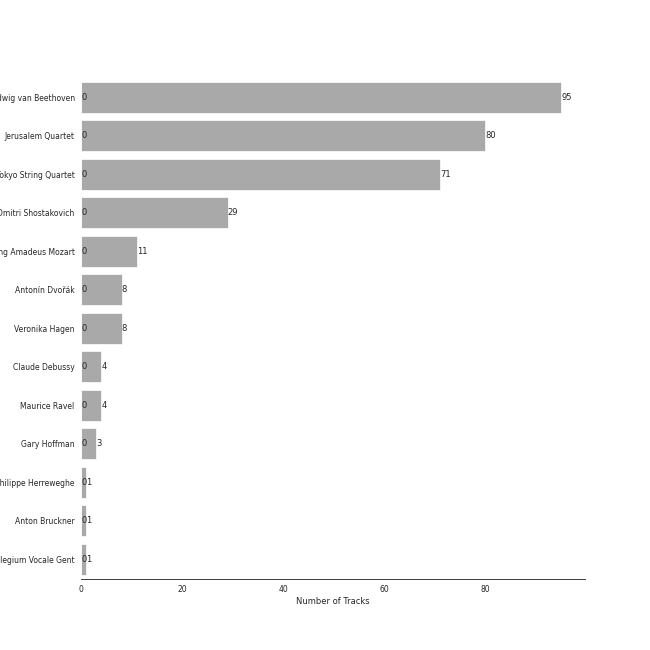
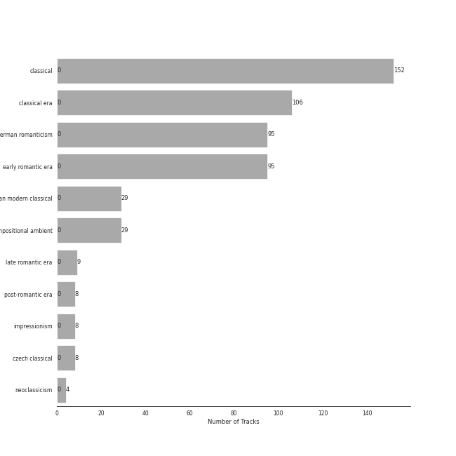

# harmonia mundi

152 songs

[See Track Features](audio_features.md)

[See Clusters](clusters/overview.md)

Appears as:
- harmonia mundi (152 tracks)

## Top Artists

| Art | Rank | Tracks | 💚 | Artist | 🔗 |
|:---|---:|---:|---:|:---|:---|
|  | 294 | 95 | 0 | [Ludwig van Beethoven](../../artists/ludwig_van_beethoven/overview.md) | [🔗](https://open.spotify.com/artist/2wOqMjp9TyABvtHdOSOTUS) |
|  | 145 | 80 | 0 | [Jerusalem Quartet](../../artists/jerusalem_quartet/overview.md) | [🔗](https://open.spotify.com/artist/7AnE8Jpu1vxLeXcs6OKYHE) |
|  | 430 | 71 | 0 | [Tokyo String Quartet](../../artists/tokyo_string_quartet/overview.md) | [🔗](https://open.spotify.com/artist/15G9RnBNBDCFUMANna2CvO) |
|  | 298 | 29 | 0 | Dmitri Shostakovich | [🔗](https://open.spotify.com/artist/6s1pCNXcbdtQJlsnM1hRIA) |
|  | 430 | 11 | 0 | [Wolfgang Amadeus Mozart](../../artists/wolfgang_amadeus_mozart/overview.md) | [🔗](https://open.spotify.com/artist/4NJhFmfw43RLBLjQvxDuRS) |
|  | 430 | 8 | 0 | Antonín Dvořák | [🔗](https://open.spotify.com/artist/6n7nd5iceYpXVwcx8VPpxF) |
|  | 430 | 8 | 0 | Veronika Hagen | [🔗](https://open.spotify.com/artist/3ijxXTal6hr7byhqZDdHsP) |
|  | 430 | 4 | 0 | Claude Debussy | [🔗](https://open.spotify.com/artist/1Uff91EOsvd99rtAupatMP) |
|  | 430 | 4 | 0 | Maurice Ravel | [🔗](https://open.spotify.com/artist/17hR0sYHpx7VYTMRfFUOmY) |
|  | 430 | 3 | 0 | Gary Hoffman | [🔗](https://open.spotify.com/artist/7qcRbaIYVuOERS3KmB71GH) |

See all 13 artists

| Art | Rank | Tracks | 💚 | Artist | 🔗 |
|:---|---:|---:|---:|:---|:---|
|  | 430 | 1 | 0 | Philippe Herreweghe | [🔗](https://open.spotify.com/artist/2ozcTa5tl8qhSbhJKM60I5) |
|  | 430 | 1 | 0 | Anton Bruckner | [🔗](https://open.spotify.com/artist/2bM3j1JQWBkmzuoZKu4zj2) |
|  | 430 | 1 | 0 | Collegium Vocale Gent | [🔗](https://open.spotify.com/artist/17BdLN9q8RRQQqyklLwac1) |

## Top Albums

| Art | Rank | Tracks | 💚 | Album | Release Date | 🔗 |
|:---|---:|---:|---:|:---|:---|:---|
|  | 643 | 71 | 0 | Beethoven: Complete String Quartets | 2010-10-12 | [🔗](https://open.spotify.com/album/4JhUG1lr4xztAcqyA0Jm3a) |
|  | 380 | 29 | 0 | Shostakovich: String Quartets Nos. 1, 4, 6, 8, 9 & 11 | 2005 | [🔗](https://open.spotify.com/album/4V2YVRjysd08RF0GLRDDK7) |
|  | 372 | 24 | 0 | Beethoven: String Quartets, Op. 18 | 2015-08-31 | [🔗](https://open.spotify.com/album/37iUq5Dekt8uP5itTiVs2Q) |
|  | 643 | 11 | 0 | Mozart: String Quartets Nos. 4, 17 & 22 | 2011-02-22 | [🔗](https://open.spotify.com/album/1PxALR0DTaTJPL6ByBK266) |
|  | 643 | 8 | 0 | Dvorak: String Quintet, Op. 97 & String Sextet, Op. 48 | 2018-01-19 | [🔗](https://open.spotify.com/album/02nUFvsdTaekp2QQalnE3N) |
|  | 643 | 8 | 0 | Debussy & Ravel: String Quartets | 2018-05-25 | [🔗](https://open.spotify.com/album/77Eg2dHidrefgsS3GZ88nK) |
|  | 643 | 1 | 0 | Bruckner: Mass in E Minor & Motets | 2002 | [🔗](https://open.spotify.com/album/13eAUvw0Ga3BBFsf6oxF46) |

## Genres

| Tracks | 💚 | Genre |
|---:|---:|:---|
| 152 | 0 | [classical](../../genres/classical/overview.md) |
| 106 | 0 | [classical era](../../genres/classical_era/overview.md) |
| 95 | 0 | [german romanticism](../../genres/german_romanticism/overview.md) |
| 95 | 0 | [early romantic era](../../genres/early_romantic_era/overview.md) |
| 29 | 0 | [russian modern classical](../../genres/russian_modern_classical/overview.md) |
| 29 | 0 | compositional ambient |
| 9 | 0 | [late romantic era](../../genres/late_romantic_era/overview.md) |
| 8 | 0 | [post-romantic era](../../genres/post-romantic_era/overview.md) |
| 8 | 0 | impressionism |
| 8 | 0 | czech classical |

See all 11 genres

| Tracks | 💚 | Genre |
|---:|---:|:---|
| 4 | 0 | [neoclassicism](../../genres/neoclassicism/overview.md) |

## Tracks released under harmonia mundi

| Art | Track | Album | Artists | Label | Rank | 💚 | 🔗 |
|:---|:---|:---|:---|:---|---:|:---|:---|
|  | String Quartet No. 3 in D Major, Op. 18: I. Allegro | Beethoven: String Quartets, Op. 18 | [Ludwig van Beethoven](../../artists/ludwig_van_beethoven/overview.md), [Jerusalem Quartet](../../artists/jerusalem_quartet/overview.md) | [harmonia mundi](.) | 542 | | [🔗](https://open.spotify.com/track/4ZTY5VL2UbVghLuVkhAQdc) |
|  | String Quartet No. 9 in E-Flat Major, Op. 117: III. Allegretto | Shostakovich: String Quartets Nos. 1, 4, 6, 8, 9 & 11 | Dmitri Shostakovich, [Jerusalem Quartet](../../artists/jerusalem_quartet/overview.md) | [harmonia mundi](.) | 557 | | [🔗](https://open.spotify.com/track/57vPVZyYD3Cfxlpmqqdgl5) |
|  | Ave María, WAB 6 | Bruckner: Mass in E Minor & Motets | Anton Bruckner, Collegium Vocale Gent, Philippe Herreweghe | [harmonia mundi](.) | 974 | | [🔗](https://open.spotify.com/track/4ptkI6Vs9LHfS92bhi9u15) |
|  | String Quartet No. 1 in C Major, Op. 49: I. Moderato | Shostakovich: String Quartets Nos. 1, 4, 6, 8, 9 & 11 | Dmitri Shostakovich, [Jerusalem Quartet](../../artists/jerusalem_quartet/overview.md) | [harmonia mundi](.) | 974 | | [🔗](https://open.spotify.com/track/5VQz0yG8Lzvjj4RCbDLMrJ) |
|  | String Quartet No. 1 in C Major, Op. 49: II. Moderato | Shostakovich: String Quartets Nos. 1, 4, 6, 8, 9 & 11 | Dmitri Shostakovich, [Jerusalem Quartet](../../artists/jerusalem_quartet/overview.md) | [harmonia mundi](.) | 974 | | [🔗](https://open.spotify.com/track/0A5oxICmtISYvCLCKY5BZs) |
|  | String Quartet No. 1 in C Major, Op. 49: III. Allegro molto | Shostakovich: String Quartets Nos. 1, 4, 6, 8, 9 & 11 | Dmitri Shostakovich, [Jerusalem Quartet](../../artists/jerusalem_quartet/overview.md) | [harmonia mundi](.) | 974 | | [🔗](https://open.spotify.com/track/5O8Iz6Mlz4oS0DP6YYyBQC) |
|  | String Quartet No. 1 in C Major, Op. 49: IV. Allegro | Shostakovich: String Quartets Nos. 1, 4, 6, 8, 9 & 11 | Dmitri Shostakovich, [Jerusalem Quartet](../../artists/jerusalem_quartet/overview.md) | [harmonia mundi](.) | 974 | | [🔗](https://open.spotify.com/track/0nxe3lOpIX0rt3E9vcrRn5) |
|  | String Quartet No. 4 in D Major, Op. 83: I. Allegretto | Shostakovich: String Quartets Nos. 1, 4, 6, 8, 9 & 11 | Dmitri Shostakovich, [Jerusalem Quartet](../../artists/jerusalem_quartet/overview.md) | [harmonia mundi](.) | 974 | | [🔗](https://open.spotify.com/track/2ESTZJCtAtRNts4sKVVTsl) |
|  | String Quartet No. 4 in D Major, Op. 83: II. Andantino | Shostakovich: String Quartets Nos. 1, 4, 6, 8, 9 & 11 | Dmitri Shostakovich, [Jerusalem Quartet](../../artists/jerusalem_quartet/overview.md) | [harmonia mundi](.) | 974 | | [🔗](https://open.spotify.com/track/4Ky633fVEZUBTOcjKbY7yc) |
|  | String Quartet No. 4 in D Major, Op. 83: III. Allegretto | Shostakovich: String Quartets Nos. 1, 4, 6, 8, 9 & 11 | Dmitri Shostakovich, [Jerusalem Quartet](../../artists/jerusalem_quartet/overview.md) | [harmonia mundi](.) | 974 | | [🔗](https://open.spotify.com/track/2cDsjReMRP1B3dLSH8uBRx) |

See all tracks

| Art | Track | Album | Artists | Label | Rank | 💚 | 🔗 |
|:---|:---|:---|:---|:---|---:|:---|:---|
|  | String Quartet No. 4 in D Major, Op. 83: IV. Allegretto | Shostakovich: String Quartets Nos. 1, 4, 6, 8, 9 & 11 | Dmitri Shostakovich, [Jerusalem Quartet](../../artists/jerusalem_quartet/overview.md) | [harmonia mundi](.) | 974 | | [🔗](https://open.spotify.com/track/4qM31gOqZIt7skvz2kgaOC) |
|  | String Quartet No. 6 in G Major, Op. 101: I. Allegretto | Shostakovich: String Quartets Nos. 1, 4, 6, 8, 9 & 11 | Dmitri Shostakovich, [Jerusalem Quartet](../../artists/jerusalem_quartet/overview.md) | [harmonia mundi](.) | 974 | | [🔗](https://open.spotify.com/track/0k7Zd9zAYnBPuNJPck4UOc) |
|  | String Quartet No. 6 in G Major, Op. 101: II. Moderato con moto | Shostakovich: String Quartets Nos. 1, 4, 6, 8, 9 & 11 | Dmitri Shostakovich, [Jerusalem Quartet](../../artists/jerusalem_quartet/overview.md) | [harmonia mundi](.) | 974 | | [🔗](https://open.spotify.com/track/5BqEbEtqCpIrKRJh5c3Z3u) |
|  | String Quartet No. 6 in G Major, Op. 101: III. Lento | Shostakovich: String Quartets Nos. 1, 4, 6, 8, 9 & 11 | Dmitri Shostakovich, [Jerusalem Quartet](../../artists/jerusalem_quartet/overview.md) | [harmonia mundi](.) | 974 | | [🔗](https://open.spotify.com/track/01toQ1HaV4k4aUqWqNsdJe) |
|  | String Quartet No. 6 in G Major, Op. 101: IV. Finale (Lento) - Allegretto | Shostakovich: String Quartets Nos. 1, 4, 6, 8, 9 & 11 | Dmitri Shostakovich, [Jerusalem Quartet](../../artists/jerusalem_quartet/overview.md) | [harmonia mundi](.) | 974 | | [🔗](https://open.spotify.com/track/3EcruCCCtRp7fi5K2YfAA5) |
|  | String Quartet No. 8 in C Minor, Op. 110: I. Largo | Shostakovich: String Quartets Nos. 1, 4, 6, 8, 9 & 11 | Dmitri Shostakovich, [Jerusalem Quartet](../../artists/jerusalem_quartet/overview.md) | [harmonia mundi](.) | 974 | | [🔗](https://open.spotify.com/track/2wtSkXod5g0Ms9h9Amd9FD) |
|  | String Quartet No. 8 in C Minor, Op. 110: II. Allegro molto | Shostakovich: String Quartets Nos. 1, 4, 6, 8, 9 & 11 | Dmitri Shostakovich, [Jerusalem Quartet](../../artists/jerusalem_quartet/overview.md) | [harmonia mundi](.) | 974 | | [🔗](https://open.spotify.com/track/5EXeMOFxbHkj2lgACzXpzr) |
|  | String Quartet No. 8 in C Minor, Op. 110: III. Allegretto | Shostakovich: String Quartets Nos. 1, 4, 6, 8, 9 & 11 | Dmitri Shostakovich, [Jerusalem Quartet](../../artists/jerusalem_quartet/overview.md) | [harmonia mundi](.) | 974 | | [🔗](https://open.spotify.com/track/1uQEWRgoZxzAn7OScQl9nV) |
|  | String Quartet No. 8 in C Minor, Op. 110: IV. Largo | Shostakovich: String Quartets Nos. 1, 4, 6, 8, 9 & 11 | Dmitri Shostakovich, [Jerusalem Quartet](../../artists/jerusalem_quartet/overview.md) | [harmonia mundi](.) | 974 | | [🔗](https://open.spotify.com/track/0axYJ2DSUKXkL67CnUDN3t) |
|  | String Quartet No. 8 in C Minor, Op. 110: V. Largo | Shostakovich: String Quartets Nos. 1, 4, 6, 8, 9 & 11 | Dmitri Shostakovich, [Jerusalem Quartet](../../artists/jerusalem_quartet/overview.md) | [harmonia mundi](.) | 974 | | [🔗](https://open.spotify.com/track/7I1ePDRDp8RvVv9lPU5wHi) |
|  | String Quartet No. 9 in E-Flat Major, Op. 117: I. Moderato Con Moto | Shostakovich: String Quartets Nos. 1, 4, 6, 8, 9 & 11 | Dmitri Shostakovich, [Jerusalem Quartet](../../artists/jerusalem_quartet/overview.md) | [harmonia mundi](.) | 974 | | [🔗](https://open.spotify.com/track/7c1PZ3jfMdI65Oqn1uI74j) |
|  | String Quartet No. 9 in E-Flat Major, Op. 117: II. Adagio | Shostakovich: String Quartets Nos. 1, 4, 6, 8, 9 & 11 | Dmitri Shostakovich, [Jerusalem Quartet](../../artists/jerusalem_quartet/overview.md) | [harmonia mundi](.) | 974 | | [🔗](https://open.spotify.com/track/4u51lPm5GBz9CmJxODuV60) |
|  | String Quartet No. 9 in E-Flat Major, Op. 117: IV. Adagio | Shostakovich: String Quartets Nos. 1, 4, 6, 8, 9 & 11 | Dmitri Shostakovich, [Jerusalem Quartet](../../artists/jerusalem_quartet/overview.md) | [harmonia mundi](.) | 974 | | [🔗](https://open.spotify.com/track/0vpGcgNCl9p9UQdtCOajUG) |
|  | String Quartet No. 9 in E-Flat Major, Op. 117: V. Allegro | Shostakovich: String Quartets Nos. 1, 4, 6, 8, 9 & 11 | Dmitri Shostakovich, [Jerusalem Quartet](../../artists/jerusalem_quartet/overview.md) | [harmonia mundi](.) | 974 | | [🔗](https://open.spotify.com/track/6XOKaXhXamHmqSa38Uwf4A) |
|  | String Quartet No.11 in F Minor, Op. 122: I. Introduction (Andantino) | Shostakovich: String Quartets Nos. 1, 4, 6, 8, 9 & 11 | Dmitri Shostakovich, [Jerusalem Quartet](../../artists/jerusalem_quartet/overview.md) | [harmonia mundi](.) | 974 | | [🔗](https://open.spotify.com/track/4tcinhmPDuyaskdPrqjWB9) |
|  | String Quartet No.11 in F Minor, Op. 122: II. Scherzo (Allegretto) | Shostakovich: String Quartets Nos. 1, 4, 6, 8, 9 & 11 | Dmitri Shostakovich, [Jerusalem Quartet](../../artists/jerusalem_quartet/overview.md) | [harmonia mundi](.) | 974 | | [🔗](https://open.spotify.com/track/5axBmM6eFCRlBCXlBIZGJM) |
|  | String Quartet No.11 in F Minor, Op. 122: III. Récitatif (Adagio) | Shostakovich: String Quartets Nos. 1, 4, 6, 8, 9 & 11 | Dmitri Shostakovich, [Jerusalem Quartet](../../artists/jerusalem_quartet/overview.md) | [harmonia mundi](.) | 974 | | [🔗](https://open.spotify.com/track/02ys9P2W1zcsnWAw9LbaRD) |
|  | String Quartet No.11 in F Minor, Op. 122: IV. Etude (Allegro) | Shostakovich: String Quartets Nos. 1, 4, 6, 8, 9 & 11 | Dmitri Shostakovich, [Jerusalem Quartet](../../artists/jerusalem_quartet/overview.md) | [harmonia mundi](.) | 974 | | [🔗](https://open.spotify.com/track/1jXkZMpNRhBlzleAvtfTop) |
|  | String Quartet No.11 in F Minor, Op. 122: V. Humoresque (Allegro) | Shostakovich: String Quartets Nos. 1, 4, 6, 8, 9 & 11 | Dmitri Shostakovich, [Jerusalem Quartet](../../artists/jerusalem_quartet/overview.md) | [harmonia mundi](.) | 974 | | [🔗](https://open.spotify.com/track/4ikkJi208jmFPkdZGsSe71) |
|  | String Quartet No.11 in F Minor, Op. 122: VI. Elégie (Adagio) | Shostakovich: String Quartets Nos. 1, 4, 6, 8, 9 & 11 | Dmitri Shostakovich, [Jerusalem Quartet](../../artists/jerusalem_quartet/overview.md) | [harmonia mundi](.) | 974 | | [🔗](https://open.spotify.com/track/4oCDQYx2mAoP7cXyGEoVDe) |
|  | String Quartet No.11 in F Minor, Op. 122: VII. Finale (Moderato) | Shostakovich: String Quartets Nos. 1, 4, 6, 8, 9 & 11 | Dmitri Shostakovich, [Jerusalem Quartet](../../artists/jerusalem_quartet/overview.md) | [harmonia mundi](.) | 974 | | [🔗](https://open.spotify.com/track/76ZylpA4UyhA3gQn0INmqF) |
|  | Grosse Fuge, Op. 133 | Beethoven: Complete String Quartets | [Ludwig van Beethoven](../../artists/ludwig_van_beethoven/overview.md), [Tokyo String Quartet](../../artists/tokyo_string_quartet/overview.md) | [harmonia mundi](.) | 974 | | [🔗](https://open.spotify.com/track/70EsjD9Fdes92N5i5qqilV) |
|  | String Quartet No. 1 in F Major, Op. 18 No. 1: I. Allegro con brio | Beethoven: Complete String Quartets | [Ludwig van Beethoven](../../artists/ludwig_van_beethoven/overview.md), [Tokyo String Quartet](../../artists/tokyo_string_quartet/overview.md) | [harmonia mundi](.) | 974 | | [🔗](https://open.spotify.com/track/77ZbS58RGMl0RE3S9TLSXx) |
|  | String Quartet No. 1 in F Major, Op. 18 No. 1: II. Adagio affettuoso ed appassionato | Beethoven: Complete String Quartets | [Ludwig van Beethoven](../../artists/ludwig_van_beethoven/overview.md), [Tokyo String Quartet](../../artists/tokyo_string_quartet/overview.md) | [harmonia mundi](.) | 974 | | [🔗](https://open.spotify.com/track/5ayLmD7ge56vYD3vgnfK8J) |
|  | String Quartet No. 1 in F Major, Op. 18 No. 1: III. Scherzo (Allegro molto) - Trio | Beethoven: Complete String Quartets | [Ludwig van Beethoven](../../artists/ludwig_van_beethoven/overview.md), [Tokyo String Quartet](../../artists/tokyo_string_quartet/overview.md) | [harmonia mundi](.) | 974 | | [🔗](https://open.spotify.com/track/6Qa7Y6Mv50TeLSRR5YMdfC) |
|  | String Quartet No. 1 in F Major, Op. 18 No. 1: IV. Allegro | Beethoven: Complete String Quartets | [Ludwig van Beethoven](../../artists/ludwig_van_beethoven/overview.md), [Tokyo String Quartet](../../artists/tokyo_string_quartet/overview.md) | [harmonia mundi](.) | 974 | | [🔗](https://open.spotify.com/track/7BCEcyDpdEs1gbmYIQuo7O) |
|  | String Quartet No. 10 in E-Flat Major, Op. 74 "Harp": I. Poco Adagio - Allegro | Beethoven: Complete String Quartets | [Ludwig van Beethoven](../../artists/ludwig_van_beethoven/overview.md), [Tokyo String Quartet](../../artists/tokyo_string_quartet/overview.md) | [harmonia mundi](.) | 974 | | [🔗](https://open.spotify.com/track/4R65AF62OndtREjmSvcfcJ) |
|  | String Quartet No. 10 in E-Flat Major, Op. 74 "Harp": II. Adagio ma non troppo | Beethoven: Complete String Quartets | [Ludwig van Beethoven](../../artists/ludwig_van_beethoven/overview.md), [Tokyo String Quartet](../../artists/tokyo_string_quartet/overview.md) | [harmonia mundi](.) | 974 | | [🔗](https://open.spotify.com/track/3wWs6OyC5Sd8WUSL8dx1ls) |
|  | String Quartet No. 10 in E-Flat Major, Op. 74 "Harp": III. Presto - Più presto quasi prestissimo | Beethoven: Complete String Quartets | [Ludwig van Beethoven](../../artists/ludwig_van_beethoven/overview.md), [Tokyo String Quartet](../../artists/tokyo_string_quartet/overview.md) | [harmonia mundi](.) | 974 | | [🔗](https://open.spotify.com/track/0EJIwpF1aRZ7vW9ihTlb5T) |
|  | String Quartet No. 10 in E-Flat Major, Op. 74 "Harp": IV. Allegretto con Variazioni | Beethoven: Complete String Quartets | [Ludwig van Beethoven](../../artists/ludwig_van_beethoven/overview.md), [Tokyo String Quartet](../../artists/tokyo_string_quartet/overview.md) | [harmonia mundi](.) | 974 | | [🔗](https://open.spotify.com/track/40oN50qAShuDPpHz2ECp0f) |
|  | String Quartet No. 11 in F Minor, Op. 95 "Quartetto serioso": II. Allegretto ma non troppo | Beethoven: Complete String Quartets | [Ludwig van Beethoven](../../artists/ludwig_van_beethoven/overview.md), [Tokyo String Quartet](../../artists/tokyo_string_quartet/overview.md) | [harmonia mundi](.) | 974 | | [🔗](https://open.spotify.com/track/226cSHopDmYFnLbzeGi5HV) |
|  | String Quartet No. 11 in F Minor, Op. 95 "Quartetto serioso": III. Allegro assai - Vivace ma serioso | Beethoven: Complete String Quartets | [Ludwig van Beethoven](../../artists/ludwig_van_beethoven/overview.md), [Tokyo String Quartet](../../artists/tokyo_string_quartet/overview.md) | [harmonia mundi](.) | 974 | | [🔗](https://open.spotify.com/track/59PsKABOvB8hAjJp91IsRP) |
|  | String Quartet No. 11 in F Minor, Op. 95 "Quartetto serioso": IV. Larghetto espressivo – Allegretto agitato – Allegro | Beethoven: Complete String Quartets | [Ludwig van Beethoven](../../artists/ludwig_van_beethoven/overview.md), [Tokyo String Quartet](../../artists/tokyo_string_quartet/overview.md) | [harmonia mundi](.) | 974 | | [🔗](https://open.spotify.com/track/51TlHN7aV2jUH1wNIJvgKS) |
|  | String Quartet No. 11 in F Minor, Op. 95 "Serioso": I. Allegro con brio | Beethoven: Complete String Quartets | [Ludwig van Beethoven](../../artists/ludwig_van_beethoven/overview.md), [Tokyo String Quartet](../../artists/tokyo_string_quartet/overview.md) | [harmonia mundi](.) | 974 | | [🔗](https://open.spotify.com/track/74nIfi1gyjTbEzgMLBqrHo) |
|  | String Quartet No. 12 in E-Flat Major, Op. 127: I. Maestoso - Allegro | Beethoven: Complete String Quartets | [Ludwig van Beethoven](../../artists/ludwig_van_beethoven/overview.md), [Tokyo String Quartet](../../artists/tokyo_string_quartet/overview.md) | [harmonia mundi](.) | 974 | | [🔗](https://open.spotify.com/track/1Oj4z7SesvJsdi52adQHkG) |
|  | String Quartet No. 12 in E-Flat Major, Op. 127: II. Adagio, ma non troppo e molto cantabile | Beethoven: Complete String Quartets | [Ludwig van Beethoven](../../artists/ludwig_van_beethoven/overview.md), [Tokyo String Quartet](../../artists/tokyo_string_quartet/overview.md) | [harmonia mundi](.) | 974 | | [🔗](https://open.spotify.com/track/5Vu02cyYBIKZo0GpmBKpLq) |
|  | String Quartet No. 12 in E-Flat Major, Op. 127: III. Scherzando vivace | Beethoven: Complete String Quartets | [Ludwig van Beethoven](../../artists/ludwig_van_beethoven/overview.md), [Tokyo String Quartet](../../artists/tokyo_string_quartet/overview.md) | [harmonia mundi](.) | 974 | | [🔗](https://open.spotify.com/track/6KdYWkuYKvlQXUIUVAm791) |
|  | String Quartet No. 12 in E-Flat Major, Op. 127: IV. Allegro | Beethoven: Complete String Quartets | [Ludwig van Beethoven](../../artists/ludwig_van_beethoven/overview.md), [Tokyo String Quartet](../../artists/tokyo_string_quartet/overview.md) | [harmonia mundi](.) | 974 | | [🔗](https://open.spotify.com/track/4ISm6kQAIhwTC4Otw2G7gQ) |
|  | String Quartet No. 13 in B-Flat Major, Op. 130: I. Adagio ma non troppo – Allegro | Beethoven: Complete String Quartets | [Ludwig van Beethoven](../../artists/ludwig_van_beethoven/overview.md), [Tokyo String Quartet](../../artists/tokyo_string_quartet/overview.md) | [harmonia mundi](.) | 974 | | [🔗](https://open.spotify.com/track/19kOcD0qYIPmpcAOeH6vrR) |
|  | String Quartet No. 13 in B-Flat Major, Op. 130: II. Presto | Beethoven: Complete String Quartets | [Ludwig van Beethoven](../../artists/ludwig_van_beethoven/overview.md), [Tokyo String Quartet](../../artists/tokyo_string_quartet/overview.md) | [harmonia mundi](.) | 974 | | [🔗](https://open.spotify.com/track/0Ls01nfIiOKq7BpUdAHc9k) |
|  | String Quartet No. 13 in B-Flat Major, Op. 130: III. Andante con moto ma non troppo | Beethoven: Complete String Quartets | [Ludwig van Beethoven](../../artists/ludwig_van_beethoven/overview.md), [Tokyo String Quartet](../../artists/tokyo_string_quartet/overview.md) | [harmonia mundi](.) | 974 | | [🔗](https://open.spotify.com/track/5ZDsIt23kqzWVzusGej26t) |
|  | String Quartet No. 13 in B-Flat Major, Op. 130: IV. Alla danza tedesca (allegro assai) | Beethoven: Complete String Quartets | [Ludwig van Beethoven](../../artists/ludwig_van_beethoven/overview.md), [Tokyo String Quartet](../../artists/tokyo_string_quartet/overview.md) | [harmonia mundi](.) | 974 | | [🔗](https://open.spotify.com/track/1D7rydMjNk6C5UniDzguOR) |
|  | String Quartet No. 13 in B-Flat Major, Op. 130: V. Cavatina (Adagio molto espressivo) | Beethoven: Complete String Quartets | [Ludwig van Beethoven](../../artists/ludwig_van_beethoven/overview.md), [Tokyo String Quartet](../../artists/tokyo_string_quartet/overview.md) | [harmonia mundi](.) | 974 | | [🔗](https://open.spotify.com/track/4pA0GR1f9KsRNGX18Va5Qe) |
|  | String Quartet No. 13 in B-Flat Major, Op. 130: VI. Finale (Allegro) | Beethoven: Complete String Quartets | [Ludwig van Beethoven](../../artists/ludwig_van_beethoven/overview.md), [Tokyo String Quartet](../../artists/tokyo_string_quartet/overview.md) | [harmonia mundi](.) | 974 | | [🔗](https://open.spotify.com/track/4NXLgjsrr00FjE44RR7Uhk) |
|  | String Quartet No. 14 in C-Sharp Minor, Op. 131: I. Adagio ma non troppo e molto espressivo | Beethoven: Complete String Quartets | [Ludwig van Beethoven](../../artists/ludwig_van_beethoven/overview.md), [Tokyo String Quartet](../../artists/tokyo_string_quartet/overview.md) | [harmonia mundi](.) | 974 | | [🔗](https://open.spotify.com/track/5vyWSi9S7IGHdxBqrEpdGR) |
|  | String Quartet No. 14 in C-Sharp Minor, Op. 131: II. Allegro molto vivace | Beethoven: Complete String Quartets | [Ludwig van Beethoven](../../artists/ludwig_van_beethoven/overview.md), [Tokyo String Quartet](../../artists/tokyo_string_quartet/overview.md) | [harmonia mundi](.) | 974 | | [🔗](https://open.spotify.com/track/5GYnVZiDlQRJKLqUkXE2yR) |
|  | String Quartet No. 14 in C-Sharp Minor, Op. 131: III. Allegro moderato - Adagio - Piu vivace | Beethoven: Complete String Quartets | [Ludwig van Beethoven](../../artists/ludwig_van_beethoven/overview.md), [Tokyo String Quartet](../../artists/tokyo_string_quartet/overview.md) | [harmonia mundi](.) | 974 | | [🔗](https://open.spotify.com/track/0qAphY2YKqhNBrYaWucjQu) |
|  | String Quartet No. 14 in C-Sharp Minor, Op. 131: IV. Andante ma non troppo e molto cantabile | Beethoven: Complete String Quartets | [Ludwig van Beethoven](../../artists/ludwig_van_beethoven/overview.md), [Tokyo String Quartet](../../artists/tokyo_string_quartet/overview.md) | [harmonia mundi](.) | 974 | | [🔗](https://open.spotify.com/track/3TDW149x3odZEoqt9cnCMd) |
|  | String Quartet No. 14 in C-Sharp Minor, Op. 131: V. Presto | Beethoven: Complete String Quartets | [Ludwig van Beethoven](../../artists/ludwig_van_beethoven/overview.md), [Tokyo String Quartet](../../artists/tokyo_string_quartet/overview.md) | [harmonia mundi](.) | 974 | | [🔗](https://open.spotify.com/track/5bMNqPkGepFdZU9WcN3oEk) |
|  | String Quartet No. 14 in C-Sharp Minor, Op. 131: VI. Adagio quasi un poco andante | Beethoven: Complete String Quartets | [Ludwig van Beethoven](../../artists/ludwig_van_beethoven/overview.md), [Tokyo String Quartet](../../artists/tokyo_string_quartet/overview.md) | [harmonia mundi](.) | 974 | | [🔗](https://open.spotify.com/track/6AOpSuZq1K7SpUAs0e91PZ) |
|  | String Quartet No. 14 in C-Sharp Minor, Op. 131: VII. Allegro | Beethoven: Complete String Quartets | [Ludwig van Beethoven](../../artists/ludwig_van_beethoven/overview.md), [Tokyo String Quartet](../../artists/tokyo_string_quartet/overview.md) | [harmonia mundi](.) | 974 | | [🔗](https://open.spotify.com/track/78BbLe00QHPhPvMoPgiqu7) |
|  | String Quartet No. 15 in A minor, Op. 132: I. Assai sostenuto - Allegro | Beethoven: Complete String Quartets | [Ludwig van Beethoven](../../artists/ludwig_van_beethoven/overview.md), [Tokyo String Quartet](../../artists/tokyo_string_quartet/overview.md) | [harmonia mundi](.) | 974 | | [🔗](https://open.spotify.com/track/7wEpfZjWkbmhx7OtzL3CKn) |
|  | String Quartet No. 15 in A minor, Op. 132: II. Allegro ma non tanto | Beethoven: Complete String Quartets | [Ludwig van Beethoven](../../artists/ludwig_van_beethoven/overview.md), [Tokyo String Quartet](../../artists/tokyo_string_quartet/overview.md) | [harmonia mundi](.) | 974 | | [🔗](https://open.spotify.com/track/52afsywDcOS3ApCQET7k5J) |
|  | String Quartet No. 15 in A minor, Op. 132: III. Molto adagio | Beethoven: Complete String Quartets | [Ludwig van Beethoven](../../artists/ludwig_van_beethoven/overview.md), [Tokyo String Quartet](../../artists/tokyo_string_quartet/overview.md) | [harmonia mundi](.) | 974 | | [🔗](https://open.spotify.com/track/6z4iTB0VGpBh2kOaqf2Ucv) |
|  | String Quartet No. 15 in A minor, Op. 132: IV. Alla marcia, assai vivace - Più Allegro | Beethoven: Complete String Quartets | [Ludwig van Beethoven](../../artists/ludwig_van_beethoven/overview.md), [Tokyo String Quartet](../../artists/tokyo_string_quartet/overview.md) | [harmonia mundi](.) | 974 | | [🔗](https://open.spotify.com/track/4qkbe0akfBLNyR8JwJ9CxL) |
|  | String Quartet No. 15 in A minor, Op. 132: V. Allegro appassionato - Presto | Beethoven: Complete String Quartets | [Ludwig van Beethoven](../../artists/ludwig_van_beethoven/overview.md), [Tokyo String Quartet](../../artists/tokyo_string_quartet/overview.md) | [harmonia mundi](.) | 974 | | [🔗](https://open.spotify.com/track/7oIlqfDug1iDhuWUscjgPy) |
|  | String Quartet No. 16 in F Major, Op. 135: I. Allegretto | Beethoven: Complete String Quartets | [Ludwig van Beethoven](../../artists/ludwig_van_beethoven/overview.md), [Tokyo String Quartet](../../artists/tokyo_string_quartet/overview.md) | [harmonia mundi](.) | 974 | | [🔗](https://open.spotify.com/track/5c8J8vgTDwNW5reGhKDSwA) |
|  | String Quartet No. 16 in F Major, Op. 135: II. Vivace | Beethoven: Complete String Quartets | [Ludwig van Beethoven](../../artists/ludwig_van_beethoven/overview.md), [Tokyo String Quartet](../../artists/tokyo_string_quartet/overview.md) | [harmonia mundi](.) | 974 | | [🔗](https://open.spotify.com/track/6MLcMKBVoM7iPeTTkGwWlg) |
|  | String Quartet No. 16 in F Major, Op. 135: III. Lento assai, cantate e tranquillo - Più lento | Beethoven: Complete String Quartets | [Ludwig van Beethoven](../../artists/ludwig_van_beethoven/overview.md), [Tokyo String Quartet](../../artists/tokyo_string_quartet/overview.md) | [harmonia mundi](.) | 974 | | [🔗](https://open.spotify.com/track/5zCdvDqjolGRBtq3D7HDAg) |
|  | String Quartet No. 16 in F Major, Op. 135: IV. Grave ma non troppo tratto - Allegro | Beethoven: Complete String Quartets | [Ludwig van Beethoven](../../artists/ludwig_van_beethoven/overview.md), [Tokyo String Quartet](../../artists/tokyo_string_quartet/overview.md) | [harmonia mundi](.) | 974 | | [🔗](https://open.spotify.com/track/17gcQZt0jMDbuEyOFaSyBI) |
|  | String Quartet No. 2 in G Major, Op. 18, No. 2: I. Allegro | Beethoven: Complete String Quartets | [Ludwig van Beethoven](../../artists/ludwig_van_beethoven/overview.md), [Tokyo String Quartet](../../artists/tokyo_string_quartet/overview.md) | [harmonia mundi](.) | 974 | | [🔗](https://open.spotify.com/track/20EVddwXhPAFwP4YKRykw2) |
|  | String Quartet No. 2 in G Major, Op. 18, No. 2: II. Adagio cantabile - Allegro | Beethoven: Complete String Quartets | [Ludwig van Beethoven](../../artists/ludwig_van_beethoven/overview.md), [Tokyo String Quartet](../../artists/tokyo_string_quartet/overview.md) | [harmonia mundi](.) | 974 | | [🔗](https://open.spotify.com/track/1RZDwDuCrrWhlpviuwVEEO) |
|  | String Quartet No. 2 in G Major, Op. 18, No. 2: III. Scherzo (Allegro) - Trio | Beethoven: Complete String Quartets | [Ludwig van Beethoven](../../artists/ludwig_van_beethoven/overview.md), [Tokyo String Quartet](../../artists/tokyo_string_quartet/overview.md) | [harmonia mundi](.) | 974 | | [🔗](https://open.spotify.com/track/6Z5emhluaR5HxVKRjuWIFy) |
|  | String Quartet No. 2 in G Major, Op. 18, No. 2: IV. Allegro molto, quasi presto | Beethoven: Complete String Quartets | [Ludwig van Beethoven](../../artists/ludwig_van_beethoven/overview.md), [Tokyo String Quartet](../../artists/tokyo_string_quartet/overview.md) | [harmonia mundi](.) | 974 | | [🔗](https://open.spotify.com/track/1bBEs2AN1gdZA3qoTpFvh9) |
|  | String Quartet No. 3 in D Major, Op. 18: I. Allegro | Beethoven: Complete String Quartets | [Ludwig van Beethoven](../../artists/ludwig_van_beethoven/overview.md), [Tokyo String Quartet](../../artists/tokyo_string_quartet/overview.md) | [harmonia mundi](.) | 974 | | [🔗](https://open.spotify.com/track/4UbcuUdeuzNJDajkn0ger7) |
|  | String Quartet No. 3 in D Major, Op. 18: II. Andante con moto | Beethoven: Complete String Quartets | [Ludwig van Beethoven](../../artists/ludwig_van_beethoven/overview.md), [Tokyo String Quartet](../../artists/tokyo_string_quartet/overview.md) | [harmonia mundi](.) | 974 | | [🔗](https://open.spotify.com/track/2V5dO6szHHSoAqIRTJViYA) |
|  | String Quartet No. 3 in D Major, Op. 18: III. Allegro | Beethoven: Complete String Quartets | [Ludwig van Beethoven](../../artists/ludwig_van_beethoven/overview.md), [Tokyo String Quartet](../../artists/tokyo_string_quartet/overview.md) | [harmonia mundi](.) | 974 | | [🔗](https://open.spotify.com/track/5G6akNf0PvWHz7vtgEmPzn) |
|  | String Quartet No. 3 in D Major, Op. 18: IV. Presto | Beethoven: Complete String Quartets | [Ludwig van Beethoven](../../artists/ludwig_van_beethoven/overview.md), [Tokyo String Quartet](../../artists/tokyo_string_quartet/overview.md) | [harmonia mundi](.) | 974 | | [🔗](https://open.spotify.com/track/4v3aIB4HSAHNBVXlsa1J7l) |
|  | String Quartet No. 4 in C Minor, Op. 18 No. 4: I. Allegro ma non tanto | Beethoven: Complete String Quartets | [Ludwig van Beethoven](../../artists/ludwig_van_beethoven/overview.md), [Tokyo String Quartet](../../artists/tokyo_string_quartet/overview.md) | [harmonia mundi](.) | 974 | | [🔗](https://open.spotify.com/track/1c0mONBrFPz4jknNod5sQ2) |
|  | String Quartet No. 4 in C Minor, Op. 18 No. 4: III. Menuetto (Allegro) - Trio | Beethoven: Complete String Quartets | [Ludwig van Beethoven](../../artists/ludwig_van_beethoven/overview.md), [Tokyo String Quartet](../../artists/tokyo_string_quartet/overview.md) | [harmonia mundi](.) | 974 | | [🔗](https://open.spotify.com/track/0FDBvZ6wjjGW15jlH3vVFt) |
|  | String Quartet No. 4 in C Minor, Op. 18 No. 4: IV. Allegretto – Prestissimo | Beethoven: Complete String Quartets | [Ludwig van Beethoven](../../artists/ludwig_van_beethoven/overview.md), [Tokyo String Quartet](../../artists/tokyo_string_quartet/overview.md) | [harmonia mundi](.) | 974 | | [🔗](https://open.spotify.com/track/4CSgXeoeJ4cj3xWqSzDqYM) |
|  | String Quartet No. 4 in C Minor, Op. 18, No. 4: II. Andante scherzoso quasi allegretto | Beethoven: Complete String Quartets | [Ludwig van Beethoven](../../artists/ludwig_van_beethoven/overview.md), [Tokyo String Quartet](../../artists/tokyo_string_quartet/overview.md) | [harmonia mundi](.) | 974 | | [🔗](https://open.spotify.com/track/2uWikiA8JLez9gK0yHJ4io) |
|  | String Quartet No. 5 in A Major, Op. 18 No. 5: I. Allegro | Beethoven: Complete String Quartets | [Ludwig van Beethoven](../../artists/ludwig_van_beethoven/overview.md), [Tokyo String Quartet](../../artists/tokyo_string_quartet/overview.md) | [harmonia mundi](.) | 974 | | [🔗](https://open.spotify.com/track/1JEQuOAmBYecUKo7rnBfs6) |
|  | String Quartet No. 5 in A Major, Op. 18 No. 5: II. Menuetto - Trio | Beethoven: Complete String Quartets | [Ludwig van Beethoven](../../artists/ludwig_van_beethoven/overview.md), [Tokyo String Quartet](../../artists/tokyo_string_quartet/overview.md) | [harmonia mundi](.) | 974 | | [🔗](https://open.spotify.com/track/33qw9cPdfAYL9nYW6Y1ODN) |
|  | String Quartet No. 5 in A Major, Op. 18 No. 5: III. Andante cantabile | Beethoven: Complete String Quartets | [Ludwig van Beethoven](../../artists/ludwig_van_beethoven/overview.md), [Tokyo String Quartet](../../artists/tokyo_string_quartet/overview.md) | [harmonia mundi](.) | 974 | | [🔗](https://open.spotify.com/track/4WOEg6BxJIlMVx3mz8gJSw) |
|  | String Quartet No. 5 in A Major, Op. 18 No. 5: IV. Allegro | Beethoven: Complete String Quartets | [Ludwig van Beethoven](../../artists/ludwig_van_beethoven/overview.md), [Tokyo String Quartet](../../artists/tokyo_string_quartet/overview.md) | [harmonia mundi](.) | 974 | | [🔗](https://open.spotify.com/track/1xooWRi29x4214VEUWnhlV) |
|  | String Quartet No. 6 in B-Flat Major, Op. 18 No. 6: I. Allegro con brio | Beethoven: Complete String Quartets | [Ludwig van Beethoven](../../artists/ludwig_van_beethoven/overview.md), [Tokyo String Quartet](../../artists/tokyo_string_quartet/overview.md) | [harmonia mundi](.) | 974 | | [🔗](https://open.spotify.com/track/4FPrp3dlfffetVoIXrcSKC) |
|  | String Quartet No. 6 in B-Flat Major, Op. 18 No. 6: II. Adagio ma non troppo | Beethoven: Complete String Quartets | [Ludwig van Beethoven](../../artists/ludwig_van_beethoven/overview.md), [Tokyo String Quartet](../../artists/tokyo_string_quartet/overview.md) | [harmonia mundi](.) | 974 | | [🔗](https://open.spotify.com/track/4AD0EywiSZv85tO1Fqe3uM) |
|  | String Quartet No. 6 in B-Flat Major, Op. 18 No. 6: III. Scherzo (Allegro) - Trio | Beethoven: Complete String Quartets | [Ludwig van Beethoven](../../artists/ludwig_van_beethoven/overview.md), [Tokyo String Quartet](../../artists/tokyo_string_quartet/overview.md) | [harmonia mundi](.) | 974 | | [🔗](https://open.spotify.com/track/5cCg2WTUTdZzozFKzP3xe1) |
|  | String Quartet No. 6 in B-Flat Major, Op. 18 No. 6: IV. Adagio "La Malinconia" - Allegretto quasi allegro | Beethoven: Complete String Quartets | [Ludwig van Beethoven](../../artists/ludwig_van_beethoven/overview.md), [Tokyo String Quartet](../../artists/tokyo_string_quartet/overview.md) | [harmonia mundi](.) | 974 | | [🔗](https://open.spotify.com/track/3f7VWJWHJQaxPq1o1Rbwpl) |
|  | String Quartet No. 7 In F Major, Op. 59 No. 1: I. Allegro | Beethoven: Complete String Quartets | [Ludwig van Beethoven](../../artists/ludwig_van_beethoven/overview.md), [Tokyo String Quartet](../../artists/tokyo_string_quartet/overview.md) | [harmonia mundi](.) | 974 | | [🔗](https://open.spotify.com/track/4ckknlEygDKbsmUxt8CR00) |
|  | String Quartet No. 7 In F Major, Op. 59 No. 1: II. Allegretto vivace e sempre scherzando | Beethoven: Complete String Quartets | [Ludwig van Beethoven](../../artists/ludwig_van_beethoven/overview.md), [Tokyo String Quartet](../../artists/tokyo_string_quartet/overview.md) | [harmonia mundi](.) | 974 | | [🔗](https://open.spotify.com/track/2T4zPGpKePodbDlA9LHMDj) |
|  | String Quartet No. 7 In F Major, Op. 59 No. 1: III. Adagio molto e mesto | Beethoven: Complete String Quartets | [Ludwig van Beethoven](../../artists/ludwig_van_beethoven/overview.md), [Tokyo String Quartet](../../artists/tokyo_string_quartet/overview.md) | [harmonia mundi](.) | 974 | | [🔗](https://open.spotify.com/track/1wge9mEvEJs6W5WIFMuMgq) |
|  | String Quartet No. 7 In F Major, Op. 59 No. 1: IV. Theme russe (Allegro) | Beethoven: Complete String Quartets | [Ludwig van Beethoven](../../artists/ludwig_van_beethoven/overview.md), [Tokyo String Quartet](../../artists/tokyo_string_quartet/overview.md) | [harmonia mundi](.) | 974 | | [🔗](https://open.spotify.com/track/7KwB8HVBvCQVRxq88bBFqM) |
|  | String Quartet No. 8 in E Minor, Op. 59 No. 2: I. Allegro | Beethoven: Complete String Quartets | [Ludwig van Beethoven](../../artists/ludwig_van_beethoven/overview.md), [Tokyo String Quartet](../../artists/tokyo_string_quartet/overview.md) | [harmonia mundi](.) | 974 | | [🔗](https://open.spotify.com/track/0OxAVSIGLWnYcsv7ob6AU1) |
|  | String Quartet No. 8 in E Minor, Op. 59 No. 2: II. Molto adagio | Beethoven: Complete String Quartets | [Ludwig van Beethoven](../../artists/ludwig_van_beethoven/overview.md), [Tokyo String Quartet](../../artists/tokyo_string_quartet/overview.md) | [harmonia mundi](.) | 974 | | [🔗](https://open.spotify.com/track/2IYwrciXeZTxkrO4tusuNL) |
|  | String Quartet No. 8 in E Minor, Op. 59 No. 2: III. Allegretto | Beethoven: Complete String Quartets | [Ludwig van Beethoven](../../artists/ludwig_van_beethoven/overview.md), [Tokyo String Quartet](../../artists/tokyo_string_quartet/overview.md) | [harmonia mundi](.) | 974 | | [🔗](https://open.spotify.com/track/1e0KnK30nx7GxphZVx7DFI) |
|  | String Quartet No. 8 in E Minor, Op. 59 No. 2: IV. Finale (Presto) | Beethoven: Complete String Quartets | [Ludwig van Beethoven](../../artists/ludwig_van_beethoven/overview.md), [Tokyo String Quartet](../../artists/tokyo_string_quartet/overview.md) | [harmonia mundi](.) | 974 | | [🔗](https://open.spotify.com/track/4xgpjUdaUAFydWQDPeFFXY) |
|  | String Quartet No. 9 in C Major, Op. 59 No. 3: I. Introduzione (Andante con moto - Allegro vivace) | Beethoven: Complete String Quartets | [Ludwig van Beethoven](../../artists/ludwig_van_beethoven/overview.md), [Tokyo String Quartet](../../artists/tokyo_string_quartet/overview.md) | [harmonia mundi](.) | 974 | | [🔗](https://open.spotify.com/track/5bUQPchwRlyhMMNP7OYrcW) |
|  | String Quartet No. 9 in C Major, Op. 59 No. 3: II. Andante con moto quasi Allegretto | Beethoven: Complete String Quartets | [Ludwig van Beethoven](../../artists/ludwig_van_beethoven/overview.md), [Tokyo String Quartet](../../artists/tokyo_string_quartet/overview.md) | [harmonia mundi](.) | 974 | | [🔗](https://open.spotify.com/track/5xvIM6UKaNka26RyNahIVi) |
|  | String Quartet No. 9 in C Major, Op. 59 No. 3: III. Menuetto (Grazioso) | Beethoven: Complete String Quartets | [Ludwig van Beethoven](../../artists/ludwig_van_beethoven/overview.md), [Tokyo String Quartet](../../artists/tokyo_string_quartet/overview.md) | [harmonia mundi](.) | 974 | | [🔗](https://open.spotify.com/track/4SZyj0ohsPGbtfTxa7py32) |
|  | String Quartet No. 9 in C Major, Op. 59 No. 3: IV. Finale (Allegro molto) | Beethoven: Complete String Quartets | [Ludwig van Beethoven](../../artists/ludwig_van_beethoven/overview.md), [Tokyo String Quartet](../../artists/tokyo_string_quartet/overview.md) | [harmonia mundi](.) | 974 | | [🔗](https://open.spotify.com/track/1KM3GCkFAaob2g2GRTSeum) |
|  | String Quartet No. 17 in B-Flat Major, K. 458 "The Hunt": I. Allegro vivace assai | Mozart: String Quartets Nos. 4, 17 & 22 | [Wolfgang Amadeus Mozart](../../artists/wolfgang_amadeus_mozart/overview.md), [Jerusalem Quartet](../../artists/jerusalem_quartet/overview.md) | [harmonia mundi](.) | 974 | | [🔗](https://open.spotify.com/track/11azjFN3PsLfWtclIaGTPz) |
|  | String Quartet No. 17 in B-Flat Major, K. 458 "The Hunt": II. Menuetto (Moderato) | Mozart: String Quartets Nos. 4, 17 & 22 | [Wolfgang Amadeus Mozart](../../artists/wolfgang_amadeus_mozart/overview.md), [Jerusalem Quartet](../../artists/jerusalem_quartet/overview.md) | [harmonia mundi](.) | 974 | | [🔗](https://open.spotify.com/track/25p4xpZb7TOwGzcjX9OBbc) |
|  | String Quartet No. 17 in B-Flat Major, K. 458 "The Hunt": III. Adagio | Mozart: String Quartets Nos. 4, 17 & 22 | [Wolfgang Amadeus Mozart](../../artists/wolfgang_amadeus_mozart/overview.md), [Jerusalem Quartet](../../artists/jerusalem_quartet/overview.md) | [harmonia mundi](.) | 974 | | [🔗](https://open.spotify.com/track/74TmNT7ctAj6O6wpDTkb6O) |
|  | String Quartet No. 17 in B-Flat Major, K. 458 "The Hunt": IV. Allegro assai | Mozart: String Quartets Nos. 4, 17 & 22 | [Wolfgang Amadeus Mozart](../../artists/wolfgang_amadeus_mozart/overview.md), [Jerusalem Quartet](../../artists/jerusalem_quartet/overview.md) | [harmonia mundi](.) | 974 | | [🔗](https://open.spotify.com/track/6AgF5rgvW3hRwe6A8KCcwl) |
|  | String Quartet No. 22 in B-Flat Major, K. 589, "Prussian": I. Allegro | Mozart: String Quartets Nos. 4, 17 & 22 | [Wolfgang Amadeus Mozart](../../artists/wolfgang_amadeus_mozart/overview.md), [Jerusalem Quartet](../../artists/jerusalem_quartet/overview.md) | [harmonia mundi](.) | 974 | | [🔗](https://open.spotify.com/track/6gN3OwvTCPD9k8tqMxUEJd) |
|  | String Quartet No. 22 in B-Flat Major, K. 589, "Prussian": II. Larghetto | Mozart: String Quartets Nos. 4, 17 & 22 | [Wolfgang Amadeus Mozart](../../artists/wolfgang_amadeus_mozart/overview.md), [Jerusalem Quartet](../../artists/jerusalem_quartet/overview.md) | [harmonia mundi](.) | 974 | | [🔗](https://open.spotify.com/track/7eaYdLRx1XuHhTpKMYaBU9) |
|  | String Quartet No. 22 in B-Flat Major, K. 589, "Prussian": III. Menuetto - Moderato | Mozart: String Quartets Nos. 4, 17 & 22 | [Wolfgang Amadeus Mozart](../../artists/wolfgang_amadeus_mozart/overview.md), [Jerusalem Quartet](../../artists/jerusalem_quartet/overview.md) | [harmonia mundi](.) | 974 | | [🔗](https://open.spotify.com/track/1LAbFa0OPRS6IuapkOySby) |
|  | String Quartet No. 22 in B-Flat Major, K. 589, "Prussian": IV. Allegro assai | Mozart: String Quartets Nos. 4, 17 & 22 | [Wolfgang Amadeus Mozart](../../artists/wolfgang_amadeus_mozart/overview.md), [Jerusalem Quartet](../../artists/jerusalem_quartet/overview.md) | [harmonia mundi](.) | 974 | | [🔗](https://open.spotify.com/track/6Y8SmRRP56DkQoDt8op0xN) |
|  | String Quartet No. 4 in C Major, K. 157: I. Allegro | Mozart: String Quartets Nos. 4, 17 & 22 | [Wolfgang Amadeus Mozart](../../artists/wolfgang_amadeus_mozart/overview.md), [Jerusalem Quartet](../../artists/jerusalem_quartet/overview.md) | [harmonia mundi](.) | 974 | | [🔗](https://open.spotify.com/track/1Yo7X5HowJgPOnisWCexqI) |
|  | String Quartet No. 4 in C Major, K. 157: II. Andante | Mozart: String Quartets Nos. 4, 17 & 22 | [Wolfgang Amadeus Mozart](../../artists/wolfgang_amadeus_mozart/overview.md), [Jerusalem Quartet](../../artists/jerusalem_quartet/overview.md) | [harmonia mundi](.) | 974 | | [🔗](https://open.spotify.com/track/4V6p7SY0ALq9I5iuOgkVNK) |
|  | String Quartet No. 4 in C Major, K. 157: III. Presto | Mozart: String Quartets Nos. 4, 17 & 22 | [Wolfgang Amadeus Mozart](../../artists/wolfgang_amadeus_mozart/overview.md), [Jerusalem Quartet](../../artists/jerusalem_quartet/overview.md) | [harmonia mundi](.) | 974 | | [🔗](https://open.spotify.com/track/6wZJSUp9ucaVj1C7gQW1Rd) |
|  | String Quartet No. 1 in F Major, Op. 18 No. 1: I. Allegro con brio | Beethoven: String Quartets, Op. 18 | [Ludwig van Beethoven](../../artists/ludwig_van_beethoven/overview.md), [Jerusalem Quartet](../../artists/jerusalem_quartet/overview.md) | [harmonia mundi](.) | 974 | | [🔗](https://open.spotify.com/track/0bLf8GdqFZ3rK8GwWhcjH8) |
|  | String Quartet No. 1 in F Major, Op. 18 No. 1: II. Adagio affettuoso ed appassionato | Beethoven: String Quartets, Op. 18 | [Ludwig van Beethoven](../../artists/ludwig_van_beethoven/overview.md), [Jerusalem Quartet](../../artists/jerusalem_quartet/overview.md) | [harmonia mundi](.) | 974 | | [🔗](https://open.spotify.com/track/74Din3wPGdlksjg6kz68Mw) |
|  | String Quartet No. 1 in F Major, Op. 18 No. 1: III. Scherzo (Allegro molto) - Trio | Beethoven: String Quartets, Op. 18 | [Ludwig van Beethoven](../../artists/ludwig_van_beethoven/overview.md), [Jerusalem Quartet](../../artists/jerusalem_quartet/overview.md) | [harmonia mundi](.) | 974 | | [🔗](https://open.spotify.com/track/62gkGN2sOcxtVmoDGCeajT) |
|  | String Quartet No. 1 in F Major, Op. 18 No. 1: IV. Allegro | Beethoven: String Quartets, Op. 18 | [Ludwig van Beethoven](../../artists/ludwig_van_beethoven/overview.md), [Jerusalem Quartet](../../artists/jerusalem_quartet/overview.md) | [harmonia mundi](.) | 974 | | [🔗](https://open.spotify.com/track/37ygTHqOZWYgHuBSEZ8M3V) |
|  | String Quartet No. 2 in G Major, Op. 18, No. 2: I. Allegro | Beethoven: String Quartets, Op. 18 | [Ludwig van Beethoven](../../artists/ludwig_van_beethoven/overview.md), [Jerusalem Quartet](../../artists/jerusalem_quartet/overview.md) | [harmonia mundi](.) | 974 | | [🔗](https://open.spotify.com/track/558uK4J0UIghC9WVf1lAuk) |
|  | String Quartet No. 2 in G Major, Op. 18, No. 2: II. Adagio cantabile - Allegro | Beethoven: String Quartets, Op. 18 | [Ludwig van Beethoven](../../artists/ludwig_van_beethoven/overview.md), [Jerusalem Quartet](../../artists/jerusalem_quartet/overview.md) | [harmonia mundi](.) | 974 | | [🔗](https://open.spotify.com/track/7v0g3biHWMpypyv0hfxroQ) |
|  | String Quartet No. 2 in G Major, Op. 18, No. 2: III. Scherzo (Allegro) - Trio | Beethoven: String Quartets, Op. 18 | [Ludwig van Beethoven](../../artists/ludwig_van_beethoven/overview.md), [Jerusalem Quartet](../../artists/jerusalem_quartet/overview.md) | [harmonia mundi](.) | 974 | | [🔗](https://open.spotify.com/track/5NFYYgZwkSOTpOZNeqiinF) |
|  | String Quartet No. 2 in G Major, Op. 18, No. 2: IV. Allegro molto, quasi presto | Beethoven: String Quartets, Op. 18 | [Ludwig van Beethoven](../../artists/ludwig_van_beethoven/overview.md), [Jerusalem Quartet](../../artists/jerusalem_quartet/overview.md) | [harmonia mundi](.) | 974 | | [🔗](https://open.spotify.com/track/2MLKpaXZA1ATmFer81pJ43) |
|  | String Quartet No. 3 in D Major, Op. 18: II. Andante con moto | Beethoven: String Quartets, Op. 18 | [Ludwig van Beethoven](../../artists/ludwig_van_beethoven/overview.md), [Jerusalem Quartet](../../artists/jerusalem_quartet/overview.md) | [harmonia mundi](.) | 974 | | [🔗](https://open.spotify.com/track/0o3Mcv1JOPsrnc3wBROq2S) |
|  | String Quartet No. 3 in D Major, Op. 18: III. Allegro | Beethoven: String Quartets, Op. 18 | [Ludwig van Beethoven](../../artists/ludwig_van_beethoven/overview.md), [Jerusalem Quartet](../../artists/jerusalem_quartet/overview.md) | [harmonia mundi](.) | 974 | | [🔗](https://open.spotify.com/track/3YHXYUEz37g5r42bPc73bB) |
|  | String Quartet No. 3 in D Major, Op. 18: IV. Presto | Beethoven: String Quartets, Op. 18 | [Ludwig van Beethoven](../../artists/ludwig_van_beethoven/overview.md), [Jerusalem Quartet](../../artists/jerusalem_quartet/overview.md) | [harmonia mundi](.) | 974 | | [🔗](https://open.spotify.com/track/6c3exNicyaeLcebTT2VaMQ) |
|  | String Quartet No. 4 in C Minor, Op. 18 No. 4: I. Allegro ma non tanto | Beethoven: String Quartets, Op. 18 | [Ludwig van Beethoven](../../artists/ludwig_van_beethoven/overview.md), [Jerusalem Quartet](../../artists/jerusalem_quartet/overview.md) | [harmonia mundi](.) | 974 | | [🔗](https://open.spotify.com/track/7yoDNO5NZYx8VwDWkYDLBr) |
|  | String Quartet No. 4 in C Minor, Op. 18 No. 4: II. Andante scherzoso quasi allegretto | Beethoven: String Quartets, Op. 18 | [Ludwig van Beethoven](../../artists/ludwig_van_beethoven/overview.md), [Jerusalem Quartet](../../artists/jerusalem_quartet/overview.md) | [harmonia mundi](.) | 974 | | [🔗](https://open.spotify.com/track/3utDQmK6hHWqyHGQUJ1mHN) |
|  | String Quartet No. 4 in C Minor, Op. 18 No. 4: III. Menuetto (Allegro) - Trio | Beethoven: String Quartets, Op. 18 | [Ludwig van Beethoven](../../artists/ludwig_van_beethoven/overview.md), [Jerusalem Quartet](../../artists/jerusalem_quartet/overview.md) | [harmonia mundi](.) | 974 | | [🔗](https://open.spotify.com/track/2dQGXr6v2FXXPeBvqrTZW2) |
|  | String Quartet No. 4 in C Minor, Op. 18 No. 4: IV. Allegretto – Prestissimo | Beethoven: String Quartets, Op. 18 | [Ludwig van Beethoven](../../artists/ludwig_van_beethoven/overview.md), [Jerusalem Quartet](../../artists/jerusalem_quartet/overview.md) | [harmonia mundi](.) | 974 | | [🔗](https://open.spotify.com/track/1MvCCoEM4ml6b1F2T8UKey) |
|  | String Quartet No. 5 in A Major, Op. 18 No. 5: I. Allegro | Beethoven: String Quartets, Op. 18 | [Ludwig van Beethoven](../../artists/ludwig_van_beethoven/overview.md), [Jerusalem Quartet](../../artists/jerusalem_quartet/overview.md) | [harmonia mundi](.) | 974 | | [🔗](https://open.spotify.com/track/26rU4aScCfqkgrtNmAAUMW) |
|  | String Quartet No. 5 in A Major, Op. 18 No. 5: II. Menuetto - Trio | Beethoven: String Quartets, Op. 18 | [Ludwig van Beethoven](../../artists/ludwig_van_beethoven/overview.md), [Jerusalem Quartet](../../artists/jerusalem_quartet/overview.md) | [harmonia mundi](.) | 974 | | [🔗](https://open.spotify.com/track/0AtBrNtW0crqbSyUtwNykS) |
|  | String Quartet No. 5 in A Major, Op. 18 No. 5: III. Andante cantabile | Beethoven: String Quartets, Op. 18 | [Ludwig van Beethoven](../../artists/ludwig_van_beethoven/overview.md), [Jerusalem Quartet](../../artists/jerusalem_quartet/overview.md) | [harmonia mundi](.) | 974 | | [🔗](https://open.spotify.com/track/2jYxlMeQolbjDhOBY4QgYR) |
|  | String Quartet No. 5 in A Major, Op. 18 No. 5: IV. Allegro | Beethoven: String Quartets, Op. 18 | [Ludwig van Beethoven](../../artists/ludwig_van_beethoven/overview.md), [Jerusalem Quartet](../../artists/jerusalem_quartet/overview.md) | [harmonia mundi](.) | 974 | | [🔗](https://open.spotify.com/track/5AByXPX7vW0d89Du16H7U6) |
|  | String Quartet No. 6 in B-Flat Major, Op. 18 No. 6: I. Allegro con brio | Beethoven: String Quartets, Op. 18 | [Ludwig van Beethoven](../../artists/ludwig_van_beethoven/overview.md), [Jerusalem Quartet](../../artists/jerusalem_quartet/overview.md) | [harmonia mundi](.) | 974 | | [🔗](https://open.spotify.com/track/7FZJQ7bjH1grTUYdfxfD73) |
|  | String Quartet No. 6 in B-Flat Major, Op. 18 No. 6: II. Adagio ma non troppo | Beethoven: String Quartets, Op. 18 | [Ludwig van Beethoven](../../artists/ludwig_van_beethoven/overview.md), [Jerusalem Quartet](../../artists/jerusalem_quartet/overview.md) | [harmonia mundi](.) | 974 | | [🔗](https://open.spotify.com/track/5haDu6D9Afpa5GIt5wVWMb) |
|  | String Quartet No. 6 in B-Flat Major, Op. 18 No. 6: III. Scherzo (Allegro) - Trio | Beethoven: String Quartets, Op. 18 | [Ludwig van Beethoven](../../artists/ludwig_van_beethoven/overview.md), [Jerusalem Quartet](../../artists/jerusalem_quartet/overview.md) | [harmonia mundi](.) | 974 | | [🔗](https://open.spotify.com/track/39AM3Owd4WbyUoTxiGNSyi) |
|  | String Quartet No. 6 in B-Flat Major, Op. 18 No. 6: IV. Adagio "La Malinconia" - Allegretto quasi allegro | Beethoven: String Quartets, Op. 18 | [Ludwig van Beethoven](../../artists/ludwig_van_beethoven/overview.md), [Jerusalem Quartet](../../artists/jerusalem_quartet/overview.md) | [harmonia mundi](.) | 974 | | [🔗](https://open.spotify.com/track/307vQS6VavTKNbzYSnYTt9) |
|  | String Quintet No. 3, Op. 97: I. Allegro non tanto | Dvorak: String Quintet, Op. 97 & String Sextet, Op. 48 | Antonín Dvořák, [Jerusalem Quartet](../../artists/jerusalem_quartet/overview.md), Veronika Hagen | [harmonia mundi](.) | 974 | | [🔗](https://open.spotify.com/track/3SwpQeSrLjp6mgUee0HYwG) |
|  | String Quintet No. 3, Op. 97: II. Allegro vivo - Minore. Un poco meno mosso | Dvorak: String Quintet, Op. 97 & String Sextet, Op. 48 | Antonín Dvořák, [Jerusalem Quartet](../../artists/jerusalem_quartet/overview.md), Veronika Hagen | [harmonia mundi](.) | 974 | | [🔗](https://open.spotify.com/track/23gYTbrPlIyLSIxac0PfrM) |
|  | String Quintet No. 3, Op. 97: III. Larghetto | Dvorak: String Quintet, Op. 97 & String Sextet, Op. 48 | Antonín Dvořák, [Jerusalem Quartet](../../artists/jerusalem_quartet/overview.md), Veronika Hagen | [harmonia mundi](.) | 974 | | [🔗](https://open.spotify.com/track/4ZdgET0UACAG4mHLd8lZYu) |
|  | String Quintet No. 3, Op. 97: IV. Finale. Allegro giusto | Dvorak: String Quintet, Op. 97 & String Sextet, Op. 48 | Antonín Dvořák, [Jerusalem Quartet](../../artists/jerusalem_quartet/overview.md), Veronika Hagen | [harmonia mundi](.) | 974 | | [🔗](https://open.spotify.com/track/6K2rgT3cbyNwMW1V5Hc60i) |
|  | String Sextet, Op. 48: I. Allegro moderato | Dvorak: String Quintet, Op. 97 & String Sextet, Op. 48 | Antonín Dvořák, [Jerusalem Quartet](../../artists/jerusalem_quartet/overview.md), Veronika Hagen, Gary Hoffman | [harmonia mundi](.) | 974 | | [🔗](https://open.spotify.com/track/5Bn7rXQJDCOkR50kqlkkfv) |
|  | String Sextet, Op. 48: II. Dumka (Elegie). Poco allegretto | Dvorak: String Quintet, Op. 97 & String Sextet, Op. 48 | Antonín Dvořák, [Jerusalem Quartet](../../artists/jerusalem_quartet/overview.md), Veronika Hagen, Gary Hoffman | [harmonia mundi](.) | 974 | | [🔗](https://open.spotify.com/track/2ioJboDNAzvnntmzl0YYnC) |
|  | String Sextet, Op. 48: III. Furiant. Presto - Trio | Dvorak: String Quintet, Op. 97 & String Sextet, Op. 48 | Antonín Dvořák, [Jerusalem Quartet](../../artists/jerusalem_quartet/overview.md), Veronika Hagen, Gary Hoffman | [harmonia mundi](.) | 974 | | [🔗](https://open.spotify.com/track/0b7X9ecotXBp5yYALXdDua) |
|  | String Sextet, Op. 48: IV. Finale. Tema con variazioni - Allegretto grazioso, quasi andantino | Dvorak: String Quintet, Op. 97 & String Sextet, Op. 48 | Antonín Dvořák, [Jerusalem Quartet](../../artists/jerusalem_quartet/overview.md), Veronika Hagen | [harmonia mundi](.) | 974 | | [🔗](https://open.spotify.com/track/1BwgToZUccesFsTGQ8mBdS) |
|  | Quatuor en Fa Majeur, M. 35: I. Allegro moderato | Debussy & Ravel: String Quartets | Maurice Ravel, [Jerusalem Quartet](../../artists/jerusalem_quartet/overview.md) | [harmonia mundi](.) | 974 | | [🔗](https://open.spotify.com/track/3TCA7n5D7MRG0v4H6BSyjW) |
|  | Quatuor en Fa Majeur, M. 35: II. Assez vif, très rythmé | Debussy & Ravel: String Quartets | Maurice Ravel, [Jerusalem Quartet](../../artists/jerusalem_quartet/overview.md) | [harmonia mundi](.) | 974 | | [🔗](https://open.spotify.com/track/766aJRX19tPpWsqp4n59xJ) |
|  | Quatuor en Fa Majeur, M. 35: III. Très lent | Debussy & Ravel: String Quartets | Maurice Ravel, [Jerusalem Quartet](../../artists/jerusalem_quartet/overview.md) | [harmonia mundi](.) | 974 | | [🔗](https://open.spotify.com/track/5Pa15bTxEBbugS06yIwnAt) |
|  | Quatuor en Fa Majeur, M. 35: IV. Vif et agité | Debussy & Ravel: String Quartets | Maurice Ravel, [Jerusalem Quartet](../../artists/jerusalem_quartet/overview.md) | [harmonia mundi](.) | 974 | | [🔗](https://open.spotify.com/track/3A49NlRC42aszkRusgYDfq) |
|  | String Quartet in G Minor, Op. 10: I. Animé et très décidé | Debussy & Ravel: String Quartets | Claude Debussy, [Jerusalem Quartet](../../artists/jerusalem_quartet/overview.md) | [harmonia mundi](.) | 974 | | [🔗](https://open.spotify.com/track/6VRCCEvDGOsiOe6M6qDsBq) |
|  | String Quartet in G Minor, Op. 10: II. Assez vif et bien rythmé | Debussy & Ravel: String Quartets | Claude Debussy, [Jerusalem Quartet](../../artists/jerusalem_quartet/overview.md) | [harmonia mundi](.) | 974 | | [🔗](https://open.spotify.com/track/4Az9YkyhksfJpgt00w01dl) |
|  | String Quartet in G Minor, Op. 10: III. Andantino, doucement expressif | Debussy & Ravel: String Quartets | Claude Debussy, [Jerusalem Quartet](../../artists/jerusalem_quartet/overview.md) | [harmonia mundi](.) | 974 | | [🔗](https://open.spotify.com/track/3ARP0EeVUiwPBc8OLhBCMg) |
|  | String Quartet in G Minor, Op. 10: IV. Très modéré | Debussy & Ravel: String Quartets | Claude Debussy, [Jerusalem Quartet](../../artists/jerusalem_quartet/overview.md) | [harmonia mundi](.) | 974 | | [🔗](https://open.spotify.com/track/4RQxDeNkibXjHkIkBXify8) |

