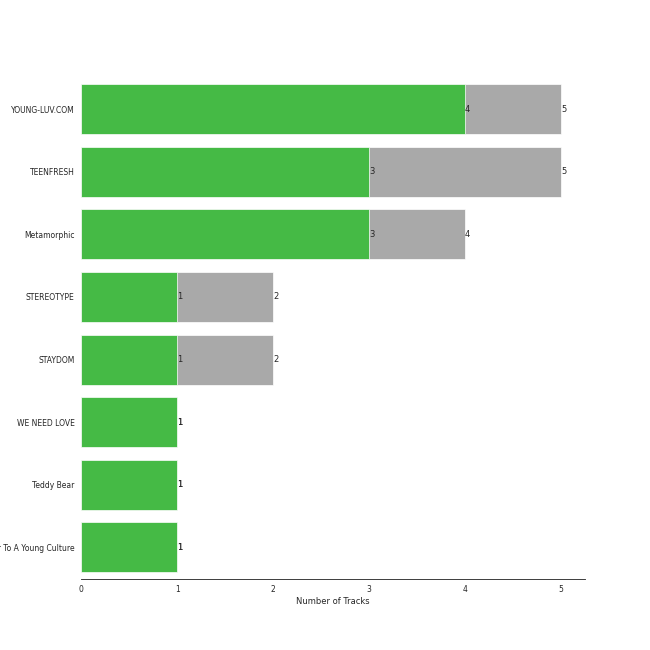

# High Up Entertainment

17 songs

[See Track Features](audio_features.md)

[See Clusters](clusters/overview.md)

Appears as:
- High Up Entertainment (17 tracks)

## Top Artists

| Art | Tracks | 💚 | Artist | 🔗 |
|:---|---:|---:|:---|:---|
|  | 17 | 12 | [STAYC](../../artists/stayc/overview.md) | [🔗](https://open.spotify.com/artist/01XYiBYaoMJcNhPokrg0l0) |

## Top Albums

| Art | Tracks | 💚 | Album | Release Date | 🔗 |
|:---|---:|---:|:---|:---|:---|
|  | 5 | 4 | YOUNG-LUV.COM | 2022-02-21 | [🔗](https://open.spotify.com/album/2xPdgNkM4yIQmP7axJ1T1o) |
|  | 5 | 3 | TEENFRESH | 2023-08-16 | [🔗](https://open.spotify.com/album/4P5wnRQTBnnjNbjt7A6S6x) |
|  | 2 | 1 | STEREOTYPE | 2021-09-06 | [🔗](https://open.spotify.com/album/7HGjNJBj1NQGNwCzFD2LHj) |
|  | 2 | 1 | STAYDOM | 2021-04-08 | [🔗](https://open.spotify.com/album/71hjsg660uio3Z8bnbB6fS) |
|  | 1 | 1 | WE NEED LOVE | 2022-07-19 | [🔗](https://open.spotify.com/album/04EniWu488MF6louRYafKJ) |
|  | 1 | 1 | Teddy Bear | 2023-02-14 | [🔗](https://open.spotify.com/album/325MEzmbNCQvjsP3oaJh4x) |
|  | 1 | 1 | Star To A Young Culture | 2020-11-12 | [🔗](https://open.spotify.com/album/4PrRd0lIunUEiiE5rbZklR) |

## Genres

| Tracks | 💚 | Genre |
|---:|---:|:---|
| 17 | 12 | [k-pop girl group](../../genres/k-pop_girl_group/overview.md) |
| 17 | 12 | [k-pop](../../genres/k-pop/overview.md) |

## Top Producers

| Art | Producer | Tracks | Credit Types |
|:---|:---|---:|:---|
| | [전군 (Jeon Goon)](../../producers/전군_(jeon_goon)/overview.md) | 10 | Lyricist, Songwriter, Producer |
| | [블랙아이드필승 (Black Eyed Pilseung)](../../producers/블랙아이드필승_(black_eyed_pilseung)/overview.md) | 10 | Lyricist, Songwriter, Arranger, Producer |
| | [라도 (Rado)](../../producers/라도_(rado)/overview.md) | 8 | Arranger, Producer |
| | [정은경 (Jung, Eun-Kyung)](../../producers/정은경_(jung,_eun-kyung)/overview.md) | 8 | Producer |
| | DRK | 5 | Producer |
| | [FLYT](../../producers/flyt/overview.md) | 5 | Arranger, Songwriter, Producer |
| | 고현정 (Go, Hyeon-Jeong) | 3 | Producer |
| | Prime Time | 2 | Songwriter |
| | BXN | 2 | Lyricist, Songwriter, Arranger |
| | 김수정 (김수정) | 1 | Producer |

View all

| Art | Producer | Tracks | Credit Types |
|:---|:---|---:|:---|
| | [양영은 (Yang, Young-eun)](../../producers/양영은_(yang,_young-eun)/overview.md) | 1 | Producer |
| | will.b | 1 | Songwriter |

## Tracks released under High Up Entertainment

| Art | Track | Album | Artists | Label | Score | 💚 | 🔗 |
|:---|:---|:---|:---|:---|---:|:---|:---|
|  | Bubble | TEENFRESH | [STAYC](../../artists/stayc/overview.md) | [High Up Entertainment](.) | 8059 | 💚 | [🔗](https://open.spotify.com/track/4P5ozkI1bxiGxA5rZ27jlO) |
|  | Not Like You | TEENFRESH | [STAYC](../../artists/stayc/overview.md) | [High Up Entertainment](.) | 1083 | 💚 | [🔗](https://open.spotify.com/track/1HnJhU3MhAnRQzdkFm6xQr) |
|  | SO BAD | Star To A Young Culture | [STAYC](../../artists/stayc/overview.md) | [High Up Entertainment](.) | 456 | 💚 | [🔗](https://open.spotify.com/track/13KR2yNRDrbKwR3dOKCDl4) |
|  | BUTTERFLY | YOUNG-LUV.COM | [STAYC](../../artists/stayc/overview.md) | [High Up Entertainment](.) | 212 | 💚 | [🔗](https://open.spotify.com/track/1q97NRLZfQlXYvZJAQ7tln) |
|  | Teddy Bear | Teddy Bear | [STAYC](../../artists/stayc/overview.md) | [High Up Entertainment](.) | 122 | 💚 | [🔗](https://open.spotify.com/track/4kSDi21MeOoSvpZs6MveI9) |
|  | RUN2U | YOUNG-LUV.COM | [STAYC](../../artists/stayc/overview.md) | [High Up Entertainment](.) | 77 | 💚 | [🔗](https://open.spotify.com/track/3gFcGnU4kTdMYLXDjH1TK8) |
|  | STEREOTYPE | STEREOTYPE | [STAYC](../../artists/stayc/overview.md) | [High Up Entertainment](.) | 69 | 💚 | [🔗](https://open.spotify.com/track/2bZIDMpzVooosmPHn0tHnd) |
|  | ASAP | STAYDOM | [STAYC](../../artists/stayc/overview.md) | [High Up Entertainment](.) | 0 | 💚 | [🔗](https://open.spotify.com/track/5BXr7hYZQOeRttkeWYTq5S) |
|  | LOVE FOOL | STAYDOM | [STAYC](../../artists/stayc/overview.md) | [High Up Entertainment](.) | 0 | | [🔗](https://open.spotify.com/track/2OhOkew9BkkLTGBG9cFOz5) |
|  | I’ll BE THERE | STEREOTYPE | [STAYC](../../artists/stayc/overview.md) | [High Up Entertainment](.) | 0 | | [🔗](https://open.spotify.com/track/1aWnOcf3GE7xuu4rubVPYL) |

See all tracks

| Art | Track | Album | Artists | Label | Score | 💚 | 🔗 |
|:---|:---|:---|:---|:---|---:|:---|:---|
|  | 247 | YOUNG-LUV.COM | [STAYC](../../artists/stayc/overview.md) | [High Up Entertainment](.) | 0 | | [🔗](https://open.spotify.com/track/51XWwKV6VHCuFftFQLp4iA) |
|  | SAME SAME | YOUNG-LUV.COM | [STAYC](../../artists/stayc/overview.md) | [High Up Entertainment](.) | 0 | 💚 | [🔗](https://open.spotify.com/track/5mr1d04qe0s5ux5fQQcH2p) |
|  | YOUNG LUV | YOUNG-LUV.COM | [STAYC](../../artists/stayc/overview.md) | [High Up Entertainment](.) | 0 | 💚 | [🔗](https://open.spotify.com/track/7HGKvoju3ucB7UqVt1GoJu) |
|  | BEAUTIFUL MONSTER | WE NEED LOVE | [STAYC](../../artists/stayc/overview.md) | [High Up Entertainment](.) | 0 | 💚 | [🔗](https://open.spotify.com/track/56s2s5e8WuBsWVKnmz6J9L) |
|  | Be Mine | TEENFRESH | [STAYC](../../artists/stayc/overview.md) | [High Up Entertainment](.) | 0 | 💚 | [🔗](https://open.spotify.com/track/3g4jq4wctEo0fVaTDKjk3Q) |
|  | Bubble (English Ver.) | TEENFRESH | [STAYC](../../artists/stayc/overview.md) | [High Up Entertainment](.) | 0 | | [🔗](https://open.spotify.com/track/3bcqk74mnFzQF2bfOMG7iK) |
|  | Bubble (Sped Up) (English Ver.) | TEENFRESH | [STAYC](../../artists/stayc/overview.md) | [High Up Entertainment](.) | 0 | | [🔗](https://open.spotify.com/track/1e9uzZKeHabJ1kSDT7m3Np) |

