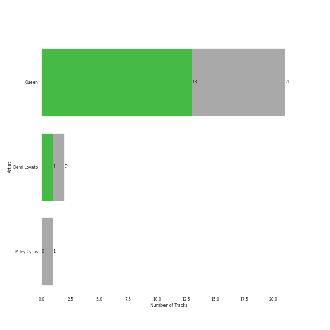
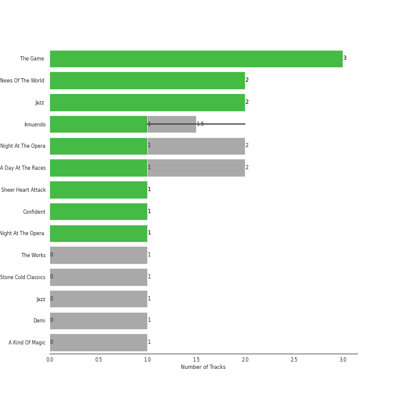
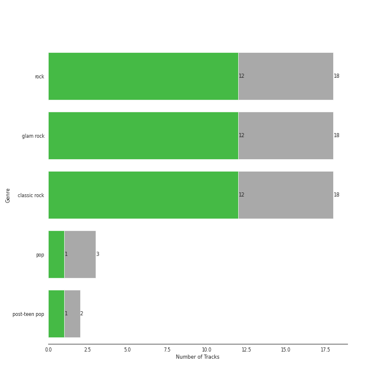
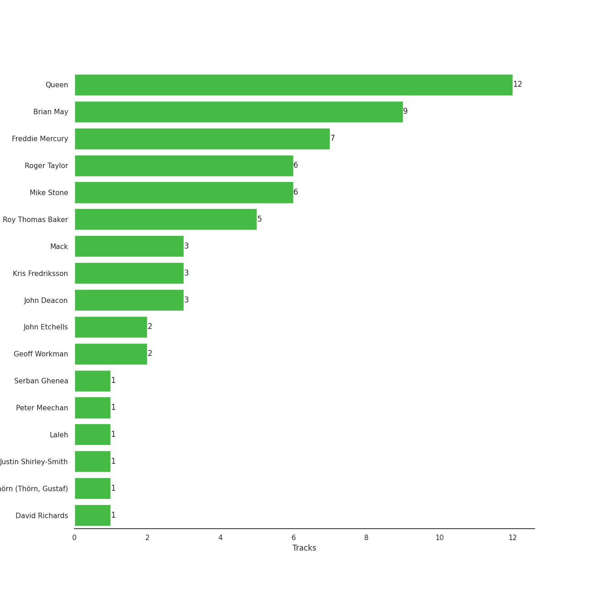

# Hollywood Records

19 songs

[See Track Features](audio_features.md)

[See Clusters](clusters/overview.md)

Appears as:
- Hollywood Records (19 tracks)

## Top Artists

| Art | Rank | Tracks | 💚 | Artist | 🔗 |
|:---|---:|---:|---:|:---|:---|
|  | 48 | 16 | 11 | [Queen](../../artists/queen/overview.md) | [🔗](https://open.spotify.com/artist/1dfeR4HaWDbWqFHLkxsg1d) |
|  | 427 | 2 | 1 | Demi Lovato | [🔗](https://open.spotify.com/artist/6S2OmqARrzebs0tKUEyXyp) |
|  | 214 | 1 | 0 | Miley Cyrus | [🔗](https://open.spotify.com/artist/5YGY8feqx7naU7z4HrwZM6) |

## Top Albums

| Art | Rank | Tracks | 💚 | Album | Release Date | 🔗 |
|:---|---:|---:|---:|:---|:---|:---|
|  | 630 | 3 | 3 | The Game (Deluxe Remastered Version) | 1980-06-27 | [🔗](https://open.spotify.com/album/6wPXUmYJ9mOWrKlLzZ5cCa) |
|  | 630 | 2 | 2 | News Of The World (Deluxe Remastered Version) | 1977-10-28 | [🔗](https://open.spotify.com/album/6Di4m5k1BtMJ0R44bWNutu) |
|  | 541 | 2 | 2 | Jazz (Deluxe Remastered Version) | 1978-11-10 | [🔗](https://open.spotify.com/album/21HMAUrbbYSj9NiPPlGumy) |
|  | 222 | 2 | 1 | Innuendo | 1991-02-04 | [🔗](https://open.spotify.com/album/3jYy7yGNCysTHE8MKrIF1k) |
|  | 630 | 2 | 1 | A Day At The Races | 1976-12-10 | [🔗](https://open.spotify.com/album/3f45rzbU4dYQBTV9v5RFBB) |
|  | 630 | 1 | 1 | Sheer Heart Attack | 1974-11-08 | [🔗](https://open.spotify.com/album/4yO8TpSaJtUKkkjmsA4VXf) |
|  | 630 | 1 | 1 | Confident | 2015-01-01 | [🔗](https://open.spotify.com/album/56yYgfX6M5FlpETfyZSHkn) |
|  | 214 | 1 | 1 | A Night At The Opera (Deluxe Remastered Version) | 1975-11-21 | [🔗](https://open.spotify.com/album/6X9k3hSsvQck2OfKYdBbXr) |
|  | 630 | 1 | 0 | The Works | 1984-02-27 | [🔗](https://open.spotify.com/album/0FbnXAGmgmWBmNthZSgm43) |
|  | 630 | 1 | 0 | The Time Of Our Lives | 2009-01-01 | [🔗](https://open.spotify.com/album/64aKkqxc3Ur2LYIKeS5osS) |

See all 13 albums

| Art | Rank | Tracks | 💚 | Album | Release Date | 🔗 |
|:---|---:|---:|---:|:---|:---|:---|
|  | 630 | 1 | 0 | Jazz | 1978-11-10 | [🔗](https://open.spotify.com/album/5X3rA8To5GDOeIWdQyMEcE) |
|  | 630 | 1 | 0 | Demi | 2013-01-01 | [🔗](https://open.spotify.com/album/6Kssm2LosQ0WyLukFZkEG5) |
|  | 630 | 1 | 0 | A Kind Of Magic | 1986-06-02 | [🔗](https://open.spotify.com/album/34xBXeJgmQrn1wQvhyVCsw) |

## Genres

| Tracks | 💚 | Genre |
|---:|---:|:---|
| 16 | 11 | [rock](../../genres/rock/overview.md) |
| 16 | 11 | glam rock |
| 16 | 11 | [classic rock](../../genres/classic_rock/overview.md) |
| 3 | 1 | [pop](../../genres/pop/overview.md) |
| 2 | 1 | [post-teen pop](../../genres/post-teen_pop/overview.md) |

## Top Producers

| Art | Producer | Tracks | Credit Types |
|:---|:---|---:|:---|
|  | [Queen](../../artists/queen/overview.md) | 11 | Producer, Arranger |
| | [Brian May](../../producers/brian_may/overview.md) | 8 | Songwriter, Lyricist, Producer, Arranger |
| | [Freddie Mercury](../../producers/freddie_mercury/overview.md) | 7 | Songwriter, Lyricist |
| | Mike Stone | 5 | Producer |
| | Roger Taylor | 5 | Songwriter, Producer |
| | Roy Thomas Baker | 4 | Producer |
| | Mack | 3 | Producer |
| | John Deacon | 2 | Songwriter, Lyricist |
| | Kris Fredriksson | 2 | Producer |
| | John Etchells | 2 | Producer |

View all

| Art | Producer | Tracks | Credit Types |
|:---|:---|---:|:---|
| | Geoff Workman | 2 | Producer |
| | Justin Shirley-Smith | 1 | Producer |
| | Gustaf Thörn (Thörn, Gustaf) | 1 | Arranger |
| | Laleh | 1 | Arranger, Producer |
| | David Richards | 1 | Producer |
| | Peter Meechan | 1 | Arranger |
| | [Serban Ghenea](../../producers/serban_ghenea/overview.md) | 1 | Producer |

## Tracks released under Hollywood Records

| Art | Track | Album | Artists | Label | Rank | 💚 | 🔗 |
|:---|:---|:---|:---|:---|---:|:---|:---|
|  | Bohemian Rhapsody - Remastered 2011 | A Night At The Opera (Deluxe Remastered Version) | [Queen](../../artists/queen/overview.md) | [Hollywood Records](.) | 296 | 💚 | [🔗](https://open.spotify.com/track/7tFiyTwD0nx5a1eklYtX2J) |
|  | Innuendo - Remastered 2011 | Innuendo | [Queen](../../artists/queen/overview.md) | [Hollywood Records](.) | 309 | 💚 | [🔗](https://open.spotify.com/track/2OuImA1gcBXJVMrVH9Kn9p) |
|  | Fat Bottomed Girls - Remastered 2011 | Jazz (Deluxe Remastered Version) | [Queen](../../artists/queen/overview.md) | [Hollywood Records](.) | 816 | 💚 | [🔗](https://open.spotify.com/track/4igIYHF3B5VBxEafHauVo3) |
|  | Killer Queen | Sheer Heart Attack | [Queen](../../artists/queen/overview.md) | [Hollywood Records](.) | 955 | 💚 | [🔗](https://open.spotify.com/track/1KPMTL3BRLBWrNY8fveVy6) |
|  | Good Old Fashioned Lover Boy | A Day At The Races | [Queen](../../artists/queen/overview.md) | [Hollywood Records](.) | 955 | | [🔗](https://open.spotify.com/track/3e9w80AUq0mT9Nrq471kLx) |
|  | Somebody To Love | A Day At The Races | [Queen](../../artists/queen/overview.md) | [Hollywood Records](.) | 955 | 💚 | [🔗](https://open.spotify.com/track/79M91zIoaIrm073sACpOtr) |
|  | We Are The Champions - Remastered 2011 | News Of The World (Deluxe Remastered Version) | [Queen](../../artists/queen/overview.md) | [Hollywood Records](.) | 955 | 💚 | [🔗](https://open.spotify.com/track/7ccI9cStQbQdystvc6TvxD) |
|  | We Will Rock You - Remastered 2011 | News Of The World (Deluxe Remastered Version) | [Queen](../../artists/queen/overview.md) | [Hollywood Records](.) | 955 | 💚 | [🔗](https://open.spotify.com/track/54flyrjcdnQdco7300avMJ) |
|  | Don't Stop Me Now | Jazz | [Queen](../../artists/queen/overview.md) | [Hollywood Records](.) | 955 | | [🔗](https://open.spotify.com/track/43DHLzDkncpby82Po5jlOZ) |
|  | Don't Stop Me Now - Remastered 2011 | Jazz (Deluxe Remastered Version) | [Queen](../../artists/queen/overview.md) | [Hollywood Records](.) | 955 | 💚 | [🔗](https://open.spotify.com/track/7hQJA50XrCWABAu5v6QZ4i) |

See all tracks

| Art | Track | Album | Artists | Label | Rank | 💚 | 🔗 |
|:---|:---|:---|:---|:---|---:|:---|:---|
|  | Another One Bites The Dust - Remastered 2011 | The Game (Deluxe Remastered Version) | [Queen](../../artists/queen/overview.md) | [Hollywood Records](.) | 955 | 💚 | [🔗](https://open.spotify.com/track/57JVGBtBLCfHw2muk5416J) |
|  | Crazy Little Thing Called Love - Remastered 2011 | The Game (Deluxe Remastered Version) | [Queen](../../artists/queen/overview.md) | [Hollywood Records](.) | 955 | 💚 | [🔗](https://open.spotify.com/track/35ItUJlMtjOQW3SSiTCrrw) |
|  | Save Me - Remastered 2011 | The Game (Deluxe Remastered Version) | [Queen](../../artists/queen/overview.md) | [Hollywood Records](.) | 955 | 💚 | [🔗](https://open.spotify.com/track/2mGEqJahn3CSyCG1BTEqMs) |
|  | I Want To Break Free | The Works | [Queen](../../artists/queen/overview.md) | [Hollywood Records](.) | 955 | | [🔗](https://open.spotify.com/track/1IVZX29ZuEXng3ChRnp3tL) |
|  | A Kind Of Magic | A Kind Of Magic | [Queen](../../artists/queen/overview.md) | [Hollywood Records](.) | 955 | | [🔗](https://open.spotify.com/track/74QzobuYWH5BHMTrW9X7Yu) |
|  | The Show Must Go On - Remastered 2011 | Innuendo | [Queen](../../artists/queen/overview.md) | [Hollywood Records](.) | 955 | | [🔗](https://open.spotify.com/track/3VYrW02CQhbkYAe4rpG297) |
|  | Party In The U.S.A. | The Time Of Our Lives | Miley Cyrus | [Hollywood Records](.) | 955 | | [🔗](https://open.spotify.com/track/5Q0Nhxo0l2bP3pNjpGJwV1) |
|  | Heart Attack | Demi | Demi Lovato | [Hollywood Records](.) | 955 | | [🔗](https://open.spotify.com/track/1V6gIisPpYqgFeWbMLI0bA) |
|  | Stone Cold | Confident | Demi Lovato | [Hollywood Records](.) | 955 | 💚 | [🔗](https://open.spotify.com/track/3by8IfnW9dZ2t4pZw1WVxz) |

