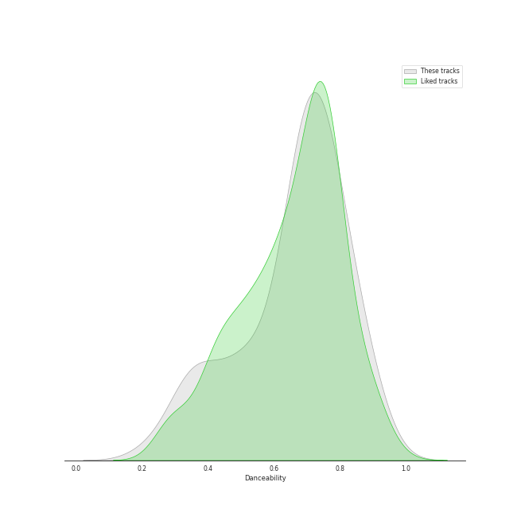
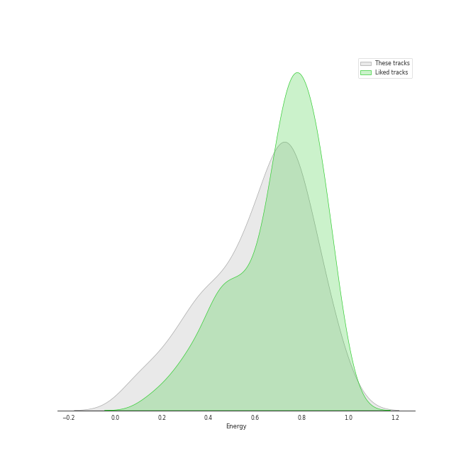
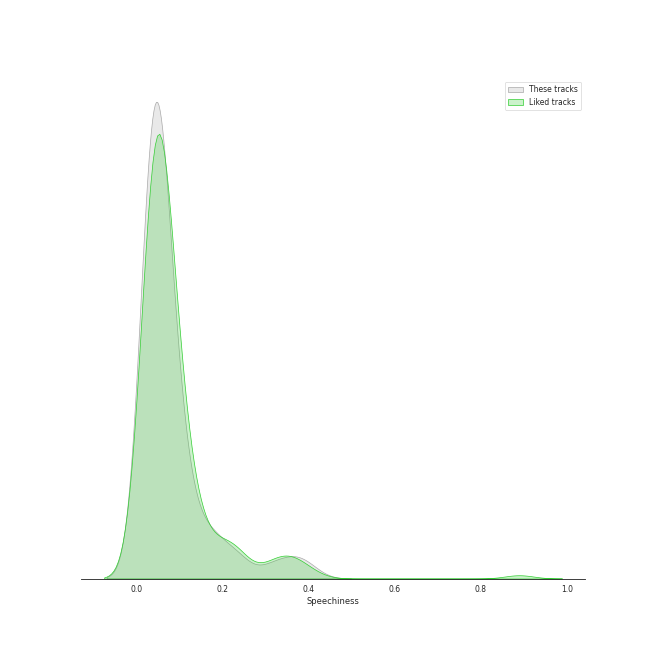
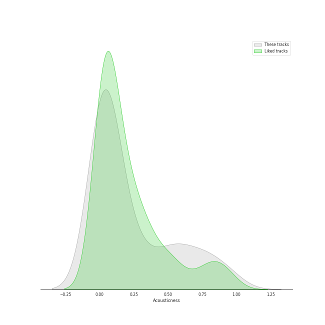
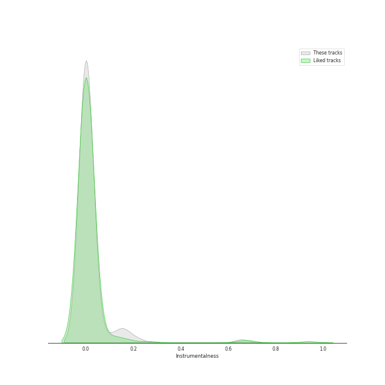
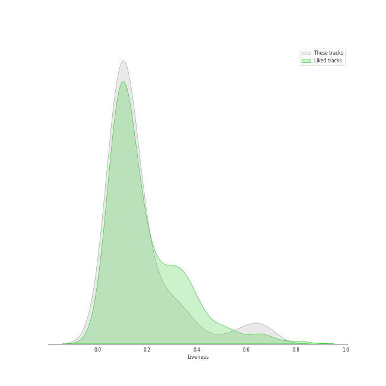
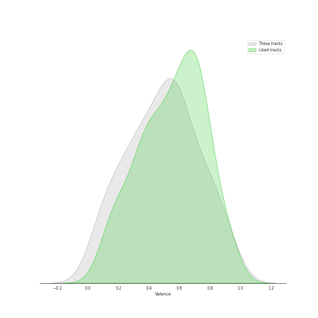
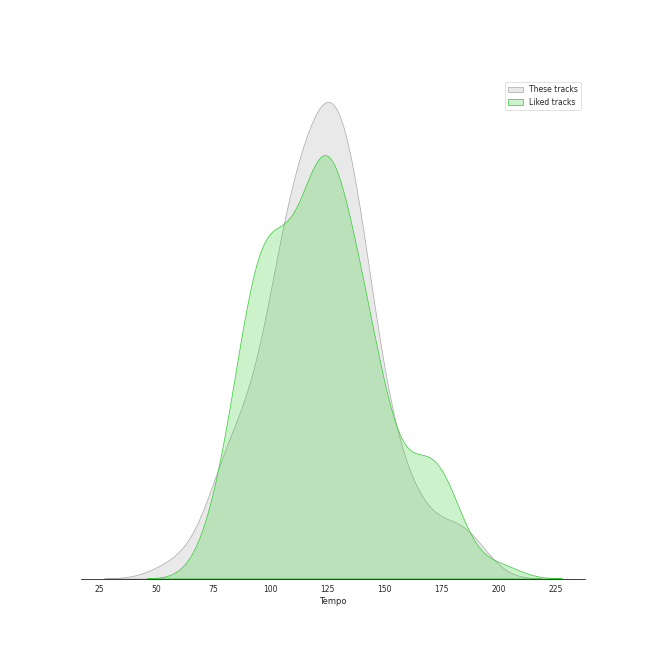

# Audio Features for Interscope Records

## Danceability

| ​ | 10 most Danceable tracks | ​​ | 10 least Danceable tracks |
|:---|:---|:---|:---|
|  | Typa Girl (0.915) |  | On The Ground (0.311) |
|  | bury a friend (0.905) |  | Happier Than Ever (0.332) |
|  | LoveGame (0.894) |  | when the party's over (0.367) |
|  | Therefore I Am (0.879) |  | No Time To Die (0.38) |
|  | Poker Face (0.851) |  | Seed (0.395) |
|  | DUMB DUMB (0.851) |  | Til It Happens To You (0.401) |
|  | FLOWER (0.841) |  | TV (0.412) |
|  | MONEY (0.831) |  | Radioactive (0.448) |
|  | Telephone (0.824) |  | You Never Know (0.477) |
|  | Just Dance (0.822) |  | Yoü And I (0.518) |

## Energy

| ​ | 10 most Energetic tracks | ​​ | 10 least Energetic tracks |
|:---|:---|:---|:---|
|  | Hello Good Morning (0.954) |  | when the party's over (0.111) |
|  | Forever Young (0.949) |  | xanny (0.125) |
|  | See U Later (0.926) |  | Come Home (0.155) |
|  | Bad Romance (0.921) |  | No Time To Die (0.219) |
|  | Really (0.881) |  | everything i wanted (0.225) |
|  | Sour Candy (with BLACKPINK) (0.87) |  | Happier Than Ever (0.225) |
|  | This Love (0.862) |  | TV (0.236) |
|  | This Love (0.862) |  | Lonely (with benny blanco) (0.239) |
|  | Rain On Me (with Ariana Grande) (0.855) |  | GOLDWING (0.303) |
|  | United In Grief (0.845) |  | Seed (0.33) |

## Speechiness

| ​ | 10 most Speechy tracks | ​​ | 10 least Speechy tracks |
|:---|:---|:---|:---|
|  | United In Grief (0.404) |  | Hope Not (0.0274) |
|  | bad guy (0.375) |  | Come Home (0.0286) |
|  | Ice Cream (with Selena Gomez) (0.365) |  | She Will Be Loved (0.0301) |
|  | bury a friend (0.332) |  | Maps (0.0303) |
|  | Hello Good Morning (0.239) |  | Tally (0.031) |
|  | xanny (0.239) |  | Just Dance (0.0311) |
|  | MONEY (0.218) |  | XOXO (0.0314) |
|  | Kill This Love (0.191) |  | The Happiest Girl (0.0328) |
|  | you should see me in a crown (0.186) |  | Anymore (0.0329) |
|  | Love To Hate Me (0.159) |  | Sugar (0.0334) |

## Acousticness

| ​ | 10 most Acoustic tracks | ​​ | 10 least Acoustic tracks |
|:---|:---|:---|:---|
|  | when the party's over (0.978) |  | Misery (0.000315) |
|  | Come Home (0.947) |  | Bad Romance (0.00314) |
|  | No Time To Die (0.917) |  | Shut Down (0.00412) |
|  | everything i wanted (0.902) |  | Yeah Yeah Yeah (0.00486) |
|  | Lonely (with benny blanco) (0.864) |  | Telephone (0.00521) |
|  | TV (0.83) |  | Lovesick Girls (0.00559) |
|  | Happier Than Ever (0.767) |  | LoveGame (0.00569) |
|  | Mushroom Chocolate (with 6LACK) (0.765) |  | Hard to Love (0.00616) |
|  | GOLDWING (0.755) |  | Nightfall (feat. Bryan Chase) (0.00677) |
|  | xanny (0.751) |  | Tally (0.00777) |

## Instrumentalness

| ​ | 10 most Instrumental tracks | ​​ | 10 least Instrumental tracks |
|:---|:---|:---|:---|
|  | everything i wanted (0.657) |  | Shut Down (0.0) |
|  | you should see me in a crown (0.219) |  | Nightfall (feat. Bryan Chase) (0.0) |
|  | bury a friend (0.162) |  | Typa Girl (0.0) |
|  | GOLDWING (0.159) |  | Til It Happens To You (0.0) |
|  | Therefore I Am (0.135) |  | Tally (0.0) |
|  | bad guy (0.13) |  | Believer (0.0) |
|  | No Time To Die (0.0104) |  | Bad Things (with Camila Cabello) (0.0) |
|  | TV (0.00653) |  | The Happiest Girl (0.0) |
|  | Happier Than Ever (0.00349) |  | Sunday Morning (0.0) |
|  | Kill This Love (0.00221) |  | See U Later (0.0) |

## Liveness

| ​ | 10 most Live tracks | ​​ | 10 least Live tracks |
|:---|:---|:---|:---|
|  | Hello Good Morning (0.669) |  | Ice Cream (with Selena Gomez) (0.0311) |
|  | Radioactive (0.668) |  | Good Thing (with Kehlani) (0.0409) |
|  | Typa Girl (0.628) |  | Crank That (Soulja Boy) (0.0468) |
|  | See U Later (0.582) |  | Therefore I Am (0.0583) |
|  | Sour Candy (with BLACKPINK) (0.489) |  | Maps (0.059) |
|  | Shoong! (feat. LISA of BLACKPINK) (0.409) |  | Sunday Morning (0.0595) |
|  | Payphone (0.37) |  | How You Like That (0.0601) |
|  | Rain On Me (with Ariana Grande) (0.323) |  | Yeah Yeah Yeah (0.0628) |
|  | LoveGame (0.317) |  | FLOWER (0.0735) |
|  | Moves Like Jagger - Studio Recording From "The Voice" Performance (0.308) |  | Kick It (0.0736) |

## Valence

| ​ | 10 most Happy tracks | ​​ | 10 least Happy tracks |
|:---|:---|:---|:---|
|  | Really (0.947) |  | No Time To Die (0.0517) |
|  | Ice Cream (with Selena Gomez) (0.91) |  | xanny (0.0528) |
|  | Sugar (0.884) |  | Lonely (with benny blanco) (0.0927) |
|  | Maps (0.879) |  | TV (0.119) |
|  | LALISA (0.85) |  | Til It Happens To You (0.15) |
|  | LoveGame (0.844) |  | Million Reasons (0.154) |
|  | This Love (0.809) |  | Come Home (0.16) |
|  | This Love (0.809) |  | Nightfall (feat. Bryan Chase) (0.168) |
|  | Sunday Morning (0.805) |  | GOLDWING (0.168) |
|  | Crank That (Soulja Boy) (0.803) |  | Hope Not (0.179) |

## Tempo

| ​ | 10 most Fast tracks | ​​ | 10 least Fast tracks |
|:---|:---|:---|:---|
|  | On The Ground (188.7) |  | No Time To Die (73.537) |
|  | Good Thing (with Kehlani) (185.913) |  | Come Home (75.003) |
|  | Pink Venom (180.169) |  | Lonely (with benny blanco) (79.859) |
|  | Love To Hate Me (162.225) |  | Gone (79.936) |
|  | GOLDWING (160.095) |  | Happier Than Ever (81.055) |
|  | Ice Cream (with Selena Gomez) (159.972) |  | when the party's over (82.642) |
|  | Pretty Savage (152.045) |  | United In Grief (85.63) |
|  | you should see me in a crown (150.455) |  | Sunday Morning (88.059) |
|  | LALISA (150.058) |  | Seed (89.851) |
|  | Mushroom Chocolate (with 6LACK) (147.921) |  | The Happiest Girl (91.058) |
