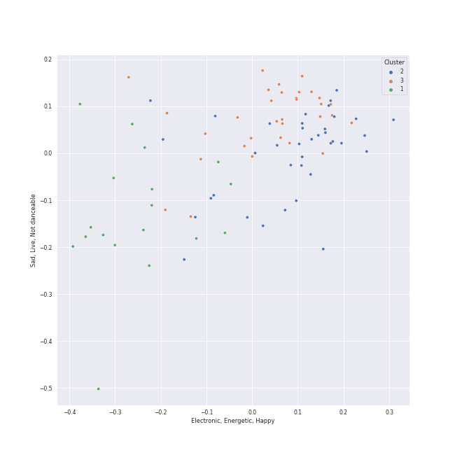

# Clusters in Interscope Records

## Cluster #1

34 tracks

| Art | Track | Album | Artists | Label | Score | 💚 | 🔗 |
|:---|:---|:---|:---|:---|---:|:---|:---|
|  | Tally | BORN PINK | [BLACKPINK](../../../../artists/blackpink/overview.md) | [Interscope Records](../..), [YG Entertainment](../../../yg_entertainment) | 0 | 💚 | [🔗](https://open.spotify.com/track/0bYVPJvXr8ACmw313cVvhB) |
|  | Pretty Savage | THE ALBUM | [BLACKPINK](../../../../artists/blackpink/overview.md) | [Interscope Records](../..), [YG Entertainment](../../../yg_entertainment) | 61344 | 💚 | [🔗](https://open.spotify.com/track/1XnpzbOGptRwfJhZgLbmSr) |
|  | Lovesick Girls | THE ALBUM | [BLACKPINK](../../../../artists/blackpink/overview.md) | [Interscope Records](../..), [YG Entertainment](../../../yg_entertainment) | 0 | 💚 | [🔗](https://open.spotify.com/track/4Ws314Ylb27BVsvlZOy30C) |
|  | Don't Know What To Do | KILL THIS LOVE | [BLACKPINK](../../../../artists/blackpink/overview.md) | [Interscope Records](../..), [YG Entertainment](../../../yg_entertainment) | 0 | 💚 | [🔗](https://open.spotify.com/track/38SKB7UfhL6Sd6Joxex5yK) |
|  | Paparazzi | The Fame | [Lady Gaga](../../../../artists/lady_gaga/overview.md) | [Interscope](../..) | 0 | | [🔗](https://open.spotify.com/track/7Hqig8kp32q2Ire3ECQvWM) |
|  | XOXO | XOXO | JEON SOMI | [THE BLACK LABEL/Interscope Records](../..) | 0 | 💚 | [🔗](https://open.spotify.com/track/4r34Yi0eltsu1tp6z4lq3x) |
|  | Anymore | XOXO | JEON SOMI | [THE BLACK LABEL/Interscope Records](../..) | 0 | 💚 | [🔗](https://open.spotify.com/track/6GwtJzM3yffZ4FJ39QuUcE) |
|  | Bad Things (with Camila Cabello) | bloom | mgk, [Camila Cabello](../../../../artists/camila_cabello/overview.md) | [Bad Boy](../../../bad_boy), [Interscope Records](../..) | 0 | 💚 | [🔗](https://open.spotify.com/track/1PSBzsahR2AKwLJgx8ehBj) |
|  | She Will Be Loved | Songs About Jane | [Maroon 5](../../../../artists/maroon_5/overview.md) | [Interscope Records*](../..) | 0 | 💚 | [🔗](https://open.spotify.com/track/7sapKrjDij2fpDVj0GxP66) |
|  | SOLO | SOLO | JENNIE | [Interscope Records](../..), [YG Entertainment](../../../yg_entertainment) | 2183 | 💚 | [🔗](https://open.spotify.com/track/2wVDWtLKXunswWecARNILj) |
## Cluster #2

23 tracks

| Art | Track | Album | Artists | Label | Score | 💚 | 🔗 |
|:---|:---|:---|:---|:---|---:|:---|:---|
|  | Hope Not | KILL THIS LOVE | [BLACKPINK](../../../../artists/blackpink/overview.md) | [Interscope Records](../..), [YG Entertainment](../../../yg_entertainment) | 0 | | [🔗](https://open.spotify.com/track/3eZD5DZGibwxMAOaCMBg3k) |
|  | GOLDWING | Happier Than Ever | [Billie Eilish](../../../../artists/billie_eilish/overview.md) | [Darkroom](../../../darkroom), [Interscope Records](../..) | 39 | 💚 | [🔗](https://open.spotify.com/track/0FfqyjhB6Kspvit1oOo7ax) |
|  | Happier Than Ever | Happier Than Ever | [Billie Eilish](../../../../artists/billie_eilish/overview.md) | [Darkroom](../../../darkroom), [Interscope Records](../..) | 0 | | [🔗](https://open.spotify.com/track/4RVwu0g32PAqgUiJoXsdF8) |
|  | TV | Guitar Songs | [Billie Eilish](../../../../artists/billie_eilish/overview.md) | [Darkroom](../../../darkroom), [Interscope Records](../..) | 0 | | [🔗](https://open.spotify.com/track/3GYlZ7tbxLOxe6ewMNVTkw) |
|  | Million Reasons | Joanne (Deluxe) | [Lady Gaga](../../../../artists/lady_gaga/overview.md) | [Interscope](../..) | 0 | | [🔗](https://open.spotify.com/track/7dZ1Odmx9jWIweQSatnRqo) |
|  | Lonely (with benny blanco) | Lonely (with benny blanco) | [Justin Bieber](../../../../artists/justin_bieber/overview.md), benny blanco | Friends Keep Secrets, [Def Jam Recordings](../../../def_jam_recordings), [Interscope Records](../..) | 0 | 💚 | [🔗](https://open.spotify.com/track/4y4spB9m0Q6026KfkAvy9Q) |
|  | Seed | Down to Earth | TAEYANG | [THEBLACKLABEL/Interscope Records](../..) | 148 | | [🔗](https://open.spotify.com/track/49eleLPCqnwgBSICKgcL0z) |
|  | Elephant Love Medley - From "Moulin Rouge" Soundtrack | Moulin Rouge | Nicole Kidman, Ewan McGregor, Jamie Allen | [Moulin Rouge / Interscope](../..) | 0 | | [🔗](https://open.spotify.com/track/1M5iGApccrA2uBzQMELW9w) |
|  | Your Song - From "Moulin Rouge" Soundtrack | Moulin Rouge | Ewan McGregor, Alessandro Safina | [Moulin Rouge / Interscope](../..) | 0 | | [🔗](https://open.spotify.com/track/1rDklEm1rIKphZ7EvWinHm) |
|  | Nature Boy - From "Moulin Rouge" Soundtrack | Moulin Rouge | David Bowie | [Moulin Rouge / Interscope](../..) | 0 | | [🔗](https://open.spotify.com/track/5EDXCIp54bSQspeOyta5R7) |
## Cluster #3

38 tracks

| Art | Track | Album | Artists | Label | Score | 💚 | 🔗 |
|:---|:---|:---|:---|:---|---:|:---|:---|
|  | Shut Down | BORN PINK | [BLACKPINK](../../../../artists/blackpink/overview.md) | [Interscope Records](../..), [YG Entertainment](../../../yg_entertainment) | 5755 | 💚 | [🔗](https://open.spotify.com/track/0ARKW62l9uWIDYMZTUmJHF) |
|  | Yeah Yeah Yeah | BORN PINK | [BLACKPINK](../../../../artists/blackpink/overview.md) | [Interscope Records](../..), [YG Entertainment](../../../yg_entertainment) | 0 | 💚 | [🔗](https://open.spotify.com/track/5TfKoQg9AjmDIWYKFoDqMN) |
|  | Pink Venom | BORN PINK | [BLACKPINK](../../../../artists/blackpink/overview.md) | [Interscope Records](../..), [YG Entertainment](../../../yg_entertainment) | 20306 | 💚 | [🔗](https://open.spotify.com/track/6stcJnJHPO8RrYx5LLz5OP) |
|  | Crazy Over You | THE ALBUM | [BLACKPINK](../../../../artists/blackpink/overview.md) | [Interscope Records](../..), [YG Entertainment](../../../yg_entertainment) | 57691 | 💚 | [🔗](https://open.spotify.com/track/7qq0EOPW4RRlqdvMBmdd73) |
|  | Just Dance | The Fame | [Lady Gaga](../../../../artists/lady_gaga/overview.md), Colby O'Donis | [Interscope](../..) | 0 | | [🔗](https://open.spotify.com/track/2x7MyWybabEz6Y6wvHuwGE) |
|  | Poker Face | The Fame | [Lady Gaga](../../../../artists/lady_gaga/overview.md) | [Interscope](../..) | 0 | 💚 | [🔗](https://open.spotify.com/track/5R8dQOPq8haW94K7mgERlO) |
|  | Fast Forward | GAME PLAN | JEON SOMI | [THEBLACKLABEL/Interscope Records](../..) | 0 | | [🔗](https://open.spotify.com/track/7jzOZuWgZ5gaMet9V5Ix1d) |
|  | VIBE (feat. Jimin of BTS) | Down to Earth | TAEYANG, Jimin | [THEBLACKLABEL/Interscope Records](../..) | 0 | 💚 | [🔗](https://open.spotify.com/track/4NIe9Is7bN5JWyTeCW2ahK) |
|  | Misery | Hands All Over (Deluxe) | [Maroon 5](../../../../artists/maroon_5/overview.md) | [Interscope Records*](../..) | 0 | 💚 | [🔗](https://open.spotify.com/track/6KBYk8OFtod7brGuZ3Y67q) |
|  | Moves Like Jagger - Studio Recording From "The Voice" Performance | Hands All Over | [Maroon 5](../../../../artists/maroon_5/overview.md), Christina Aguilera | [Interscope Records*](../..) | 0 | | [🔗](https://open.spotify.com/track/7LcfRTgAVTs5pQGEQgUEzN) |