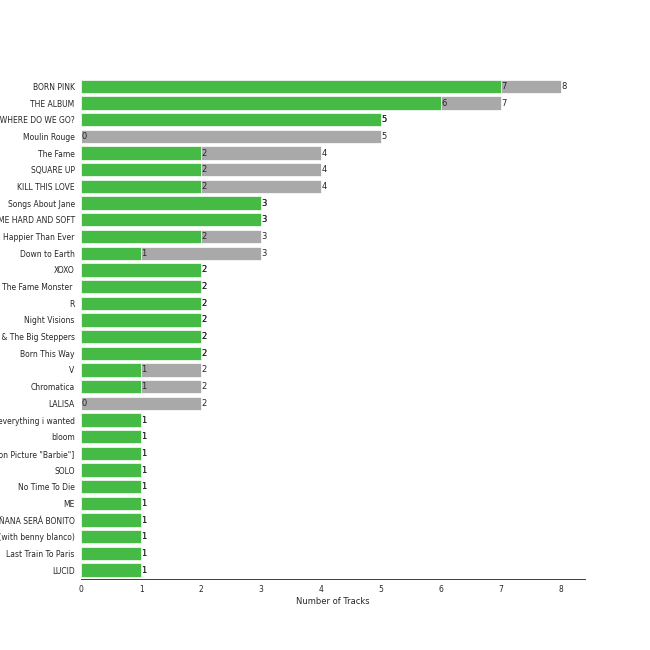
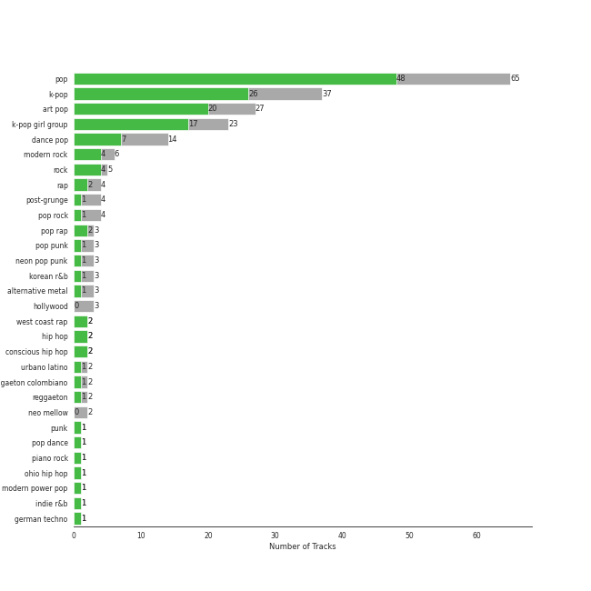

# Interscope Records

80 songs

[See Audio Features](audio_features.md)

Appears as:
- YG Entertainment/Interscope Records (20 tracks)
- Interscope (11 tracks)
- Darkroom/Interscope Records (11 tracks)
- Interscope Records* (9 tracks)
- YG Entertainment, distributed through Interscope Records (5 tracks)
- THEBLACKLABEL/Interscope Records (4 tracks)
- 2018 YG Entertainment, distributed through Interscope Records (4 tracks)
- THE BLACK LABEL/Interscope Records (3 tracks)
- Bad Boy / Interscope (2 tracks)
- Kid Ina Korner / Interscope (2 tracks)
- Mosley / Interscope (2 tracks)
- pgLang/Top Dawg Entertainment/Aftermath/Interscope Records (2 tracks)
- Interscope Records (1 tracks)
- LVRN/Interscope Records (1 tracks)
- Friends Keep Secrets/Def Jam Recordings/Interscope Records (1 tracks)
- Fantasy Soul/Interscope Records (1 tracks)
- Collipark / Interscope (1 tracks)

## Top Artists

| Art | Tracks | 💚 | Artist | 🔗 |
|:---|---:|---:|:---|:---|
|  | 24 | 20 | [BLACKPINK](../../artists/blackpink/overview.md) | [🔗](https://open.spotify.com/artist/41MozSoPIsD1dJM0CLPjZF) |
|  | 11 | 9 | [Billie Eilish](../../artists/billie_eilish/overview.md) | [🔗](https://open.spotify.com/artist/6qqNVTkY8uBg9cP3Jd7DAH) |
|  | 11 | 7 | [Lady Gaga](../../artists/lady_gaga/overview.md) | [🔗](https://open.spotify.com/artist/1HY2Jd0NmPuamShAr6KMms) |
|  | 9 | 5 | Maroon 5 | [🔗](https://open.spotify.com/artist/04gDigrS5kc9YWfZHwBETP) |
|  | 3 | 3 | JEON SOMI | [🔗](https://open.spotify.com/artist/7zYj9S9SdIunYCfSm7vzAR) |
|  | 2 | 2 | OneRepublic | [🔗](https://open.spotify.com/artist/5Pwc4xIPtQLFEnJriah9YJ) |
|  | 2 | 2 | Imagine Dragons | [🔗](https://open.spotify.com/artist/53XhwfbYqKCa1cC15pYq2q) |
|  | 2 | 2 | ROSÉ | [🔗](https://open.spotify.com/artist/3eVa5w3URK5duf6eyVDbu9) |
|  | 2 | 2 | Kendrick Lamar | [🔗](https://open.spotify.com/artist/2YZyLoL8N0Wb9xBt1NhZWg) |
|  | 4 | 1 | TAEYANG | [🔗](https://open.spotify.com/artist/6udveWUgX4vu75FF0DTrXV) |

See all 32 artists

| Art | Tracks | 💚 | Artist | 🔗 |
|:---|---:|---:|:---|:---|
|  | 3 | 1 | LISA | [🔗](https://open.spotify.com/artist/5L1lO4eRHmJ7a0Q6csE5cT) |
|  | 2 | 1 | Jimin | [🔗](https://open.spotify.com/artist/1oSPZhvZMIrWW5I41kPkkY) |
|  | 1 | 1 | Colby O'Donis | [🔗](https://open.spotify.com/artist/7fObcBw9VM3x7ntWKCYl0z) |
|  | 1 | 1 | [Beyoncé](../../artists/beyonc_/overview.md) | [🔗](https://open.spotify.com/artist/6vWDO969PvNqNYHIOW5v0m) |
|  | 1 | 1 | JISOO | [🔗](https://open.spotify.com/artist/6UZ0ba50XreR4TM8u322gs) |
|  | 1 | 1 | Machine Gun Kelly | [🔗](https://open.spotify.com/artist/6TIYQ3jFPwQSRmorSezPxX) |
|  | 1 | 1 | benny blanco | [🔗](https://open.spotify.com/artist/5CiGnKThu5ctn9pBxv7DGa) |
|  | 1 | 1 | Camila Cabello | [🔗](https://open.spotify.com/artist/4nDoRrQiYLoBzwC5BhVJzF) |
|  | 1 | 1 | T.I. | [🔗](https://open.spotify.com/artist/4OBJLual30L7gRl5UkeRcT) |
|  | 1 | 1 | 6LACK | [🔗](https://open.spotify.com/artist/4IVAbR2w4JJNJDDRFP3E83) |
|  | 1 | 1 | QUIN | [🔗](https://open.spotify.com/artist/3sHS70DMNgPxRqx2fUNrRA) |
|  | 1 | 1 | Zedd | [🔗](https://open.spotify.com/artist/2qxJFvFYMEDqd7ui6kSAcq) |
|  | 1 | 1 | Diddy - Dirty Money | [🔗](https://open.spotify.com/artist/2QYEvpsWUOjqaYuxDPTCmV) |
|  | 1 | 1 | JENNIE | [🔗](https://open.spotify.com/artist/250b0Wlc5Vk0CoUsaCY84M) |
|  | 1 | 1 | Justin Bieber | [🔗](https://open.spotify.com/artist/1uNFoZAHBGtllmzznpCI3s) |
|  | 1 | 1 | Kehlani | [🔗](https://open.spotify.com/artist/0cGUm45nv7Z6M6qdXYQGTX) |
|  | 1 | 1 | Selena Gomez | [🔗](https://open.spotify.com/artist/0C8ZW7ezQVs4URX5aX7Kqx) |
|  | 1 | 0 | Soulja Boy | [🔗](https://open.spotify.com/artist/6GMYJwaziB4ekv1Y6wCDWS) |
|  | 1 | 0 | [Ariana Grande](../../artists/ariana_grande/overview.md) | [🔗](https://open.spotify.com/artist/66CXWjxzNUsdJxJ2JdwvnR) |
|  | 1 | 0 | Summer Walker | [🔗](https://open.spotify.com/artist/57LYzLEk2LcFghVwuWbcuS) |
|  | 1 | 0 | Christina Aguilera | [🔗](https://open.spotify.com/artist/1l7ZsJRRS8wlW3WfJfPfNS) |
|  | 1 | 0 | Wiz Khalifa | [🔗](https://open.spotify.com/artist/137W8MRPWKqSmrBGDBFSop) |

## Top Albums

| Art | Tracks | 💚 | Album | Release Date | 🔗 |
|:---|---:|---:|:---|:---|:---|
|  | 8 | 7 | BORN PINK | 2022-09-16 | [🔗](https://open.spotify.com/album/7jaSNQUBJbvfbZHLNFrV7P) |
|  | 7 | 7 | THE ALBUM | 2020-10-02 | [🔗](https://open.spotify.com/album/71O60S5gIJSIAhdnrDIh3N) |
|  | 5 | 5 | WHEN WE ALL FALL ASLEEP, WHERE DO WE GO? | 2019-03-29 | [🔗](https://open.spotify.com/album/0S0KGZnfBGSIssfF54WSJh) |
|  | 4 | 3 | The Fame | 2008-01-01 | [🔗](https://open.spotify.com/album/1jpUMnKpRlng1OJN7LJauV) |
|  | 4 | 3 | SQUARE UP | 2018-06-15 | [🔗](https://open.spotify.com/album/0wOiWrujRbxlKEGWRQpKYc) |
|  | 4 | 2 | KILL THIS LOVE | 2019-04-05 | [🔗](https://open.spotify.com/album/3PNxZ3BELbUXJ1XLktXiHz) |
|  | 3 | 3 | Songs About Jane | 2002-06-25 | [🔗](https://open.spotify.com/album/1Rv9WRKyYhFaGbuYDaQunN) |
|  | 3 | 2 | Happier Than Ever | 2021-07-30 | [🔗](https://open.spotify.com/album/0JGOiO34nwfUdDrD612dOp) |
|  | 3 | 1 | Down to Earth | 2023-04-25 | [🔗](https://open.spotify.com/album/6uMu4poce5OdMd1HYglZux) |
|  | 2 | 2 | XOXO | 2021-10-29 | [🔗](https://open.spotify.com/album/63pvOn2B5pUUcUKUwIEg9m) |

See all 40 albums

| Art | Tracks | 💚 | Album | Release Date | 🔗 |
|:---|---:|---:|:---|:---|:---|
|  | 2 | 2 | The Fame Monster (Deluxe Edition) | 2009-11-05 | [🔗](https://open.spotify.com/album/6rePArBMb5nLWEaY9aQqL4) |
|  | 2 | 2 | R | 2021-03-12 | [🔗](https://open.spotify.com/album/5BQcoDfcZ8aBcikYX9B7Ob) |
|  | 2 | 2 | Mr. Morale & The Big Steppers | 2022-05-13 | [🔗](https://open.spotify.com/album/79ONNoS4M9tfIA1mYLBYVX) |
|  | 2 | 2 | Dreaming Out Loud | 2007-01-01 | [🔗](https://open.spotify.com/album/2KSpGeDoNjqCKg6HL8LAyI) |
|  | 2 | 1 | V | 2014-09-02 | [🔗](https://open.spotify.com/album/2Auw0pTT6EcQdvHNimhLQI) |
|  | 2 | 1 | LALISA | 2021-09-10 | [🔗](https://open.spotify.com/album/66OYt73mqan1hWa78BhfPd) |
|  | 2 | 1 | Chromatica | 2020-05-29 | [🔗](https://open.spotify.com/album/05c49JgPmL4Uz2ZeqRx5SP) |
|  | 1 | 1 | everything i wanted | 2019-11-13 | [🔗](https://open.spotify.com/album/4i3rAwPw7Ln2YrKDusaWyT) |
|  | 1 | 1 | bloom | 2017-05-12 | [🔗](https://open.spotify.com/album/3yWRq9Dd2UO5xyqxTjLDmp) |
|  | 1 | 1 | SOLO | 2018-11-12 | [🔗](https://open.spotify.com/album/7qAJpYeABXN9ZV5wOOX59k) |
|  | 1 | 1 | No Time To Die | 2020-02-13 | [🔗](https://open.spotify.com/album/5sXSHscDjBez8VF20cSyad) |
|  | 1 | 1 | Night Visions | 2012-09-04 | [🔗](https://open.spotify.com/album/6htgf3qv7vGcsdxLCDxKp8) |
|  | 1 | 1 | ME | 2023-03-31 | [🔗](https://open.spotify.com/album/4QuczuzDZNzCDli5Gz6DQ0) |
|  | 1 | 1 | Lonely (with benny blanco) | 2020-10-16 | [🔗](https://open.spotify.com/album/3P5WIUJO0Ots1lQx09TOxk) |
|  | 1 | 1 | Last Train To Paris | 2010-01-01 | [🔗](https://open.spotify.com/album/2psjRixnoePs8ZqE8cuU5Z) |
|  | 1 | 1 | LUCID | 2019-11-15 | [🔗](https://open.spotify.com/album/5qQhQ1rmPjqQgv8RmfaQU3) |
|  | 1 | 1 | Hands All Over (Deluxe) | 2010 | [🔗](https://open.spotify.com/album/2H4DCvJiZknLngsD2Yqf6k) |
|  | 1 | 1 | Good Thing (with Kehlani) | 2019-09-27 | [🔗](https://open.spotify.com/album/3wpdeV1FZfiEnelZSfAFp4) |
|  | 1 | 1 | Evolve | 2017-06-23 | [🔗](https://open.spotify.com/album/33pt9HBdGlAbRGBHQgsZsU) |
|  | 1 | 1 | DUMB DUMB | 2021-08-02 | [🔗](https://open.spotify.com/album/24sFioeGsPtxa5fD6VzL8b) |
|  | 1 | 1 | Born This Way | 2011-01-01 | [🔗](https://open.spotify.com/album/2KkMVsxymoNR7hRmBcMttd) |
|  | 1 | 0 | souljaboytellem.com | 2007-01-01 | [🔗](https://open.spotify.com/album/5wFQi4xOTXILQSKQr0Ft8s) |
|  | 1 | 0 | VIBE (feat. Jimin of BTS) | 2023-01-13 | [🔗](https://open.spotify.com/album/3qUOk1Se3Oopu5pUlHTjVJ) |
|  | 1 | 0 | Til It Happens To You | 2015-09-18 | [🔗](https://open.spotify.com/album/00qjYaNSNpQCZHhCpAlH60) |
|  | 1 | 0 | Songs About Jane: 10th Anniversary Edition | 2002 | [🔗](https://open.spotify.com/album/5zClcGCSWj926AMjvBNSLc) |
|  | 1 | 0 | Overexposed (Deluxe) | 2012-01-01 | [🔗](https://open.spotify.com/album/2pjfMmH52fryXVQuWTWOgP) |
|  | 1 | 0 | Over It | 2019-10-04 | [🔗](https://open.spotify.com/album/1qgJNWnPIeK9rx7hF8JCPK) |
|  | 1 | 0 | Joanne (Deluxe) | 2016-10-21 | [🔗](https://open.spotify.com/album/2ZUwFxlWo0gwTsvZ6L4Meh) |
|  | 1 | 0 | Hands All Over | 2010 | [🔗](https://open.spotify.com/album/7strNUlU6xZqlVWBNUdOYv) |
|  | 1 | 0 | Guitar Songs | 2022-07-21 | [🔗](https://open.spotify.com/album/1YPWxMpQEC8kcOuefgXbhj) |

## Genres

| Tracks | 💚 | Genre |
|---:|---:|:---|
| 60 | 46 | [pop](../../genres/pop/overview.md) |
| 36 | 28 | [k-pop](../../genres/k_pop/overview.md) |
| 23 | 19 | [k-pop girl group](../../genres/k_pop_girl_group/overview.md) |
| 22 | 16 | [art pop](../../genres/art_pop/overview.md) |
| 11 | 9 | electropop |
| 12 | 7 | [dance pop](../../genres/dance_pop/overview.md) |
| 3 | 2 | [rap](../../genres/rap/overview.md) |
| 3 | 2 | pop rap |
| 2 | 2 | west coast rap |
| 2 | 2 | [rock](../../genres/rock/overview.md) |

See all 27 genres

| Tracks | 💚 | Genre |
|---:|---:|:---|
| 2 | 2 | piano rock |
| 2 | 2 | [modern rock](../../genres/modern_rock/overview.md) |
| 2 | 2 | hip hop |
| 2 | 2 | conscious hip hop |
| 4 | 1 | [korean r&b](../../genres/korean_r_b/overview.md) |
| 1 | 1 | pop dance |
| 1 | 1 | ohio hip hop |
| 1 | 1 | indie r&b |
| 1 | 1 | german techno |
| 1 | 1 | edm |
| 1 | 1 | complextro |
| 1 | 1 | canadian pop |
| 1 | 0 | trap |
| 1 | 0 | southern hip hop |
| 1 | 0 | [r&b](../../genres/r_b/overview.md) |
| 1 | 0 | chicago bop |
| 1 | 0 | atl hip hop |

## Tracks released under Interscope Records

| Art | Track | Album | Artists | Label | 💚 | 🔗 |
|:---|:---|:---|:---|:---|:---|:---|
|  | bad guy | WHEN WE ALL FALL ASLEEP, WHERE DO WE GO? | [Billie Eilish](../../artists/billie_eilish/overview.md) | [Darkroom](../darkroom), [Interscope Records](.) | 💚 | [🔗](https://open.spotify.com/track/2Fxmhks0bxGSBdJ92vM42m) |
|  | bury a friend | WHEN WE ALL FALL ASLEEP, WHERE DO WE GO? | [Billie Eilish](../../artists/billie_eilish/overview.md) | [Darkroom](../darkroom), [Interscope Records](.) | 💚 | [🔗](https://open.spotify.com/track/4SSnFejRGlZikf02HLewEF) |
|  | when the party's over | WHEN WE ALL FALL ASLEEP, WHERE DO WE GO? | [Billie Eilish](../../artists/billie_eilish/overview.md) | [Darkroom](../darkroom), [Interscope Records](.) | 💚 | [🔗](https://open.spotify.com/track/43zdsphuZLzwA9k4DJhU0I) |
|  | xanny | WHEN WE ALL FALL ASLEEP, WHERE DO WE GO? | [Billie Eilish](../../artists/billie_eilish/overview.md) | [Darkroom](../darkroom), [Interscope Records](.) | 💚 | [🔗](https://open.spotify.com/track/4QIo4oxwzzafcBWkKjDpXY) |
|  | you should see me in a crown | WHEN WE ALL FALL ASLEEP, WHERE DO WE GO? | [Billie Eilish](../../artists/billie_eilish/overview.md) | [Darkroom](../darkroom), [Interscope Records](.) | 💚 | [🔗](https://open.spotify.com/track/3XF5xLJHOQQRbWya6hBp7d) |
|  | everything i wanted | everything i wanted | [Billie Eilish](../../artists/billie_eilish/overview.md) | [Darkroom](../darkroom), [Interscope Records](.) | 💚 | [🔗](https://open.spotify.com/track/3ZCTVFBt2Brf31RLEnCkWJ) |
|  | No Time To Die | No Time To Die | [Billie Eilish](../../artists/billie_eilish/overview.md) | [Darkroom](../darkroom), [Interscope Records](.) | 💚 | [🔗](https://open.spotify.com/track/73SpzrcaHk0RQPFP73vqVR) |
|  | GOLDWING | Happier Than Ever | [Billie Eilish](../../artists/billie_eilish/overview.md) | [Darkroom](../darkroom), [Interscope Records](.) | 💚 | [🔗](https://open.spotify.com/track/0FfqyjhB6Kspvit1oOo7ax) |
|  | Happier Than Ever | Happier Than Ever | [Billie Eilish](../../artists/billie_eilish/overview.md) | [Darkroom](../darkroom), [Interscope Records](.) | | [🔗](https://open.spotify.com/track/4RVwu0g32PAqgUiJoXsdF8) |
|  | Therefore I Am | Happier Than Ever | [Billie Eilish](../../artists/billie_eilish/overview.md) | [Darkroom](../darkroom), [Interscope Records](.) | 💚 | [🔗](https://open.spotify.com/track/20R4HfKloPKgXDqU7UKk3x) |

See all tracks

| Art | Track | Album | Artists | Label | 💚 | 🔗 |
|:---|:---|:---|:---|:---|:---|:---|
|  | TV | Guitar Songs | [Billie Eilish](../../artists/billie_eilish/overview.md) | [Darkroom](../darkroom), [Interscope Records](.) | | [🔗](https://open.spotify.com/track/3GYlZ7tbxLOxe6ewMNVTkw) |
|  | DDU-DU DDU-DU | SQUARE UP | [BLACKPINK](../../artists/blackpink/overview.md) | [Interscope Records](.), [YG Entertainment](../yg_entertainment) | 💚 | [🔗](https://open.spotify.com/track/4lQsB3ERTWSNaAN1IkuNRl) |
|  | Forever Young | SQUARE UP | [BLACKPINK](../../artists/blackpink/overview.md) | [Interscope Records](.), [YG Entertainment](../yg_entertainment) | 💚 | [🔗](https://open.spotify.com/track/6veFyjNycn6EaNCKhkPXUY) |
|  | Really | SQUARE UP | [BLACKPINK](../../artists/blackpink/overview.md) | [Interscope Records](.), [YG Entertainment](../yg_entertainment) | 💚 | [🔗](https://open.spotify.com/track/2URMA0ap6SAI8wFmcY1yta) |
|  | See U Later | SQUARE UP | [BLACKPINK](../../artists/blackpink/overview.md) | [Interscope Records](.), [YG Entertainment](../yg_entertainment) | | [🔗](https://open.spotify.com/track/2REoTZjaB3jyAt5dgkV5GK) |
|  | Don't Know What To Do | KILL THIS LOVE | [BLACKPINK](../../artists/blackpink/overview.md) | [Interscope Records](.), [YG Entertainment](../yg_entertainment) | 💚 | [🔗](https://open.spotify.com/track/38SKB7UfhL6Sd6Joxex5yK) |
|  | Hope Not | KILL THIS LOVE | [BLACKPINK](../../artists/blackpink/overview.md) | [Interscope Records](.), [YG Entertainment](../yg_entertainment) | | [🔗](https://open.spotify.com/track/3eZD5DZGibwxMAOaCMBg3k) |
|  | Kick It | KILL THIS LOVE | [BLACKPINK](../../artists/blackpink/overview.md) | [Interscope Records](.), [YG Entertainment](../yg_entertainment) | | [🔗](https://open.spotify.com/track/4rsoLz7ZY1Ldz8dpm4Lqtg) |
|  | Kill This Love | KILL THIS LOVE | [BLACKPINK](../../artists/blackpink/overview.md) | [Interscope Records](.), [YG Entertainment](../yg_entertainment) | 💚 | [🔗](https://open.spotify.com/track/6hvczQ05jc1yGlp9zhb95V) |
|  | Crazy Over You | THE ALBUM | [BLACKPINK](../../artists/blackpink/overview.md) | [Interscope Records](.), [YG Entertainment](../yg_entertainment) | 💚 | [🔗](https://open.spotify.com/track/7qq0EOPW4RRlqdvMBmdd73) |
|  | How You Like That | THE ALBUM | [BLACKPINK](../../artists/blackpink/overview.md) | [Interscope Records](.), [YG Entertainment](../yg_entertainment) | 💚 | [🔗](https://open.spotify.com/track/4SFknyjLcyTLJFPKD2m96o) |
|  | Ice Cream (with Selena Gomez) | THE ALBUM | [BLACKPINK](../../artists/blackpink/overview.md), Selena Gomez | [Interscope Records](.), [YG Entertainment](../yg_entertainment) | 💚 | [🔗](https://open.spotify.com/track/4JUPEh2DVSXFGExu4Uxevz) |
|  | Love To Hate Me | THE ALBUM | [BLACKPINK](../../artists/blackpink/overview.md) | [Interscope Records](.), [YG Entertainment](../yg_entertainment) | 💚 | [🔗](https://open.spotify.com/track/7iKDsPfLT0d5mu2htfMKBZ) |
|  | Lovesick Girls | THE ALBUM | [BLACKPINK](../../artists/blackpink/overview.md) | [Interscope Records](.), [YG Entertainment](../yg_entertainment) | 💚 | [🔗](https://open.spotify.com/track/4Ws314Ylb27BVsvlZOy30C) |
|  | Pretty Savage | THE ALBUM | [BLACKPINK](../../artists/blackpink/overview.md) | [Interscope Records](.), [YG Entertainment](../yg_entertainment) | 💚 | [🔗](https://open.spotify.com/track/1XnpzbOGptRwfJhZgLbmSr) |
|  | You Never Know | THE ALBUM | [BLACKPINK](../../artists/blackpink/overview.md) | [Interscope Records](.), [YG Entertainment](../yg_entertainment) | 💚 | [🔗](https://open.spotify.com/track/39kzWAiVPpycdMpr745oPj) |
|  | Hard to Love | BORN PINK | [BLACKPINK](../../artists/blackpink/overview.md) | [Interscope Records](.), [YG Entertainment](../yg_entertainment) | 💚 | [🔗](https://open.spotify.com/track/3MJhPqL2IgGs7gHEB2M35q) |
|  | Pink Venom | BORN PINK | [BLACKPINK](../../artists/blackpink/overview.md) | [Interscope Records](.), [YG Entertainment](../yg_entertainment) | 💚 | [🔗](https://open.spotify.com/track/6stcJnJHPO8RrYx5LLz5OP) |
|  | Ready For Love | BORN PINK | [BLACKPINK](../../artists/blackpink/overview.md) | [Interscope Records](.), [YG Entertainment](../yg_entertainment) | | [🔗](https://open.spotify.com/track/7Dq4YNgsltQuTmhYz1wJzq) |
|  | Shut Down | BORN PINK | [BLACKPINK](../../artists/blackpink/overview.md) | [Interscope Records](.), [YG Entertainment](../yg_entertainment) | 💚 | [🔗](https://open.spotify.com/track/0ARKW62l9uWIDYMZTUmJHF) |
|  | Tally | BORN PINK | [BLACKPINK](../../artists/blackpink/overview.md) | [Interscope Records](.), [YG Entertainment](../yg_entertainment) | 💚 | [🔗](https://open.spotify.com/track/0bYVPJvXr8ACmw313cVvhB) |
|  | The Happiest Girl | BORN PINK | [BLACKPINK](../../artists/blackpink/overview.md) | [Interscope Records](.), [YG Entertainment](../yg_entertainment) | 💚 | [🔗](https://open.spotify.com/track/1XoY4WZrvPIphBaikXGjF8) |
|  | Typa Girl | BORN PINK | [BLACKPINK](../../artists/blackpink/overview.md) | [Interscope Records](.), [YG Entertainment](../yg_entertainment) | 💚 | [🔗](https://open.spotify.com/track/0L8LOav65XwLjCLS11gNPD) |
|  | Yeah Yeah Yeah | BORN PINK | [BLACKPINK](../../artists/blackpink/overview.md) | [Interscope Records](.), [YG Entertainment](../yg_entertainment) | 💚 | [🔗](https://open.spotify.com/track/5TfKoQg9AjmDIWYKFoDqMN) |
|  | Hello Good Morning | Last Train To Paris | Diddy - Dirty Money, T.I. | [Bad Boy / Interscope](.) | 💚 | [🔗](https://open.spotify.com/track/7yzSijmAyOMBcHrK6Tfsoe) |
|  | Radioactive | Night Visions | Imagine Dragons | [Kid Ina Korner / Interscope](.) | 💚 | [🔗](https://open.spotify.com/track/4G8gkOterJn0Ywt6uhqbhp) |
|  | Believer | Evolve | Imagine Dragons | [Kid Ina Korner / Interscope](.) | 💚 | [🔗](https://open.spotify.com/track/0pqnGHJpmpxLKifKRmU6WP) |
|  | SOLO | SOLO | JENNIE | [Interscope Records](.), [YG Entertainment](../yg_entertainment) | 💚 | [🔗](https://open.spotify.com/track/2wVDWtLKXunswWecARNILj) |
|  | DUMB DUMB | DUMB DUMB | JEON SOMI | [THE BLACK LABEL/Interscope Records](.) | 💚 | [🔗](https://open.spotify.com/track/0dnkOK5hGUCmIJ7FDF0yHz) |
|  | Anymore | XOXO | JEON SOMI | [THE BLACK LABEL/Interscope Records](.) | 💚 | [🔗](https://open.spotify.com/track/6GwtJzM3yffZ4FJ39QuUcE) |
|  | XOXO | XOXO | JEON SOMI | [THE BLACK LABEL/Interscope Records](.) | 💚 | [🔗](https://open.spotify.com/track/4r34Yi0eltsu1tp6z4lq3x) |
|  | FLOWER | ME | JISOO | [Interscope Records](.), [YG Entertainment](../yg_entertainment) | 💚 | [🔗](https://open.spotify.com/track/69CrOS7vEHIrhC2ILyEi0s) |
|  | Lonely (with benny blanco) | Lonely (with benny blanco) | Justin Bieber, benny blanco | Friends Keep Secrets, [Def Jam Recordings](../def_jam_recordings), [Interscope Records](.) | 💚 | [🔗](https://open.spotify.com/track/4y4spB9m0Q6026KfkAvy9Q) |
|  | Count Me Out | Mr. Morale & The Big Steppers | Kendrick Lamar | [pgLang/Top Dawg Entertainment/Aftermath/Interscope Records](.) | 💚 | [🔗](https://open.spotify.com/track/6BU1RZexmvJcBjgagVVt3M) |
|  | United In Grief | Mr. Morale & The Big Steppers | Kendrick Lamar | [pgLang/Top Dawg Entertainment/Aftermath/Interscope Records](.) | 💚 | [🔗](https://open.spotify.com/track/5Gt9bxniM1SxN61yRzRhXL) |
|  | Just Dance | The Fame | [Lady Gaga](../../artists/lady_gaga/overview.md), Colby O'Donis | [Interscope](.) | 💚 | [🔗](https://open.spotify.com/track/2x7MyWybabEz6Y6wvHuwGE) |
|  | LoveGame | The Fame | [Lady Gaga](../../artists/lady_gaga/overview.md) | [Interscope](.) | 💚 | [🔗](https://open.spotify.com/track/0TcJ7QWpggdSg8t0fHThHm) |
|  | Paparazzi | The Fame | [Lady Gaga](../../artists/lady_gaga/overview.md) | [Interscope](.) | | [🔗](https://open.spotify.com/track/7Hqig8kp32q2Ire3ECQvWM) |
|  | Poker Face | The Fame | [Lady Gaga](../../artists/lady_gaga/overview.md) | [Interscope](.) | 💚 | [🔗](https://open.spotify.com/track/5R8dQOPq8haW94K7mgERlO) |
|  | Bad Romance | The Fame Monster (Deluxe Edition) | [Lady Gaga](../../artists/lady_gaga/overview.md) | [Interscope](.) | 💚 | [🔗](https://open.spotify.com/track/0SiywuOBRcynK0uKGWdCnn) |
|  | Telephone | The Fame Monster (Deluxe Edition) | [Lady Gaga](../../artists/lady_gaga/overview.md), [Beyoncé](../../artists/beyonc_/overview.md) | [Interscope](.) | 💚 | [🔗](https://open.spotify.com/track/4TCL0qqKyqsMZml0G3M9IM) |
|  | Yoü And I | Born This Way | [Lady Gaga](../../artists/lady_gaga/overview.md) | [Interscope](.) | 💚 | [🔗](https://open.spotify.com/track/6rkAY9rk1NTFB94QxG3LJR) |
|  | Til It Happens To You | Til It Happens To You | [Lady Gaga](../../artists/lady_gaga/overview.md) | [Interscope](.) | | [🔗](https://open.spotify.com/track/0bCCGLHflR08UVA6oJJc8I) |
|  | Million Reasons | Joanne (Deluxe) | [Lady Gaga](../../artists/lady_gaga/overview.md) | [Interscope](.) | | [🔗](https://open.spotify.com/track/7dZ1Odmx9jWIweQSatnRqo) |
|  | Rain On Me (with Ariana Grande) | Chromatica | [Lady Gaga](../../artists/lady_gaga/overview.md), [Ariana Grande](../../artists/ariana_grande/overview.md) | [Interscope](.) | | [🔗](https://open.spotify.com/track/7ju97lgwC2rKQ6wwsf9no9) |
|  | Sour Candy (with BLACKPINK) | Chromatica | [Lady Gaga](../../artists/lady_gaga/overview.md), [BLACKPINK](../../artists/blackpink/overview.md) | [Interscope](.) | 💚 | [🔗](https://open.spotify.com/track/1IWNylpZ477gIVUDpJL66u) |
|  | LALISA | LALISA | LISA | [Interscope Records](.), [YG Entertainment](../yg_entertainment) | 💚 | [🔗](https://open.spotify.com/track/7uQZVznj0uQOGC9KhV2Mg6) |
|  | MONEY | LALISA | LISA | [Interscope Records](.), [YG Entertainment](../yg_entertainment) | | [🔗](https://open.spotify.com/track/7hU3IHwjX150XLoTVmjD0q) |
|  | Bad Things (with Camila Cabello) | bloom | Machine Gun Kelly, Camila Cabello | [Bad Boy / Interscope](.) | 💚 | [🔗](https://open.spotify.com/track/1PSBzsahR2AKwLJgx8ehBj) |
|  | This Love | Songs About Jane: 10th Anniversary Edition | Maroon 5 | [Interscope Records*](.) | | [🔗](https://open.spotify.com/track/6ECp64rv50XVz93WvxXMGF) |
|  | She Will Be Loved | Songs About Jane | Maroon 5 | [Interscope Records*](.) | 💚 | [🔗](https://open.spotify.com/track/7sapKrjDij2fpDVj0GxP66) |
|  | Sunday Morning | Songs About Jane | Maroon 5 | [Interscope Records*](.) | 💚 | [🔗](https://open.spotify.com/track/1YI0uK36eupTmw9F8kHysr) |
|  | This Love | Songs About Jane | Maroon 5 | [Interscope Records*](.) | 💚 | [🔗](https://open.spotify.com/track/6YgV0EF8xJMZz0Zm6BTaT4) |
|  | Moves Like Jagger - Studio Recording From "The Voice" Performance | Hands All Over | Maroon 5, Christina Aguilera | [Interscope Records*](.) | | [🔗](https://open.spotify.com/track/7LcfRTgAVTs5pQGEQgUEzN) |
|  | Misery | Hands All Over (Deluxe) | Maroon 5 | [Interscope Records*](.) | 💚 | [🔗](https://open.spotify.com/track/6KBYk8OFtod7brGuZ3Y67q) |
|  | Payphone | Overexposed (Deluxe) | Maroon 5, Wiz Khalifa | [Interscope Records*](.) | | [🔗](https://open.spotify.com/track/4P0osvTXoSYZZC2n8IFH3c) |
|  | Maps | V | Maroon 5 | [Interscope Records*](.) | | [🔗](https://open.spotify.com/track/4gbVRS8gloEluzf0GzDOFc) |
|  | Sugar | V | Maroon 5 | [Interscope Records*](.) | 💚 | [🔗](https://open.spotify.com/track/2iuZJX9X9P0GKaE93xcPjk) |
|  | Come Home | Dreaming Out Loud | OneRepublic | [Mosley / Interscope](.) | 💚 | [🔗](https://open.spotify.com/track/0bJfgUyjfPJYqRgUxb12Eh) |
|  | Say (All I Need) | Dreaming Out Loud | OneRepublic | [Mosley / Interscope](.) | 💚 | [🔗](https://open.spotify.com/track/6H4vq5gz0rlNjH0LBzu4An) |
|  | Mushroom Chocolate (with 6LACK) | LUCID | QUIN, 6LACK | [Fantasy Soul/Interscope Records](.) | 💚 | [🔗](https://open.spotify.com/track/6DEhBd4RGr8MbSAtSNNtai) |
|  | Gone | R | ROSÉ | [Interscope Records](.), [YG Entertainment](../yg_entertainment) | 💚 | [🔗](https://open.spotify.com/track/2dHoVW9AxJVSRebPRyV2aA) |
|  | On The Ground | R | ROSÉ | [Interscope Records](.), [YG Entertainment](../yg_entertainment) | 💚 | [🔗](https://open.spotify.com/track/2pn8dNVSpYnAtlKFC8Q0DJ) |
|  | Crank That (Soulja Boy) | souljaboytellem.com | Soulja Boy | [Collipark / Interscope](.) | | [🔗](https://open.spotify.com/track/66TRwr5uJwPt15mfFkzhbi) |
|  | Body | Over It | Summer Walker | [LVRN/Interscope Records](.) | | [🔗](https://open.spotify.com/track/7vxLj7MREliG5i5vSnqSVr) |
|  | VIBE (feat. Jimin of BTS) | VIBE (feat. Jimin of BTS) | TAEYANG, Jimin | [THEBLACKLABEL/Interscope Records](.) | | [🔗](https://open.spotify.com/track/61AZsmFB3VoJdmraMk5ZSn) |
|  | Seed | Down to Earth | TAEYANG | [THEBLACKLABEL/Interscope Records](.) | | [🔗](https://open.spotify.com/track/49eleLPCqnwgBSICKgcL0z) |
|  | Shoong! (feat. LISA of BLACKPINK) | Down to Earth | TAEYANG, LISA | [THEBLACKLABEL/Interscope Records](.) | | [🔗](https://open.spotify.com/track/5HrIcZOo1DysX53qDRlRnt) |
|  | VIBE (feat. Jimin of BTS) | Down to Earth | TAEYANG, Jimin | [THEBLACKLABEL/Interscope Records](.) | 💚 | [🔗](https://open.spotify.com/track/4NIe9Is7bN5JWyTeCW2ahK) |
|  | Good Thing (with Kehlani) | Good Thing (with Kehlani) | Zedd, Kehlani | [Interscope Records](.) | 💚 | [🔗](https://open.spotify.com/track/5aUSEPNd3m5xliFK4pn5mU) |

