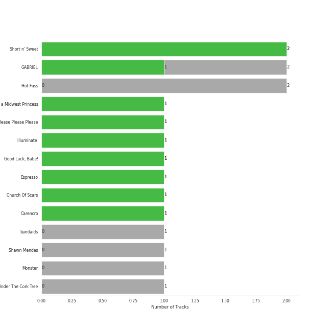

# Island Records

12 songs

[See Track Features](audio_features.md)

[See Clusters](clusters/overview.md)

Appears as:
- Island Records (10 tracks)
- Shawn Mendes LP4-5 PS/ Island (1 tracks)
- Teleport Records / Island Records (1 tracks)

## Top Artists

| Art | Tracks | 💚 | Artist | 🔗 |
|:---|---:|---:|:---|:---|
|  | 3 | 1 | Shawn Mendes | [🔗](https://open.spotify.com/artist/7n2wHs1TKAczGzO7Dd2rGr) |
|  | 1 | 1 | Marc Broussard | [🔗](https://open.spotify.com/artist/4cEwEednPwWCdYT7ZhROZe) |
|  | 1 | 1 | Bishop Briggs | [🔗](https://open.spotify.com/artist/0yb46jwm7gqbZXVXZQ8Z1e) |
|  | 4 | 0 | keshi | [🔗](https://open.spotify.com/artist/3pc0bOVB5whxmD50W79wwO) |
|  | 2 | 0 | The Killers | [🔗](https://open.spotify.com/artist/0C0XlULifJtAgn6ZNCW2eu) |
|  | 1 | 0 | Fall Out Boy | [🔗](https://open.spotify.com/artist/4UXqAaa6dQYAk18Lv7PEgX) |
|  | 1 | 0 | [Justin Bieber](../../artists/justin_bieber/overview.md) | [🔗](https://open.spotify.com/artist/1uNFoZAHBGtllmzznpCI3s) |

## Top Albums

| Art | Tracks | 💚 | Album | Release Date | 🔗 |
|:---|---:|---:|:---|:---|:---|
|  | 2 | 0 | Hot Fuss | 2004 | [🔗](https://open.spotify.com/album/4piJq7R3gjUOxnYs6lDCTg) |
|  | 2 | 0 | GABRIEL | 2022-03-25 | [🔗](https://open.spotify.com/album/1WVIJaAboRSwJOe4u0n0Q7) |
|  | 1 | 1 | Illuminate (Deluxe) | 2017-04-20 | [🔗](https://open.spotify.com/album/3wBabo4pmzsYjALMSKY7Iq) |
|  | 1 | 1 | Church Of Scars | 2018-04-20 | [🔗](https://open.spotify.com/album/1TTxcgs3zEngN0EB56yXzY) |
|  | 1 | 1 | Carencro | 2004-08-03 | [🔗](https://open.spotify.com/album/15dP7BadtY55t9VvFlVrBA) |
|  | 1 | 0 | beside you | 2021-04-23 | [🔗](https://open.spotify.com/album/3boOG8cQ8szHDizPKUyBFD) |
|  | 1 | 0 | bandaids | 2020-03-24 | [🔗](https://open.spotify.com/album/4LfFHT00C9ImLMUjHkqWjQ) |
|  | 1 | 0 | Shawn Mendes | 2018-05-25 | [🔗](https://open.spotify.com/album/2VP96XdMOKTXefI8Nui23s) |
|  | 1 | 0 | Monster | 2020-11-20 | [🔗](https://open.spotify.com/album/3yVVL2EYLp8g7gT08VvYKy) |
|  | 1 | 0 | From Under The Cork Tree | 2005-05-03 | [🔗](https://open.spotify.com/album/5nkUSlIhtoJZMOUlB0sNCp) |

## Genres

| Tracks | 💚 | Genre |
|---:|---:|:---|
| 4 | 1 | [pop](../../genres/pop/overview.md) |
| 3 | 1 | [viral pop](../../genres/viral_pop/overview.md) |
| 3 | 1 | [canadian pop](../../genres/canadian_pop/overview.md) |
| 1 | 1 | modern alternative rock |
| 1 | 1 | lafayette indie |
| 1 | 1 | [acoustic pop](../../genres/acoustic_pop/overview.md) |
| 4 | 0 | chill r&b |
| 3 | 0 | [rock](../../genres/rock/overview.md) |
| 3 | 0 | [modern rock](../../genres/modern_rock/overview.md) |
| 2 | 0 | [permanent wave](../../genres/permanent_wave/overview.md) |

See all 13 genres

| Tracks | 💚 | Genre |
|---:|---:|:---|
| 2 | 0 | dance rock |
| 2 | 0 | [alternative rock](../../genres/alternative_rock/overview.md) |
| 1 | 0 | emo |

## Top Producers

| Art | Producer | Tracks | Credit Types |
|:---|:---|---:|:---|
| | Mark Jackson | 1 | Songwriter |
| | Drew Ramsey | 1 | Producer |
| | Scott Harris | 1 | Songwriter |
| | Marshall Altman | 1 | Arranger, Producer |
| | Shannon Sanders | 1 | Producer |
| | Geoff Warburton | 1 | Songwriter |
| | Ian Scott | 1 | Songwriter |
| | Joe Zook | 1 | Producer |
|  | Shawn Mendes | 1 | Songwriter |
| | Teddy Geiger | 1 | Songwriter |

View all

| Art | Producer | Tracks | Credit Types |
|:---|:---|---:|:---|
|  | Bishop Briggs | 1 | Songwriter |

## Tracks released under Island Records

| Art | Track | Album | Artists | Label | 💚 | 🔗 |
|:---|:---|:---|:---|:---|:---|:---|
|  | River | Church Of Scars | Bishop Briggs | [Teleport Records / Island Records](.) | 💚 | [🔗](https://open.spotify.com/track/3mRLHiSHYtC8Hk7bzZdUs1) |
|  | Sugar, We're Goin Down | From Under The Cork Tree | Fall Out Boy | [Island Records](.) | | [🔗](https://open.spotify.com/track/2TfSHkHiFO4gRztVIkggkE) |
|  | Home | Carencro | Marc Broussard | [Island Records](.) | 💚 | [🔗](https://open.spotify.com/track/1XhzO8cuPaqsqUKw92Wbwc) |
|  | There's Nothing Holdin' Me Back | Illuminate (Deluxe) | Shawn Mendes | [Island Records](.) | 💚 | [🔗](https://open.spotify.com/track/7JJmb5XwzOO8jgpou264Ml) |
|  | In My Blood | Shawn Mendes | Shawn Mendes | [Island Records](.) | | [🔗](https://open.spotify.com/track/2QZ7WLBE8h2y1Y5Fb8RYbH) |
|  | Monster (Shawn Mendes & Justin Bieber) | Monster | Shawn Mendes, [Justin Bieber](../../artists/justin_bieber/overview.md) | [Shawn Mendes LP4-5 PS/ Island](.) | | [🔗](https://open.spotify.com/track/2Z8yfpFX0ZMavHkcIeHiO1) |
|  | All These Things That I've Done | Hot Fuss | The Killers | [Island Records](.) | | [🔗](https://open.spotify.com/track/5vollujufHY0jMZxx77VWr) |
|  | Mr. Brightside | Hot Fuss | The Killers | [Island Records](.) | | [🔗](https://open.spotify.com/track/003vvx7Niy0yvhvHt4a68B) |
|  | right here | bandaids | keshi | [Island Records](.) | | [🔗](https://open.spotify.com/track/2Q3QRjA8MjzqpFaIkFludb) |
|  | beside you | beside you | keshi | [Island Records](.) | | [🔗](https://open.spotify.com/track/1Fhb9iJPufNMZSwupsXiRe) |

See all tracks

| Art | Track | Album | Artists | Label | 💚 | 🔗 |
|:---|:---|:---|:---|:---|:---|:---|
|  | LIMBO | GABRIEL | keshi | [Island Records](.) | | [🔗](https://open.spotify.com/track/2bdVgAQgosGUJoViVDNeOV) |
|  | UNDERSTAND | GABRIEL | keshi | [Island Records](.) | | [🔗](https://open.spotify.com/track/72sfmdpuO5r8cBDgs7MqZZ) |

