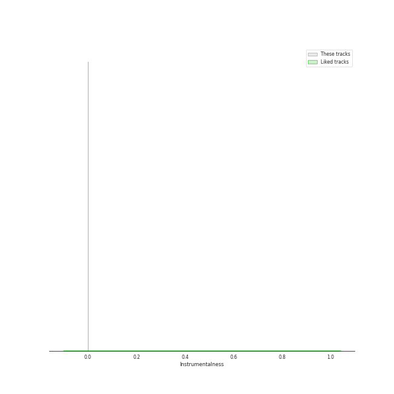
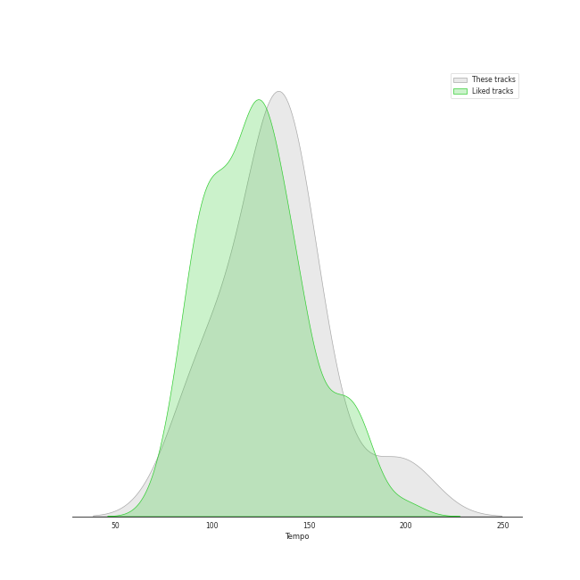

# Audio Features for Ithacappella

## Danceability

| 10 most Danceable tracks | 10 least Danceable tracks |
|:---|:---|
| Telephone (0.756) | The Man Who Can't Be Moved (0.231) |
| Sixteen Tons (0.702) | The Sound of Silence (0.235) |
| Fireflies (0.618) | I Won't Give Up (0.381) |
| Some Nights (0.602) | Halo (0.445) |
| Don't Stop Me Now (0.559) | Say Something (0.466) |
| Too Close (feat. Roxorloops & Blady Kris) (0.555) | We Found Love (0.541) |
| We Found Love (0.541) | Too Close (feat. Roxorloops & Blady Kris) (0.555) |
| Say Something (0.466) | Don't Stop Me Now (0.559) |
| Halo (0.445) | Some Nights (0.602) |
| I Won't Give Up (0.381) | Fireflies (0.618) |

## Energy

| 10 most Energetic tracks | 10 least Energetic tracks |
|:---|:---|
| Don't Stop Me Now (0.883) | The Sound of Silence (0.115) |
| Telephone (0.832) | Say Something (0.236) |
| Too Close (feat. Roxorloops & Blady Kris) (0.804) | Sixteen Tons (0.31) |
| Some Nights (0.766) | We Found Love (0.398) |
| Fireflies (0.556) | I Won't Give Up (0.415) |
| Halo (0.499) | The Man Who Can't Be Moved (0.419) |
| The Man Who Can't Be Moved (0.419) | Halo (0.499) |
| I Won't Give Up (0.415) | Fireflies (0.556) |
| We Found Love (0.398) | Some Nights (0.766) |
| Sixteen Tons (0.31) | Too Close (feat. Roxorloops & Blady Kris) (0.804) |

## Speechiness

| 10 most Speechy tracks | 10 least Speechy tracks |
|:---|:---|
| Don't Stop Me Now (0.31) | We Found Love (0.0244) |
| Too Close (feat. Roxorloops & Blady Kris) (0.146) | Say Something (0.0301) |
| Fireflies (0.0606) | Halo (0.0316) |
| Telephone (0.056) | The Man Who Can't Be Moved (0.0333) |
| Some Nights (0.0545) | The Sound of Silence (0.0346) |
| Sixteen Tons (0.0445) | I Won't Give Up (0.0358) |
| I Won't Give Up (0.0358) | Sixteen Tons (0.0445) |
| The Sound of Silence (0.0346) | Some Nights (0.0545) |
| The Man Who Can't Be Moved (0.0333) | Telephone (0.056) |
| Halo (0.0316) | Fireflies (0.0606) |

## Acousticness

| 10 most Acoustic tracks | 10 least Acoustic tracks |
|:---|:---|
| The Sound of Silence (0.887) | Telephone (0.0764) |
| Say Something (0.843) | Too Close (feat. Roxorloops & Blady Kris) (0.129) |
| Sixteen Tons (0.84) | Some Nights (0.221) |
| I Won't Give Up (0.679) | Don't Stop Me Now (0.302) |
| Halo (0.648) | Fireflies (0.366) |
| The Man Who Can't Be Moved (0.587) | We Found Love (0.579) |
| We Found Love (0.579) | The Man Who Can't Be Moved (0.587) |
| Fireflies (0.366) | Halo (0.648) |
| Don't Stop Me Now (0.302) | I Won't Give Up (0.679) |
| Some Nights (0.221) | Sixteen Tons (0.84) |

## Instrumentalness

| 10 most Instrumental tracks | 10 least Instrumental tracks |
|:---|:---|
| The Sound of Silence (1.4e-06) | Say Something (0.0) |
| The Man Who Can't Be Moved (0.0) | Sixteen Tons (0.0) |
| Some Nights (0.0) | Telephone (0.0) |
| Halo (0.0) | Fireflies (0.0) |
| We Found Love (0.0) | Too Close (feat. Roxorloops & Blady Kris) (0.0) |
| I Won't Give Up (0.0) | Don't Stop Me Now (0.0) |
| Don't Stop Me Now (0.0) | I Won't Give Up (0.0) |
| Too Close (feat. Roxorloops & Blady Kris) (0.0) | We Found Love (0.0) |
| Fireflies (0.0) | Halo (0.0) |
| Telephone (0.0) | Some Nights (0.0) |

## Liveness

| 10 most Live tracks | 10 least Live tracks |
|:---|:---|
| Telephone (0.321) | I Won't Give Up (0.1) |
| Some Nights (0.25) | The Sound of Silence (0.103) |
| Say Something (0.183) | We Found Love (0.121) |
| Don't Stop Me Now (0.14) | Sixteen Tons (0.124) |
| Fireflies (0.14) | Too Close (feat. Roxorloops & Blady Kris) (0.125) |
| The Man Who Can't Be Moved (0.138) | Halo (0.137) |
| Halo (0.137) | The Man Who Can't Be Moved (0.138) |
| Too Close (feat. Roxorloops & Blady Kris) (0.125) | Fireflies (0.14) |
| Sixteen Tons (0.124) | Don't Stop Me Now (0.14) |
| We Found Love (0.121) | Say Something (0.183) |

## Valence

| 10 most Happy tracks | 10 least Happy tracks |
|:---|:---|
| Sixteen Tons (0.696) | The Sound of Silence (0.0476) |
| Telephone (0.655) | I Won't Give Up (0.125) |
| Some Nights (0.501) | Halo (0.145) |
| Too Close (feat. Roxorloops & Blady Kris) (0.447) | The Man Who Can't Be Moved (0.179) |
| We Found Love (0.442) | Say Something (0.207) |
| Don't Stop Me Now (0.242) | Fireflies (0.234) |
| Fireflies (0.234) | Don't Stop Me Now (0.242) |
| Say Something (0.207) | We Found Love (0.442) |
| The Man Who Can't Be Moved (0.179) | Too Close (feat. Roxorloops & Blady Kris) (0.447) |
| Halo (0.145) | Some Nights (0.501) |

## Tempo

| 10 most Fast tracks | 10 least Fast tracks |
|:---|:---|
| The Man Who Can't Be Moved (198.008) | Fireflies (90.013) |
| Don't Stop Me Now (155.816) | We Found Love (95.015) |
| Halo (139.872) | Some Nights (109.977) |
| Sixteen Tons (137.89) | Telephone (124.052) |
| The Sound of Silence (137.094) | Too Close (feat. Roxorloops & Blady Kris) (132.315) |
| I Won't Give Up (135.728) | Say Something (135.12) |
| Say Something (135.12) | I Won't Give Up (135.728) |
| Too Close (feat. Roxorloops & Blady Kris) (132.315) | The Sound of Silence (137.094) |
| Telephone (124.052) | Sixteen Tons (137.89) |
| Some Nights (109.977) | Halo (139.872) |
