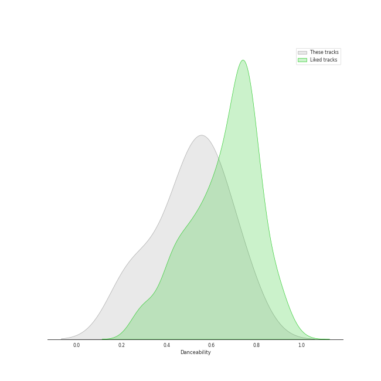
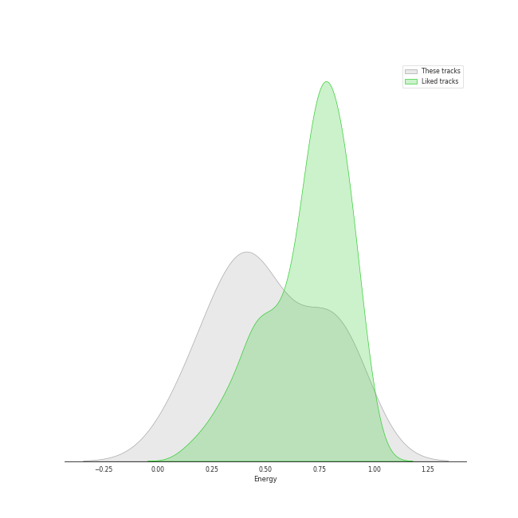
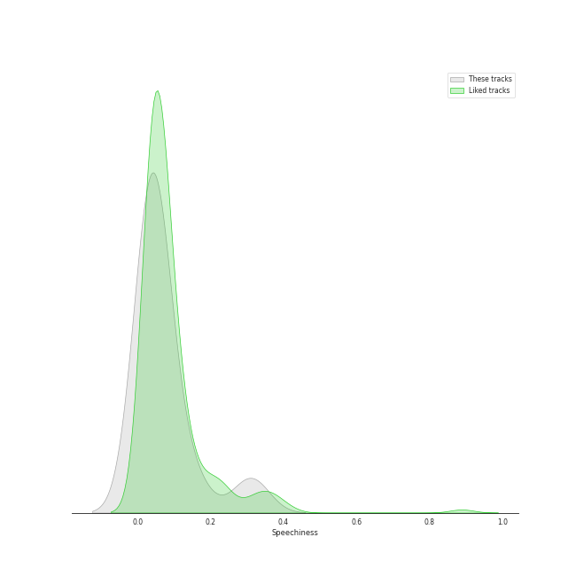
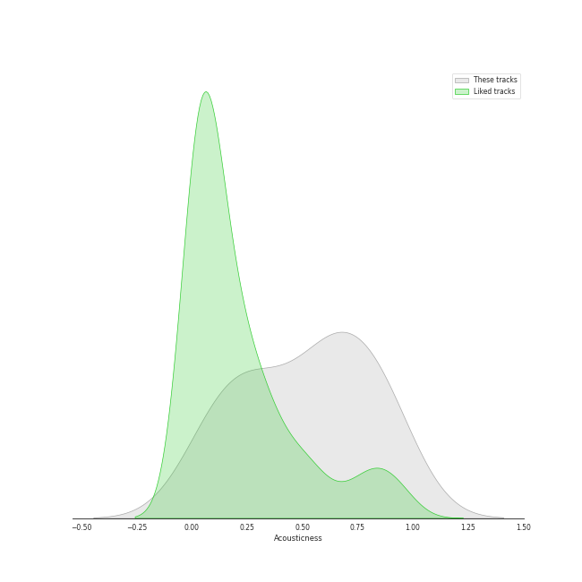
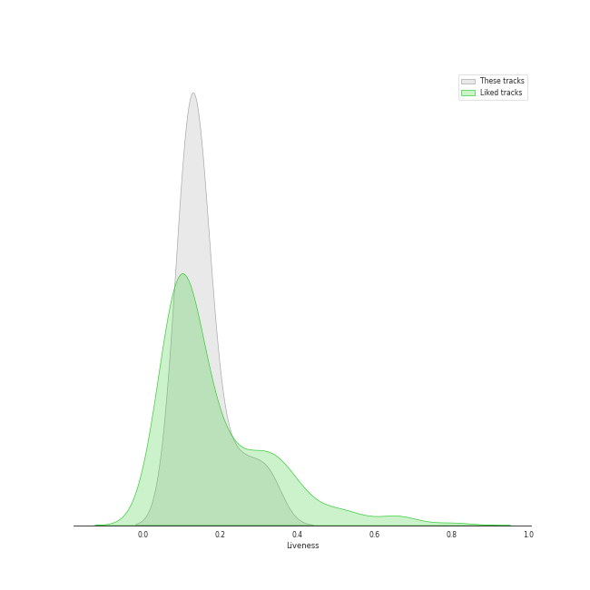
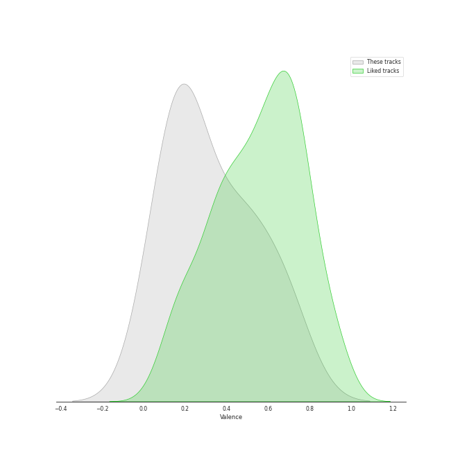

# Audio Features for Ithacappella

## Danceability

| ​ | 10 most Danceable tracks | ​​ | 10 least Danceable tracks |
|:---|:---|:---|:---|
|  | Telephone (0.756) |  | The Man Who Can't Be Moved (0.231) |
|  | Sixteen Tons (0.702) |  | The Sound of Silence (0.235) |
|  | Fireflies (0.618) |  | I Won't Give Up (0.381) |
|  | Some Nights (0.602) |  | Halo (0.445) |
|  | Don't Stop Me Now (0.559) |  | Say Something (0.466) |
|  | Too Close (feat. Roxorloops & Blady Kris) (0.555) |  | We Found Love (0.541) |
|  | We Found Love (0.541) |  | Too Close (feat. Roxorloops & Blady Kris) (0.555) |
|  | Say Something (0.466) |  | Don't Stop Me Now (0.559) |
|  | Halo (0.445) |  | Some Nights (0.602) |
|  | I Won't Give Up (0.381) |  | Fireflies (0.618) |

## Energy

| ​ | 10 most Energetic tracks | ​​ | 10 least Energetic tracks |
|:---|:---|:---|:---|
|  | Don't Stop Me Now (0.883) |  | The Sound of Silence (0.115) |
|  | Telephone (0.832) |  | Say Something (0.236) |
|  | Too Close (feat. Roxorloops & Blady Kris) (0.804) |  | Sixteen Tons (0.31) |
|  | Some Nights (0.766) |  | We Found Love (0.398) |
|  | Fireflies (0.556) |  | I Won't Give Up (0.415) |
|  | Halo (0.499) |  | The Man Who Can't Be Moved (0.419) |
|  | The Man Who Can't Be Moved (0.419) |  | Halo (0.499) |
|  | I Won't Give Up (0.415) |  | Fireflies (0.556) |
|  | We Found Love (0.398) |  | Some Nights (0.766) |
|  | Sixteen Tons (0.31) |  | Too Close (feat. Roxorloops & Blady Kris) (0.804) |

## Speechiness

| ​ | 10 most Speechy tracks | ​​ | 10 least Speechy tracks |
|:---|:---|:---|:---|
|  | Don't Stop Me Now (0.31) |  | We Found Love (0.0244) |
|  | Too Close (feat. Roxorloops & Blady Kris) (0.146) |  | Say Something (0.0301) |
|  | Fireflies (0.0606) |  | Halo (0.0316) |
|  | Telephone (0.056) |  | The Man Who Can't Be Moved (0.0333) |
|  | Some Nights (0.0545) |  | The Sound of Silence (0.0346) |
|  | Sixteen Tons (0.0445) |  | I Won't Give Up (0.0358) |
|  | I Won't Give Up (0.0358) |  | Sixteen Tons (0.0445) |
|  | The Sound of Silence (0.0346) |  | Some Nights (0.0545) |
|  | The Man Who Can't Be Moved (0.0333) |  | Telephone (0.056) |
|  | Halo (0.0316) |  | Fireflies (0.0606) |

## Acousticness

| ​ | 10 most Acoustic tracks | ​​ | 10 least Acoustic tracks |
|:---|:---|:---|:---|
|  | The Sound of Silence (0.887) |  | Telephone (0.0764) |
|  | Say Something (0.843) |  | Too Close (feat. Roxorloops & Blady Kris) (0.129) |
|  | Sixteen Tons (0.84) |  | Some Nights (0.221) |
|  | I Won't Give Up (0.679) |  | Don't Stop Me Now (0.302) |
|  | Halo (0.648) |  | Fireflies (0.366) |
|  | The Man Who Can't Be Moved (0.587) |  | We Found Love (0.579) |
|  | We Found Love (0.579) |  | The Man Who Can't Be Moved (0.587) |
|  | Fireflies (0.366) |  | Halo (0.648) |
|  | Don't Stop Me Now (0.302) |  | I Won't Give Up (0.679) |
|  | Some Nights (0.221) |  | Sixteen Tons (0.84) |

## Instrumentalness

| ​ | 10 most Instrumental tracks | ​​ | 10 least Instrumental tracks |
|:---|:---|:---|:---|
|  | The Sound of Silence (1.4e-06) |  | Say Something (0.0) |
|  | The Man Who Can't Be Moved (0.0) |  | Sixteen Tons (0.0) |
|  | Some Nights (0.0) |  | Telephone (0.0) |
|  | Halo (0.0) |  | Fireflies (0.0) |
|  | We Found Love (0.0) |  | Too Close (feat. Roxorloops & Blady Kris) (0.0) |
|  | I Won't Give Up (0.0) |  | Don't Stop Me Now (0.0) |
|  | Don't Stop Me Now (0.0) |  | I Won't Give Up (0.0) |
|  | Too Close (feat. Roxorloops & Blady Kris) (0.0) |  | We Found Love (0.0) |
|  | Fireflies (0.0) |  | Halo (0.0) |
|  | Telephone (0.0) |  | Some Nights (0.0) |

## Liveness

| ​ | 10 most Live tracks | ​​ | 10 least Live tracks |
|:---|:---|:---|:---|
|  | Telephone (0.321) |  | I Won't Give Up (0.1) |
|  | Some Nights (0.25) |  | The Sound of Silence (0.103) |
|  | Say Something (0.183) |  | We Found Love (0.121) |
|  | Don't Stop Me Now (0.14) |  | Sixteen Tons (0.124) |
|  | Fireflies (0.14) |  | Too Close (feat. Roxorloops & Blady Kris) (0.125) |
|  | The Man Who Can't Be Moved (0.138) |  | Halo (0.137) |
|  | Halo (0.137) |  | The Man Who Can't Be Moved (0.138) |
|  | Too Close (feat. Roxorloops & Blady Kris) (0.125) |  | Fireflies (0.14) |
|  | Sixteen Tons (0.124) |  | Don't Stop Me Now (0.14) |
|  | We Found Love (0.121) |  | Say Something (0.183) |

## Valence

| ​ | 10 most Happy tracks | ​​ | 10 least Happy tracks |
|:---|:---|:---|:---|
|  | Sixteen Tons (0.696) |  | The Sound of Silence (0.0476) |
|  | Telephone (0.655) |  | I Won't Give Up (0.125) |
|  | Some Nights (0.501) |  | Halo (0.145) |
|  | Too Close (feat. Roxorloops & Blady Kris) (0.447) |  | The Man Who Can't Be Moved (0.179) |
|  | We Found Love (0.442) |  | Say Something (0.207) |
|  | Don't Stop Me Now (0.242) |  | Fireflies (0.234) |
|  | Fireflies (0.234) |  | Don't Stop Me Now (0.242) |
|  | Say Something (0.207) |  | We Found Love (0.442) |
|  | The Man Who Can't Be Moved (0.179) |  | Too Close (feat. Roxorloops & Blady Kris) (0.447) |
|  | Halo (0.145) |  | Some Nights (0.501) |

## Tempo

| ​ | 10 most Fast tracks | ​​ | 10 least Fast tracks |
|:---|:---|:---|:---|
|  | The Man Who Can't Be Moved (198.008) |  | Fireflies (90.013) |
|  | Don't Stop Me Now (155.816) |  | We Found Love (95.015) |
|  | Halo (139.872) |  | Some Nights (109.977) |
|  | Sixteen Tons (137.89) |  | Telephone (124.052) |
|  | The Sound of Silence (137.094) |  | Too Close (feat. Roxorloops & Blady Kris) (132.315) |
|  | I Won't Give Up (135.728) |  | Say Something (135.12) |
|  | Say Something (135.12) |  | I Won't Give Up (135.728) |
|  | Too Close (feat. Roxorloops & Blady Kris) (132.315) |  | The Sound of Silence (137.094) |
|  | Telephone (124.052) |  | Sixteen Tons (137.89) |
|  | Some Nights (109.977) |  | Halo (139.872) |
