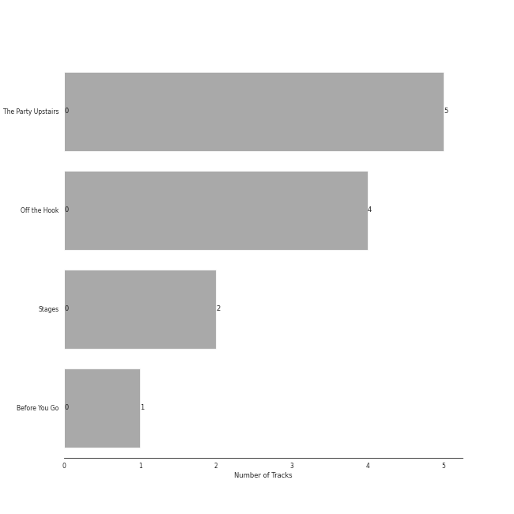

# Ithacappella

12 songs

[See Track Features](audio_features.md)

[See Clusters](clusters/overview.md)

Appears as:
- Ithacappella (12 tracks)

## Top Artists

| Art | Rank | Tracks | 💚 | Artist | 🔗 |
|:---|---:|---:|---:|:---|:---|
|  | 433 | 12 | 0 | Ithacappella | [🔗](https://open.spotify.com/artist/5bPTIGQvxRNjr6wl9yyAct) |
| | 433 | 1 | 0 | Roxorloops & Blady Kris | [🔗](https://open.spotify.com/artist/6HRJOlHBoo07WcZdXZAADI) |

## Top Albums

| Art | Rank | Tracks | 💚 | Album | Release Date | 🔗 |
|:---|---:|---:|---:|:---|:---|:---|
|  | 664 | 5 | 0 | The Party Upstairs | 2013-12-13 | [🔗](https://open.spotify.com/album/2AIAKP2FxbYNjmwQgAkqZz) |
|  | 664 | 4 | 0 | Off the Hook | 2011-12-10 | [🔗](https://open.spotify.com/album/1wfYTTpHsGxvIjDwsPLAAC) |
|  | 664 | 2 | 0 | Stages | 2014-09-21 | [🔗](https://open.spotify.com/album/3mnYoDcAHKx6uA91f7rtAa) |
|  | 664 | 1 | 0 | Before You Go | 2008-12-12 | [🔗](https://open.spotify.com/album/00x5MddnbpBoWJWtubLhHH) |

## Genres

| Tracks | 💚 | Genre |
|---:|---:|:---|
| 12 | 0 | [college a cappella](../../genres/college_a_cappella/overview.md) |

## Tracks released under Ithacappella

| Art | Track | Album | Artists | Label | Rank | 💚 | 🔗 |
|:---|:---|:---|:---|:---|---:|:---|:---|
|  | Sixteen Tons | Before You Go | Ithacappella | [Ithacappella](.) | 1014 | | [🔗](https://open.spotify.com/track/1eBmRgj1SjBwnRYMImzhg5) |
|  | Fireflies | Off the Hook | Ithacappella | [Ithacappella](.) | 1014 | | [🔗](https://open.spotify.com/track/32Z70Jce3icBWnVZrZHt68) |
|  | Halo | Off the Hook | Ithacappella | [Ithacappella](.) | 1014 | | [🔗](https://open.spotify.com/track/5qlpHkmxJntPok8hKIPcrY) |
|  | Telephone | Off the Hook | Ithacappella | [Ithacappella](.) | 1014 | | [🔗](https://open.spotify.com/track/2Be3QDAcqCqaqZLuO64J87) |
|  | The Sound of Silence | Off the Hook | Ithacappella | [Ithacappella](.) | 1014 | | [🔗](https://open.spotify.com/track/4tptZOGxMiwN7jB3mwY9Uq) |
|  | I Won't Give Up | The Party Upstairs | Ithacappella | [Ithacappella](.) | 1014 | | [🔗](https://open.spotify.com/track/4fK1ojDf3LYPh4KhNWoQFi) |
|  | Some Nights | The Party Upstairs | Ithacappella | [Ithacappella](.) | 1014 | | [🔗](https://open.spotify.com/track/5ys1Y4xf0vaKR8HjonRl21) |
|  | The Man Who Can't Be Moved | The Party Upstairs | Ithacappella | [Ithacappella](.) | 1014 | | [🔗](https://open.spotify.com/track/6wUSJugAinSVEgJu8S50Ou) |
|  | Too Close (feat. Roxorloops & Blady Kris) | The Party Upstairs | Ithacappella, Roxorloops & Blady Kris | [Ithacappella](.) | 1014 | | [🔗](https://open.spotify.com/track/3mTJZn9RT8dd9cOXLq3Kgj) |
|  | We Found Love | The Party Upstairs | Ithacappella | [Ithacappella](.) | 1014 | | [🔗](https://open.spotify.com/track/4p2CmpzQB1PzgCssyQepPg) |

See all tracks

| Art | Track | Album | Artists | Label | Rank | 💚 | 🔗 |
|:---|:---|:---|:---|:---|---:|:---|:---|
|  | Don't Stop Me Now | Stages | Ithacappella | [Ithacappella](.) | 1014 | | [🔗](https://open.spotify.com/track/4DBs9w3PojGatSDbT42vS7) |
|  | Say Something | Stages | Ithacappella | [Ithacappella](.) | 1014 | | [🔗](https://open.spotify.com/track/03ZafJ5f3rfyF9fSB8JkX8) |

