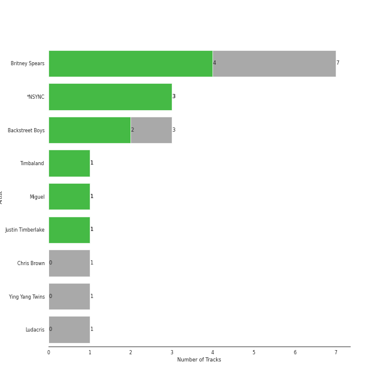
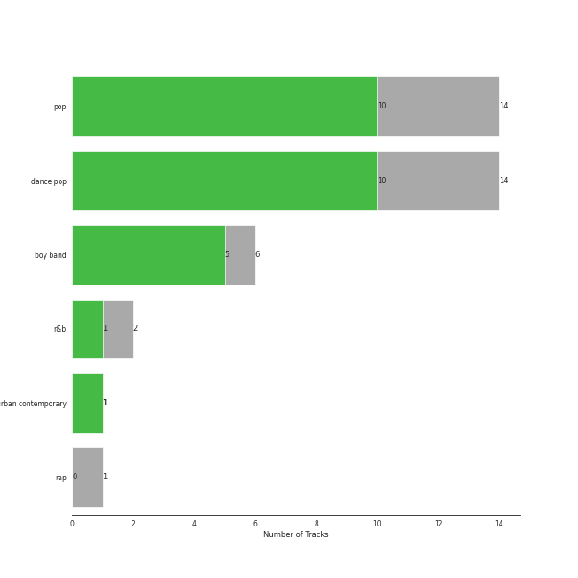

# Jive

16 songs

[See Track Features](audio_features.md)

[See Clusters](clusters/overview.md)

Appears as:
- Jive (16 tracks)

## Top Artists

| Art | Tracks | 💚 | Artist | 🔗 |
|:---|---:|---:|:---|:---|
|  | 7 | 4 | Britney Spears | [🔗](https://open.spotify.com/artist/26dSoYclwsYLMAKD3tpOr4) |
|  | 3 | 3 | *NSYNC | [🔗](https://open.spotify.com/artist/6Ff53KvcvAj5U7Z1vojB5o) |
|  | 3 | 2 | Backstreet Boys | [🔗](https://open.spotify.com/artist/5rSXSAkZ67PYJSvpUpkOr7) |
|  | 1 | 1 | Timbaland | [🔗](https://open.spotify.com/artist/5Y5TRrQiqgUO4S36tzjIRZ) |
|  | 1 | 1 | Miguel | [🔗](https://open.spotify.com/artist/360IAlyVv4PCEVjgyMZrxK) |
|  | 1 | 1 | Justin Timberlake | [🔗](https://open.spotify.com/artist/31TPClRtHm23RisEBtV3X7) |
|  | 1 | 0 | Chris Brown | [🔗](https://open.spotify.com/artist/7bXgB6jMjp9ATFy66eO08Z) |
|  | 1 | 0 | Ying Yang Twins | [🔗](https://open.spotify.com/artist/44PA0rCQXikgOWbfY7Fq7m) |
|  | 1 | 0 | Ludacris | [🔗](https://open.spotify.com/artist/3ipn9JLAPI5GUEo4y4jcoi) |

## Top Albums

| Art | Tracks | 💚 | Album | Release Date | 🔗 |
|:---|---:|---:|:---|:---|:---|
|  | 3 | 3 | No Strings Attached | 2000-03-21 | [🔗](https://open.spotify.com/album/20RMokVwJ2wjQ0s8FOdOFC) |
|  | 3 | 2 | Millennium | 1999-05-18 | [🔗](https://open.spotify.com/album/5ySxm9hxBNss01WCL7GLyQ) |
|  | 2 | 1 | In The Zone | 2003-11-13 | [🔗](https://open.spotify.com/album/0z7pVBGOD7HCIB7S8eLkLI) |
|  | 2 | 0 | Circus (Deluxe Version) | 2008-12-02 | [🔗](https://open.spotify.com/album/2tve5DGwub1TtbX1khPX5j) |
|  | 1 | 1 | Oops!... I Did It Again | 2000-05-16 | [🔗](https://open.spotify.com/album/5PmgtkodFl2Om3hMXONDll) |
|  | 1 | 1 | FutureSex/LoveSounds | 2006-09-12 | [🔗](https://open.spotify.com/album/2scB1uhcCI1TSf6b9TCZK3) |
|  | 1 | 1 | Britney (Digital Deluxe Version) | 2001-10-31 | [🔗](https://open.spotify.com/album/5ax3GTsfX5uCUaNgnJsSG5) |
|  | 1 | 1 | All I Want Is You | 2010-11-26 | [🔗](https://open.spotify.com/album/493HYe7N5pleudEZRyhE7R) |
|  | 1 | 1 | ...Baby One More Time (Digital Deluxe Version) | 1999-01-12 | [🔗](https://open.spotify.com/album/3WNxdumkSMGMJRhEgK80qx) |
|  | 1 | 0 | F.A.M.E. (Expanded Edition) | 2011-03-22 | [🔗](https://open.spotify.com/album/6df0qvkMXoyHGt9J8cujZb) |

## Genres

| Tracks | 💚 | Genre |
|---:|---:|:---|
| 14 | 10 | [pop](../../genres/pop/overview.md) |
| 14 | 10 | [dance pop](../../genres/dance_pop/overview.md) |
| 6 | 5 | boy band |
| 2 | 1 | [r&b](../../genres/r_b/overview.md) |
| 1 | 1 | [urban contemporary](../../genres/urban_contemporary/overview.md) |
| 1 | 0 | [rap](../../genres/rap/overview.md) |
| 1 | 0 | pop rap |

## Top Producers

| Art | Producer | Tracks | Credit Types |
|:---|:---|---:|:---|
| | Max Martin | 5 | Producer, Songwriter, Lyricist |
| | Andreas Carlsson | 3 | Songwriter, Lyricist |
| | Rami | 3 | Producer, Songwriter |
| | Kristian Lundin | 3 | Producer, Songwriter |
| | John Amatiello | 2 | Producer |
| | Happy Perez | 1 | Songwriter |
| | Brian T. Littrell | 1 | Songwriter |
| | Robin Wiley | 1 | Arranger, Lyricist, Producer, Songwriter |
| | Jimmy Douglass | 1 | Producer |
| | Cathy Dennis | 1 | Songwriter |

View all

| Art | Producer | Tracks | Credit Types |
|:---|:---|---:|:---|
| | Janson+Janson | 1 | Arranger |
| | Pontus Winnberg | 1 | Songwriter |
| | Serban Ghenea | 1 | Producer |
| | Steve Lunt | 1 | Arranger |
|  | Timbaland | 1 | Lyricist, Producer, Songwriter |
| | Brady Barnett | 1 | Producer |
| | Andrew Coleman | 1 | Producer |
| | Danja | 1 | Lyricist, Producer, Songwriter |
| | Chad Hugo | 1 | Songwriter |
|  | Pharrell Williams | 1 | Songwriter |
| | Bloodshy and Avant | 1 | Arranger, Producer |
| | Niklas Flyckt | 1 | Producer |
| | Jonathan Kaplan | 1 | Producer |
|  | Justin Timberlake | 1 | Lyricist, Producer, Songwriter |
| | Brian Garten | 1 | Producer |
| | Michael Tucker | 1 | Producer |
|  | Miguel | 1 | Songwriter |
| | The Neptunes | 1 | Producer |
| | Christian Karlsson | 1 | Songwriter |
| | Henrik Jonback | 1 | Songwriter |
| | Chris Trevett | 1 | Producer |
| | Jacob Schulze | 1 | Producer, Songwriter |
| | Pat McMakin | 1 | Producer |

## Tracks released under Jive

| Art | Track | Album | Artists | Label | 💚 | 🔗 |
|:---|:---|:---|:---|:---|:---|:---|
|  | Bye Bye Bye | No Strings Attached | *NSYNC | [Jive](.) | 💚 | [🔗](https://open.spotify.com/track/62bOmKYxYg7dhrC6gH9vFn) |
|  | I Thought She Knew | No Strings Attached | *NSYNC | [Jive](.) | 💚 | [🔗](https://open.spotify.com/track/0b4u7IhBY61kSmS8wVIPYg) |
|  | It's Gonna Be Me | No Strings Attached | *NSYNC | [Jive](.) | 💚 | [🔗](https://open.spotify.com/track/2AW37v0bDyuOzGP3XnmFuA) |
|  | I Want It That Way | Millennium | Backstreet Boys | [Jive](.) | 💚 | [🔗](https://open.spotify.com/track/47BBI51FKFwOMlIiX6m8ya) |
|  | Larger Than Life | Millennium | Backstreet Boys | [Jive](.) | 💚 | [🔗](https://open.spotify.com/track/6sbXGUn9V9ZaLwLdOfpKRE) |
|  | Show Me the Meaning of Being Lonely | Millennium | Backstreet Boys | [Jive](.) | | [🔗](https://open.spotify.com/track/3BsaRV5QIulYz2lV9WWa8T) |
|  | ...Baby One More Time | ...Baby One More Time (Digital Deluxe Version) | Britney Spears | [Jive](.) | 💚 | [🔗](https://open.spotify.com/track/3MjUtNVVq3C8Fn0MP3zhXa) |
|  | Oops!...I Did It Again | Oops!... I Did It Again | Britney Spears | [Jive](.) | 💚 | [🔗](https://open.spotify.com/track/6naxalmIoLFWR0siv8dnQQ) |
|  | I'm a Slave 4 U | Britney (Digital Deluxe Version) | Britney Spears | [Jive](.) | 💚 | [🔗](https://open.spotify.com/track/6ldwfK0yWgTAlmIfuQkTYN) |
|  | (I Got That) Boom Boom | In The Zone | Britney Spears, Ying Yang Twins | [Jive](.) | | [🔗](https://open.spotify.com/track/5epx5YtoMbV0GrL9qx9kVY) |

See all tracks

| Art | Track | Album | Artists | Label | 💚 | 🔗 |
|:---|:---|:---|:---|:---|:---|:---|
|  | Toxic | In The Zone | Britney Spears | [Jive](.) | 💚 | [🔗](https://open.spotify.com/track/6I9VzXrHxO9rA9A5euc8Ak) |
|  | If U Seek Amy | Circus (Deluxe Version) | Britney Spears | [Jive](.) | | [🔗](https://open.spotify.com/track/2hdy9Wt9qp7M7d0U3ossu2) |
|  | Womanizer | Circus (Deluxe Version) | Britney Spears | [Jive](.) | | [🔗](https://open.spotify.com/track/4fixebDZAVToLbUCuEloa2) |
|  | Wet The Bed (feat. Ludacris) | F.A.M.E. (Expanded Edition) | Chris Brown, Ludacris | [Jive](.) | | [🔗](https://open.spotify.com/track/2xRGPubKBTHX6iyrpQvtCy) |
|  | SexyBack (feat. Timbaland) | FutureSex/LoveSounds | Justin Timberlake, Timbaland | [Jive](.) | 💚 | [🔗](https://open.spotify.com/track/0O45fw2L5vsWpdsOdXwNAR) |
|  | Sure Thing | All I Want Is You | Miguel | [Jive](.) | 💚 | [🔗](https://open.spotify.com/track/0JXXNGljqupsJaZsgSbMZV) |

