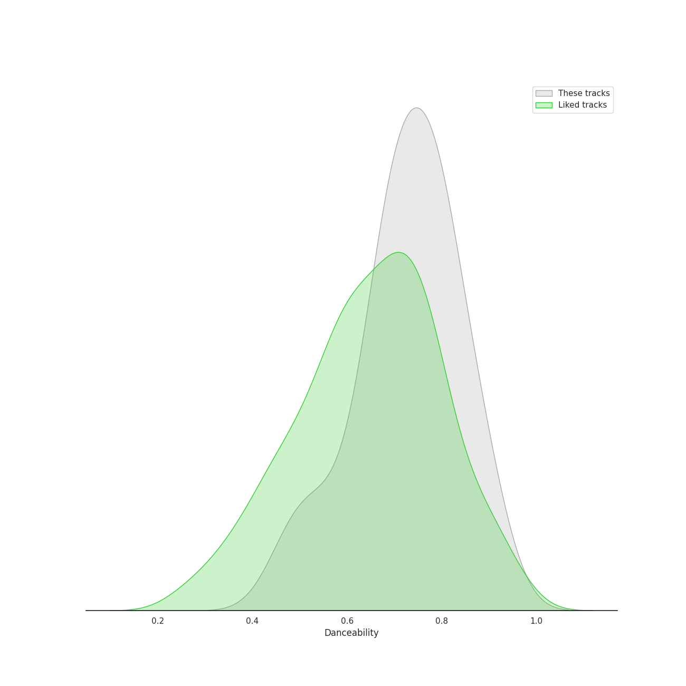
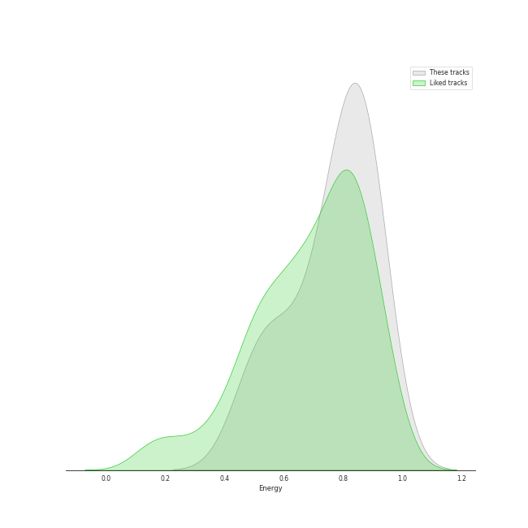
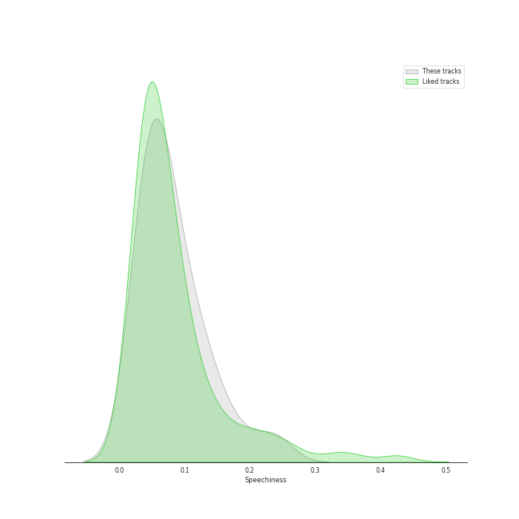
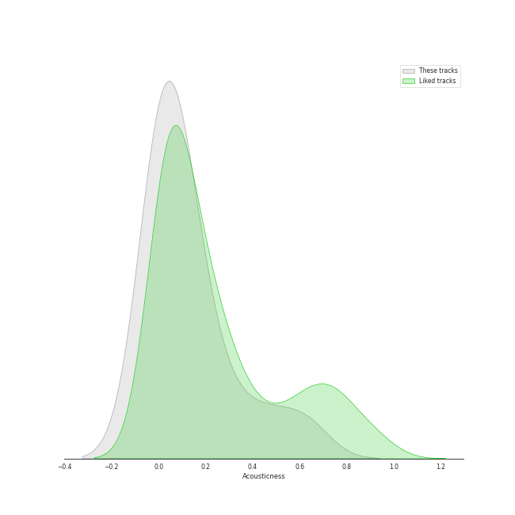
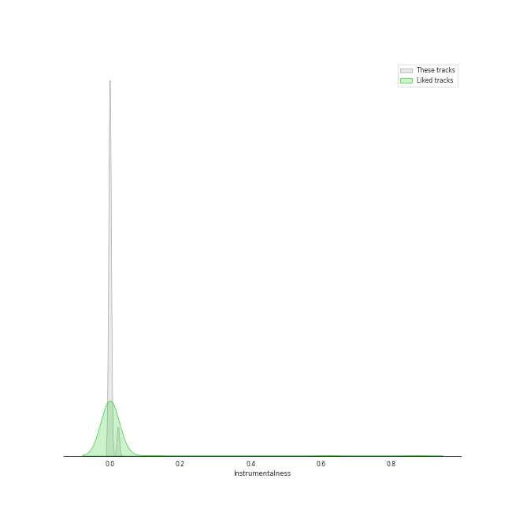
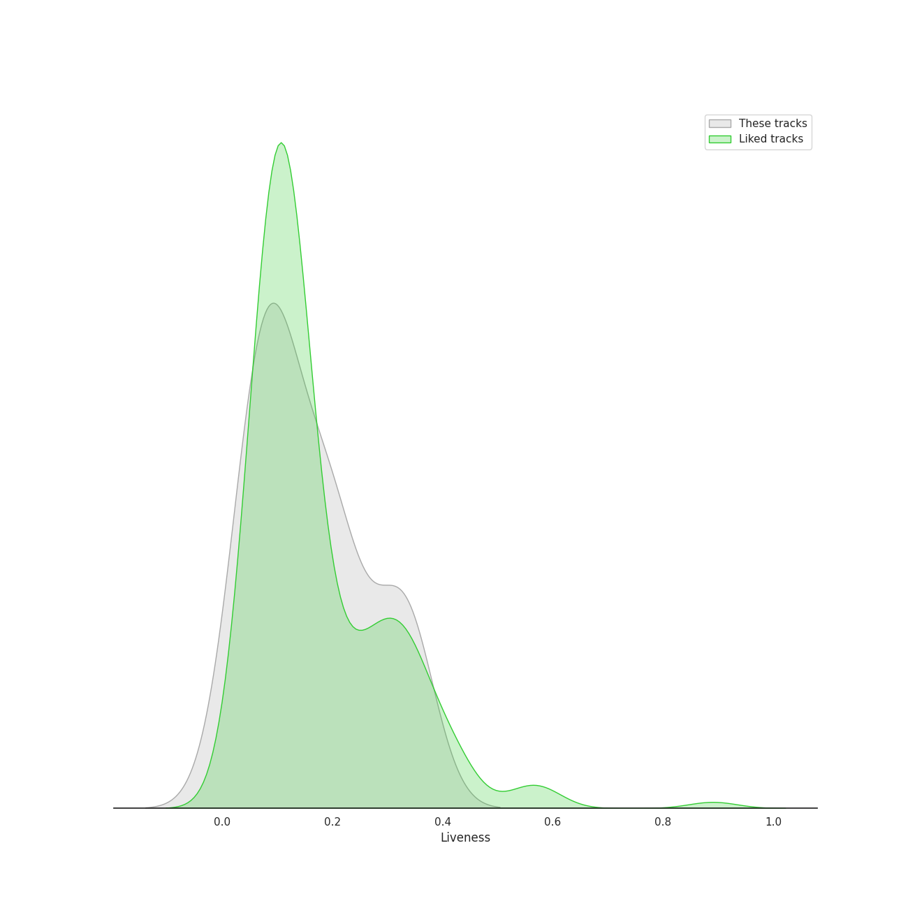
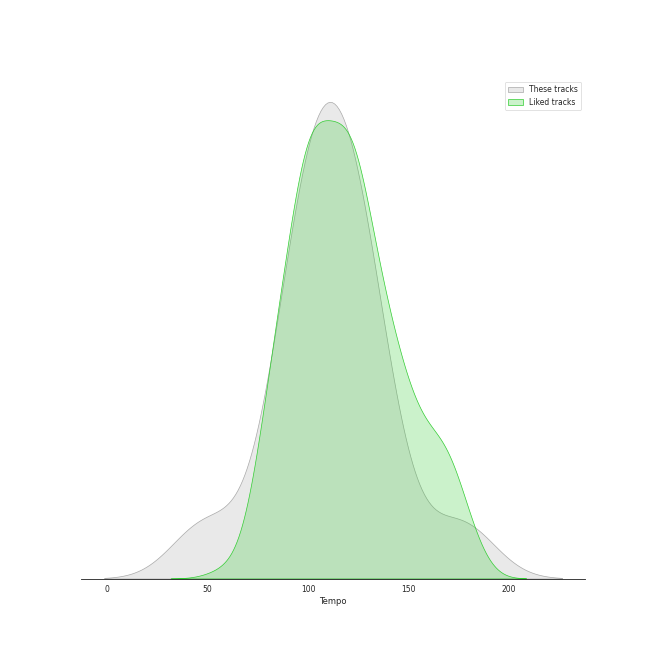

# Track Features for JYP Entertainment

## Danceability

| ​ | 10 most Danceable tracks | ​​ | 10 least Danceable tracks |
|:---|:---|:---|:---|
|  | I Do (0.898) |  | Strawberry Cake (0.476) |
|  | So Hot (0.879) |  | Bye Bye My Blue (0.511) |
|  | You Calling My Name (0.813) |  | My House (0.557) |
|  | ICY (0.801) |  | Man in a Movie (0.627) |
|  | Tell Me (0.792) |  | Why So Lonely (0.634) |
|  | It′s Raining (0.783) |  | When We Disco (0.678) |
|  | Just Right (0.76) |  | Funky Glitter Christmas (0.681) |
|  | Lullaby (0.727) |  | If You Do (0.692) |
|  | Dream (0.718) |  | Who's Your Mama? (0.692) |
|  | Rewind (0.716) |  | Hard Carry (0.7) |

## Energy

| ​ | 10 most Energetic tracks | ​​ | 10 least Energetic tracks |
|:---|:---|:---|:---|
|  | Tell Me (0.924) |  | Dream (0.476) |
|  | When We Disco (0.912) |  | Bye Bye My Blue (0.539) |
|  | ICY (0.904) |  | I Do (0.583) |
|  | Lullaby (0.888) |  | You Calling My Name (0.667) |
|  | Rewind (0.886) |  | Strawberry Cake (0.67) |
|  | If You Do (0.886) |  | So Hot (0.695) |
|  | It′s Raining (0.875) |  | Why So Lonely (0.726) |
|  | Hard Carry (0.873) |  | My House (0.74) |
|  | Who's Your Mama? (0.83) |  | Man in a Movie (0.76) |
|  | Funky Glitter Christmas (0.824) |  | Just Right (0.781) |

## Speechiness

| ​ | 10 most Speechy tracks | ​​ | 10 least Speechy tracks |
|:---|:---|:---|:---|
|  | My House (0.236) |  | When We Disco (0.0293) |
|  | Who's Your Mama? (0.177) |  | Man in a Movie (0.03) |
|  | Dream (0.139) |  | Tell Me (0.0327) |
|  | Why So Lonely (0.133) |  | Rewind (0.0327) |
|  | Bye Bye My Blue (0.114) |  | Funky Glitter Christmas (0.0477) |
|  | I Do (0.112) |  | Strawberry Cake (0.0518) |
|  | Lullaby (0.0881) |  | So Hot (0.0521) |
|  | Hard Carry (0.0869) |  | You Calling My Name (0.0616) |
|  | ICY (0.0834) |  | Just Right (0.0641) |
|  | If You Do (0.0766) |  | It′s Raining (0.0663) |

## Acousticness

| ​ | 10 most Acoustic tracks | ​​ | 10 least Acoustic tracks |
|:---|:---|:---|:---|
|  | Bye Bye My Blue (0.613) |  | My House (0.00152) |
|  | Rewind (0.576) |  | When We Disco (0.00283) |
|  | Dream (0.422) |  | Man in a Movie (0.00635) |
|  | Just Right (0.233) |  | Hard Carry (0.0148) |
|  | I Do (0.187) |  | Lullaby (0.015) |
|  | Funky Glitter Christmas (0.115) |  | It′s Raining (0.0172) |
|  | Why So Lonely (0.111) |  | So Hot (0.0192) |
|  | Tell Me (0.104) |  | Who's Your Mama? (0.0262) |
|  | You Calling My Name (0.0917) |  | ICY (0.0324) |
|  | Strawberry Cake (0.0559) |  | If You Do (0.0557) |

## Instrumentalness

| ​ | 10 most Instrumental tracks | ​​ | 10 least Instrumental tracks |
|:---|:---|:---|:---|
|  | It′s Raining (0.0233) |  | Hard Carry (0.0) |
|  | So Hot (0.00976) |  | Man in a Movie (0.0) |
|  | Tell Me (0.000224) |  | Lullaby (0.0) |
|  | ICY (3.1e-05) |  | Dream (0.0) |
|  | I Do (4.32e-06) |  | Why So Lonely (0.0) |
|  | Bye Bye My Blue (3.16e-06) |  | My House (0.0) |
|  | Funky Glitter Christmas (0.0) |  | Just Right (0.0) |
|  | Who's Your Mama? (0.0) |  | If You Do (0.0) |
|  | When We Disco (0.0) |  | Strawberry Cake (0.0) |
|  | You Calling My Name (0.0) |  | Rewind (0.0) |

## Liveness

| ​ | 10 most Live tracks | ​​ | 10 least Live tracks |
|:---|:---|:---|:---|
|  | Hard Carry (0.343) |  | Funky Glitter Christmas (0.0221) |
|  | Tell Me (0.336) |  | So Hot (0.0515) |
|  | Strawberry Cake (0.324) |  | My House (0.0663) |
|  | Rewind (0.322) |  | I Do (0.0679) |
|  | When We Disco (0.319) |  | You Calling My Name (0.0802) |
|  | It′s Raining (0.217) |  | Dream (0.0876) |
|  | If You Do (0.217) |  | Just Right (0.106) |
|  | Who's Your Mama? (0.204) |  | Why So Lonely (0.111) |
|  | Man in a Movie (0.201) |  | Lullaby (0.113) |
|  | ICY (0.182) |  | Bye Bye My Blue (0.121) |

## Valence

| ​ | 10 most Happy tracks | ​​ | 10 least Happy tracks |
|:---|:---|:---|:---|
|  | Tell Me (0.968) |  | Bye Bye My Blue (0.297) |
|  | So Hot (0.963) |  | It′s Raining (0.385) |
|  | Funky Glitter Christmas (0.881) |  | Dream (0.448) |
|  | ICY (0.814) |  | Rewind (0.461) |
|  | Why So Lonely (0.809) |  | Man in a Movie (0.481) |
|  | My House (0.781) |  | You Calling My Name (0.514) |
|  | If You Do (0.757) |  | Who's Your Mama? (0.53) |
|  | Just Right (0.736) |  | Hard Carry (0.612) |
|  | Lullaby (0.726) |  | Strawberry Cake (0.691) |
|  | I Do (0.726) |  | When We Disco (0.692) |

## Tempo

| ​ | 10 most Fast tracks | ​​ | 10 least Fast tracks |
|:---|:---|:---|:---|
|  | Strawberry Cake (199.943) |  | Dream (48.973) |
|  | My House (176.021) |  | Bye Bye My Blue (87.702) |
|  | Why So Lonely (155.161) |  | Just Right (95.97) |
|  | So Hot (139.985) |  | I Do (95.997) |
|  | When We Disco (131.947) |  | Hard Carry (99.972) |
|  | Lullaby (129.993) |  | It′s Raining (103.953) |
|  | If You Do (129.957) |  | Rewind (105.017) |
|  | Tell Me (127.003) |  | You Calling My Name (111.02) |
|  | ICY (124.979) |  | Funky Glitter Christmas (113.956) |
|  | Man in a Movie (120.002) |  | Who's Your Mama? (115.006) |
