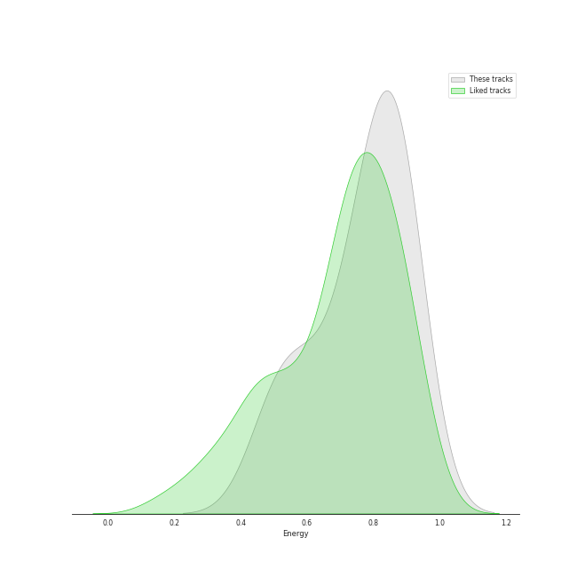
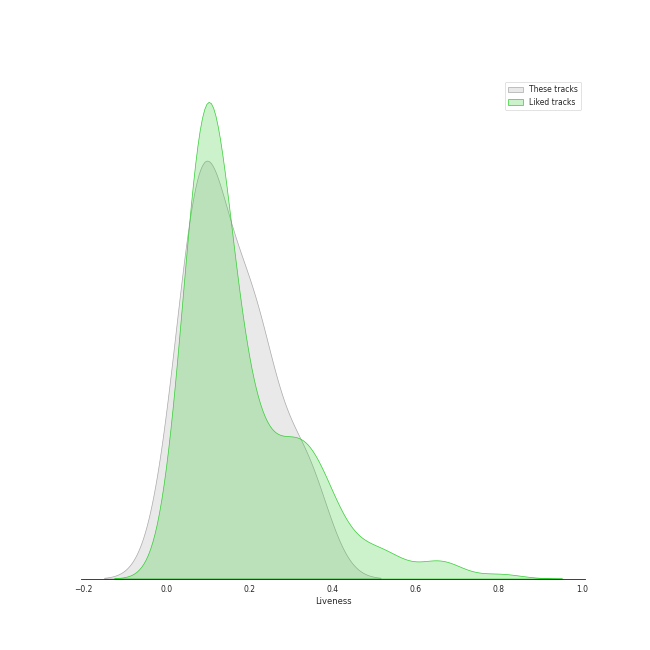
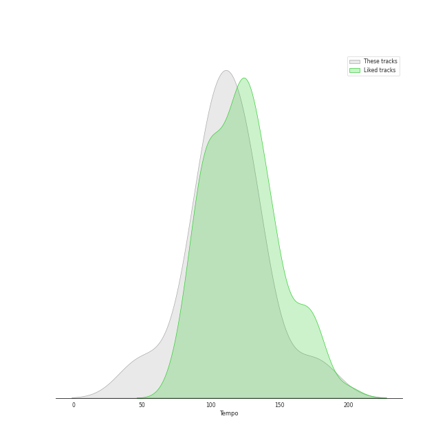

# Audio Features for JYP Entertainment

## Danceability

| ​ | 10 most Danceable tracks | ​​ | 10 least Danceable tracks |
|:---|:---|:---|:---|
|  | I Do (0.898) |  | O.O (0.39) |
|  | Nobody (0.882) |  | Strawberry Cake (0.476) |
|  | So Hot (0.879) |  | Bye bye my blue (0.511) |
|  | FEVER (0.832) |  | DICE (0.556) |
|  | CHERRY (0.829) |  | 우리집 My House (0.557) |
|  | You Calling My Name (0.813) |  | COOL (Your rainbow) (0.594) |
|  | Love Me Like This (0.803) |  | Man in a movie (0.627) |
|  | ICY (0.801) |  | Why So Lonely (0.634) |
|  | Bad Girl Good Girl (0.793) |  | TANK (0.637) |
|  | It′s Raining (0.783) |  | When We Disco (0.678) |

## Energy

| ​ | 10 most Energetic tracks | ​​ | 10 least Energetic tracks |
|:---|:---|:---|:---|
|  | TANK (0.927) |  | Dream (0.476) |
|  | When We Disco (0.912) |  | Bye bye my blue (0.539) |
|  | ICY (0.904) |  | CHERRY (0.559) |
|  | HOME (0.892) |  | I Do (0.583) |
|  | Lullaby (0.888) |  | You Calling My Name (0.667) |
|  | 니가 하면 If You Do (0.886) |  | Strawberry Cake (0.67) |
|  | Just Did It (0.877) |  | So Hot (0.695) |
|  | It′s Raining (0.875) |  | COOL (Your rainbow) (0.722) |
|  | 하드캐리 Hard Carry (0.873) |  | Why So Lonely (0.726) |
|  | Who's Your Mama? (0.83) |  | 우리집 My House (0.74) |

## Speechiness

| ​ | 10 most Speechy tracks | ​​ | 10 least Speechy tracks |
|:---|:---|:---|:---|
|  | O.O (0.293) |  | When We Disco (0.0293) |
|  | DICE (0.254) |  | Man in a movie (0.03) |
|  | 우리집 My House (0.236) |  | This Christmas (0.0407) |
|  | Young, Dumb, Stupid (0.233) |  | Just Did It (0.0414) |
|  | HOME (0.215) |  | Bad Girl Good Girl (0.0438) |
|  | TANK (0.212) |  | Hush (0.0494) |
|  | Who's Your Mama? (0.177) |  | Strawberry Cake (0.0518) |
|  | COOL (Your rainbow) (0.161) |  | So Hot (0.0521) |
|  | FEVER (0.144) |  | You Calling My Name (0.0616) |
|  | Dream (0.139) |  | Love Me Like This (0.064) |

## Acousticness

| ​ | 10 most Acoustic tracks | ​​ | 10 least Acoustic tracks |
|:---|:---|:---|:---|
|  | Bye bye my blue (0.613) |  | 우리집 My House (0.00152) |
|  | COOL (Your rainbow) (0.554) |  | When We Disco (0.00283) |
|  | Dream (0.422) |  | Man in a movie (0.00635) |
|  | Hush (0.275) |  | Love Me Like This (0.00805) |
|  | 딱 좋아(Just right) (0.233) |  | CHERRY (0.0111) |
|  | I Do (0.187) |  | 하드캐리 Hard Carry (0.0148) |
|  | Why So Lonely (0.111) |  | Lullaby (0.015) |
|  | Just Did It (0.108) |  | It′s Raining (0.0172) |
|  | Nobody (0.102) |  | So Hot (0.0192) |
|  | Bad Girl Good Girl (0.1) |  | FEVER (0.0238) |

## Instrumentalness

| ​ | 10 most Instrumental tracks | ​​ | 10 least Instrumental tracks |
|:---|:---|:---|:---|
|  | It′s Raining (0.0233) |  | Hush (0.0) |
|  | So Hot (0.00976) |  | DICE (0.0) |
|  | Nobody (0.00142) |  | 하드캐리 Hard Carry (0.0) |
|  | TANK (0.000564) |  | Man in a movie (0.0) |
|  | Bad Girl Good Girl (9.03e-05) |  | Lullaby (0.0) |
|  | ICY (3.1e-05) |  | Dream (0.0) |
|  | FEVER (6.02e-06) |  | Why So Lonely (0.0) |
|  | I Do (4.32e-06) |  | 우리집 My House (0.0) |
|  | O.O (4.26e-06) |  | Love Me Like This (0.0) |
|  | Bye bye my blue (3.16e-06) |  | 딱 좋아(Just right) (0.0) |

## Liveness

| ​ | 10 most Live tracks | ​​ | 10 least Live tracks |
|:---|:---|:---|:---|
|  | TANK (0.408) |  | So Hot (0.0515) |
|  | 하드캐리 Hard Carry (0.343) |  | CHERRY (0.0561) |
|  | DICE (0.33) |  | O.O (0.0601) |
|  | Strawberry Cake (0.324) |  | Love Me Like This (0.0641) |
|  | COOL (Your rainbow) (0.323) |  | Bad Girl Good Girl (0.0641) |
|  | When We Disco (0.319) |  | 우리집 My House (0.0663) |
|  | It′s Raining (0.217) |  | I Do (0.0679) |
|  | 니가 하면 If You Do (0.217) |  | You Calling My Name (0.0802) |
|  | Just Did It (0.212) |  | Nobody (0.0856) |
|  | Who's Your Mama? (0.204) |  | Dream (0.0876) |

## Valence

| ​ | 10 most Happy tracks | ​​ | 10 least Happy tracks |
|:---|:---|:---|:---|
|  | So Hot (0.963) |  | O.O (0.285) |
|  | Nobody (0.95) |  | Bye bye my blue (0.297) |
|  | ICY (0.814) |  | It′s Raining (0.385) |
|  | Why So Lonely (0.809) |  | Dream (0.448) |
|  | FEVER (0.809) |  | Man in a movie (0.481) |
|  | 우리집 My House (0.781) |  | TANK (0.504) |
|  | 니가 하면 If You Do (0.757) |  | Bad Girl Good Girl (0.507) |
|  | This Christmas (0.747) |  | You Calling My Name (0.514) |
|  | 딱 좋아(Just right) (0.736) |  | Who's Your Mama? (0.53) |
|  | Lullaby (0.726) |  | CHERRY (0.532) |

## Tempo

| ​ | 10 most Fast tracks | ​​ | 10 least Fast tracks |
|:---|:---|:---|:---|
|  | O.O (200.263) |  | Dream (48.973) |
|  | Strawberry Cake (199.943) |  | Bye bye my blue (87.702) |
|  | Young, Dumb, Stupid (187.985) |  | CHERRY (94.991) |
|  | TANK (179.905) |  | Just Did It (95.489) |
|  | 우리집 My House (176.021) |  | FEVER (95.963) |
|  | HOME (157.927) |  | 딱 좋아(Just right) (95.97) |
|  | Why So Lonely (155.161) |  | I Do (95.997) |
|  | COOL (Your rainbow) (148.904) |  | Love Me Like This (97.031) |
|  | So Hot (139.985) |  | 하드캐리 Hard Carry (99.972) |
|  | Bad Girl Good Girl (135.987) |  | It′s Raining (103.953) |
