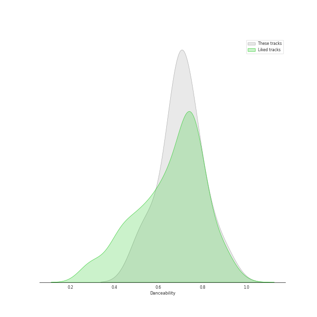
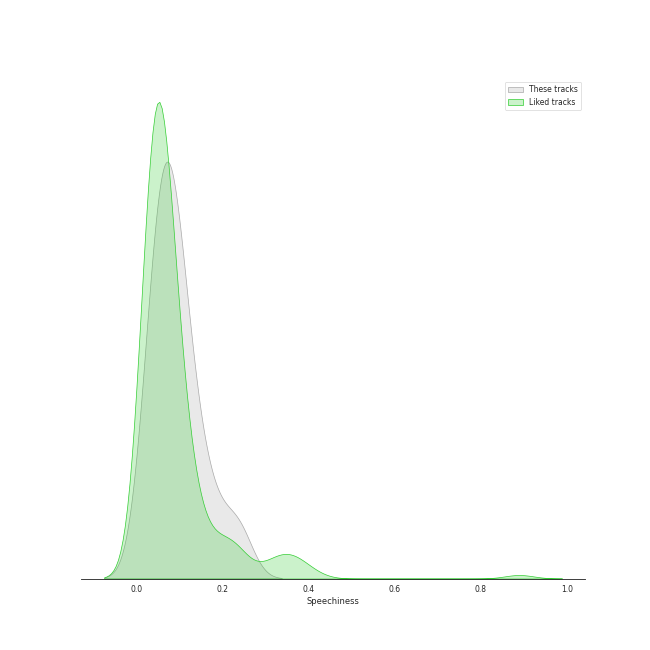
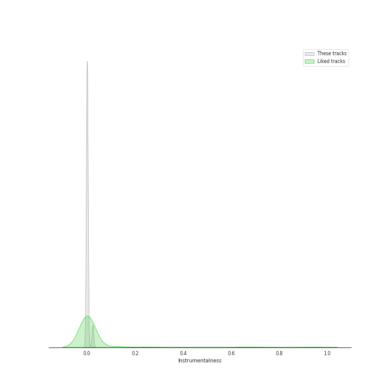

# Audio Features for JYP Entertainment

## Danceability

| 10 most Danceable tracks | 10 least Danceable tracks |
|:---|:---|
| I Do (0.898) | O.O (0.39) |
| Nobody (0.882) | Strawberry Cake (0.476) |
| So Hot (0.879) | Bye bye my blue (0.511) |
| FEVER (0.832) | DICE (0.556) |
| CHERRY (0.829) | 우리집 My House (0.557) |
| You Calling My Name (0.813) | COOL (Your rainbow) (0.594) |
| Love Me Like This (0.803) | Man in a movie (0.627) |
| ICY (0.801) | Why So Lonely (0.634) |
| Bad Girl Good Girl (0.793) | TANK (0.637) |
| It′s Raining (0.783) | When We Disco (Duet with SUNMI) (0.678) |

## Energy

| 10 most Energetic tracks | 10 least Energetic tracks |
|:---|:---|
| TANK (0.927) | Dream (0.476) |
| When We Disco (Duet with SUNMI) (0.912) | Bye bye my blue (0.539) |
| ICY (0.904) | CHERRY (0.559) |
| HOME (0.892) | I Do (0.583) |
| Lullaby (0.888) | You Calling My Name (0.667) |
| 니가 하면 If You Do (0.886) | Strawberry Cake (0.67) |
| Just Did It (0.877) | So Hot (0.695) |
| It′s Raining (0.875) | COOL (Your rainbow) (0.722) |
| 하드캐리 Hard Carry (0.873) | Why So Lonely (0.726) |
| 어머님이 누구니 (Who's your mama?) (Feat. Jessi) (0.83) | 우리집 My House (0.74) |

## Speechiness

| 10 most Speechy tracks | 10 least Speechy tracks |
|:---|:---|
| O.O (0.293) | When We Disco (Duet with SUNMI) (0.0293) |
| DICE (0.254) | Man in a movie (0.03) |
| 우리집 My House (0.236) | This Christmas (0.0407) |
| Young, Dumb, Stupid (0.233) | Just Did It (0.0414) |
| HOME (0.215) | Bad Girl Good Girl (0.0438) |
| TANK (0.212) | Hush (0.0494) |
| 어머님이 누구니 (Who's your mama?) (Feat. Jessi) (0.177) | Strawberry Cake (0.0518) |
| COOL (Your rainbow) (0.161) | So Hot (0.0521) |
| FEVER (0.144) | You Calling My Name (0.0616) |
| Dream (0.139) | Love Me Like This (0.064) |

## Acousticness

| 10 most Acoustic tracks | 10 least Acoustic tracks |
|:---|:---|
| Bye bye my blue (0.613) | 우리집 My House (0.00152) |
| COOL (Your rainbow) (0.554) | When We Disco (Duet with SUNMI) (0.00283) |
| Dream (0.422) | Man in a movie (0.00635) |
| Hush (0.275) | Love Me Like This (0.00805) |
| 딱 좋아(Just right) (0.233) | CHERRY (0.0111) |
| I Do (0.187) | 하드캐리 Hard Carry (0.0148) |
| Why So Lonely (0.111) | Lullaby (0.015) |
| Just Did It (0.108) | It′s Raining (0.0172) |
| Nobody (0.102) | So Hot (0.0192) |
| Bad Girl Good Girl (0.1) | FEVER (0.0238) |

## Instrumentalness

| 10 most Instrumental tracks | 10 least Instrumental tracks |
|:---|:---|
| It′s Raining (0.0233) | Hush (0.0) |
| So Hot (0.00976) | DICE (0.0) |
| Nobody (0.00142) | 하드캐리 Hard Carry (0.0) |
| TANK (0.000564) | Man in a movie (0.0) |
| Bad Girl Good Girl (9.03e-05) | Lullaby (0.0) |
| ICY (3.1e-05) | Dream (0.0) |
| FEVER (6.02e-06) | Why So Lonely (0.0) |
| I Do (4.32e-06) | 우리집 My House (0.0) |
| O.O (4.26e-06) | Love Me Like This (0.0) |
| Bye bye my blue (3.16e-06) | 딱 좋아(Just right) (0.0) |

## Liveness

| 10 most Live tracks | 10 least Live tracks |
|:---|:---|
| TANK (0.408) | So Hot (0.0515) |
| 하드캐리 Hard Carry (0.343) | CHERRY (0.0561) |
| DICE (0.33) | O.O (0.0601) |
| Strawberry Cake (0.324) | Love Me Like This (0.0641) |
| COOL (Your rainbow) (0.323) | Bad Girl Good Girl (0.0641) |
| When We Disco (Duet with SUNMI) (0.319) | 우리집 My House (0.0663) |
| It′s Raining (0.217) | I Do (0.0679) |
| 니가 하면 If You Do (0.217) | You Calling My Name (0.0802) |
| Just Did It (0.212) | Nobody (0.0856) |
| 어머님이 누구니 (Who's your mama?) (Feat. Jessi) (0.204) | Dream (0.0876) |

## Valence

| 10 most Happy tracks | 10 least Happy tracks |
|:---|:---|
| So Hot (0.963) | O.O (0.285) |
| Nobody (0.95) | Bye bye my blue (0.297) |
| ICY (0.814) | It′s Raining (0.385) |
| Why So Lonely (0.809) | Dream (0.448) |
| FEVER (0.809) | Man in a movie (0.481) |
| 우리집 My House (0.781) | TANK (0.504) |
| 니가 하면 If You Do (0.757) | Bad Girl Good Girl (0.507) |
| This Christmas (0.747) | You Calling My Name (0.514) |
| 딱 좋아(Just right) (0.736) | 어머님이 누구니 (Who's your mama?) (Feat. Jessi) (0.53) |
| Lullaby (0.726) | CHERRY (0.532) |

## Tempo

| 10 most Fast tracks | 10 least Fast tracks |
|:---|:---|
| O.O (200.263) | Dream (48.973) |
| Strawberry Cake (199.943) | Bye bye my blue (87.702) |
| Young, Dumb, Stupid (187.985) | CHERRY (94.991) |
| TANK (179.905) | Just Did It (95.489) |
| 우리집 My House (176.021) | FEVER (95.963) |
| HOME (157.927) | 딱 좋아(Just right) (95.97) |
| Why So Lonely (155.161) | I Do (95.997) |
| COOL (Your rainbow) (148.904) | Love Me Like This (97.031) |
| So Hot (139.985) | 하드캐리 Hard Carry (99.972) |
| Bad Girl Good Girl (135.987) | It′s Raining (103.953) |
