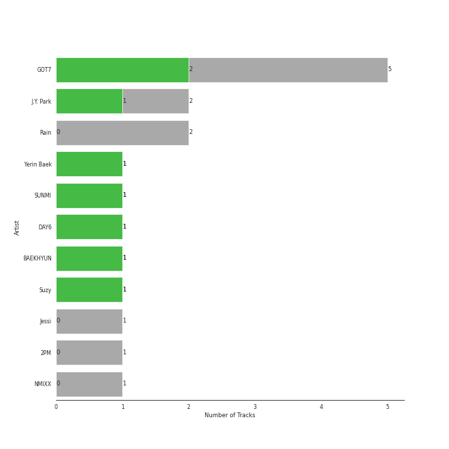
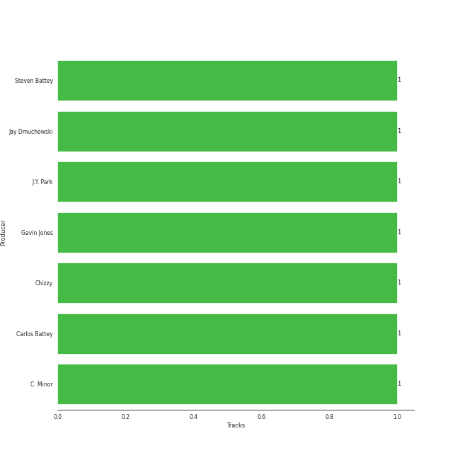

# JYP Entertainment

14 songs

[See Track Features](audio_features.md)

[See Clusters](clusters/overview.md)

Appears as:
- JYP Entertainment (13 tracks)
- MYSTIC ENTERTAINMENT, ChoongangICS, SM ENTERTAINMENT, JYP ENTERTAINMENT (1 tracks)

## Top Artists

| Art | Rank | Tracks | 💚 | Artist | 🔗 |
|:---|---:|---:|---:|:---|:---|
|  | 404 | 5 | 2 | GOT7 | [🔗](https://open.spotify.com/artist/6nfDaffa50mKtEOwR8g4df) |
|  | 404 | 2 | 1 | J.Y. Park | [🔗](https://open.spotify.com/artist/1TTx0YcbKUtJIZY1HEnh9B) |
|  | 404 | 1 | 1 | Yerin Baek | [🔗](https://open.spotify.com/artist/6dhfy4ByARPJdPtMyrUYJK) |
|  | 38 | 1 | 1 | [SUNMI](../../artists/sunmi/overview.md) | [🔗](https://open.spotify.com/artist/6MoXcK2GyGg7FIyxPU5yW6) |
|  | 404 | 1 | 1 | DAY6 | [🔗](https://open.spotify.com/artist/5TnQc2N1iKlFjYD7CPGvFc) |
|  | 47 | 1 | 1 | [BAEKHYUN](../../artists/baekhyun/overview.md) | [🔗](https://open.spotify.com/artist/4ufh0WuMZh6y4Dmdnklvdl) |
|  | 73 | 1 | 1 | Suzy | [🔗](https://open.spotify.com/artist/4U80LJd8sG6U9YTFP5izka) |
|  | 404 | 2 | 0 | Rain | [🔗](https://open.spotify.com/artist/5L4EafeXwZ0stGuPtGr5Tz) |
|  | 404 | 1 | 0 | Jessi | [🔗](https://open.spotify.com/artist/64k5e9kV9MdukXjFrR5R37) |
|  | 404 | 1 | 0 | 2PM | [🔗](https://open.spotify.com/artist/5iRPbkcPmqAFFwDUj6ywVS) |

See all 11 artists

| Art | Rank | Tracks | 💚 | Artist | 🔗 |
|:---|---:|---:|---:|:---|:---|
|  | 27 | 1 | 0 | [NMIXX](../../artists/nmixx/overview.md) | [🔗](https://open.spotify.com/artist/28ot3wh4oNmoFOdVajibBl) |

## Top Albums

| Art | Rank | Tracks | 💚 | Album | Release Date | 🔗 |
|:---|---:|---:|---:|:---|:---|:---|
|  | 583 | 2 | 0 | It's Raining | 2004-10-08 | [🔗](https://open.spotify.com/album/3oZ0ClkVrQS6pqb2VCCbhZ) |
|  | 583 | 1 | 1 | When We Disco | 2020-08-12 | [🔗](https://open.spotify.com/album/1PllJjUqafNlQ23eBqs511) |
|  | 583 | 1 | 1 | SUNRISE | 2017-06-07 | [🔗](https://open.spotify.com/album/4B2Ijqpz9hRDqWraaDxLSS) |
|  | 583 | 1 | 1 | Just Right | 2015-07-13 | [🔗](https://open.spotify.com/album/4159syQKTGC1JSJN4xBScv) |
|  | 65 | 1 | 1 | Dream | 2016-01-07 | [🔗](https://open.spotify.com/album/7ciJtZ2tYXhKsndQ7bf7Vw) |
|  | 583 | 1 | 1 | Call My Name | 2019-11-04 | [🔗](https://open.spotify.com/album/76B3bEVEuCnZTkwhOXdjmg) |
|  | 583 | 1 | 1 | Bye Bye My Blue | 2016-06-20 | [🔗](https://open.spotify.com/album/22qM69DGAvUsSyQfVh8Lgm) |
|  | 583 | 1 | 0 | Present : YOU | 2018-09-18 | [🔗](https://open.spotify.com/album/5bZagDONazVp43sbHlf3RD) |
|  | 583 | 1 | 0 | No.5 | 2015-06-15 | [🔗](https://open.spotify.com/album/7il4UShdCQt4HcsAng0Om2) |
|  | 583 | 1 | 0 | MAD | 2015-09-29 | [🔗](https://open.spotify.com/album/3MPrK5Op0AZAql78coCQLA) |

See all 13 albums

| Art | Rank | Tracks | 💚 | Album | Release Date | 🔗 |
|:---|---:|---:|---:|:---|:---|:---|
|  | 583 | 1 | 0 | FLIGHT LOG : TURBULENCE | 2016-09-27 | [🔗](https://open.spotify.com/album/4m7ocqdUZh1ohn3nxurMf0) |
|  | 583 | 1 | 0 | 24/34 | 2015-04-12 | [🔗](https://open.spotify.com/album/7cPUxsJL1nMh87bld2LyTo) |
|  | 583 | 1 | 0 | 1st Intermixxion Single <Funky Glitter Christmas> | 2022-11-23 | [🔗](https://open.spotify.com/album/6cuwtxgP5dcbc87iAgSc25) |

## Genres

| Tracks | 💚 | Genre |
|---:|---:|:---|
| 9 | 4 | [k-pop](../../genres/k-pop/overview.md) |
| 7 | 3 | [k-pop boy group](../../genres/k-pop_boy_group/overview.md) |
| 4 | 1 | classic k-pop |
| 1 | 1 | [korean pop](../../genres/korean_pop/overview.md) |
| 1 | 0 | [k-pop girl group](../../genres/k-pop_girl_group/overview.md) |

## Top Producers

| Art | Producer | Tracks | Credit Types |
|:---|:---|---:|:---|
|  | J.Y. Park | 1 | Lyricist |
| | Gavin Jones | 1 | Songwriter |
| | Chizzy | 1 | Songwriter |
| | Jay Dmuchowski | 1 | Songwriter |
| | C. Minor | 1 | Songwriter |
| | Carlos Battey | 1 | Songwriter |
| | Steven Battey | 1 | Songwriter |

## Tracks released under JYP Entertainment

| Art | Track | Album | Artists | Label | Rank | 💚 | 🔗 |
|:---|:---|:---|:---|:---|---:|:---|:---|
|  | Dream | Dream | Suzy, [BAEKHYUN](../../artists/baekhyun/overview.md) | ChoongangICS, MYSTIC Entertainment, [JYP Entertainment](.), [SM Entertainment](../sm_entertainment) | 66 | 💚 | [🔗](https://open.spotify.com/track/3JBnDOUd18QKjDqSYuOfpm) |
|  | I Do | It's Raining | Rain | [JYP Entertainment](.) | 870 | | [🔗](https://open.spotify.com/track/2g05KWuVd5Rixv1YtSSTog) |
|  | It′s Raining | It's Raining | Rain | [JYP Entertainment](.) | 870 | | [🔗](https://open.spotify.com/track/7gH0gjbvNKZJtryOUNW2Yt) |
|  | Who's Your Mama? | 24/34 | J.Y. Park, Jessi | [JYP Entertainment](.) | 870 | | [🔗](https://open.spotify.com/track/7Hjmz2XTMCuFvKBSfvrtC5) |
|  | My House | No.5 | 2PM | [JYP Entertainment](.) | 870 | | [🔗](https://open.spotify.com/track/3nQ7liRYD6pXWAP0oVPtW2) |
|  | Just Right | Just Right | GOT7 | [JYP Entertainment](.) | 870 | 💚 | [🔗](https://open.spotify.com/track/4ER58qECydWokIsgqtysWu) |
|  | If You Do | MAD | GOT7 | [JYP Entertainment](.) | 870 | | [🔗](https://open.spotify.com/track/5ypObuDXm2XT7ipEE5yZMr) |
|  | Bye Bye My Blue | Bye Bye My Blue | Yerin Baek | [JYP Entertainment](.) | 870 | 💚 | [🔗](https://open.spotify.com/track/1XslqSASDWaMZdjhWa7Jb7) |
|  | Hard Carry | FLIGHT LOG : TURBULENCE | GOT7 | [JYP Entertainment](.) | 870 | | [🔗](https://open.spotify.com/track/1xzCUpXSMnAbckUXDwBTlW) |
|  | Man in a Movie | SUNRISE | DAY6 | [JYP Entertainment](.) | 870 | 💚 | [🔗](https://open.spotify.com/track/2FVdoDnjz6SybHC0mJU7wa) |

See all tracks

| Art | Track | Album | Artists | Label | Rank | 💚 | 🔗 |
|:---|:---|:---|:---|:---|---:|:---|:---|
|  | Lullaby | Present : YOU | GOT7 | [JYP Entertainment](.) | 870 | | [🔗](https://open.spotify.com/track/2iXvnjL5CH66UpnGjXHDmZ) |
|  | You Calling My Name | Call My Name | GOT7 | [JYP Entertainment](.) | 870 | 💚 | [🔗](https://open.spotify.com/track/6f4wghlwYWGLqGEIKc6HDQ) |
|  | When We Disco | When We Disco | J.Y. Park, [SUNMI](../../artists/sunmi/overview.md) | [JYP Entertainment](.) | 870 | 💚 | [🔗](https://open.spotify.com/track/6t9nnPyEZfjcn1aLJ4l9AK) |
|  | Funky Glitter Christmas | 1st Intermixxion Single <Funky Glitter Christmas> | [NMIXX](../../artists/nmixx/overview.md) | [JYP Entertainment](.) | 870 | | [🔗](https://open.spotify.com/track/7ra9FZOGKDhiodoH5fuYsy) |

