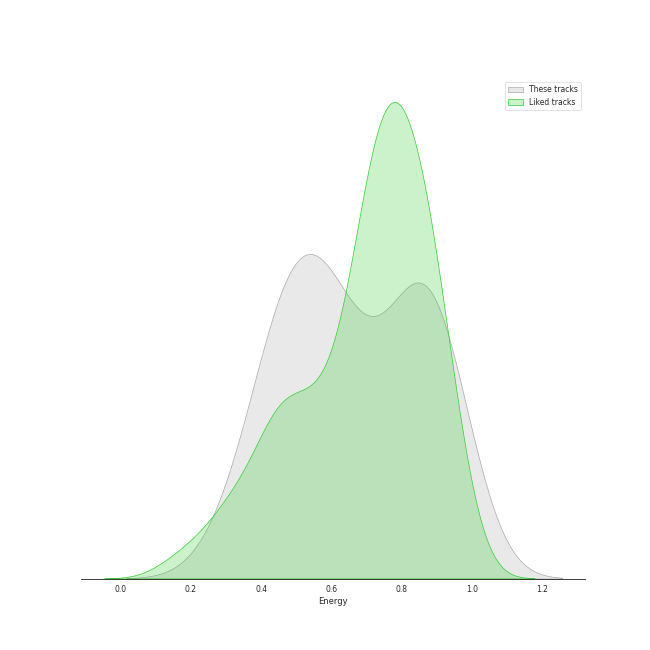
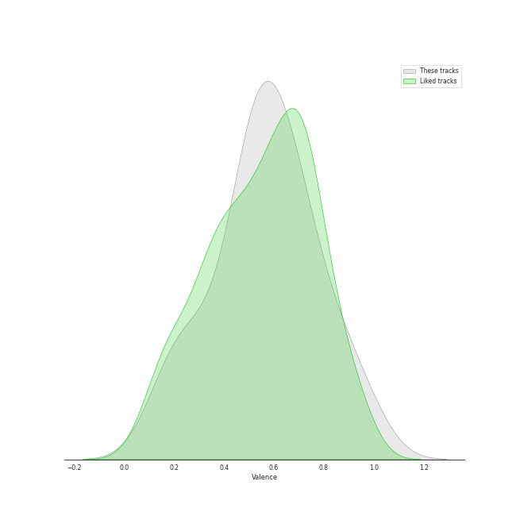

# Audio Features for Kakao Entertainment

## Danceability

| ​ | 10 most Danceable tracks | ​​ | 10 least Danceable tracks |
|:---|:---|:---|:---|
|  | BBIBBI (0.839) |  | Love poem (0.404) |
|  | Pierrot laughs at us (0.824) |  | above the time (0.471) |
|  | Blueming (0.819) |  | Glasses (0.578) |
|  | BBoom BBoom (0.785) |  | lost child (0.59) |
|  | Twenty-three (0.757) |  | YOU&I (0.636) |
|  | 4AM (0.755) |  | The Red Shoes (0.636) |
|  | BAAM (0.725) |  | Good day (0.637) |
|  | Friday (feat.Jang Yi-jeong) (0.681) |  | Merry Christmas ahead (feat.Chundung) (0.665) |
|  | Merry Christmas ahead (feat.Chundung) (0.665) |  | Friday (feat.Jang Yi-jeong) (0.681) |
|  | Good day (0.637) |  | BAAM (0.725) |

## Energy

| ​ | 10 most Energetic tracks | ​​ | 10 least Energetic tracks |
|:---|:---|:---|:---|
|  | Twenty-three (0.955) |  | 4AM (0.421) |
|  | BAAM (0.94) |  | Glasses (0.462) |
|  | The Red Shoes (0.922) |  | Love poem (0.467) |
|  | YOU&I (0.9) |  | Friday (feat.Jang Yi-jeong) (0.525) |
|  | Good day (0.882) |  | above the time (0.548) |
|  | lost child (0.832) |  | Pierrot laughs at us (0.555) |
|  | Merry Christmas ahead (feat.Chundung) (0.803) |  | BBIBBI (0.617) |
|  | BBoom BBoom (0.744) |  | Blueming (0.674) |
|  | Blueming (0.674) |  | BBoom BBoom (0.744) |
|  | BBIBBI (0.617) |  | Merry Christmas ahead (feat.Chundung) (0.803) |

## Speechiness

| ​ | 10 most Speechy tracks | ​​ | 10 least Speechy tracks |
|:---|:---|:---|:---|
|  | BBIBBI (0.331) |  | lost child (0.0365) |
|  | The Red Shoes (0.211) |  | above the time (0.0369) |
|  | Good day (0.0654) |  | BBoom BBoom (0.0369) |
|  | Blueming (0.0587) |  | Pierrot laughs at us (0.0371) |
|  | Merry Christmas ahead (feat.Chundung) (0.0575) |  | 4AM (0.0405) |
|  | YOU&I (0.0571) |  | Twenty-three (0.0412) |
|  | Friday (feat.Jang Yi-jeong) (0.0512) |  | Love poem (0.0413) |
|  | BAAM (0.0435) |  | Glasses (0.043) |
|  | Glasses (0.043) |  | BAAM (0.0435) |
|  | Love poem (0.0413) |  | Friday (feat.Jang Yi-jeong) (0.0512) |

## Acousticness

| ​ | 10 most Acoustic tracks | ​​ | 10 least Acoustic tracks |
|:---|:---|:---|:---|
|  | Pierrot laughs at us (0.752) |  | BBoom BBoom (0.0149) |
|  | above the time (0.742) |  | Twenty-three (0.0168) |
|  | Love poem (0.74) |  | Blueming (0.0849) |
|  | Friday (feat.Jang Yi-jeong) (0.619) |  | BAAM (0.115) |
|  | lost child (0.56) |  | Good day (0.165) |
|  | The Red Shoes (0.512) |  | Glasses (0.185) |
|  | Merry Christmas ahead (feat.Chundung) (0.294) |  | BBIBBI (0.241) |
|  | YOU&I (0.286) |  | 4AM (0.267) |
|  | 4AM (0.267) |  | YOU&I (0.286) |
|  | BBIBBI (0.241) |  | Merry Christmas ahead (feat.Chundung) (0.294) |

## Instrumentalness

| ​ | 10 most Instrumental tracks | ​​ | 10 least Instrumental tracks |
|:---|:---|:---|:---|
|  | BBoom BBoom (0.00666) |  | Friday (feat.Jang Yi-jeong) (0.0) |
|  | BAAM (0.00431) |  | lost child (0.0) |
|  | 4AM (4.63e-06) |  | Good day (0.0) |
|  | YOU&I (1.47e-06) |  | above the time (0.0) |
|  | Pierrot laughs at us (0.0) |  | Twenty-three (0.0) |
|  | Love poem (0.0) |  | The Red Shoes (0.0) |
|  | Merry Christmas ahead (feat.Chundung) (0.0) |  | Blueming (0.0) |
|  | Glasses (0.0) |  | BBIBBI (0.0) |
|  | BBIBBI (0.0) |  | Glasses (0.0) |
|  | Blueming (0.0) |  | Merry Christmas ahead (feat.Chundung) (0.0) |

## Liveness

| ​ | 10 most Live tracks | ​​ | 10 least Live tracks |
|:---|:---|:---|:---|
|  | BBIBBI (0.3) |  | Pierrot laughs at us (0.0577) |
|  | Merry Christmas ahead (feat.Chundung) (0.26) |  | BBoom BBoom (0.0661) |
|  | Glasses (0.233) |  | Blueming (0.0667) |
|  | lost child (0.155) |  | Twenty-three (0.0817) |
|  | 4AM (0.122) |  | BAAM (0.0864) |
|  | Love poem (0.106) |  | above the time (0.0896) |
|  | Friday (feat.Jang Yi-jeong) (0.103) |  | The Red Shoes (0.0898) |
|  | YOU&I (0.0982) |  | Good day (0.0981) |
|  | Good day (0.0981) |  | YOU&I (0.0982) |
|  | The Red Shoes (0.0898) |  | Friday (feat.Jang Yi-jeong) (0.103) |

## Valence

| ​ | 10 most Happy tracks | ​​ | 10 least Happy tracks |
|:---|:---|:---|:---|
|  | Twenty-three (0.968) |  | lost child (0.174) |
|  | BAAM (0.905) |  | above the time (0.177) |
|  | BBoom BBoom (0.833) |  | Love poem (0.273) |
|  | BBIBBI (0.821) |  | The Red Shoes (0.371) |
|  | YOU&I (0.686) |  | 4AM (0.417) |
|  | Blueming (0.682) |  | Merry Christmas ahead (feat.Chundung) (0.496) |
|  | Pierrot laughs at us (0.659) |  | Friday (feat.Jang Yi-jeong) (0.551) |
|  | Glasses (0.608) |  | Good day (0.552) |
|  | Good day (0.552) |  | Glasses (0.608) |
|  | Friday (feat.Jang Yi-jeong) (0.551) |  | Pierrot laughs at us (0.659) |

## Tempo

| ​ | 10 most Fast tracks | ​​ | 10 least Fast tracks |
|:---|:---|:---|:---|
|  | above the time (147.961) |  | Friday (feat.Jang Yi-jeong) (80.052) |
|  | BBIBBI (143.894) |  | 4AM (84.976) |
|  | YOU&I (134.004) |  | Blueming (106.032) |
|  | Good day (128.027) |  | Pierrot laughs at us (106.032) |
|  | Merry Christmas ahead (feat.Chundung) (127.998) |  | Glasses (114.999) |
|  | BAAM (127.051) |  | The Red Shoes (118.065) |
|  | BBoom BBoom (126.018) |  | Love poem (119.994) |
|  | lost child (123.937) |  | Twenty-three (122.952) |
|  | Twenty-three (122.952) |  | lost child (123.937) |
|  | Love poem (119.994) |  | BBoom BBoom (126.018) |
