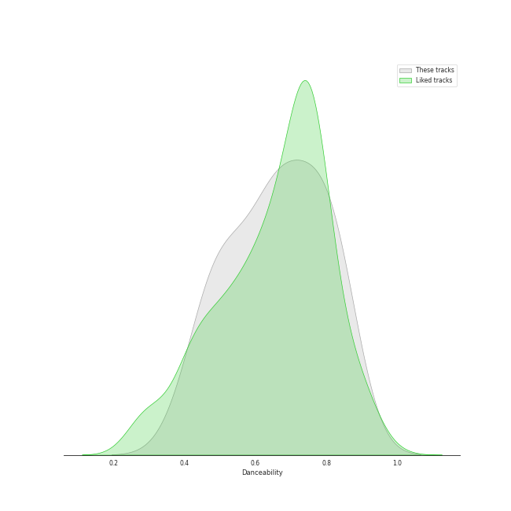
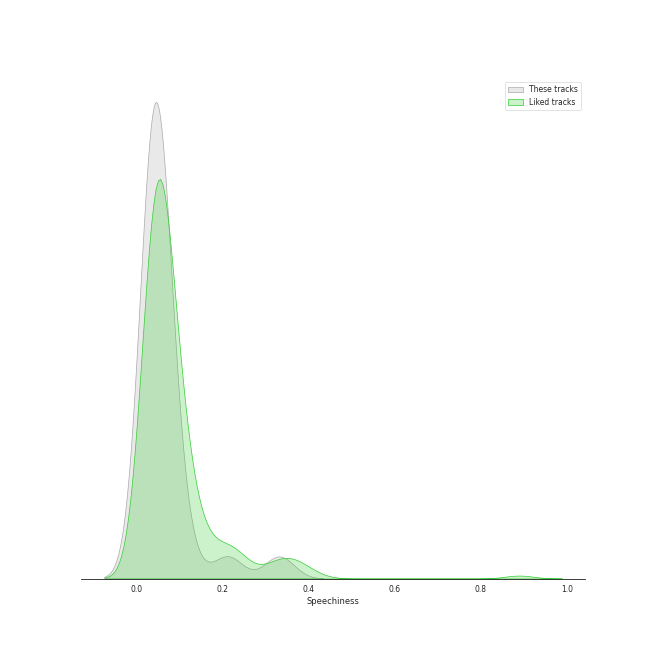
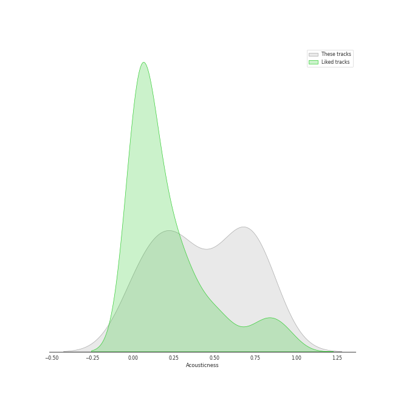
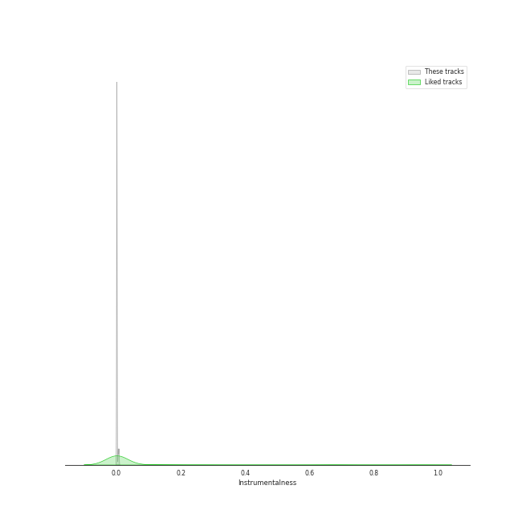
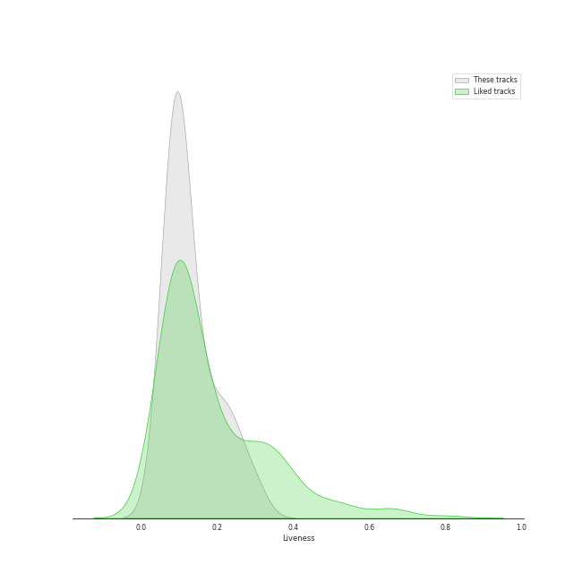
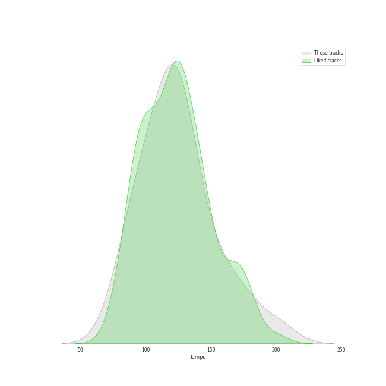

# Audio Features for Kakao Entertainment

## Danceability

| 10 most Danceable tracks | 10 least Danceable tracks |
|:---|:---|
| BBIBBI (0.839) | Love poem (0.404) |
| Pierrot laughs at us (0.824) | above the time (0.471) |
| Blueming (0.819) | Glasses (0.578) |
| BBoom BBoom (0.785) | lost child (0.59) |
| Twenty-three (0.757) | YOU&I (0.636) |
| 4AM (0.755) | The Red Shoes (0.636) |
| BAAM (0.725) | Good day (0.637) |
| Friday (feat.Jang Yi-jeong) (0.681) | Merry Christmas ahead (feat.Chundung) (0.665) |
| Merry Christmas ahead (feat.Chundung) (0.665) | Friday (feat.Jang Yi-jeong) (0.681) |
| Good day (0.637) | BAAM (0.725) |

## Energy

| 10 most Energetic tracks | 10 least Energetic tracks |
|:---|:---|
| Twenty-three (0.955) | 4AM (0.421) |
| BAAM (0.94) | Glasses (0.462) |
| The Red Shoes (0.922) | Love poem (0.467) |
| YOU&I (0.9) | Friday (feat.Jang Yi-jeong) (0.525) |
| Good day (0.882) | above the time (0.548) |
| lost child (0.832) | Pierrot laughs at us (0.555) |
| Merry Christmas ahead (feat.Chundung) (0.803) | BBIBBI (0.617) |
| BBoom BBoom (0.744) | Blueming (0.674) |
| Blueming (0.674) | BBoom BBoom (0.744) |
| BBIBBI (0.617) | Merry Christmas ahead (feat.Chundung) (0.803) |

## Speechiness

| 10 most Speechy tracks | 10 least Speechy tracks |
|:---|:---|
| BBIBBI (0.331) | lost child (0.0365) |
| The Red Shoes (0.211) | above the time (0.0369) |
| Good day (0.0654) | BBoom BBoom (0.0369) |
| Blueming (0.0587) | Pierrot laughs at us (0.0371) |
| Merry Christmas ahead (feat.Chundung) (0.0575) | 4AM (0.0405) |
| YOU&I (0.0571) | Twenty-three (0.0412) |
| Friday (feat.Jang Yi-jeong) (0.0512) | Love poem (0.0413) |
| BAAM (0.0435) | Glasses (0.043) |
| Glasses (0.043) | BAAM (0.0435) |
| Love poem (0.0413) | Friday (feat.Jang Yi-jeong) (0.0512) |

## Acousticness

| 10 most Acoustic tracks | 10 least Acoustic tracks |
|:---|:---|
| Pierrot laughs at us (0.752) | BBoom BBoom (0.0149) |
| above the time (0.742) | Twenty-three (0.0168) |
| Love poem (0.74) | Blueming (0.0849) |
| Friday (feat.Jang Yi-jeong) (0.619) | BAAM (0.115) |
| lost child (0.56) | Good day (0.165) |
| The Red Shoes (0.512) | Glasses (0.185) |
| Merry Christmas ahead (feat.Chundung) (0.294) | BBIBBI (0.241) |
| YOU&I (0.286) | 4AM (0.267) |
| 4AM (0.267) | YOU&I (0.286) |
| BBIBBI (0.241) | Merry Christmas ahead (feat.Chundung) (0.294) |

## Instrumentalness

| 10 most Instrumental tracks | 10 least Instrumental tracks |
|:---|:---|
| BBoom BBoom (0.00666) | Friday (feat.Jang Yi-jeong) (0.0) |
| BAAM (0.00431) | lost child (0.0) |
| 4AM (4.63e-06) | Good day (0.0) |
| YOU&I (1.47e-06) | above the time (0.0) |
| Pierrot laughs at us (0.0) | Twenty-three (0.0) |
| Love poem (0.0) | The Red Shoes (0.0) |
| Merry Christmas ahead (feat.Chundung) (0.0) | Blueming (0.0) |
| Glasses (0.0) | BBIBBI (0.0) |
| BBIBBI (0.0) | Glasses (0.0) |
| Blueming (0.0) | Merry Christmas ahead (feat.Chundung) (0.0) |

## Liveness

| 10 most Live tracks | 10 least Live tracks |
|:---|:---|
| BBIBBI (0.3) | Pierrot laughs at us (0.0577) |
| Merry Christmas ahead (feat.Chundung) (0.26) | BBoom BBoom (0.0661) |
| Glasses (0.233) | Blueming (0.0667) |
| lost child (0.155) | Twenty-three (0.0817) |
| 4AM (0.122) | BAAM (0.0864) |
| Love poem (0.106) | above the time (0.0896) |
| Friday (feat.Jang Yi-jeong) (0.103) | The Red Shoes (0.0898) |
| YOU&I (0.0982) | Good day (0.0981) |
| Good day (0.0981) | YOU&I (0.0982) |
| The Red Shoes (0.0898) | Friday (feat.Jang Yi-jeong) (0.103) |

## Valence

| 10 most Happy tracks | 10 least Happy tracks |
|:---|:---|
| Twenty-three (0.968) | lost child (0.174) |
| BAAM (0.905) | above the time (0.177) |
| BBoom BBoom (0.833) | Love poem (0.273) |
| BBIBBI (0.821) | The Red Shoes (0.371) |
| YOU&I (0.686) | 4AM (0.417) |
| Blueming (0.682) | Merry Christmas ahead (feat.Chundung) (0.496) |
| Pierrot laughs at us (0.659) | Friday (feat.Jang Yi-jeong) (0.551) |
| Glasses (0.608) | Good day (0.552) |
| Good day (0.552) | Glasses (0.608) |
| Friday (feat.Jang Yi-jeong) (0.551) | Pierrot laughs at us (0.659) |

## Tempo

| 10 most Fast tracks | 10 least Fast tracks |
|:---|:---|
| above the time (147.961) | Friday (feat.Jang Yi-jeong) (80.052) |
| BBIBBI (143.894) | 4AM (84.976) |
| YOU&I (134.004) | Blueming (106.032) |
| Good day (128.027) | Pierrot laughs at us (106.032) |
| Merry Christmas ahead (feat.Chundung) (127.998) | Glasses (114.999) |
| BAAM (127.051) | The Red Shoes (118.065) |
| BBoom BBoom (126.018) | Love poem (119.994) |
| lost child (123.937) | Twenty-three (122.952) |
| Twenty-three (122.952) | lost child (123.937) |
| Love poem (119.994) | BBoom BBoom (126.018) |
