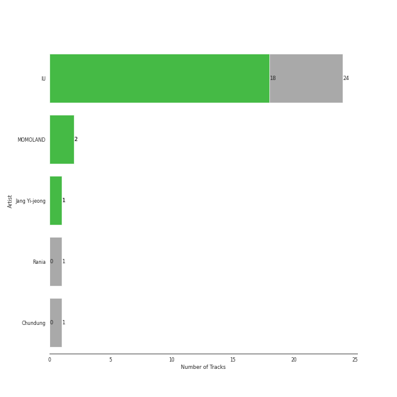
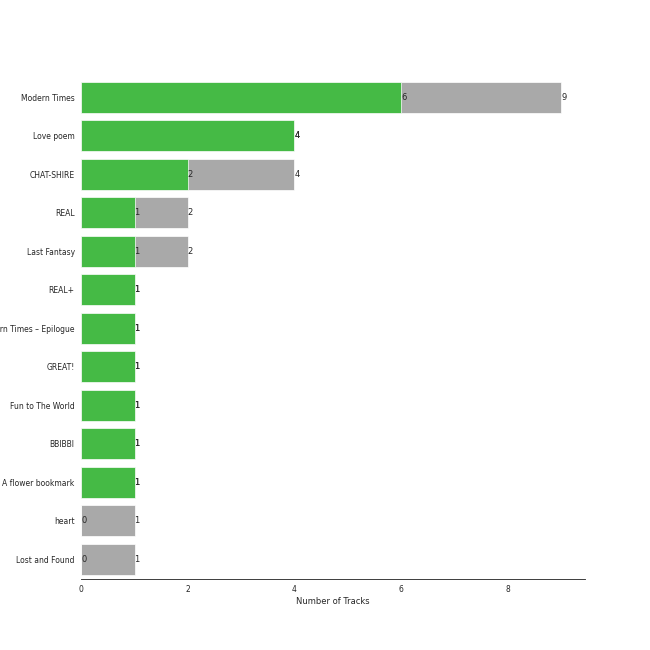
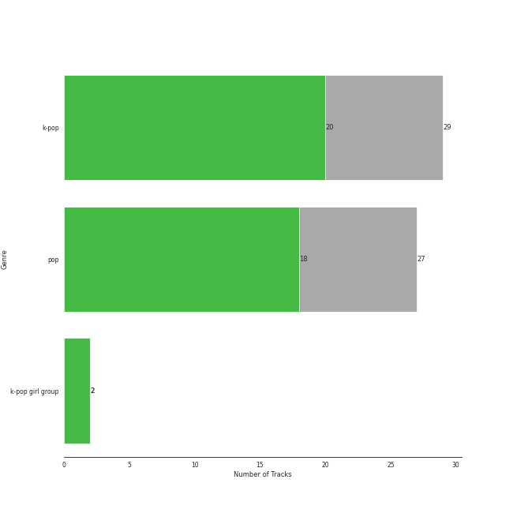
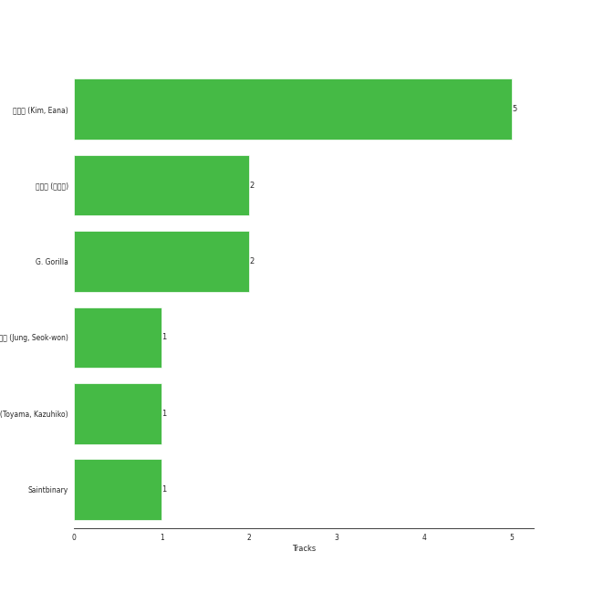

# Kakao Entertainment

26 songs

[See Track Features](audio_features.md)

[See Clusters](clusters/overview.md)

Appears as:
- Kakao Entertainment (24 tracks)
- DUBLEKICK COMPANY, Kakao Entertainment (1 tracks)
- MLD ENTERTAINMENT, Kakao Entertainment (1 tracks)

## Top Artists

| Art | Tracks | 💚 | Artist | 🔗 |
|:---|---:|---:|:---|:---|
|  | 23 | 18 | [IU](../../artists/iu/overview.md) | [🔗](https://open.spotify.com/artist/3HqSLMAZ3g3d5poNaI7GOU) |
|  | 2 | 2 | [MOMOLAND](../../artists/momoland/overview.md) | [🔗](https://open.spotify.com/artist/5RR0MLwcjc87wjSw2JYdwx) |
| | 1 | 1 | Jang Yi-jeong | [🔗](https://open.spotify.com/artist/7nLakaHt1koh5mP4OIVM0F) |
|  | 1 | 1 | Rania | [🔗](https://open.spotify.com/artist/5sUKi0QlHVxvsCzmrhJsFO) |
| | 1 | 0 | Chundung | [🔗](https://open.spotify.com/artist/52KEoFZCGGap8hZHtOgENt) |

## Top Albums

| Art | Tracks | 💚 | Album | Release Date | 🔗 |
|:---|---:|---:|:---|:---|:---|
|  | 6 | 5 | Modern Times | 2013-10-08 | [🔗](https://open.spotify.com/album/2QcuXvQBWv1ZKyQtEhLbFe) |
|  | 4 | 4 | Love poem | 2019-11-18 | [🔗](https://open.spotify.com/album/2xEH7SRzJq7LgA0fCtTlxH) |
|  | 3 | 3 | CHAT-SHIRE | 2015-10-23 | [🔗](https://open.spotify.com/album/3rMvAe0zU0pJRnRa7Rfc1U) |
|  | 2 | 1 | REAL | 2010-12-09 | [🔗](https://open.spotify.com/album/4WY1pPvmP9sBlVICuPxBQh) |
|  | 2 | 1 | Last Fantasy | 2011-11-29 | [🔗](https://open.spotify.com/album/149BHv6qAyMgJ483vPi77C) |
|  | 1 | 1 | REAL+ | 2011-02-17 | [🔗](https://open.spotify.com/album/79725WrSou2C9RrEUxClUf) |
|  | 1 | 1 | Modern Times – Epilogue | 2013-12-20 | [🔗](https://open.spotify.com/album/56MqewtCUq5bplrqEYTVL0) |
|  | 1 | 1 | Just go | 2013-03-08 | [🔗](https://open.spotify.com/album/4rNbLQCtgRSSCvYjk12zX3) |
|  | 1 | 1 | GREAT! | 2018-01-03 | [🔗](https://open.spotify.com/album/5vt2sEP5J0VNbYXoA7h2k4) |
|  | 1 | 1 | Fun to The World | 2018-06-26 | [🔗](https://open.spotify.com/album/75dkh8s39e7txjNe9cODH3) |

See all 14 albums

| Art | Tracks | 💚 | Album | Release Date | 🔗 |
|:---|---:|---:|:---|:---|:---|
|  | 1 | 1 | BBIBBI | 2018-10-10 | [🔗](https://open.spotify.com/album/4ghBzVOTFoeKPPmyNKjVtI) |
|  | 1 | 1 | A flower bookmark | 2014-05-16 | [🔗](https://open.spotify.com/album/460uGpon2JwPfRgDohV2bP) |
|  | 1 | 0 | heart | 2015-05-18 | [🔗](https://open.spotify.com/album/3NYm5NdVNZsXNfn0ZVezWb) |
|  | 1 | 0 | Lost and Found | 2008-09-23 | [🔗](https://open.spotify.com/album/5CqhdN6fFBPN5JcNiU1uyF) |

## Genres

| Tracks | 💚 | Genre |
|---:|---:|:---|
| 25 | 20 | [k-pop](../../genres/k-pop/overview.md) |
| 23 | 18 | [pop](../../genres/pop/overview.md) |
| 3 | 3 | [k-pop girl group](../../genres/k-pop_girl_group/overview.md) |

## Top Producers

| Art | Producer | Tracks | Credit Types |
|:---|:---|---:|:---|
| | [김이나 (Kim, Eana)](../../producers/김이나_(kim,_eana)/overview.md) | 5 | Lyricist |
| | [이민수 (이민수)](../../producers/이민수_(이민수)/overview.md) | 2 | Arranger, Songwriter |
| | G. Gorilla | 2 | Arranger, Lyricist, Songwriter |
| | 박주원 (Park, Ju-Won) | 1 | Arranger, Songwriter |
| | Saintbinary | 1 | Songwriter |
| | 정석원 (Jung, Seok-won) | 1 | Arranger, Songwriter |
| | 外山和彦 (Toyama, Kazuhiko) | 1 | Arranger |
|  | [IU](../../artists/iu/overview.md) | 1 | Lyricist |

## Tracks released under Kakao Entertainment

| Art | Track | Album | Artists | Label | Rank | 💚 | 🔗 |
|:---|:---|:---|:---|:---|---:|:---|:---|
|  | BBIBBI | BBIBBI | [IU](../../artists/iu/overview.md) | [Kakao Entertainment](.) | 17 | 💚 | [🔗](https://open.spotify.com/track/4as4XEOR03oGm1STUKl6pa) |
|  | The Red Shoes | Modern Times | [IU](../../artists/iu/overview.md) | [Kakao Entertainment](.) | 98 | 💚 | [🔗](https://open.spotify.com/track/3atsk5EWI5fNxLMIJnfYfJ) |
|  | Modern Times | Modern Times | [IU](../../artists/iu/overview.md) | [Kakao Entertainment](.) | 325 | 💚 | [🔗](https://open.spotify.com/track/38Dwg8OrUClCZl2wzUKrmi) |
|  | YOU&I | Last Fantasy | [IU](../../artists/iu/overview.md) | [Kakao Entertainment](.) | 412 | 💚 | [🔗](https://open.spotify.com/track/37S86pw74OH8j96ZmMnrpR) |
|  | above the time | Love poem | [IU](../../artists/iu/overview.md) | [Kakao Entertainment](.) | 494 | 💚 | [🔗](https://open.spotify.com/track/2qKZnheMe0HhqYC1XJcdaA) |
|  | unlucky | Love poem | [IU](../../artists/iu/overview.md) | [Kakao Entertainment](.) | 526 | 💚 | [🔗](https://open.spotify.com/track/1jsY6pQeNaEConZWGau1L4) |
|  | Scary Fairy Tale | REAL+ | [IU](../../artists/iu/overview.md) | [Kakao Entertainment](.) | 533 | 💚 | [🔗](https://open.spotify.com/track/4I7QHqHq3luA1ygpWZqqBV) |
|  | 4AM | Last Fantasy | [IU](../../artists/iu/overview.md) | [Kakao Entertainment](.) | 676 | | [🔗](https://open.spotify.com/track/3K2qsjNSynFOx2XHTHGXT2) |
|  | Zezé | CHAT-SHIRE | [IU](../../artists/iu/overview.md) | [Kakao Entertainment](.) | 830 | 💚 | [🔗](https://open.spotify.com/track/1dwOTQnBuN8LeVX4jNwJXS) |
|  | lost child | Lost and Found | [IU](../../artists/iu/overview.md) | [Kakao Entertainment](.) | 855 | | [🔗](https://open.spotify.com/track/1EzYoGGkr0azLsiq8svGSl) |

See all tracks

| Art | Track | Album | Artists | Label | Rank | 💚 | 🔗 |
|:---|:---|:---|:---|:---|---:|:---|:---|
|  | Good day | REAL | [IU](../../artists/iu/overview.md) | [Kakao Entertainment](.) | 855 | 💚 | [🔗](https://open.spotify.com/track/1SwZVVH9BnXtLRLi2cbFhw) |
|  | Merry Christmas ahead (feat.Chundung) | REAL | [IU](../../artists/iu/overview.md), Chundung | [Kakao Entertainment](.) | 855 | | [🔗](https://open.spotify.com/track/6I9Y6PHTWv72fgQV3tIHt0) |
|  | Dr.feel good | Just go | Rania | [Kakao Entertainment](.) | 855 | 💚 | [🔗](https://open.spotify.com/track/5bHHIh8rTDH3ukXrdp7lcw) |
|  | Between the lips (50cm) | Modern Times | [IU](../../artists/iu/overview.md) | [Kakao Entertainment](.) | 855 | 💚 | [🔗](https://open.spotify.com/track/5K8D8VKWxLlS9irhfGlIEi) |
|  | Havana | Modern Times | [IU](../../artists/iu/overview.md) | [Kakao Entertainment](.) | 855 | | [🔗](https://open.spotify.com/track/5tW1WVLeSj61qexZmyb1il) |
|  | Love of B | Modern Times | [IU](../../artists/iu/overview.md) | [Kakao Entertainment](.) | 855 | 💚 | [🔗](https://open.spotify.com/track/7b3p9nGAWa2fByucNemToA) |
|  | Obliviate | Modern Times | [IU](../../artists/iu/overview.md) | [Kakao Entertainment](.) | 855 | 💚 | [🔗](https://open.spotify.com/track/2RENeWPEosqVewFaHSNnjT) |
|  | Friday (feat.Jang Yi-jeong) | Modern Times – Epilogue | [IU](../../artists/iu/overview.md), Jang Yi-jeong | [Kakao Entertainment](.) | 855 | 💚 | [🔗](https://open.spotify.com/track/0GsRx0gPft6RmijIwMsKmG) |
|  | Pierrot laughs at us | A flower bookmark | [IU](../../artists/iu/overview.md) | [Kakao Entertainment](.) | 855 | 💚 | [🔗](https://open.spotify.com/track/7rx1DA57CL4nGS3AnFGjgJ) |
|  | heart | heart | [IU](../../artists/iu/overview.md) | [Kakao Entertainment](.) | 855 | | [🔗](https://open.spotify.com/track/5ktwBE88NKZSfmk6Lw2KhS) |
|  | Glasses | CHAT-SHIRE | [IU](../../artists/iu/overview.md) | [Kakao Entertainment](.) | 855 | 💚 | [🔗](https://open.spotify.com/track/4ogMtogPGtC1VwKRNiHymx) |
|  | Twenty-three | CHAT-SHIRE | [IU](../../artists/iu/overview.md) | [Kakao Entertainment](.) | 855 | 💚 | [🔗](https://open.spotify.com/track/3YkDslZvvMixTwgDId0aYB) |
|  | BBoom BBoom | GREAT! | [MOMOLAND](../../artists/momoland/overview.md) | [DUBLEKICK COMPANY, Kakao Entertainment](.) | 855 | 💚 | [🔗](https://open.spotify.com/track/3BPoSr2pO34Aan6alFfVto) |
|  | BAAM | Fun to The World | [MOMOLAND](../../artists/momoland/overview.md) | [MLD ENTERTAINMENT, Kakao Entertainment](.) | 855 | 💚 | [🔗](https://open.spotify.com/track/4Is1b37KJY9XVCgzp81FBW) |
|  | Blueming | Love poem | [IU](../../artists/iu/overview.md) | [Kakao Entertainment](.) | 855 | 💚 | [🔗](https://open.spotify.com/track/4Dr2hJ3EnVh2Aaot6fRwDO) |
|  | Love poem | Love poem | [IU](../../artists/iu/overview.md) | [Kakao Entertainment](.) | 855 | 💚 | [🔗](https://open.spotify.com/track/7HrE6HtYNBbGqp5GmHbFV0) |

