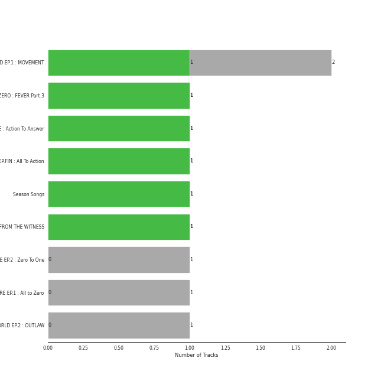
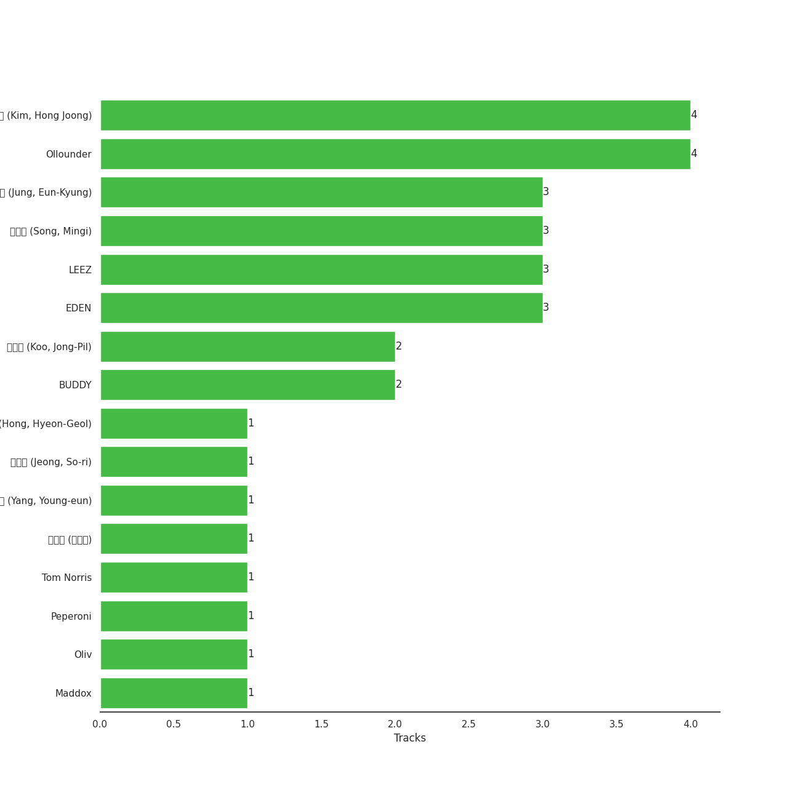

# KQ Entertainment

10 songs

Appears as:
- KQ Entertainment (9 tracks)
- KQ Entertainment, TURBO JK Company (1 tracks)

## Top Artists

| Art | Tracks | 💚 | Artist | 🔗 |
|:---|---:|---:|:---|:---|
|  | 10 | 5 | [ATEEZ](../../artists/ateez/overview.md) | [🔗](https://open.spotify.com/artist/68KmkJeZGfwe1OUaivBa2L) |

## Top Albums

| Art | Tracks | 💚 | Album | Release Date | 🔗 |
|:---|---:|---:|:---|:---|:---|
|  | 2 | 1 | THE WORLD EP.1 : MOVEMENT | 2022-07-29 | [🔗](https://open.spotify.com/album/3fgDrbflffzvV3H3plG9e6) |
|  | 1 | 1 | ZERO : FEVER Part.3 | 2021-09-13 | [🔗](https://open.spotify.com/album/5ozaWoYQScjFzGODcJmy3G) |
|  | 1 | 1 | TREASURE EPILOGUE : Action To Answer | 2020-01-06 | [🔗](https://open.spotify.com/album/3TTkDOcSzRQCvGMT7VmmPE) |
|  | 1 | 1 | TREASURE EP.FIN : All To Action | 2019-10-08 | [🔗](https://open.spotify.com/album/4HGhzqQEY1X6WWZw6MhjlO) |
|  | 1 | 1 | SPIN OFF : FROM THE WITNESS | 2022-12-30 | [🔗](https://open.spotify.com/album/0NQQk6vo9LOOwKjZc2iUwm) |
|  | 1 | 0 | TREASURE EP.2 : Zero To One | 2019-01-15 | [🔗](https://open.spotify.com/album/2PQ8cQ8WzAJJkWYT2Ydmhw) |
|  | 1 | 0 | TREASURE EP.1 : All to Zero | 2018-10-24 | [🔗](https://open.spotify.com/album/4ayTucmOGwLd0WrJddrUwx) |
|  | 1 | 0 | THE WORLD EP.2 : OUTLAW | 2023-06-16 | [🔗](https://open.spotify.com/album/5DxixnuklLg28S7UMeGC9H) |
|  | 1 | 0 | Season Songs | 2021-08-16 | [🔗](https://open.spotify.com/album/7o5jeWeyGW3Nb77WhmVPwJ) |

## Genres

| Tracks | 💚 | Genre |
|---:|---:|:---|
| 10 | 5 | [k-pop boy group](../../genres/k-pop_boy_group/overview.md) |
| 10 | 5 | [k-pop](../../genres/k-pop/overview.md) |

## Top Producers

| Art | Producer | Tracks | Credit Types |
|:---|:---|---:|:---|
| | [Ollounder](../../producers/ollounder/overview.md) | 4 | Arranger, Songwriter, Lyricist |
| | 김홍중 (Kim, Hong Joong) | 4 | Songwriter, Lyricist |
| | EDEN | 3 | Arranger, Songwriter, Lyricist |
| | 송민기 (Song, Mingi) | 3 | Songwriter, Lyricist |
| | [정은경 (Jung, Eun-Kyung)](../../producers/정은경_(jung,_eun-kyung)/overview.md) | 3 | Producer |
| | [LEEZ](../../producers/leez/overview.md) | 3 | Arranger, Songwriter, Lyricist |
| | BUDDY | 2 | Arranger, Songwriter, Lyricist |
| | [구종필 (Koo, Jong-Pil)](../../producers/구종필_(koo,_jong-pil)/overview.md) | 2 | Producer |
| | Peperoni | 1 | Arranger, Songwriter |
| | 홍현걸 (Hong, Hyeon-Geol) | 1 | Lyricist |

View all

| Art | Producer | Tracks | Credit Types |
|:---|:---|---:|:---|
| | 김수정 (김수정) | 1 | Producer |
| | Maddox | 1 | Arranger, Lyricist, Songwriter |
| | [양영은 (Yang, Young-eun)](../../producers/양영은_(yang,_young-eun)/overview.md) | 1 | Producer |
| | Tom Norris | 1 | Producer |
| | Oliv | 1 | Arranger, Songwriter |
| | 정소리 (Jeong, So-ri) | 1 | Arranger |

## Tracks released under KQ Entertainment

| Art | Track | Album | Artists | Label | Rank | 💚 | 🔗 |
|:---|:---|:---|:---|:---|---:|:---|:---|
|  | HALAZIA | SPIN OFF : FROM THE WITNESS | [ATEEZ](../../artists/ateez/overview.md) | [KQ Entertainment](.) | 117 | 💚 | [🔗](https://open.spotify.com/track/5cTnKClHyczcUhFT8MKBZe) |
|  | Deja Vu | ZERO : FEVER Part.3 | [ATEEZ](../../artists/ateez/overview.md) | [KQ Entertainment](.) | 408 | 💚 | [🔗](https://open.spotify.com/track/3zmrdOtnOogqLllz26WLZ3) |
|  | Answer | TREASURE EPILOGUE : Action To Answer | [ATEEZ](../../artists/ateez/overview.md) | [KQ Entertainment](.) | 728 | 💚 | [🔗](https://open.spotify.com/track/3IdPtyJHB1WVPM4eCiCAKM) |
|  | WONDERLAND | TREASURE EP.FIN : All To Action | [ATEEZ](../../artists/ateez/overview.md) | [KQ Entertainment](.) | 810 | 💚 | [🔗](https://open.spotify.com/track/6k67RdkVjTZj79c1cRz7IQ) |
|  | Pirate King | TREASURE EP.1 : All to Zero | [ATEEZ](../../artists/ateez/overview.md) | [KQ Entertainment](.) | 861 | | [🔗](https://open.spotify.com/track/5Jl2i6LR3Socm4TYqRzZw3) |
|  | HALA HALA (Hearts Awakened, Live Alive) | TREASURE EP.2 : Zero To One | [ATEEZ](../../artists/ateez/overview.md) | [KQ Entertainment](.) | 861 | | [🔗](https://open.spotify.com/track/4v2BLMhWtVvBnZwuoiKxja) |
|  | The Black Cat Nero | Season Songs | [ATEEZ](../../artists/ateez/overview.md) | [KQ Entertainment, TURBO JK Company](.) | 861 | | [🔗](https://open.spotify.com/track/5GCkHlq2lxmtSlAhiLpnjq) |
|  | Cyberpunk | THE WORLD EP.1 : MOVEMENT | [ATEEZ](../../artists/ateez/overview.md) | [KQ Entertainment](.) | 861 | | [🔗](https://open.spotify.com/track/2Ax4rdLenBhULX7nRbhful) |
|  | Guerrilla | THE WORLD EP.1 : MOVEMENT | [ATEEZ](../../artists/ateez/overview.md) | [KQ Entertainment](.) | 861 | 💚 | [🔗](https://open.spotify.com/track/0tYZo2UhV1lrUez5CA0Iyw) |
|  | BOUNCY (K-HOT CHILLI PEPPERS) | THE WORLD EP.2 : OUTLAW | [ATEEZ](../../artists/ateez/overview.md) | [KQ Entertainment](.) | 861 | | [🔗](https://open.spotify.com/track/5KyOUICJIvO0z71MBdPGiX) |
