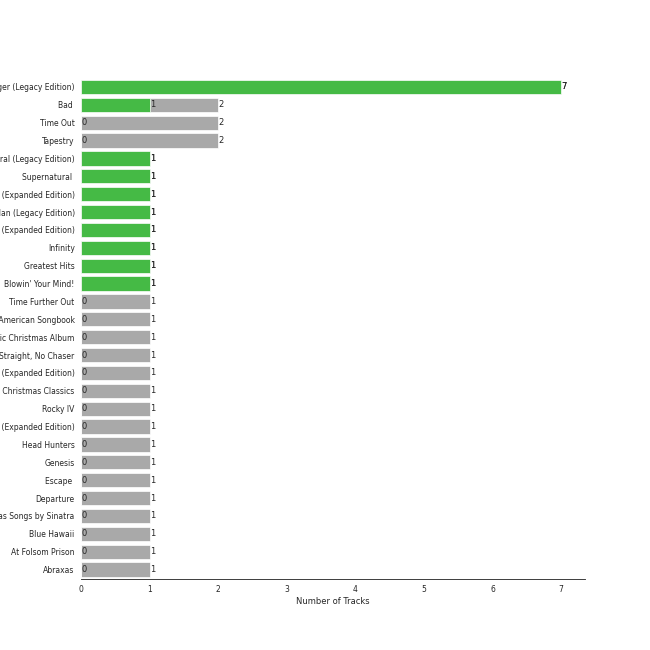
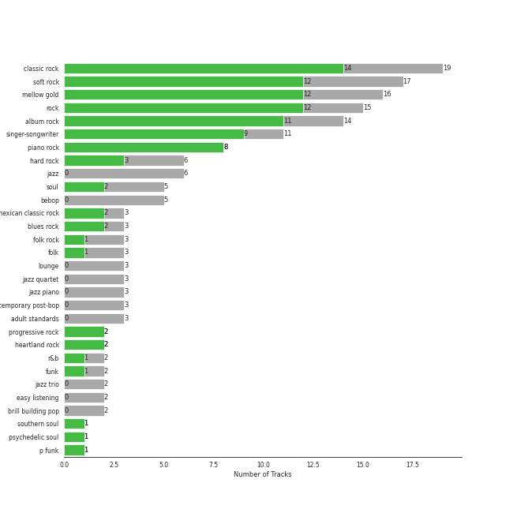

# Legacy

17 songs

Appears as:
- Columbia/Legacy (8 tracks)
- Epic/Legacy (4 tracks)
- Ode/Epic/Legacy (2 tracks)
- Legacy/Columbia (1 tracks)
- RCA/Legacy (1 tracks)
- Volcano/Legacy (1 tracks)

## Top Artists

See all 10 artists

|   Number of Tracks | Art                                                                                              | Artist                                 | 🔗                                                           |
|-------------------:|:-------------------------------------------------------------------------------------------------|:---------------------------------------|:------------------------------------------------------------|
|                  3 |  | The Dave Brubeck Quartet               | [🔗](https://open.spotify.com/artist/4iRZAbYvBqnxrbs6K25aJ7) |
|                  2 |  | [Billy Joel](../artists/billy_joel.md) | [🔗](https://open.spotify.com/artist/6zFYqv1mOsgBRQbae3JJ9e) |
|                  2 |  | Michael Jackson                        | [🔗](https://open.spotify.com/artist/3fMbdgg4jU18AjLCKBhRSm) |
|                  2 |  | Carole King                            | [🔗](https://open.spotify.com/artist/319yZVtYM9MBGqmSQnMyY6) |
|                  2 |  | Kansas                                 | [🔗](https://open.spotify.com/artist/2hl0xAkS2AIRAu23TVMBG1) |
|                  2 |  | Journey                                | [🔗](https://open.spotify.com/artist/0rvjqX7ttXeg3mTy8Xscbt) |
|                  1 |  | Johnny Cash                            | [🔗](https://open.spotify.com/artist/6kACVPfCOnqzgfEF5ryl0x) |
|                  1 |  | Van Morrison                           | [🔗](https://open.spotify.com/artist/44NX2ffIYHr6D4n7RaZF7A) |
|                  1 |  | Elvis Presley                          | [🔗](https://open.spotify.com/artist/43ZHCT0cAZBISjO8DG9PnE) |
|                  1 |  | Survivor                               | [🔗](https://open.spotify.com/artist/26bcq2nyj5GB7uRr558iQg) |

## Top Albums

See all 13 albums

|   Number of Tracks | Art                                                                                              | Album                                   | 🔗                                                          |
|-------------------:|:-------------------------------------------------------------------------------------------------|:----------------------------------------|:-----------------------------------------------------------|
|                  2 |  | Time Out                                | [🔗](https://open.spotify.com/album/0nTTEAhCZsbbeplyDMIFuA) |
|                  2 |  | The Stranger (Legacy Edition)           | [🔗](https://open.spotify.com/album/1Mhn9VosyjtWn4dMPFlna6) |
|                  2 |  | Tapestry                                | [🔗](https://open.spotify.com/album/12n11cgnpjXKLeqrnIERoS) |
|                  2 |  | Bad (Remastered)                        | [🔗](https://open.spotify.com/album/3Us57CjssWnHjTUIXBuIeH) |
|                  1 |  | Time Further Out                        | [🔗](https://open.spotify.com/album/0eMXd1VtCXCkuGWn9JjRDT) |
|                  1 |  | Rocky IV                                | [🔗](https://open.spotify.com/album/3t3BbpFJiGcXl4jI5CRLLA) |
|                  1 |  | Point Of Know Return (Expanded Edition) | [🔗](https://open.spotify.com/album/6oU298pdPTCQnMx1PYwyUA) |
|                  1 |  | Leftoverture (Expanded Edition)         | [🔗](https://open.spotify.com/album/7MejfRSNnrpcLZIxkeZDqR) |
|                  1 |  | Infinity                                | [🔗](https://open.spotify.com/album/7K4Nk5fHkCuzNm5A6mdo2U) |
|                  1 |  | Departure                               | [🔗](https://open.spotify.com/album/2OyVtIEp7O7a6o82DF4Ba5) |
|                  1 |  | Blue Hawaii                             | [🔗](https://open.spotify.com/album/7xe8VI48TxUpU1IIo0RfGi) |
|                  1 |  | Blowin' Your Mind!                      | [🔗](https://open.spotify.com/album/7dsWupQRlFuhG8FGiQAUjC) |
|                  1 |  | At Folsom Prison                        | [🔗](https://open.spotify.com/album/4TJIdlY9hGSSTO1kUs1neh) |

## Genres

See all 27 genres

|   Number of Tracks | Genre                                               |
|-------------------:|:----------------------------------------------------|
|                 10 | [soft rock](../genres/soft_rock.md)                 |
|                 10 | [rock](../genres/rock.md)                           |
|                  9 | [mellow gold](../genres/mellow_gold.md)             |
|                  9 | [classic rock](../genres/classic_rock.md)           |
|                  5 | [singer-songwriter](../genres/singer_songwriter.md) |
|                  5 | hard rock                                           |
|                  5 | [folk rock](../genres/folk_rock.md)                 |
|                  5 | album rock                                          |
|                  3 | jazz quartet                                        |
|                  3 | jazz                                                |
|                  3 | folk                                                |
|                  3 | bebop                                               |
|                  2 | symphonic rock                                      |
|                  2 | soul                                                |
|                  2 | [r&b](../genres/r_b.md)                             |
|                  2 | progressive rock                                    |
|                  2 | [pop](../genres/pop.md)                             |
|                  2 | piano rock                                          |
|                  2 | heartland rock                                      |
|                  2 | brill building pop                                  |
|                  2 | art rock                                            |
|                  2 | [adult standards](../genres/adult_standards.md)     |
|                  1 | roots rock                                          |
|                  1 | rockabilly                                          |
|                  1 | rock-and-roll                                       |
|                  1 | outlaw country                                      |
|                  1 | arkansas country                                    |

## Tracks released under Legacy

| Art                                                                                              | Track                                                                        | Album                                   | Artists                                | Label                                                          | 💚   | 🔗                                                          |
|:-------------------------------------------------------------------------------------------------|:-----------------------------------------------------------------------------|:----------------------------------------|:---------------------------------------|:---------------------------------------------------------------|:----|:-----------------------------------------------------------|
|  | Just the Way You Are                                                         | The Stranger (Legacy Edition)           | [Billy Joel](../artists/billy_joel.md) | [Columbia](columbia.md), [Legacy](legacy.md)                   | 💚   | [🔗](https://open.spotify.com/track/49MHCPzvMLXhRjDantBMVH) |
|  | Vienna                                                                       | The Stranger (Legacy Edition)           | [Billy Joel](../artists/billy_joel.md) | [Columbia](columbia.md), [Legacy](legacy.md)                   | 💚   | [🔗](https://open.spotify.com/track/4U45aEWtQhrm8A5mxPaFZ7) |
|  | I Feel the Earth Move                                                        | Tapestry                                | Carole King                            | [Legacy](legacy.md), Ode, [Epic](epic.md)                      |     | [🔗](https://open.spotify.com/track/1BWsOxeMx83OrKGCV4gxly) |
|  | So Far Away                                                                  | Tapestry                                | Carole King                            | [Legacy](legacy.md), Ode, [Epic](epic.md)                      |     | [🔗](https://open.spotify.com/track/4HHge4zAyIw3pkrtFzmwCl) |
|  | Can't Help Falling in Love                                                   | Blue Hawaii                             | Elvis Presley                          | [RCA Records Label](rca_records_label.md), [Legacy](legacy.md) |     | [🔗](https://open.spotify.com/track/44AyOl4qVkzS48vBsbNXaC) |
|  | Folsom Prison Blues - Live at Folsom State Prison, Folsom, CA - January 1968 | At Folsom Prison                        | Johnny Cash                            | [Columbia](columbia.md), [Legacy](legacy.md)                   |     | [🔗](https://open.spotify.com/track/2fDHuS1PTkHBbCWWZF1ph9) |
|  | Lights                                                                       | Infinity                                | Journey                                | [Columbia](columbia.md), [Legacy](legacy.md)                   | 💚   | [🔗](https://open.spotify.com/track/7EHmKkyAr6MZv5Y2FdZbXw) |
|  | Any Way You Want It                                                          | Departure                               | Journey                                | [Columbia](columbia.md), [Legacy](legacy.md)                   |     | [🔗](https://open.spotify.com/track/71SvEDmsOwIWw1IozsZoMA) |
|  | Carry on Wayward Son                                                         | Leftoverture (Expanded Edition)         | Kansas                                 | [Legacy](legacy.md), [Epic](epic.md)                           |     | [🔗](https://open.spotify.com/track/4DMKwE2E2iYDKY01C335Uw) |
|  | Dust in the Wind                                                             | Point Of Know Return (Expanded Edition) | Kansas                                 | [Legacy](legacy.md), [Epic](epic.md)                           | 💚   | [🔗](https://open.spotify.com/track/6zeE5tKyr8Nu882DQhhSQI) |
|  | Man in the Mirror - 2012 Remaster                                            | Bad (Remastered)                        | Michael Jackson                        | [Legacy](legacy.md), [Epic](epic.md)                           |     | [🔗](https://open.spotify.com/track/3c7Ctlw9MKlIQPxRH3fOTt) |
|  | Smooth Criminal - 2012 Remaster                                              | Bad (Remastered)                        | Michael Jackson                        | [Legacy](legacy.md), [Epic](epic.md)                           | 💚   | [🔗](https://open.spotify.com/track/5T7ywazdGIydr6JCW6t02j) |
|  | Eye of the Tiger                                                             | Rocky IV                                | Survivor                               | [Volcano/Legacy](volcano.md)                                   |     | [🔗](https://open.spotify.com/track/2KH16WveTQWT6KOG9Rg6e2) |
|  | Blue Rondo à la Turk                                                         | Time Out                                | The Dave Brubeck Quartet               | [Columbia](columbia.md), [Legacy](legacy.md)                   |     | [🔗](https://open.spotify.com/track/7CrNF9zL7tIQ2269DVxzST) |
|  | Take Five                                                                    | Time Out                                | The Dave Brubeck Quartet               | [Columbia](columbia.md), [Legacy](legacy.md)                   |     | [🔗](https://open.spotify.com/track/1YQWosTIljIvxAgHWTp7KP) |
|  | Unsquare Dance                                                               | Time Further Out                        | The Dave Brubeck Quartet               | [Columbia](columbia.md), [Legacy](legacy.md)                   |     | [🔗](https://open.spotify.com/track/2VUo8O3ymKRYNgj97ZG2kM) |
|  | Brown Eyed Girl                                                              | Blowin' Your Mind!                      | Van Morrison                           | [Columbia](columbia.md), [Legacy](legacy.md)                   | 💚   | [🔗](https://open.spotify.com/track/3yrSvpt2l1xhsV9Em88Pul) |
