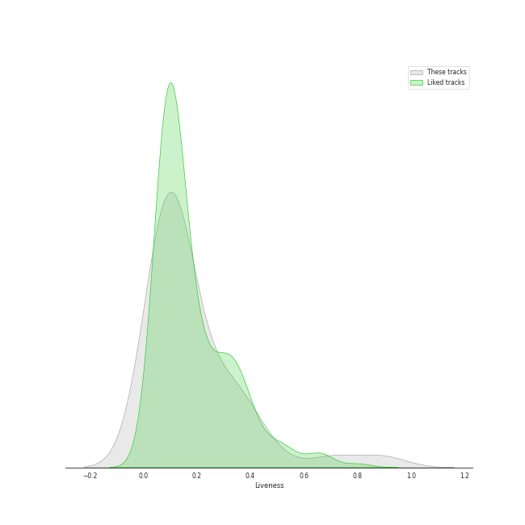
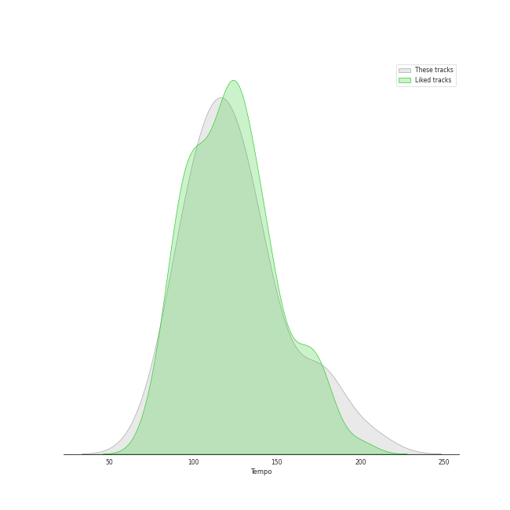

# Track Features for Legacy

## Danceability

| ​ | 10 most Danceable tracks | ​​ | 10 least Danceable tracks |
|:---|:---|:---|:---|
|  | Thank You (Falettinme Be Mice Elf Agin) - Single Version (0.9) |  | Lights (0.193) |
|  | Smooth Criminal - 2012 Remaster (0.853) |  | She's Always a Woman (0.292) |
|  | Here Comes Santa Claus (Right Down Santa Claus Lane) - 1947 Version (0.834) |  | Piano Man (0.331) |
|  | Break Ya Neck (0.82) |  | Can't Help Falling in Love (0.396) |
|  | Eye of the Tiger (0.817) |  | Scenes from an Italian Restaurant (0.415) |
|  | Let's Hear It for the Boy - From "Footloose" Original Soundtrack (0.808) |  | Take Five (0.454) |
|  | Man in the Mirror - 2012 Remaster (0.808) |  | Straight, No Chaser (0.465) |
|  | Oye Como Va (0.736) |  | Mack the Knife (0.472) |
|  | Watermelon Man (0.724) |  | Dust in the Wind (0.475) |
|  | I Feel the Earth Move (0.711) |  | Carry on Wayward Son (0.482) |

## Energy

| ​ | 10 most Energetic tracks | ​​ | 10 least Energetic tracks |
|:---|:---|:---|:---|
|  | Smooth Criminal - 2012 Remaster (0.981) |  | So Far Away (0.172) |
|  | Any Way You Want It (0.932) |  | Baby, It's Cold Outside (with Dorothy Kirsten) (0.239) |
|  | Scenes from an Italian Restaurant (0.931) |  | Let It Snow! Let It Snow! Let It Snow! (with The B. Swanson Quartet) (0.259) |
|  | Smooth (feat. Rob Thomas) (0.923) |  | Take Five (0.26) |
|  | Movin' Out (Anthony's Song) (0.88) |  | Can't Help Falling in Love (0.293) |
|  | The Stranger (0.878) |  | Dust in the Wind (0.322) |
|  | Only the Good Die Young (0.872) |  | She's Always a Woman (0.324) |
|  | Man in the Mirror - 2012 Remaster (0.812) |  | Straight, No Chaser (0.35) |
|  | Break Ya Neck (0.809) |  | I'm Confessin' (That I Love You) (0.359) |
|  | Corazon Espinado (feat. Mana) (0.789) |  | Here Comes Santa Claus (Right Down Santa Claus Lane) - 1947 Version (0.371) |

## Speechiness

| ​ | 10 most Speechy tracks | ​​ | 10 least Speechy tracks |
|:---|:---|:---|:---|
|  | Break Ya Neck (0.251) |  | Piano Man (0.0272) |
|  | Only the Good Die Young (0.159) |  | Can't Help Falling in Love (0.0275) |
|  | Baby, It's Cold Outside (with Dorothy Kirsten) (0.131) |  | Dust in the Wind (0.0283) |
|  | Scenes from an Italian Restaurant (0.126) |  | Corazon Espinado (feat. Mana) (0.0285) |
|  | Mack the Knife (0.118) |  | I Feel the Earth Move (0.0305) |
|  | Unsquare Dance (0.115) |  | Carry on Wayward Son (0.032) |
|  | The Stranger (0.0837) |  | Movin' Out (Anthony's Song) (0.0326) |
|  | Folsom Prison Blues - Live at Folsom State Prison, Folsom, CA - January 1968 (0.0803) |  | Eye of the Tiger (0.0328) |
|  | Smooth Criminal - 2012 Remaster (0.0751) |  | Smooth (feat. Rob Thomas) (0.0338) |
|  | Thank You (Falettinme Be Mice Elf Agin) - Single Version (0.0636) |  | Vienna (0.0343) |

## Acousticness

| ​ | 10 most Acoustic tracks | ​​ | 10 least Acoustic tracks |
|:---|:---|:---|:---|
|  | I'm Confessin' (That I Love You) (0.965) |  | Any Way You Want It (0.00251) |
|  | Baby, It's Cold Outside (with Dorothy Kirsten) (0.963) |  | Carry on Wayward Son (0.00321) |
|  | Can't Help Falling in Love (0.941) |  | Folsom Prison Blues - Live at Folsom State Prison, Folsom, CA - January 1968 (0.0652) |
|  | Let It Snow! Let It Snow! Let It Snow! (with The B. Swanson Quartet) (0.903) |  | Unsquare Dance (0.0723) |
|  | So Far Away (0.897) |  | Let's Hear It for the Boy - From "Footloose" Original Soundtrack (0.0761) |
|  | Blue Rondo à la Turk (0.851) |  | Lights (0.107) |
|  | Here Comes Santa Claus (Right Down Santa Claus Lane) - 1947 Version (0.799) |  | Corazon Espinado (feat. Mana) (0.13) |
|  | She's Always a Woman (0.797) |  | Eye of the Tiger (0.132) |
|  | Just the Way You Are (0.703) |  | Don't Stop Believin' (2022 Remaster) (0.132) |
|  | Vienna (0.659) |  | Only the Good Die Young (0.159) |

## Instrumentalness

| ​ | 10 most Instrumental tracks | ​​ | 10 least Instrumental tracks |
|:---|:---|:---|:---|
|  | I'm Confessin' (That I Love You) (0.905) |  | Mack the Knife (0.0) |
|  | Unsquare Dance (0.88) |  | Only the Good Die Young (0.0) |
|  | Smooth Criminal - 2012 Remaster (0.468) |  | Here Comes Santa Claus (Right Down Santa Claus Lane) - 1947 Version (0.0) |
|  | Blue Rondo à la Turk (0.352) |  | Brown Eyed Girl (0.0) |
|  | Oye Como Va (0.345) |  | Vienna (0.0) |
|  | Corazon Espinado (feat. Mana) (0.287) |  | Let It Snow! Let It Snow! Let It Snow! (with The B. Swanson Quartet) (0.0) |
|  | Straight, No Chaser (0.279) |  | Don't Stop Believin' (2022 Remaster) (0.0) |
|  | Watermelon Man (0.111) |  | Piano Man (3.96e-06) |
|  | Lights (0.00711) |  | Smooth (feat. Rob Thomas) (4.73e-06) |
|  | Let's Hear It for the Boy - From "Footloose" Original Soundtrack (0.00414) |  | The Stranger (7.64e-06) |

## Liveness

| ​ | 10 most Live tracks | ​​ | 10 least Live tracks |
|:---|:---|:---|:---|
|  | Folsom Prison Blues - Live at Folsom State Prison, Folsom, CA - January 1968 (0.893) |  | Let's Hear It for the Boy - From "Footloose" Original Soundtrack (0.0477) |
|  | Baby, It's Cold Outside (with Dorothy Kirsten) (0.706) |  | I Feel the Earth Move (0.0528) |
|  | Carry on Wayward Son (0.446) |  | Movin' Out (Anthony's Song) (0.0591) |
|  | Brown Eyed Girl (0.406) |  | Break Ya Neck (0.0613) |
|  | Let It Snow! Let It Snow! Let It Snow! (with The B. Swanson Quartet) (0.362) |  | Take Five (0.0675) |
|  | Lights (0.332) |  | So Far Away (0.0753) |
|  | Mack the Knife (0.332) |  | Vienna (0.0754) |
|  | Smooth Criminal - 2012 Remaster (0.306) |  | Watermelon Man (0.0785) |
|  | Smooth (feat. Rob Thomas) (0.295) |  | The Stranger (0.0812) |
|  | Here Comes Santa Claus (Right Down Santa Claus Lane) - 1947 Version (0.275) |  | Thank You (Falettinme Be Mice Elf Agin) - Single Version (0.0863) |

## Valence

| ​ | 10 most Happy tracks | ​​ | 10 least Happy tracks |
|:---|:---|:---|:---|
|  | Here Comes Santa Claus (Right Down Santa Claus Lane) - 1947 Version (0.976) |  | I'm Confessin' (That I Love You) (0.206) |
|  | Corazon Espinado (feat. Mana) (0.962) |  | The Stranger (0.222) |
|  | Smooth (feat. Rob Thomas) (0.961) |  | Man in the Mirror - 2012 Remaster (0.269) |
|  | Oye Como Va (0.948) |  | Vienna (0.308) |
|  | Brown Eyed Girl (0.908) |  | Scenes from an Italian Restaurant (0.339) |
|  | Thank You (Falettinme Be Mice Elf Agin) - Single Version (0.897) |  | Can't Help Falling in Love (0.343) |
|  | Movin' Out (Anthony's Song) (0.895) |  | Lights (0.344) |
|  | Folsom Prison Blues - Live at Folsom State Prison, Folsom, CA - January 1968 (0.889) |  | So Far Away (0.361) |
|  | Let It Snow! Let It Snow! Let It Snow! (with The B. Swanson Quartet) (0.836) |  | She's Always a Woman (0.384) |
|  | Carry on Wayward Son (0.793) |  | Dust in the Wind (0.387) |

## Tempo

| ​ | 10 most Fast tracks | ​​ | 10 least Fast tracks |
|:---|:---|:---|:---|
|  | Lights (205.422) |  | Only the Good Die Young (76.214) |
|  | Mack the Knife (178.306) |  | Break Ya Neck (83.011) |
|  | Piano Man (177.734) |  | The Stranger (91.881) |
|  | She's Always a Woman (176.631) |  | Straight, No Chaser (93.336) |
|  | Take Five (174.322) |  | Dust in the Wind (93.503) |
|  | Brown Eyed Girl (150.566) |  | Here Comes Santa Claus (Right Down Santa Claus Lane) - 1947 Version (96.628) |
|  | Watermelon Man (146.939) |  | Scenes from an Italian Restaurant (97.953) |
|  | So Far Away (143.837) |  | Can't Help Falling in Love (100.307) |
|  | Let It Snow! Let It Snow! Let It Snow! (with The B. Swanson Quartet) (142.169) |  | Man in the Mirror - 2012 Remaster (100.331) |
|  | Just the Way You Are (139.148) |  | I'm Confessin' (That I Love You) (104.357) |
