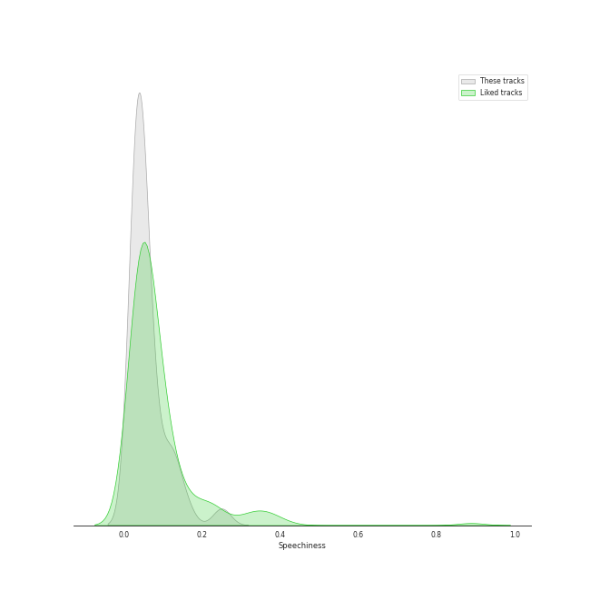
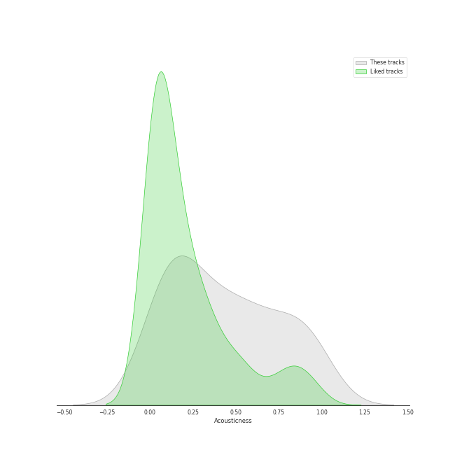
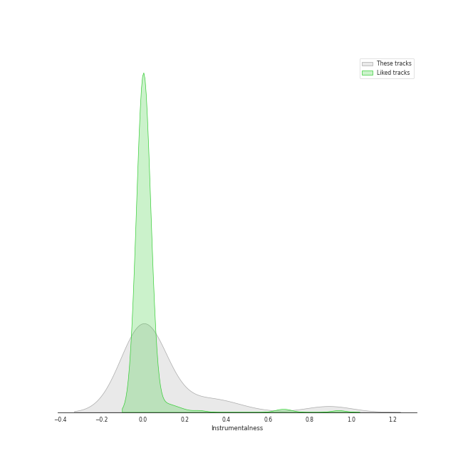
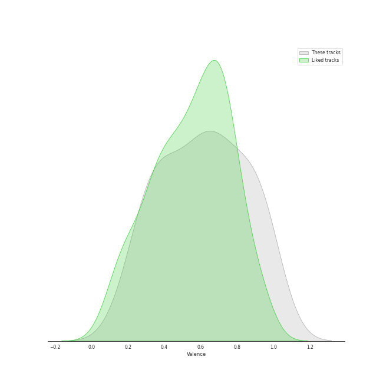

# Track Features for Legacy

## Danceability

| ​ | 10 most Danceable tracks | ​​ | 10 least Danceable tracks |
|:---|:---|:---|:---|
|  | Smooth Criminal - 2012 Remaster (0.853) |  | Lights (0.193) |
|  | Here Comes Santa Claus (Right Down Santa Claus Lane) - 1947 Version (0.834) |  | Can't Help Falling in Love (0.396) |
|  | Break Ya Neck (0.82) |  | Take Five (0.454) |
|  | Eye of the Tiger (0.817) |  | Straight, No Chaser (0.465) |
|  | Man in the Mirror - 2012 Remaster (0.808) |  | Dust in the Wind (0.475) |
|  | Watermelon Man (0.724) |  | Carry on Wayward Son (0.482) |
|  | I Feel the Earth Move (0.711) |  | So Far Away (0.49) |
|  | Mack the Knife (0.673) |  | Brown Eyed Girl (0.491) |
|  | Let It Snow! Let It Snow! Let It Snow! (with The B. Swanson Quartet) (0.652) |  | Any Way You Want It (0.529) |
|  | Unsquare Dance (0.65) |  | Milestones (feat. John Coltrane, Cannonball Adderley, Red Garland, Paul Chambers & Philly Joe Jones) (0.553) |

## Energy

| ​ | 10 most Energetic tracks | ​​ | 10 least Energetic tracks |
|:---|:---|:---|:---|
|  | Smooth Criminal - 2012 Remaster (0.981) |  | So Far Away (0.172) |
|  | Any Way You Want It (0.932) |  | Baby, It's Cold Outside (with Dorothy Kirsten) (0.239) |
|  | Man in the Mirror - 2012 Remaster (0.812) |  | Let It Snow! Let It Snow! Let It Snow! (with The B. Swanson Quartet) (0.259) |
|  | Break Ya Neck (0.809) |  | Take Five (0.26) |
|  | Carry on Wayward Son (0.786) |  | Can't Help Falling in Love (0.293) |
|  | Chameleon (0.672) |  | Dust in the Wind (0.322) |
|  | Eye of the Tiger (0.599) |  | Straight, No Chaser (0.35) |
|  | Brown Eyed Girl (0.583) |  | Here Comes Santa Claus (Right Down Santa Claus Lane) - 1947 Version (0.371) |
|  | I Feel the Earth Move (0.576) |  | Mack the Knife (0.377) |
|  | Milestones (feat. John Coltrane, Cannonball Adderley, Red Garland, Paul Chambers & Philly Joe Jones) (0.546) |  | Blue Rondo à la Turk (0.4) |

## Speechiness

| ​ | 10 most Speechy tracks | ​​ | 10 least Speechy tracks |
|:---|:---|:---|:---|
|  | Break Ya Neck (0.251) |  | Can't Help Falling in Love (0.0275) |
|  | Baby, It's Cold Outside (with Dorothy Kirsten) (0.131) |  | Dust in the Wind (0.0283) |
|  | Unsquare Dance (0.115) |  | I Feel the Earth Move (0.0305) |
|  | Folsom Prison Blues - Live at Folsom State Prison, Folsom, CA - January 1968 (0.0803) |  | Carry on Wayward Son (0.032) |
|  | Smooth Criminal - 2012 Remaster (0.0751) |  | Eye of the Tiger (0.0328) |
|  | Mack the Knife (0.0697) |  | Milestones (feat. John Coltrane, Cannonball Adderley, Red Garland, Paul Chambers & Philly Joe Jones) (0.0341) |
|  | Chameleon (0.0602) |  | Here Comes Santa Claus (Right Down Santa Claus Lane) - 1947 Version (0.0358) |
|  | Let It Snow! Let It Snow! Let It Snow! (with The B. Swanson Quartet) (0.0595) |  | Blue Rondo à la Turk (0.036) |
|  | Watermelon Man (0.0588) |  | So Far Away (0.0372) |
|  | Any Way You Want It (0.0488) |  | Brown Eyed Girl (0.0376) |

## Acousticness

| ​ | 10 most Acoustic tracks | ​​ | 10 least Acoustic tracks |
|:---|:---|:---|:---|
|  | Baby, It's Cold Outside (with Dorothy Kirsten) (0.963) |  | Any Way You Want It (0.00251) |
|  | Can't Help Falling in Love (0.941) |  | Carry on Wayward Son (0.00321) |
|  | Let It Snow! Let It Snow! Let It Snow! (with The B. Swanson Quartet) (0.903) |  | Folsom Prison Blues - Live at Folsom State Prison, Folsom, CA - January 1968 (0.0652) |
|  | So Far Away (0.897) |  | Unsquare Dance (0.0723) |
|  | Blue Rondo à la Turk (0.851) |  | Chameleon (0.104) |
|  | Here Comes Santa Claus (Right Down Santa Claus Lane) - 1947 Version (0.799) |  | Lights (0.107) |
|  | I Feel the Earth Move (0.648) |  | Eye of the Tiger (0.132) |
|  | Mack the Knife (0.586) |  | Brown Eyed Girl (0.185) |
|  | Take Five (0.539) |  | Smooth Criminal - 2012 Remaster (0.247) |
|  | Man in the Mirror - 2012 Remaster (0.52) |  | Watermelon Man (0.262) |

## Instrumentalness

| ​ | 10 most Instrumental tracks | ​​ | 10 least Instrumental tracks |
|:---|:---|:---|:---|
|  | Unsquare Dance (0.88) |  | Mack the Knife (0.0) |
|  | Chameleon (0.856) |  | Here Comes Santa Claus (Right Down Santa Claus Lane) - 1947 Version (0.0) |
|  | Smooth Criminal - 2012 Remaster (0.468) |  | Brown Eyed Girl (0.0) |
|  | Blue Rondo à la Turk (0.352) |  | Let It Snow! Let It Snow! Let It Snow! (with The B. Swanson Quartet) (0.0) |
|  | Straight, No Chaser (0.279) |  | So Far Away (3.32e-05) |
|  | Watermelon Man (0.111) |  | Man in the Mirror - 2012 Remaster (7.91e-05) |
|  | Lights (0.00711) |  | Carry on Wayward Son (8.88e-05) |
|  | I Feel the Earth Move (0.00226) |  | Can't Help Falling in Love (0.000196) |
|  | Folsom Prison Blues - Live at Folsom State Prison, Folsom, CA - January 1968 (0.00199) |  | Baby, It's Cold Outside (with Dorothy Kirsten) (0.000253) |
|  | Break Ya Neck (0.00175) |  | Eye of the Tiger (0.000311) |

## Liveness

| ​ | 10 most Live tracks | ​​ | 10 least Live tracks |
|:---|:---|:---|:---|
|  | Folsom Prison Blues - Live at Folsom State Prison, Folsom, CA - January 1968 (0.893) |  | Chameleon (0.0458) |
|  | Baby, It's Cold Outside (with Dorothy Kirsten) (0.706) |  | I Feel the Earth Move (0.0528) |
|  | Carry on Wayward Son (0.446) |  | Break Ya Neck (0.0613) |
|  | Brown Eyed Girl (0.406) |  | Take Five (0.0675) |
|  | Let It Snow! Let It Snow! Let It Snow! (with The B. Swanson Quartet) (0.362) |  | So Far Away (0.0753) |
|  | Lights (0.332) |  | Watermelon Man (0.0785) |
|  | Mack the Knife (0.332) |  | Eye of the Tiger (0.0873) |
|  | Smooth Criminal - 2012 Remaster (0.306) |  | Can't Help Falling in Love (0.105) |
|  | Here Comes Santa Claus (Right Down Santa Claus Lane) - 1947 Version (0.275) |  | Dust in the Wind (0.11) |
|  | Milestones (feat. John Coltrane, Cannonball Adderley, Red Garland, Paul Chambers & Philly Joe Jones) (0.167) |  | Blue Rondo à la Turk (0.11) |

## Valence

| ​ | 10 most Happy tracks | ​​ | 10 least Happy tracks |
|:---|:---|:---|:---|
|  | Here Comes Santa Claus (Right Down Santa Claus Lane) - 1947 Version (0.976) |  | Man in the Mirror - 2012 Remaster (0.269) |
|  | Brown Eyed Girl (0.908) |  | Can't Help Falling in Love (0.343) |
|  | Folsom Prison Blues - Live at Folsom State Prison, Folsom, CA - January 1968 (0.889) |  | Lights (0.344) |
|  | Let It Snow! Let It Snow! Let It Snow! (with The B. Swanson Quartet) (0.836) |  | So Far Away (0.361) |
|  | Chameleon (0.808) |  | Dust in the Wind (0.387) |
|  | Carry on Wayward Son (0.793) |  | Blue Rondo à la Turk (0.468) |
|  | Break Ya Neck (0.737) |  | Eye of the Tiger (0.548) |
|  | Watermelon Man (0.719) |  | Any Way You Want It (0.571) |
|  | Mack the Knife (0.713) |  | Smooth Criminal - 2012 Remaster (0.595) |
|  | Baby, It's Cold Outside (with Dorothy Kirsten) (0.703) |  | Take Five (0.598) |

## Tempo

| ​ | 10 most Fast tracks | ​​ | 10 least Fast tracks |
|:---|:---|:---|:---|
|  | Lights (205.422) |  | Break Ya Neck (83.011) |
|  | Take Five (174.322) |  | Mack the Knife (88.973) |
|  | Brown Eyed Girl (150.566) |  | Straight, No Chaser (93.336) |
|  | Watermelon Man (146.939) |  | Dust in the Wind (93.503) |
|  | So Far Away (143.837) |  | Here Comes Santa Claus (Right Down Santa Claus Lane) - 1947 Version (96.628) |
|  | Let It Snow! Let It Snow! Let It Snow! (with The B. Swanson Quartet) (142.169) |  | Can't Help Falling in Love (100.307) |
|  | Any Way You Want It (138.158) |  | Man in the Mirror - 2012 Remaster (100.331) |
|  | Baby, It's Cold Outside (with Dorothy Kirsten) (127.892) |  | Eye of the Tiger (108.873) |
|  | Carry on Wayward Son (126.755) |  | Folsom Prison Blues - Live at Folsom State Prison, Folsom, CA - January 1968 (110.586) |
|  | I Feel the Earth Move (120.117) |  | Chameleon (111.154) |
