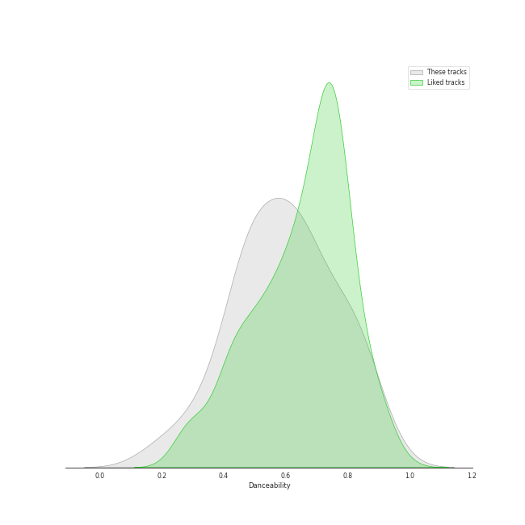

# Audio Features for Legacy

## Danceability

| 10 most Danceable tracks | 10 least Danceable tracks |
|:---|:---|
| Smooth Criminal - 2012 Remaster (0.853) | Lights (0.193) |
| Here Comes Santa Claus (Right Down Santa Claus Lane) - 1947 Version (0.834) | Can't Help Falling in Love (0.396) |
| Break Ya Neck (0.82) | Take Five (0.454) |
| Eye of the Tiger (0.817) | Dust in the Wind (0.475) |
| Man in the Mirror - 2012 Remaster (0.808) | Carry on Wayward Son (0.482) |
| I Feel the Earth Move (0.711) | So Far Away (0.49) |
| Let It Snow! Let It Snow! Let It Snow! (with The B. Swanson Quartet) (0.652) | Brown Eyed Girl (0.491) |
| Unsquare Dance (0.65) | Any Way You Want It (0.529) |
| Folsom Prison Blues - Live at Folsom State Prison, Folsom, CA - January 1968 (0.621) | Blue Rondo à la Turk (0.588) |
| Baby, It's Cold Outside (with Dorothy Kirsten) (0.594) | Baby, It's Cold Outside (with Dorothy Kirsten) (0.594) |

## Energy

| 10 most Energetic tracks | 10 least Energetic tracks |
|:---|:---|
| Smooth Criminal - 2012 Remaster (0.981) | So Far Away (0.172) |
| Any Way You Want It (0.932) | Baby, It's Cold Outside (with Dorothy Kirsten) (0.239) |
| Man in the Mirror - 2012 Remaster (0.812) | Let It Snow! Let It Snow! Let It Snow! (with The B. Swanson Quartet) (0.259) |
| Break Ya Neck (0.809) | Take Five (0.26) |
| Carry on Wayward Son (0.786) | Can't Help Falling in Love (0.293) |
| Eye of the Tiger (0.599) | Dust in the Wind (0.322) |
| Brown Eyed Girl (0.583) | Here Comes Santa Claus (Right Down Santa Claus Lane) - 1947 Version (0.371) |
| I Feel the Earth Move (0.576) | Blue Rondo à la Turk (0.4) |
| Folsom Prison Blues - Live at Folsom State Prison, Folsom, CA - January 1968 (0.524) | Unsquare Dance (0.496) |
| Lights (0.498) | Lights (0.498) |

## Speechiness

| 10 most Speechy tracks | 10 least Speechy tracks |
|:---|:---|
| Break Ya Neck (0.251) | Can't Help Falling in Love (0.0275) |
| Baby, It's Cold Outside (with Dorothy Kirsten) (0.131) | Dust in the Wind (0.0283) |
| Unsquare Dance (0.115) | I Feel the Earth Move (0.0305) |
| Folsom Prison Blues - Live at Folsom State Prison, Folsom, CA - January 1968 (0.0803) | Carry on Wayward Son (0.032) |
| Smooth Criminal - 2012 Remaster (0.0751) | Eye of the Tiger (0.0328) |
| Let It Snow! Let It Snow! Let It Snow! (with The B. Swanson Quartet) (0.0595) | Here Comes Santa Claus (Right Down Santa Claus Lane) - 1947 Version (0.0358) |
| Any Way You Want It (0.0488) | Blue Rondo à la Turk (0.036) |
| Take Five (0.0401) | So Far Away (0.0372) |
| Lights (0.0381) | Brown Eyed Girl (0.0376) |
| Man in the Mirror - 2012 Remaster (0.0381) | Man in the Mirror - 2012 Remaster (0.0381) |

## Acousticness

| 10 most Acoustic tracks | 10 least Acoustic tracks |
|:---|:---|
| Baby, It's Cold Outside (with Dorothy Kirsten) (0.963) | Any Way You Want It (0.00251) |
| Can't Help Falling in Love (0.941) | Carry on Wayward Son (0.00321) |
| Let It Snow! Let It Snow! Let It Snow! (with The B. Swanson Quartet) (0.903) | Folsom Prison Blues - Live at Folsom State Prison, Folsom, CA - January 1968 (0.0652) |
| So Far Away (0.897) | Unsquare Dance (0.0723) |
| Blue Rondo à la Turk (0.851) | Lights (0.107) |
| Here Comes Santa Claus (Right Down Santa Claus Lane) - 1947 Version (0.799) | Eye of the Tiger (0.132) |
| I Feel the Earth Move (0.648) | Brown Eyed Girl (0.185) |
| Take Five (0.539) | Smooth Criminal - 2012 Remaster (0.247) |
| Man in the Mirror - 2012 Remaster (0.52) | Dust in the Wind (0.367) |
| Break Ya Neck (0.443) | Break Ya Neck (0.443) |

## Instrumentalness

| 10 most Instrumental tracks | 10 least Instrumental tracks |
|:---|:---|
| Unsquare Dance (0.88) | Here Comes Santa Claus (Right Down Santa Claus Lane) - 1947 Version (0.0) |
| Smooth Criminal - 2012 Remaster (0.468) | Brown Eyed Girl (0.0) |
| Blue Rondo à la Turk (0.352) | Let It Snow! Let It Snow! Let It Snow! (with The B. Swanson Quartet) (0.0) |
| Lights (0.00711) | So Far Away (3.32e-05) |
| I Feel the Earth Move (0.00226) | Man in the Mirror - 2012 Remaster (7.91e-05) |
| Folsom Prison Blues - Live at Folsom State Prison, Folsom, CA - January 1968 (0.00199) | Carry on Wayward Son (8.88e-05) |
| Break Ya Neck (0.00175) | Can't Help Falling in Love (0.000196) |
| Any Way You Want It (0.00109) | Baby, It's Cold Outside (with Dorothy Kirsten) (0.000253) |
| Take Five (0.00078) | Eye of the Tiger (0.000311) |
| Dust in the Wind (0.00056) | Dust in the Wind (0.00056) |

## Liveness

| 10 most Live tracks | 10 least Live tracks |
|:---|:---|
| Folsom Prison Blues - Live at Folsom State Prison, Folsom, CA - January 1968 (0.893) | I Feel the Earth Move (0.0528) |
| Baby, It's Cold Outside (with Dorothy Kirsten) (0.706) | Break Ya Neck (0.0613) |
| Carry on Wayward Son (0.446) | Take Five (0.0675) |
| Brown Eyed Girl (0.406) | So Far Away (0.0753) |
| Let It Snow! Let It Snow! Let It Snow! (with The B. Swanson Quartet) (0.362) | Eye of the Tiger (0.0873) |
| Lights (0.332) | Can't Help Falling in Love (0.105) |
| Smooth Criminal - 2012 Remaster (0.306) | Dust in the Wind (0.11) |
| Here Comes Santa Claus (Right Down Santa Claus Lane) - 1947 Version (0.275) | Blue Rondo à la Turk (0.11) |
| Any Way You Want It (0.136) | Unsquare Dance (0.119) |
| Man in the Mirror - 2012 Remaster (0.134) | Man in the Mirror - 2012 Remaster (0.134) |

## Valence

| 10 most Happy tracks | 10 least Happy tracks |
|:---|:---|
| Here Comes Santa Claus (Right Down Santa Claus Lane) - 1947 Version (0.976) | Man in the Mirror - 2012 Remaster (0.269) |
| Brown Eyed Girl (0.908) | Can't Help Falling in Love (0.343) |
| Folsom Prison Blues - Live at Folsom State Prison, Folsom, CA - January 1968 (0.889) | Lights (0.344) |
| Let It Snow! Let It Snow! Let It Snow! (with The B. Swanson Quartet) (0.836) | So Far Away (0.361) |
| Carry on Wayward Son (0.793) | Dust in the Wind (0.387) |
| Break Ya Neck (0.737) | Blue Rondo à la Turk (0.468) |
| Baby, It's Cold Outside (with Dorothy Kirsten) (0.703) | Eye of the Tiger (0.548) |
| I Feel the Earth Move (0.644) | Any Way You Want It (0.571) |
| Unsquare Dance (0.615) | Smooth Criminal - 2012 Remaster (0.595) |
| Take Five (0.598) | Take Five (0.598) |

## Tempo

| 10 most Fast tracks | 10 least Fast tracks |
|:---|:---|
| Lights (205.422) | Break Ya Neck (83.011) |
| Take Five (174.322) | Dust in the Wind (93.503) |
| Brown Eyed Girl (150.566) | Here Comes Santa Claus (Right Down Santa Claus Lane) - 1947 Version (96.628) |
| So Far Away (143.837) | Can't Help Falling in Love (100.307) |
| Let It Snow! Let It Snow! Let It Snow! (with The B. Swanson Quartet) (142.169) | Man in the Mirror - 2012 Remaster (100.331) |
| Any Way You Want It (138.158) | Eye of the Tiger (108.873) |
| Baby, It's Cold Outside (with Dorothy Kirsten) (127.892) | Folsom Prison Blues - Live at Folsom State Prison, Folsom, CA - January 1968 (110.586) |
| Carry on Wayward Son (126.755) | Blue Rondo à la Turk (113.615) |
| I Feel the Earth Move (120.117) | Unsquare Dance (116.868) |
| Smooth Criminal - 2012 Remaster (118.193) | Smooth Criminal - 2012 Remaster (118.193) |
