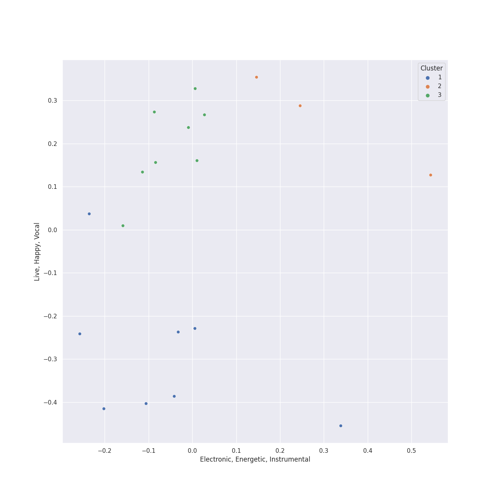

# Clusters in Legacy

## Cluster #1

6 tracks

| Art | Track | Album | Artists | Label | Rank | 💚 | 🔗 |
|:---|:---|:---|:---|:---|---:|:---|:---|
|  | Brown Eyed Girl | Blowin' Your Mind! | Van Morrison | [Columbia](../../../columbia), [Legacy](../..) | nan | 💚 | [🔗](https://open.spotify.com/track/3yrSvpt2l1xhsV9Em88Pul) |
|  | Unsquare Dance | Time Further Out | The Dave Brubeck Quartet | [Columbia](../../../columbia), [Legacy](../..) | nan | | [🔗](https://open.spotify.com/track/2VUo8O3ymKRYNgj97ZG2kM) |
|  | Folsom Prison Blues - Live at Folsom State Prison, Folsom, CA - January 1968 | At Folsom Prison | Johnny Cash | [Columbia](../../../columbia), [Legacy](../..) | nan | | [🔗](https://open.spotify.com/track/2fDHuS1PTkHBbCWWZF1ph9) |
|  | Carry on Wayward Son | Leftoverture (Expanded Edition) | Kansas | [Epic](../../../epic), [Legacy](../..) | nan | 💚 | [🔗](https://open.spotify.com/track/4DMKwE2E2iYDKY01C335Uw) |
|  | Lights | Infinity | Journey | [Columbia](../../../columbia), [Legacy](../..) | nan | 💚 | [🔗](https://open.spotify.com/track/7EHmKkyAr6MZv5Y2FdZbXw) |
|  | Straight, No Chaser | Straight, No Chaser | Thelonious Monk | [Columbia](../../../columbia), [Legacy](../..) | nan | | [🔗](https://open.spotify.com/track/6YYu8qFzcY1ZyzzsJIQM12) |
## Cluster #2

10 tracks

| Art | Track | Album | Artists | Label | Rank | 💚 | 🔗 |
|:---|:---|:---|:---|:---|---:|:---|:---|
|  | Mack the Knife | The Great American Songbook | Louis Armstrong | [Columbia](../../../columbia), [Legacy](../..) | 381 | | [🔗](https://open.spotify.com/track/0RNxWy0PC3AyH4ThH3aGK6) |
|  | Baby, It's Cold Outside (with Dorothy Kirsten) | The Classic Christmas Album | [Frank Sinatra](../../../../artists/frank_sinatra/overview.md), Dorothy Kirsten | [Columbia](../../../columbia), [Legacy](../..) | nan | | [🔗](https://open.spotify.com/track/3wvG6oGSZ6c7oskNDsI1CY) |
|  | Let It Snow! Let It Snow! Let It Snow! (with The B. Swanson Quartet) | Christmas Songs by Sinatra | [Frank Sinatra](../../../../artists/frank_sinatra/overview.md), B. Swanson Quartet | [Columbia](../../../columbia), [Legacy](../..) | nan | | [🔗](https://open.spotify.com/track/4kKdvXD0ez7jp1296JmAts) |
|  | So Far Away | Tapestry | Carole King | Ode, [Epic](../../../epic), [Legacy](../..) | nan | | [🔗](https://open.spotify.com/track/4HHge4zAyIw3pkrtFzmwCl) |
|  | Take Five | Time Out | The Dave Brubeck Quartet | [Columbia](../../../columbia), [Legacy](../..) | nan | | [🔗](https://open.spotify.com/track/1YQWosTIljIvxAgHWTp7KP) |
|  | Blue Rondo à la Turk | Time Out | The Dave Brubeck Quartet | [Columbia](../../../columbia), [Legacy](../..) | nan | | [🔗](https://open.spotify.com/track/7CrNF9zL7tIQ2269DVxzST) |
|  | Here Comes Santa Claus (Right Down Santa Claus Lane) - 1947 Version | Rudolph The Red Nosed Reindeer And Other Christmas Classics | Gene Autry | [Columbia](../../../columbia), [Legacy](../..) | 518 | | [🔗](https://open.spotify.com/track/25leEEaz1gIpp7o21Fqyjo) |
|  | Can't Help Falling in Love | Blue Hawaii | Elvis Presley | [Legacy](../..), [RCA Records Label](../../../rca_records_label) | nan | | [🔗](https://open.spotify.com/track/44AyOl4qVkzS48vBsbNXaC) |
|  | Dust in the Wind | Point Of Know Return (Expanded Edition) | Kansas | [Epic](../../../epic), [Legacy](../..) | nan | 💚 | [🔗](https://open.spotify.com/track/6zeE5tKyr8Nu882DQhhSQI) |
|  | I'm Confessin' (That I Love You) | Solo Monk (Expanded Edition) | Thelonious Monk | [Columbia](../../../columbia), [Legacy](../..) | nan | | [🔗](https://open.spotify.com/track/6kLp24Op7cOu8iQkU46sBv) |
## Cluster #3

10 tracks

| Art | Track | Album | Artists | Label | Rank | 💚 | 🔗 |
|:---|:---|:---|:---|:---|---:|:---|:---|
|  | I Feel the Earth Move | Tapestry | Carole King | Ode, [Epic](../../../epic), [Legacy](../..) | nan | | [🔗](https://open.spotify.com/track/1BWsOxeMx83OrKGCV4gxly) |
|  | Man in the Mirror - 2012 Remaster | Bad (Remastered) | [Michael Jackson](../../../../artists/michael_jackson/overview.md) | [Epic](../../../epic), [Legacy](../..) | nan | | [🔗](https://open.spotify.com/track/3c7Ctlw9MKlIQPxRH3fOTt) |
|  | Smooth Criminal - 2012 Remaster | Bad (Remastered) | [Michael Jackson](../../../../artists/michael_jackson/overview.md) | [Epic](../../../epic), [Legacy](../..) | nan | 💚 | [🔗](https://open.spotify.com/track/5T7ywazdGIydr6JCW6t02j) |
|  | Eye of the Tiger | Rocky IV | Survivor | [Volcano/Legacy](../..) | nan | | [🔗](https://open.spotify.com/track/2KH16WveTQWT6KOG9Rg6e2) |
|  | Watermelon Man | Head Hunters | Herbie Hancock | [Columbia](../../../columbia), [Legacy](../..) | nan | | [🔗](https://open.spotify.com/track/2zQl59dZMzwhrmeSBEgiXY) |
|  | Let's Hear It for the Boy - From "Footloose" Original Soundtrack | Let's Hear It for the Boy (Expanded Edition) | Deniece Williams | [Columbia](../../../columbia), [Legacy](../..) | nan | | [🔗](https://open.spotify.com/track/4VyU9Tg4drTj2mOUZHSK2u) |
|  | Don't Stop Believin' (2022 Remaster) | Escape (2022 Remaster) | Journey | [Columbia](../../../columbia), [Legacy](../..) | nan | | [🔗](https://open.spotify.com/track/5RKQ5NdjSh2QzD4MaunT91) |
|  | Any Way You Want It | Departure | Journey | [Columbia](../../../columbia), [Legacy](../..) | nan | | [🔗](https://open.spotify.com/track/71SvEDmsOwIWw1IozsZoMA) |
|  | Thank You (Falettinme Be Mice Elf Agin) - Single Version | Greatest Hits | Sly & The Family Stone | [Epic](../../../epic), [Legacy](../..) | nan | 💚 | [🔗](https://open.spotify.com/track/74iQ3gahRTOGc19bYadBE3) |
|  | Break Ya Neck | Genesis | Busta Rhymes | [J Records/Legacy](../..) | nan | | [🔗](https://open.spotify.com/track/7gKgd0P3dAAePiSQQBqrlf) |