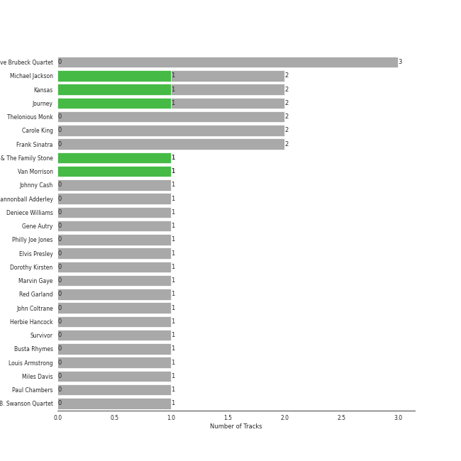
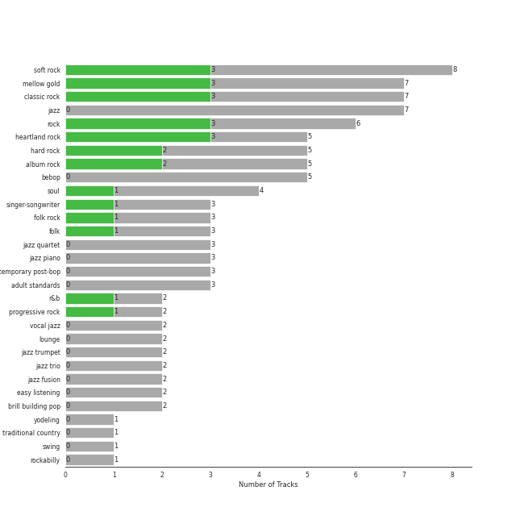

# Legacy

19 songs

[See Audio Features](audio_features.md)

Appears as:
- Columbia/Legacy (9 tracks)
- Epic/Legacy (4 tracks)
- Ode/Epic/Legacy (2 tracks)
- J Records/Legacy (1 tracks)
- Legacy/Columbia (1 tracks)
- RCA/Legacy (1 tracks)
- Volcano/Legacy (1 tracks)

## Top Artists

| Art | Tracks | 💚 | Artist | 🔗 |
|:---|---:|---:|:---|:---|
|  | 2 | 1 | Michael Jackson | [🔗](https://open.spotify.com/artist/3fMbdgg4jU18AjLCKBhRSm) |
|  | 2 | 1 | Kansas | [🔗](https://open.spotify.com/artist/2hl0xAkS2AIRAu23TVMBG1) |
|  | 2 | 1 | Journey | [🔗](https://open.spotify.com/artist/0rvjqX7ttXeg3mTy8Xscbt) |
|  | 1 | 1 | Van Morrison | [🔗](https://open.spotify.com/artist/44NX2ffIYHr6D4n7RaZF7A) |
|  | 3 | 0 | The Dave Brubeck Quartet | [🔗](https://open.spotify.com/artist/4iRZAbYvBqnxrbs6K25aJ7) |
|  | 2 | 0 | Carole King | [🔗](https://open.spotify.com/artist/319yZVtYM9MBGqmSQnMyY6) |
|  | 2 | 0 | [Frank Sinatra](../../artists/frank_sinatra/overview.md) | [🔗](https://open.spotify.com/artist/1Mxqyy3pSjf8kZZL4QVxS0) |
|  | 1 | 0 | Johnny Cash | [🔗](https://open.spotify.com/artist/6kACVPfCOnqzgfEF5ryl0x) |
|  | 1 | 0 | Gene Autry | [🔗](https://open.spotify.com/artist/5ixB75BQR3ADoWQkcHQJTs) |
|  | 1 | 0 | Elvis Presley | [🔗](https://open.spotify.com/artist/43ZHCT0cAZBISjO8DG9PnE) |

See all 14 artists

| Art | Tracks | 💚 | Artist | 🔗 |
|:---|---:|---:|:---|:---|
|  | 1 | 0 | Dorothy Kirsten | [🔗](https://open.spotify.com/artist/3mMDsLh0ODpEuwpvn9sitk) |
|  | 1 | 0 | Survivor | [🔗](https://open.spotify.com/artist/26bcq2nyj5GB7uRr558iQg) |
|  | 1 | 0 | Busta Rhymes | [🔗](https://open.spotify.com/artist/1YfEcTuGvBQ8xSD1f53UnK) |
|  | 1 | 0 | B. Swanson Quartet | [🔗](https://open.spotify.com/artist/0JXiS2FrAg3wQYJHcmZdrc) |

## Top Albums

| Art | Tracks | 💚 | Album | Release Date | 🔗 |
|:---|---:|---:|:---|:---|:---|
|  | 2 | 1 | Bad (Remastered) | 1987-08-31 | [🔗](https://open.spotify.com/album/3Us57CjssWnHjTUIXBuIeH) |
|  | 2 | 0 | Time Out | 1959-12-14 | [🔗](https://open.spotify.com/album/0nTTEAhCZsbbeplyDMIFuA) |
|  | 2 | 0 | Tapestry | 1971 | [🔗](https://open.spotify.com/album/12n11cgnpjXKLeqrnIERoS) |
|  | 1 | 1 | Point Of Know Return (Expanded Edition) | 1977 | [🔗](https://open.spotify.com/album/6oU298pdPTCQnMx1PYwyUA) |
|  | 1 | 1 | Infinity | 1978 | [🔗](https://open.spotify.com/album/7K4Nk5fHkCuzNm5A6mdo2U) |
|  | 1 | 1 | Blowin' Your Mind! | 1967-09 | [🔗](https://open.spotify.com/album/7dsWupQRlFuhG8FGiQAUjC) |
|  | 1 | 0 | Time Further Out | 1961 | [🔗](https://open.spotify.com/album/0eMXd1VtCXCkuGWn9JjRDT) |
|  | 1 | 0 | The Classic Christmas Album | 1945 | [🔗](https://open.spotify.com/album/2B9FcHKqz3PWJlh0yGnmM7) |
|  | 1 | 0 | Rudolph The Red Nosed Reindeer And Other Christmas Classics | 1947 | [🔗](https://open.spotify.com/album/3BPDSjoJlho8oiUPUNrShM) |
|  | 1 | 0 | Rocky IV | 1985 | [🔗](https://open.spotify.com/album/3t3BbpFJiGcXl4jI5CRLLA) |

See all 16 albums

| Art | Tracks | 💚 | Album | Release Date | 🔗 |
|:---|---:|---:|:---|:---|:---|
|  | 1 | 0 | Leftoverture (Expanded Edition) | 1976 | [🔗](https://open.spotify.com/album/7MejfRSNnrpcLZIxkeZDqR) |
|  | 1 | 0 | Genesis | 2001-11-07 | [🔗](https://open.spotify.com/album/6cj1gdwhr2MVJr9YnWghUd) |
|  | 1 | 0 | Departure | 1980 | [🔗](https://open.spotify.com/album/2OyVtIEp7O7a6o82DF4Ba5) |
|  | 1 | 0 | Christmas Songs by Sinatra | 1994-11-08 | [🔗](https://open.spotify.com/album/4XbPmVHP7EYBMoE7ZVjKCU) |
|  | 1 | 0 | Blue Hawaii | 1961-10-20 | [🔗](https://open.spotify.com/album/7xe8VI48TxUpU1IIo0RfGi) |
|  | 1 | 0 | At Folsom Prison | 1968-05-01 | [🔗](https://open.spotify.com/album/4TJIdlY9hGSSTO1kUs1neh) |

## Genres

| Tracks | 💚 | Genre |
|---:|---:|:---|
| 8 | 3 | [soft rock](../../genres/soft_rock/overview.md) |
| 7 | 3 | [mellow gold](../../genres/mellow_gold/overview.md) |
| 6 | 3 | [rock](../../genres/rock/overview.md) |
| 5 | 3 | [heartland rock](../../genres/heartland_rock/overview.md) |
| 5 | 3 | [classic rock](../../genres/classic_rock/overview.md) |
| 5 | 2 | hard rock |
| 5 | 2 | [album rock](../../genres/album_rock/overview.md) |
| 3 | 1 | [singer-songwriter](../../genres/singer_songwriter/overview.md) |
| 3 | 1 | folk rock |
| 3 | 1 | folk |

See all 34 genres

| Tracks | 💚 | Genre |
|---:|---:|:---|
| 2 | 1 | soul |
| 2 | 1 | [r&b](../../genres/r_b/overview.md) |
| 2 | 1 | progressive rock |
| 3 | 0 | jazz quartet |
| 3 | 0 | jazz |
| 3 | 0 | bebop |
| 2 | 0 | lounge |
| 2 | 0 | easy listening |
| 2 | 0 | brill building pop |
| 2 | 0 | [adult standards](../../genres/adult_standards/overview.md) |
| 1 | 0 | yodeling |
| 1 | 0 | traditional country |
| 1 | 0 | rockabilly |
| 1 | 0 | rock-and-roll |
| 1 | 0 | [rap](../../genres/rap/overview.md) |
| 1 | 0 | pop rap |
| 1 | 0 | outlaw country |
| 1 | 0 | hip hop |
| 1 | 0 | hardcore hip hop |
| 1 | 0 | glam metal |
| 1 | 0 | east coast hip hop |
| 1 | 0 | cowboy western |
| 1 | 0 | classic oklahoma country |
| 1 | 0 | arkansas country |

## Tracks released under Legacy

| Art | Track | Album | Artists | Label | 💚 | 🔗 |
|:---|:---|:---|:---|:---|:---|:---|
|  | Break Ya Neck | Genesis | Busta Rhymes | [J Records/Legacy](.) | | [🔗](https://open.spotify.com/track/7gKgd0P3dAAePiSQQBqrlf) |
|  | I Feel the Earth Move | Tapestry | Carole King | Ode, [Epic](../epic), [Legacy](.) | | [🔗](https://open.spotify.com/track/1BWsOxeMx83OrKGCV4gxly) |
|  | So Far Away | Tapestry | Carole King | Ode, [Epic](../epic), [Legacy](.) | | [🔗](https://open.spotify.com/track/4HHge4zAyIw3pkrtFzmwCl) |
|  | Can't Help Falling in Love | Blue Hawaii | Elvis Presley | [Legacy](.), [RCA Records Label](../rca_records_label) | | [🔗](https://open.spotify.com/track/44AyOl4qVkzS48vBsbNXaC) |
|  | Baby, It's Cold Outside (with Dorothy Kirsten) | The Classic Christmas Album | [Frank Sinatra](../../artists/frank_sinatra/overview.md), Dorothy Kirsten | [Columbia](../columbia), [Legacy](.) | | [🔗](https://open.spotify.com/track/3wvG6oGSZ6c7oskNDsI1CY) |
|  | Let It Snow! Let It Snow! Let It Snow! (with The B. Swanson Quartet) | Christmas Songs by Sinatra | B. Swanson Quartet, [Frank Sinatra](../../artists/frank_sinatra/overview.md) | [Columbia](../columbia), [Legacy](.) | | [🔗](https://open.spotify.com/track/4kKdvXD0ez7jp1296JmAts) |
|  | Here Comes Santa Claus (Right Down Santa Claus Lane) - 1947 Version | Rudolph The Red Nosed Reindeer And Other Christmas Classics | Gene Autry | [Columbia](../columbia), [Legacy](.) | | [🔗](https://open.spotify.com/track/25leEEaz1gIpp7o21Fqyjo) |
|  | Folsom Prison Blues - Live at Folsom State Prison, Folsom, CA - January 1968 | At Folsom Prison | Johnny Cash | [Columbia](../columbia), [Legacy](.) | | [🔗](https://open.spotify.com/track/2fDHuS1PTkHBbCWWZF1ph9) |
|  | Lights | Infinity | Journey | [Columbia](../columbia), [Legacy](.) | 💚 | [🔗](https://open.spotify.com/track/7EHmKkyAr6MZv5Y2FdZbXw) |
|  | Any Way You Want It | Departure | Journey | [Columbia](../columbia), [Legacy](.) | | [🔗](https://open.spotify.com/track/71SvEDmsOwIWw1IozsZoMA) |

See all tracks

| Art | Track | Album | Artists | Label | 💚 | 🔗 |
|:---|:---|:---|:---|:---|:---|:---|
|  | Carry on Wayward Son | Leftoverture (Expanded Edition) | Kansas | [Epic](../epic), [Legacy](.) | | [🔗](https://open.spotify.com/track/4DMKwE2E2iYDKY01C335Uw) |
|  | Dust in the Wind | Point Of Know Return (Expanded Edition) | Kansas | [Epic](../epic), [Legacy](.) | 💚 | [🔗](https://open.spotify.com/track/6zeE5tKyr8Nu882DQhhSQI) |
|  | Man in the Mirror - 2012 Remaster | Bad (Remastered) | Michael Jackson | [Epic](../epic), [Legacy](.) | | [🔗](https://open.spotify.com/track/3c7Ctlw9MKlIQPxRH3fOTt) |
|  | Smooth Criminal - 2012 Remaster | Bad (Remastered) | Michael Jackson | [Epic](../epic), [Legacy](.) | 💚 | [🔗](https://open.spotify.com/track/5T7ywazdGIydr6JCW6t02j) |
|  | Eye of the Tiger | Rocky IV | Survivor | [Volcano/Legacy](.) | | [🔗](https://open.spotify.com/track/2KH16WveTQWT6KOG9Rg6e2) |
|  | Blue Rondo à la Turk | Time Out | The Dave Brubeck Quartet | [Columbia](../columbia), [Legacy](.) | | [🔗](https://open.spotify.com/track/7CrNF9zL7tIQ2269DVxzST) |
|  | Take Five | Time Out | The Dave Brubeck Quartet | [Columbia](../columbia), [Legacy](.) | | [🔗](https://open.spotify.com/track/1YQWosTIljIvxAgHWTp7KP) |
|  | Unsquare Dance | Time Further Out | The Dave Brubeck Quartet | [Columbia](../columbia), [Legacy](.) | | [🔗](https://open.spotify.com/track/2VUo8O3ymKRYNgj97ZG2kM) |
|  | Brown Eyed Girl | Blowin' Your Mind! | Van Morrison | [Columbia](../columbia), [Legacy](.) | 💚 | [🔗](https://open.spotify.com/track/3yrSvpt2l1xhsV9Em88Pul) |

