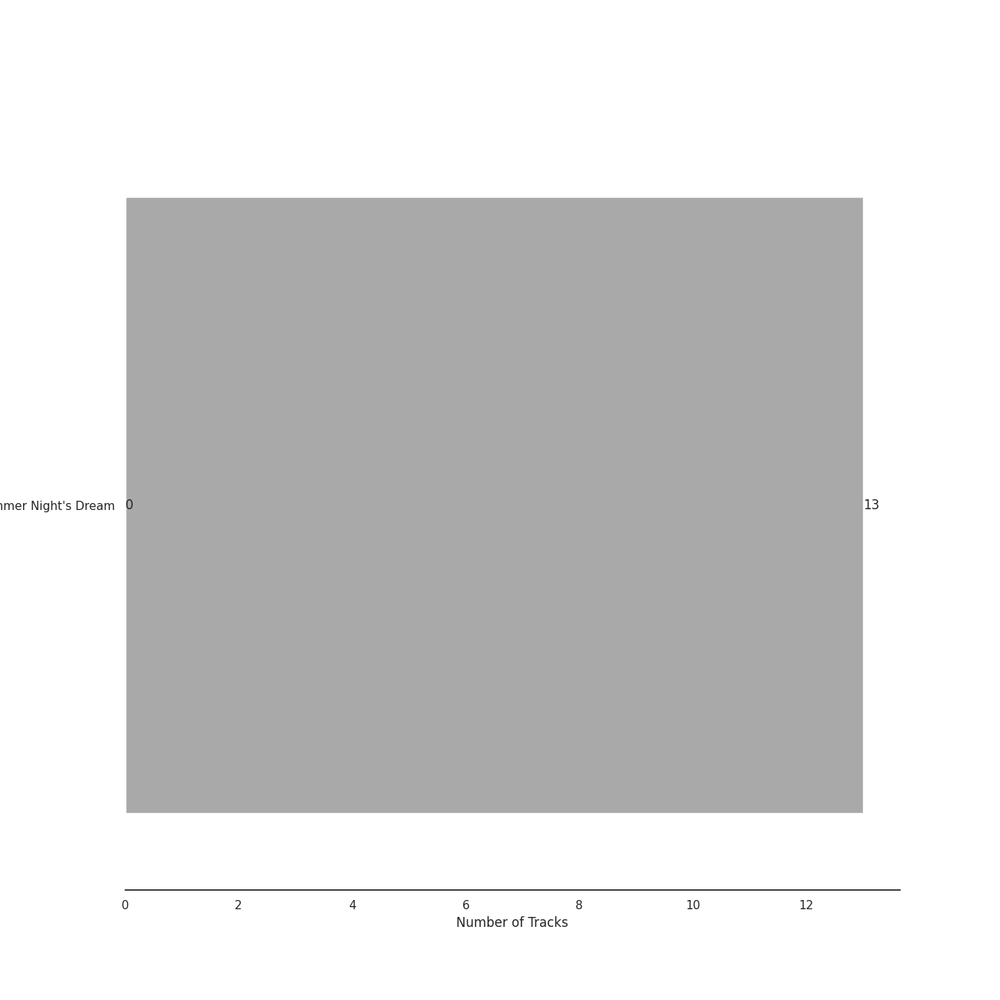

# Lso Live

13 songs

Appears as:
- Lso Live (13 tracks)

## Top Artists

See all 7 artists

|   Number of Tracks | Art                                                                                              | Artist                                                               | 🔗                                                           |
|-------------------:|:-------------------------------------------------------------------------------------------------|:---------------------------------------------------------------------|:------------------------------------------------------------|
|                 13 |  | [Felix Mendelssohn](../artists/felix_mendelssohn.md)                 | [🔗](https://open.spotify.com/artist/6MF58APd3YV72Ln2eVg710) |
|                 13 |  | [John Eliot Gardiner](../artists/john_eliot_gardiner.md)             | [🔗](https://open.spotify.com/artist/1qIRoGEKXINqrCx5N1engi) |
|                 12 |  | [London Symphony Orchestra](../artists/london_symphony_orchestra.md) | [🔗](https://open.spotify.com/artist/5yxyJsFanEAuwSM5kOuZKc) |
|                  8 |                                                               | Alexander Knox                                                       | [🔗](https://open.spotify.com/artist/4vzwv4zzBTlG8qsFCqP2Yv) |
|                  6 |                                                               | Ceri-lyn Cissone                                                     | [🔗](https://open.spotify.com/artist/6F3jOFmhUwRxRdWAZU6G1A) |
|                  4 |                                                               | Frankie Wakefield                                                    | [🔗](https://open.spotify.com/artist/7jobsaZIFhejECE605yxx6) |
|                  2 |  | The Monteverdi Choir                                                 | [🔗](https://open.spotify.com/artist/0Cqfz92flAzrp94pgN1jEW) |

## Top Albums

See all 1 albums

|   Number of Tracks | Art                                                                                              | Album                                  | 🔗                                                          |
|-------------------:|:-------------------------------------------------------------------------------------------------|:---------------------------------------|:-----------------------------------------------------------|
|                 13 |  | Mendelssohn: A Midsummer Night's Dream | [🔗](https://open.spotify.com/album/60J66evwnrnfH03HgDTrwN) |

## Genres

See all 3 genres

|   Number of Tracks | Genre                                                 |
|-------------------:|:------------------------------------------------------|
|                 13 | [german romanticism](../genres/german_romanticism.md) |
|                 13 | [early romantic era](../genres/early_romantic_era.md) |
|                 13 | [classical](../genres/classical.md)                   |

## Tracks released under Lso Live

| Art                                                                                              | Track                                                                                                                          | Album                                  | Artists                                                                                                                                                                                                                                                         | Label                   | 💚   | 🔗                                                          |
|:-------------------------------------------------------------------------------------------------|:-------------------------------------------------------------------------------------------------------------------------------|:---------------------------------------|:----------------------------------------------------------------------------------------------------------------------------------------------------------------------------------------------------------------------------------------------------------------|:------------------------|:----|:-----------------------------------------------------------|
|  | A Midsummer Night's Dream, Incidental Music, Op. 61: "Ay Me! For Aught That I Could Ever Read"                                 | Mendelssohn: A Midsummer Night's Dream | [Felix Mendelssohn](../artists/felix_mendelssohn.md), [John Eliot Gardiner](../artists/john_eliot_gardiner.md), Alexander Knox                                                                                                                                  | [Lso Live](lso_live.md) |     | [🔗](https://open.spotify.com/track/1EGPsb3zw2L5Q6ocFc3G83) |
|  | A Midsummer Night's Dream, Incidental Music, Op. 61: Finale. Allegro di molto                                                  | Mendelssohn: A Midsummer Night's Dream | [Felix Mendelssohn](../artists/felix_mendelssohn.md), [London Symphony Orchestra](../artists/london_symphony_orchestra.md), [John Eliot Gardiner](../artists/john_eliot_gardiner.md), The Monteverdi Choir, Frankie Wakefield, Alexander Knox, Ceri-lyn Cissone | [Lso Live](lso_live.md) |     | [🔗](https://open.spotify.com/track/5iGRKlJcFcSx0PA4OGpiYD) |
|  | A Midsummer Night's Dream, Incidental Music, Op. 61: No. 1, Scherzo                                                            | Mendelssohn: A Midsummer Night's Dream | [Felix Mendelssohn](../artists/felix_mendelssohn.md), [London Symphony Orchestra](../artists/london_symphony_orchestra.md), Alexander Knox, [John Eliot Gardiner](../artists/john_eliot_gardiner.md)                                                            | [Lso Live](lso_live.md) |     | [🔗](https://open.spotify.com/track/359jW2zuaHCdC0gCJRcX5o) |
|  | A Midsummer Night's Dream, Incidental Music, Op. 61: No. 2, L'istesso tempo                                                    | Mendelssohn: A Midsummer Night's Dream | [Felix Mendelssohn](../artists/felix_mendelssohn.md), [London Symphony Orchestra](../artists/london_symphony_orchestra.md), [John Eliot Gardiner](../artists/john_eliot_gardiner.md), Alexander Knox, Ceri-lyn Cissone                                          | [Lso Live](lso_live.md) |     | [🔗](https://open.spotify.com/track/68afyO04jLHCK9Na8cgsGR) |
|  | A Midsummer Night's Dream, Incidental Music, Op. 61: No. 2a, Allegro vivace                                                    | Mendelssohn: A Midsummer Night's Dream | [Felix Mendelssohn](../artists/felix_mendelssohn.md), [London Symphony Orchestra](../artists/london_symphony_orchestra.md), Frankie Wakefield, Alexander Knox, [John Eliot Gardiner](../artists/john_eliot_gardiner.md)                                         | [Lso Live](lso_live.md) |     | [🔗](https://open.spotify.com/track/58VxRBZ7XFR3vWgNwz5fYT) |
|  | A Midsummer Night's Dream, Incidental Music, Op. 61: No. 3, Lied mit Chor                                                      | Mendelssohn: A Midsummer Night's Dream | [Felix Mendelssohn](../artists/felix_mendelssohn.md), [London Symphony Orchestra](../artists/london_symphony_orchestra.md), Ceri-lyn Cissone, [John Eliot Gardiner](../artists/john_eliot_gardiner.md), The Monteverdi Choir                                    | [Lso Live](lso_live.md) |     | [🔗](https://open.spotify.com/track/1dDvLHCOPEVgNhHtVnB2is) |
|  | A Midsummer Night's Dream, Incidental Music, Op. 61: No. 4, Andante                                                            | Mendelssohn: A Midsummer Night's Dream | [Felix Mendelssohn](../artists/felix_mendelssohn.md), [London Symphony Orchestra](../artists/london_symphony_orchestra.md), Frankie Wakefield, [John Eliot Gardiner](../artists/john_eliot_gardiner.md), Ceri-lyn Cissone                                       | [Lso Live](lso_live.md) |     | [🔗](https://open.spotify.com/track/67eEYhol9DXQ65kUFt7jdk) |
|  | A Midsummer Night's Dream, Incidental Music, Op. 61: No. 5, Allegro appassionato                                               | Mendelssohn: A Midsummer Night's Dream | [Felix Mendelssohn](../artists/felix_mendelssohn.md), [London Symphony Orchestra](../artists/london_symphony_orchestra.md), Ceri-lyn Cissone, [John Eliot Gardiner](../artists/john_eliot_gardiner.md), Alexander Knox                                          | [Lso Live](lso_live.md) |     | [🔗](https://open.spotify.com/track/5XWKRz9i2PQWI3PsW0FmQj) |
|  | A Midsummer Night's Dream, Incidental Music, Op. 61: No. 7, Nocturne. Con moto tranquillo                                      | Mendelssohn: A Midsummer Night's Dream | [Felix Mendelssohn](../artists/felix_mendelssohn.md), [John Eliot Gardiner](../artists/john_eliot_gardiner.md), [London Symphony Orchestra](../artists/london_symphony_orchestra.md)                                                                            | [Lso Live](lso_live.md) |     | [🔗](https://open.spotify.com/track/5lmp8r1rxxI6FuluNPBm82) |
|  | A Midsummer Night's Dream, Incidental Music, Op. 61: No. 8, Andante                                                            | Mendelssohn: A Midsummer Night's Dream | [Felix Mendelssohn](../artists/felix_mendelssohn.md), [London Symphony Orchestra](../artists/london_symphony_orchestra.md), [John Eliot Gardiner](../artists/john_eliot_gardiner.md), Frankie Wakefield, Alexander Knox, Ceri-lyn Cissone                       | [Lso Live](lso_live.md) |     | [🔗](https://open.spotify.com/track/2QYtN5MiVrF7OJFpkJvLrS) |
|  | A Midsummer Night's Dream, Incidental Music, Op. 61: No. 9, Hochzeitmarsch "Wedding March" - No. 12, Allegro vivace come primo | Mendelssohn: A Midsummer Night's Dream | [Felix Mendelssohn](../artists/felix_mendelssohn.md), [London Symphony Orchestra](../artists/london_symphony_orchestra.md), [John Eliot Gardiner](../artists/john_eliot_gardiner.md), Alexander Knox                                                            | [Lso Live](lso_live.md) |     | [🔗](https://open.spotify.com/track/1ipR2jLKKgr7X9xJyd54Kx) |
|  | Overture to "A Midsummer Night's Dream", Op. 21: Allegro di molto                                                              | Mendelssohn: A Midsummer Night's Dream | [Felix Mendelssohn](../artists/felix_mendelssohn.md), [London Symphony Orchestra](../artists/london_symphony_orchestra.md), [John Eliot Gardiner](../artists/john_eliot_gardiner.md)                                                                            | [Lso Live](lso_live.md) |     | [🔗](https://open.spotify.com/track/7pz2npttELZeXmDgYfCDlE) |
|  | Overture to "A Midsummer Night's Dream", Op. 21: Tempo primo                                                                   | Mendelssohn: A Midsummer Night's Dream | [Felix Mendelssohn](../artists/felix_mendelssohn.md), [John Eliot Gardiner](../artists/john_eliot_gardiner.md), [London Symphony Orchestra](../artists/london_symphony_orchestra.md)                                                                            | [Lso Live](lso_live.md) |     | [🔗](https://open.spotify.com/track/2idvFSH2im8mdSaMiE81vn) |
