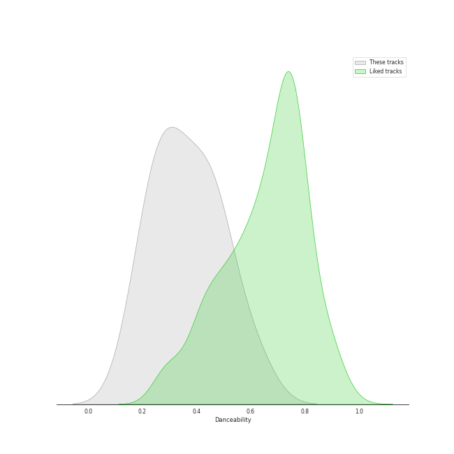
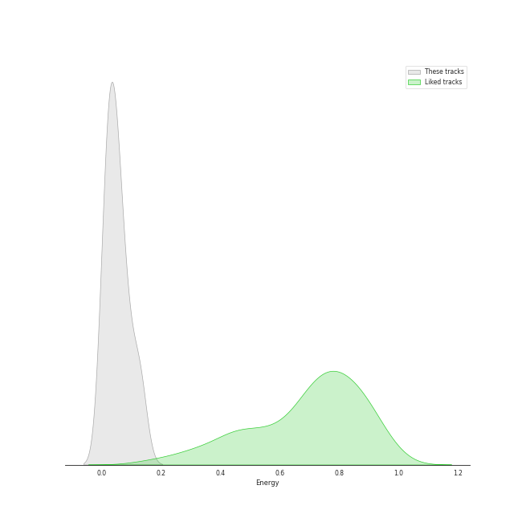
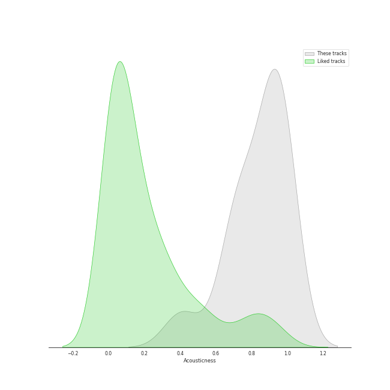
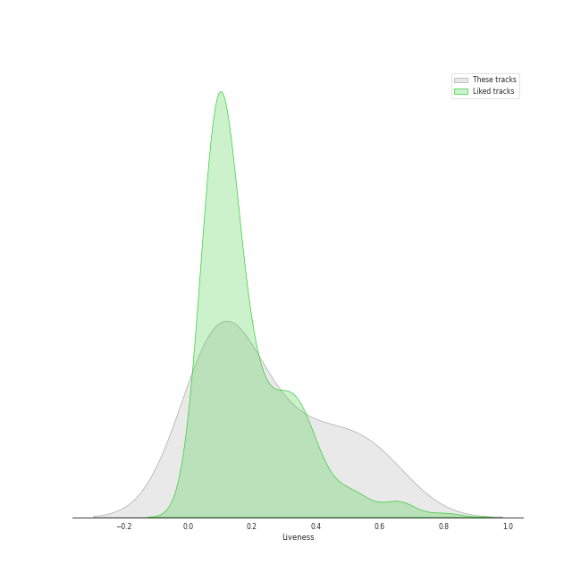
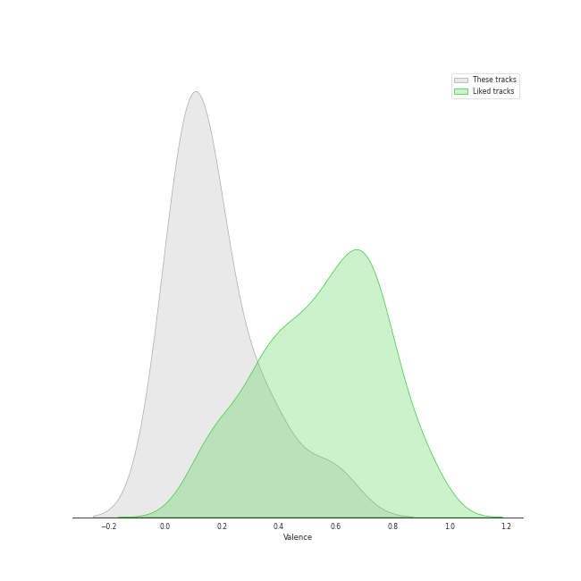

# Audio Features for Lso Live

## Danceability

| 10 most Danceable tracks | 10 least Danceable tracks |
|:---|:---|
| A Midsummer Night's Dream, Incidental Music, Op. 61: "Ay Me! For Aught That I Could Ever Read" (0.614) | A Midsummer Night's Dream, Incidental Music, Op. 61: No. 7, Nocturne. Con moto tranquillo (0.173) |
| A Midsummer Night's Dream, Incidental Music, Op. 61: No. 1, Scherzo (0.505) | A Midsummer Night's Dream, Incidental Music, Op. 61: Finale. Allegro di molto (0.227) |
| A Midsummer Night's Dream, Incidental Music, Op. 61: No. 2, L'istesso tempo (0.485) | Overture to "A Midsummer Night's Dream", Op. 21: Tempo primo (0.24) |
| A Midsummer Night's Dream, Incidental Music, Op. 61: No. 4, Andante (0.451) | Overture to "A Midsummer Night's Dream", Op. 21: Allegro di molto (0.278) |
| A Midsummer Night's Dream, Incidental Music, Op. 61: No. 2a, Allegro vivace (0.438) | A Midsummer Night's Dream, Incidental Music, Op. 61: No. 5, Allegro appassionato (0.282) |
| A Midsummer Night's Dream, Incidental Music, Op. 61: No. 8, Andante (0.387) | A Midsummer Night's Dream, Incidental Music, Op. 61: No. 3, Lied mit Chor (0.323) |
| A Midsummer Night's Dream, Incidental Music, Op. 61: No. 9, Hochzeitmarsch "Wedding March" - No. 12, Allegro vivace come primo (0.352) | A Midsummer Night's Dream, Incidental Music, Op. 61: No. 9, Hochzeitmarsch "Wedding March" - No. 12, Allegro vivace come primo (0.352) |
| A Midsummer Night's Dream, Incidental Music, Op. 61: No. 3, Lied mit Chor (0.323) | A Midsummer Night's Dream, Incidental Music, Op. 61: No. 8, Andante (0.387) |
| A Midsummer Night's Dream, Incidental Music, Op. 61: No. 5, Allegro appassionato (0.282) | A Midsummer Night's Dream, Incidental Music, Op. 61: No. 2a, Allegro vivace (0.438) |
| Overture to "A Midsummer Night's Dream", Op. 21: Allegro di molto (0.278) | A Midsummer Night's Dream, Incidental Music, Op. 61: No. 4, Andante (0.451) |

## Energy

| 10 most Energetic tracks | 10 least Energetic tracks |
|:---|:---|
| A Midsummer Night's Dream, Incidental Music, Op. 61: No. 1, Scherzo (0.133) | A Midsummer Night's Dream, Incidental Music, Op. 61: No. 4, Andante (0.0082) |
| A Midsummer Night's Dream, Incidental Music, Op. 61: No. 9, Hochzeitmarsch "Wedding March" - No. 12, Allegro vivace come primo (0.112) | A Midsummer Night's Dream, Incidental Music, Op. 61: No. 8, Andante (0.00913) |
| A Midsummer Night's Dream, Incidental Music, Op. 61: No. 2, L'istesso tempo (0.0791) | A Midsummer Night's Dream, Incidental Music, Op. 61: No. 7, Nocturne. Con moto tranquillo (0.0115) |
| Overture to "A Midsummer Night's Dream", Op. 21: Allegro di molto (0.0756) | A Midsummer Night's Dream, Incidental Music, Op. 61: Finale. Allegro di molto (0.0246) |
| A Midsummer Night's Dream, Incidental Music, Op. 61: No. 2a, Allegro vivace (0.0554) | A Midsummer Night's Dream, Incidental Music, Op. 61: No. 3, Lied mit Chor (0.0349) |
| A Midsummer Night's Dream, Incidental Music, Op. 61: "Ay Me! For Aught That I Could Ever Read" (0.0494) | A Midsummer Night's Dream, Incidental Music, Op. 61: No. 5, Allegro appassionato (0.0368) |
| Overture to "A Midsummer Night's Dream", Op. 21: Tempo primo (0.0373) | Overture to "A Midsummer Night's Dream", Op. 21: Tempo primo (0.0373) |
| A Midsummer Night's Dream, Incidental Music, Op. 61: No. 5, Allegro appassionato (0.0368) | A Midsummer Night's Dream, Incidental Music, Op. 61: "Ay Me! For Aught That I Could Ever Read" (0.0494) |
| A Midsummer Night's Dream, Incidental Music, Op. 61: No. 3, Lied mit Chor (0.0349) | A Midsummer Night's Dream, Incidental Music, Op. 61: No. 2a, Allegro vivace (0.0554) |
| A Midsummer Night's Dream, Incidental Music, Op. 61: Finale. Allegro di molto (0.0246) | Overture to "A Midsummer Night's Dream", Op. 21: Allegro di molto (0.0756) |

## Speechiness

| 10 most Speechy tracks | 10 least Speechy tracks |
|:---|:---|
| A Midsummer Night's Dream, Incidental Music, Op. 61: No. 2, L'istesso tempo (0.676) | A Midsummer Night's Dream, Incidental Music, Op. 61: No. 1, Scherzo (0.0314) |
| A Midsummer Night's Dream, Incidental Music, Op. 61: "Ay Me! For Aught That I Could Ever Read" (0.524) | Overture to "A Midsummer Night's Dream", Op. 21: Allegro di molto (0.0388) |
| A Midsummer Night's Dream, Incidental Music, Op. 61: No. 2a, Allegro vivace (0.0884) | A Midsummer Night's Dream, Incidental Music, Op. 61: No. 7, Nocturne. Con moto tranquillo (0.0415) |
| A Midsummer Night's Dream, Incidental Music, Op. 61: No. 4, Andante (0.0791) | A Midsummer Night's Dream, Incidental Music, Op. 61: No. 3, Lied mit Chor (0.0416) |
| A Midsummer Night's Dream, Incidental Music, Op. 61: No. 9, Hochzeitmarsch "Wedding March" - No. 12, Allegro vivace come primo (0.0636) | Overture to "A Midsummer Night's Dream", Op. 21: Tempo primo (0.0436) |
| A Midsummer Night's Dream, Incidental Music, Op. 61: No. 8, Andante (0.0574) | A Midsummer Night's Dream, Incidental Music, Op. 61: Finale. Allegro di molto (0.0473) |
| A Midsummer Night's Dream, Incidental Music, Op. 61: No. 5, Allegro appassionato (0.0502) | A Midsummer Night's Dream, Incidental Music, Op. 61: No. 5, Allegro appassionato (0.0502) |
| A Midsummer Night's Dream, Incidental Music, Op. 61: Finale. Allegro di molto (0.0473) | A Midsummer Night's Dream, Incidental Music, Op. 61: No. 8, Andante (0.0574) |
| Overture to "A Midsummer Night's Dream", Op. 21: Tempo primo (0.0436) | A Midsummer Night's Dream, Incidental Music, Op. 61: No. 9, Hochzeitmarsch "Wedding March" - No. 12, Allegro vivace come primo (0.0636) |
| A Midsummer Night's Dream, Incidental Music, Op. 61: No. 3, Lied mit Chor (0.0416) | A Midsummer Night's Dream, Incidental Music, Op. 61: No. 4, Andante (0.0791) |

## Acousticness

| 10 most Acoustic tracks | 10 least Acoustic tracks |
|:---|:---|
| A Midsummer Night's Dream, Incidental Music, Op. 61: No. 7, Nocturne. Con moto tranquillo (0.981) | A Midsummer Night's Dream, Incidental Music, Op. 61: "Ay Me! For Aught That I Could Ever Read" (0.41) |
| A Midsummer Night's Dream, Incidental Music, Op. 61: No. 3, Lied mit Chor (0.969) | A Midsummer Night's Dream, Incidental Music, Op. 61: No. 2, L'istesso tempo (0.69) |
| A Midsummer Night's Dream, Incidental Music, Op. 61: No. 9, Hochzeitmarsch "Wedding March" - No. 12, Allegro vivace come primo (0.964) | A Midsummer Night's Dream, Incidental Music, Op. 61: No. 8, Andante (0.715) |
| A Midsummer Night's Dream, Incidental Music, Op. 61: No. 1, Scherzo (0.955) | A Midsummer Night's Dream, Incidental Music, Op. 61: No. 2a, Allegro vivace (0.745) |
| A Midsummer Night's Dream, Incidental Music, Op. 61: No. 5, Allegro appassionato (0.951) | A Midsummer Night's Dream, Incidental Music, Op. 61: No. 4, Andante (0.75) |
| Overture to "A Midsummer Night's Dream", Op. 21: Tempo primo (0.942) | Overture to "A Midsummer Night's Dream", Op. 21: Allegro di molto (0.887) |
| A Midsummer Night's Dream, Incidental Music, Op. 61: Finale. Allegro di molto (0.891) | A Midsummer Night's Dream, Incidental Music, Op. 61: Finale. Allegro di molto (0.891) |
| Overture to "A Midsummer Night's Dream", Op. 21: Allegro di molto (0.887) | Overture to "A Midsummer Night's Dream", Op. 21: Tempo primo (0.942) |
| A Midsummer Night's Dream, Incidental Music, Op. 61: No. 4, Andante (0.75) | A Midsummer Night's Dream, Incidental Music, Op. 61: No. 5, Allegro appassionato (0.951) |
| A Midsummer Night's Dream, Incidental Music, Op. 61: No. 2a, Allegro vivace (0.745) | A Midsummer Night's Dream, Incidental Music, Op. 61: No. 1, Scherzo (0.955) |

## Instrumentalness

| 10 most Instrumental tracks | 10 least Instrumental tracks |
|:---|:---|
| A Midsummer Night's Dream, Incidental Music, Op. 61: No. 1, Scherzo (0.952) | A Midsummer Night's Dream, Incidental Music, Op. 61: "Ay Me! For Aught That I Could Ever Read" (0.0) |
| A Midsummer Night's Dream, Incidental Music, Op. 61: No. 7, Nocturne. Con moto tranquillo (0.869) | A Midsummer Night's Dream, Incidental Music, Op. 61: No. 8, Andante (0.0) |
| Overture to "A Midsummer Night's Dream", Op. 21: Allegro di molto (0.734) | A Midsummer Night's Dream, Incidental Music, Op. 61: No. 4, Andante (0.0) |
| Overture to "A Midsummer Night's Dream", Op. 21: Tempo primo (0.692) | A Midsummer Night's Dream, Incidental Music, Op. 61: No. 2, L'istesso tempo (0.0) |
| A Midsummer Night's Dream, Incidental Music, Op. 61: No. 9, Hochzeitmarsch "Wedding March" - No. 12, Allegro vivace come primo (0.0798) | A Midsummer Night's Dream, Incidental Music, Op. 61: Finale. Allegro di molto (3.2e-06) |
| A Midsummer Night's Dream, Incidental Music, Op. 61: No. 5, Allegro appassionato (0.00512) | A Midsummer Night's Dream, Incidental Music, Op. 61: No. 2a, Allegro vivace (1.33e-05) |
| A Midsummer Night's Dream, Incidental Music, Op. 61: No. 3, Lied mit Chor (0.00137) | A Midsummer Night's Dream, Incidental Music, Op. 61: No. 3, Lied mit Chor (0.00137) |
| A Midsummer Night's Dream, Incidental Music, Op. 61: No. 2a, Allegro vivace (1.33e-05) | A Midsummer Night's Dream, Incidental Music, Op. 61: No. 5, Allegro appassionato (0.00512) |
| A Midsummer Night's Dream, Incidental Music, Op. 61: Finale. Allegro di molto (3.2e-06) | A Midsummer Night's Dream, Incidental Music, Op. 61: No. 9, Hochzeitmarsch "Wedding March" - No. 12, Allegro vivace come primo (0.0798) |
| A Midsummer Night's Dream, Incidental Music, Op. 61: No. 2, L'istesso tempo (0.0) | Overture to "A Midsummer Night's Dream", Op. 21: Tempo primo (0.692) |

## Liveness

| 10 most Live tracks | 10 least Live tracks |
|:---|:---|
| A Midsummer Night's Dream, Incidental Music, Op. 61: No. 4, Andante (0.626) | A Midsummer Night's Dream, Incidental Music, Op. 61: No. 3, Lied mit Chor (0.0609) |
| A Midsummer Night's Dream, Incidental Music, Op. 61: No. 2a, Allegro vivace (0.539) | A Midsummer Night's Dream, Incidental Music, Op. 61: No. 9, Hochzeitmarsch "Wedding March" - No. 12, Allegro vivace come primo (0.0646) |
| A Midsummer Night's Dream, Incidental Music, Op. 61: No. 8, Andante (0.488) | Overture to "A Midsummer Night's Dream", Op. 21: Tempo primo (0.0675) |
| A Midsummer Night's Dream, Incidental Music, Op. 61: No. 2, L'istesso tempo (0.354) | A Midsummer Night's Dream, Incidental Music, Op. 61: No. 7, Nocturne. Con moto tranquillo (0.0899) |
| A Midsummer Night's Dream, Incidental Music, Op. 61: "Ay Me! For Aught That I Could Ever Read" (0.336) | Overture to "A Midsummer Night's Dream", Op. 21: Allegro di molto (0.0936) |
| A Midsummer Night's Dream, Incidental Music, Op. 61: No. 1, Scherzo (0.2) | A Midsummer Night's Dream, Incidental Music, Op. 61: Finale. Allegro di molto (0.136) |
| A Midsummer Night's Dream, Incidental Music, Op. 61: No. 5, Allegro appassionato (0.172) | A Midsummer Night's Dream, Incidental Music, Op. 61: No. 5, Allegro appassionato (0.172) |
| A Midsummer Night's Dream, Incidental Music, Op. 61: Finale. Allegro di molto (0.136) | A Midsummer Night's Dream, Incidental Music, Op. 61: No. 1, Scherzo (0.2) |
| Overture to "A Midsummer Night's Dream", Op. 21: Allegro di molto (0.0936) | A Midsummer Night's Dream, Incidental Music, Op. 61: "Ay Me! For Aught That I Could Ever Read" (0.336) |
| A Midsummer Night's Dream, Incidental Music, Op. 61: No. 7, Nocturne. Con moto tranquillo (0.0899) | A Midsummer Night's Dream, Incidental Music, Op. 61: No. 2, L'istesso tempo (0.354) |

## Valence

| 10 most Happy tracks | 10 least Happy tracks |
|:---|:---|
| A Midsummer Night's Dream, Incidental Music, Op. 61: No. 1, Scherzo (0.584) | A Midsummer Night's Dream, Incidental Music, Op. 61: No. 7, Nocturne. Con moto tranquillo (0.0353) |
| A Midsummer Night's Dream, Incidental Music, Op. 61: "Ay Me! For Aught That I Could Ever Read" (0.378) | A Midsummer Night's Dream, Incidental Music, Op. 61: Finale. Allegro di molto (0.05) |
| A Midsummer Night's Dream, Incidental Music, Op. 61: No. 2, L'istesso tempo (0.338) | Overture to "A Midsummer Night's Dream", Op. 21: Tempo primo (0.0519) |
| A Midsummer Night's Dream, Incidental Music, Op. 61: No. 4, Andante (0.207) | A Midsummer Night's Dream, Incidental Music, Op. 61: No. 8, Andante (0.0727) |
| A Midsummer Night's Dream, Incidental Music, Op. 61: No. 9, Hochzeitmarsch "Wedding March" - No. 12, Allegro vivace come primo (0.179) | A Midsummer Night's Dream, Incidental Music, Op. 61: No. 2a, Allegro vivace (0.0999) |
| A Midsummer Night's Dream, Incidental Music, Op. 61: No. 5, Allegro appassionato (0.135) | A Midsummer Night's Dream, Incidental Music, Op. 61: No. 3, Lied mit Chor (0.113) |
| Overture to "A Midsummer Night's Dream", Op. 21: Allegro di molto (0.134) | Overture to "A Midsummer Night's Dream", Op. 21: Allegro di molto (0.134) |
| A Midsummer Night's Dream, Incidental Music, Op. 61: No. 3, Lied mit Chor (0.113) | A Midsummer Night's Dream, Incidental Music, Op. 61: No. 5, Allegro appassionato (0.135) |
| A Midsummer Night's Dream, Incidental Music, Op. 61: No. 2a, Allegro vivace (0.0999) | A Midsummer Night's Dream, Incidental Music, Op. 61: No. 9, Hochzeitmarsch "Wedding March" - No. 12, Allegro vivace come primo (0.179) |
| A Midsummer Night's Dream, Incidental Music, Op. 61: No. 8, Andante (0.0727) | A Midsummer Night's Dream, Incidental Music, Op. 61: No. 4, Andante (0.207) |

## Tempo

| 10 most Fast tracks | 10 least Fast tracks |
|:---|:---|
| A Midsummer Night's Dream, Incidental Music, Op. 61: Finale. Allegro di molto (175.796) | A Midsummer Night's Dream, Incidental Music, Op. 61: No. 7, Nocturne. Con moto tranquillo (68.74) |
| Overture to "A Midsummer Night's Dream", Op. 21: Tempo primo (140.454) | A Midsummer Night's Dream, Incidental Music, Op. 61: "Ay Me! For Aught That I Could Ever Read" (69.651) |
| Overture to "A Midsummer Night's Dream", Op. 21: Allegro di molto (137.416) | A Midsummer Night's Dream, Incidental Music, Op. 61: No. 2, L'istesso tempo (77.716) |
| A Midsummer Night's Dream, Incidental Music, Op. 61: No. 2a, Allegro vivace (137.327) | A Midsummer Night's Dream, Incidental Music, Op. 61: No. 9, Hochzeitmarsch "Wedding March" - No. 12, Allegro vivace come primo (81.733) |
| A Midsummer Night's Dream, Incidental Music, Op. 61: No. 1, Scherzo (134.158) | A Midsummer Night's Dream, Incidental Music, Op. 61: No. 8, Andante (82.043) |
| A Midsummer Night's Dream, Incidental Music, Op. 61: No. 3, Lied mit Chor (99.091) | A Midsummer Night's Dream, Incidental Music, Op. 61: No. 4, Andante (92.272) |
| A Midsummer Night's Dream, Incidental Music, Op. 61: No. 5, Allegro appassionato (98.608) | A Midsummer Night's Dream, Incidental Music, Op. 61: No. 5, Allegro appassionato (98.608) |
| A Midsummer Night's Dream, Incidental Music, Op. 61: No. 4, Andante (92.272) | A Midsummer Night's Dream, Incidental Music, Op. 61: No. 3, Lied mit Chor (99.091) |
| A Midsummer Night's Dream, Incidental Music, Op. 61: No. 8, Andante (82.043) | A Midsummer Night's Dream, Incidental Music, Op. 61: No. 1, Scherzo (134.158) |
| A Midsummer Night's Dream, Incidental Music, Op. 61: No. 9, Hochzeitmarsch "Wedding March" - No. 12, Allegro vivace come primo (81.733) | A Midsummer Night's Dream, Incidental Music, Op. 61: No. 2a, Allegro vivace (137.327) |
