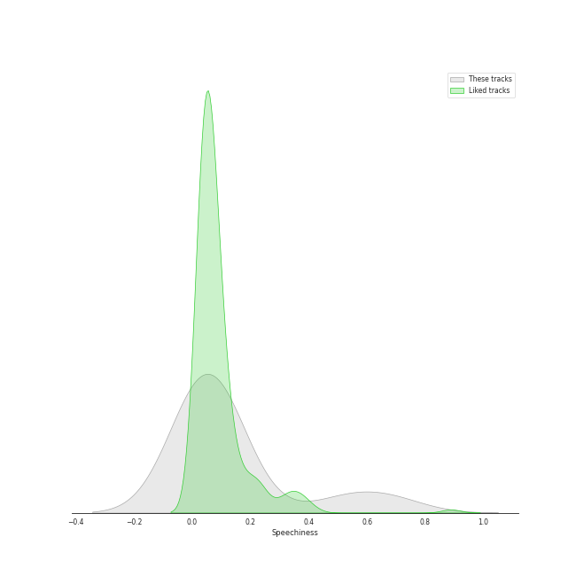
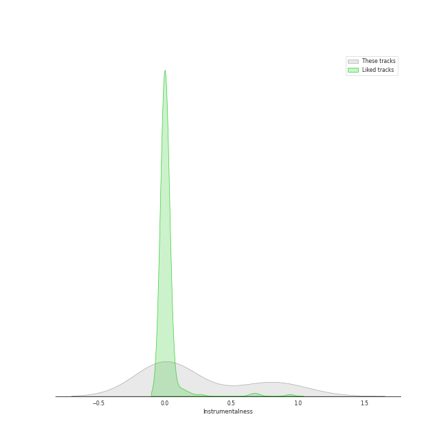
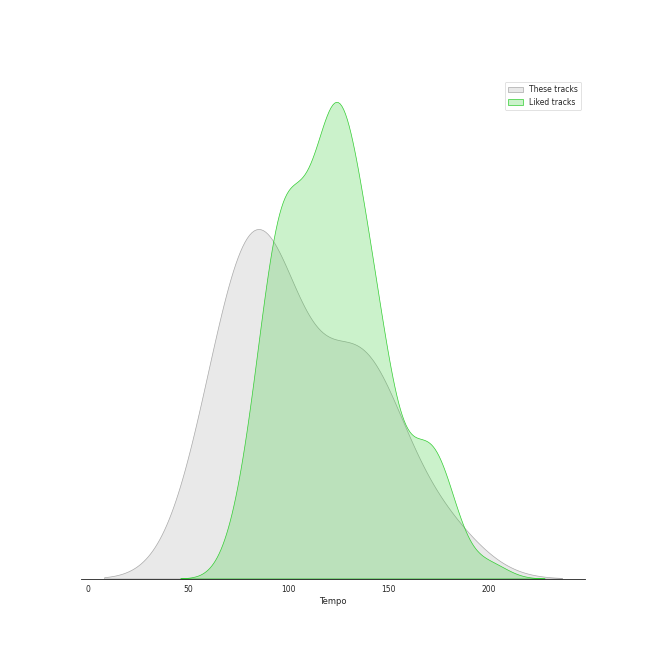

# Track Features for Lso Live

## Danceability

| ​ | 10 most Danceable tracks | ​​ | 10 least Danceable tracks |
|:---|:---|:---|:---|
|  | A Midsummer Night's Dream, Incidental Music, Op. 61: "Ay Me! For Aught That I Could Ever Read" (0.614) |  | A Midsummer Night's Dream, Incidental Music, Op. 61: No. 7, Nocturne. Con moto tranquillo (0.173) |
|  | A Midsummer Night's Dream, Incidental Music, Op. 61: No. 1, Scherzo (0.505) |  | A Midsummer Night's Dream, Incidental Music, Op. 61: Finale. Allegro di molto (0.227) |
|  | A Midsummer Night's Dream, Incidental Music, Op. 61: No. 2, L'istesso tempo (0.485) |  | Overture to "A Midsummer Night's Dream", Op. 21: Tempo primo (0.24) |
|  | A Midsummer Night's Dream, Incidental Music, Op. 61: No. 4, Andante (0.451) |  | Overture to "A Midsummer Night's Dream", Op. 21: Allegro di molto (0.278) |
|  | A Midsummer Night's Dream, Incidental Music, Op. 61: No. 2a, Allegro vivace (0.438) |  | A Midsummer Night's Dream, Incidental Music, Op. 61: No. 5, Allegro appassionato (0.282) |
|  | A Midsummer Night's Dream, Incidental Music, Op. 61: No. 8, Andante (0.387) |  | A Midsummer Night's Dream, Incidental Music, Op. 61: No. 3, Lied mit Chor (0.323) |
|  | A Midsummer Night's Dream, Incidental Music, Op. 61: No. 9, Hochzeitmarsch "Wedding March" - No. 12, Allegro vivace come primo (0.352) |  | A Midsummer Night's Dream, Incidental Music, Op. 61: No. 9, Hochzeitmarsch "Wedding March" - No. 12, Allegro vivace come primo (0.352) |
|  | A Midsummer Night's Dream, Incidental Music, Op. 61: No. 3, Lied mit Chor (0.323) |  | A Midsummer Night's Dream, Incidental Music, Op. 61: No. 8, Andante (0.387) |
|  | A Midsummer Night's Dream, Incidental Music, Op. 61: No. 5, Allegro appassionato (0.282) |  | A Midsummer Night's Dream, Incidental Music, Op. 61: No. 2a, Allegro vivace (0.438) |
|  | Overture to "A Midsummer Night's Dream", Op. 21: Allegro di molto (0.278) |  | A Midsummer Night's Dream, Incidental Music, Op. 61: No. 4, Andante (0.451) |

## Energy

| ​ | 10 most Energetic tracks | ​​ | 10 least Energetic tracks |
|:---|:---|:---|:---|
|  | A Midsummer Night's Dream, Incidental Music, Op. 61: No. 1, Scherzo (0.133) |  | A Midsummer Night's Dream, Incidental Music, Op. 61: No. 4, Andante (0.0082) |
|  | A Midsummer Night's Dream, Incidental Music, Op. 61: No. 9, Hochzeitmarsch "Wedding March" - No. 12, Allegro vivace come primo (0.112) |  | A Midsummer Night's Dream, Incidental Music, Op. 61: No. 8, Andante (0.00913) |
|  | A Midsummer Night's Dream, Incidental Music, Op. 61: No. 2, L'istesso tempo (0.0791) |  | A Midsummer Night's Dream, Incidental Music, Op. 61: No. 7, Nocturne. Con moto tranquillo (0.0115) |
|  | Overture to "A Midsummer Night's Dream", Op. 21: Allegro di molto (0.0756) |  | A Midsummer Night's Dream, Incidental Music, Op. 61: Finale. Allegro di molto (0.0246) |
|  | A Midsummer Night's Dream, Incidental Music, Op. 61: No. 2a, Allegro vivace (0.0554) |  | A Midsummer Night's Dream, Incidental Music, Op. 61: No. 3, Lied mit Chor (0.0349) |
|  | A Midsummer Night's Dream, Incidental Music, Op. 61: "Ay Me! For Aught That I Could Ever Read" (0.0494) |  | A Midsummer Night's Dream, Incidental Music, Op. 61: No. 5, Allegro appassionato (0.0368) |
|  | Overture to "A Midsummer Night's Dream", Op. 21: Tempo primo (0.0373) |  | Overture to "A Midsummer Night's Dream", Op. 21: Tempo primo (0.0373) |
|  | A Midsummer Night's Dream, Incidental Music, Op. 61: No. 5, Allegro appassionato (0.0368) |  | A Midsummer Night's Dream, Incidental Music, Op. 61: "Ay Me! For Aught That I Could Ever Read" (0.0494) |
|  | A Midsummer Night's Dream, Incidental Music, Op. 61: No. 3, Lied mit Chor (0.0349) |  | A Midsummer Night's Dream, Incidental Music, Op. 61: No. 2a, Allegro vivace (0.0554) |
|  | A Midsummer Night's Dream, Incidental Music, Op. 61: Finale. Allegro di molto (0.0246) |  | Overture to "A Midsummer Night's Dream", Op. 21: Allegro di molto (0.0756) |

## Speechiness

| ​ | 10 most Speechy tracks | ​​ | 10 least Speechy tracks |
|:---|:---|:---|:---|
|  | A Midsummer Night's Dream, Incidental Music, Op. 61: No. 2, L'istesso tempo (0.676) |  | A Midsummer Night's Dream, Incidental Music, Op. 61: No. 1, Scherzo (0.0314) |
|  | A Midsummer Night's Dream, Incidental Music, Op. 61: "Ay Me! For Aught That I Could Ever Read" (0.524) |  | Overture to "A Midsummer Night's Dream", Op. 21: Allegro di molto (0.0388) |
|  | A Midsummer Night's Dream, Incidental Music, Op. 61: No. 2a, Allegro vivace (0.0884) |  | A Midsummer Night's Dream, Incidental Music, Op. 61: No. 7, Nocturne. Con moto tranquillo (0.0415) |
|  | A Midsummer Night's Dream, Incidental Music, Op. 61: No. 4, Andante (0.0791) |  | A Midsummer Night's Dream, Incidental Music, Op. 61: No. 3, Lied mit Chor (0.0416) |
|  | A Midsummer Night's Dream, Incidental Music, Op. 61: No. 9, Hochzeitmarsch "Wedding March" - No. 12, Allegro vivace come primo (0.0636) |  | Overture to "A Midsummer Night's Dream", Op. 21: Tempo primo (0.0436) |
|  | A Midsummer Night's Dream, Incidental Music, Op. 61: No. 8, Andante (0.0574) |  | A Midsummer Night's Dream, Incidental Music, Op. 61: Finale. Allegro di molto (0.0473) |
|  | A Midsummer Night's Dream, Incidental Music, Op. 61: No. 5, Allegro appassionato (0.0502) |  | A Midsummer Night's Dream, Incidental Music, Op. 61: No. 5, Allegro appassionato (0.0502) |
|  | A Midsummer Night's Dream, Incidental Music, Op. 61: Finale. Allegro di molto (0.0473) |  | A Midsummer Night's Dream, Incidental Music, Op. 61: No. 8, Andante (0.0574) |
|  | Overture to "A Midsummer Night's Dream", Op. 21: Tempo primo (0.0436) |  | A Midsummer Night's Dream, Incidental Music, Op. 61: No. 9, Hochzeitmarsch "Wedding March" - No. 12, Allegro vivace come primo (0.0636) |
|  | A Midsummer Night's Dream, Incidental Music, Op. 61: No. 3, Lied mit Chor (0.0416) |  | A Midsummer Night's Dream, Incidental Music, Op. 61: No. 4, Andante (0.0791) |

## Acousticness

| ​ | 10 most Acoustic tracks | ​​ | 10 least Acoustic tracks |
|:---|:---|:---|:---|
|  | A Midsummer Night's Dream, Incidental Music, Op. 61: No. 7, Nocturne. Con moto tranquillo (0.981) |  | A Midsummer Night's Dream, Incidental Music, Op. 61: "Ay Me! For Aught That I Could Ever Read" (0.41) |
|  | A Midsummer Night's Dream, Incidental Music, Op. 61: No. 3, Lied mit Chor (0.969) |  | A Midsummer Night's Dream, Incidental Music, Op. 61: No. 2, L'istesso tempo (0.69) |
|  | A Midsummer Night's Dream, Incidental Music, Op. 61: No. 9, Hochzeitmarsch "Wedding March" - No. 12, Allegro vivace come primo (0.964) |  | A Midsummer Night's Dream, Incidental Music, Op. 61: No. 8, Andante (0.715) |
|  | A Midsummer Night's Dream, Incidental Music, Op. 61: No. 1, Scherzo (0.955) |  | A Midsummer Night's Dream, Incidental Music, Op. 61: No. 2a, Allegro vivace (0.745) |
|  | A Midsummer Night's Dream, Incidental Music, Op. 61: No. 5, Allegro appassionato (0.951) |  | A Midsummer Night's Dream, Incidental Music, Op. 61: No. 4, Andante (0.75) |
|  | Overture to "A Midsummer Night's Dream", Op. 21: Tempo primo (0.942) |  | Overture to "A Midsummer Night's Dream", Op. 21: Allegro di molto (0.887) |
|  | A Midsummer Night's Dream, Incidental Music, Op. 61: Finale. Allegro di molto (0.891) |  | A Midsummer Night's Dream, Incidental Music, Op. 61: Finale. Allegro di molto (0.891) |
|  | Overture to "A Midsummer Night's Dream", Op. 21: Allegro di molto (0.887) |  | Overture to "A Midsummer Night's Dream", Op. 21: Tempo primo (0.942) |
|  | A Midsummer Night's Dream, Incidental Music, Op. 61: No. 4, Andante (0.75) |  | A Midsummer Night's Dream, Incidental Music, Op. 61: No. 5, Allegro appassionato (0.951) |
|  | A Midsummer Night's Dream, Incidental Music, Op. 61: No. 2a, Allegro vivace (0.745) |  | A Midsummer Night's Dream, Incidental Music, Op. 61: No. 1, Scherzo (0.955) |

## Instrumentalness

| ​ | 10 most Instrumental tracks | ​​ | 10 least Instrumental tracks |
|:---|:---|:---|:---|
|  | A Midsummer Night's Dream, Incidental Music, Op. 61: No. 1, Scherzo (0.952) |  | A Midsummer Night's Dream, Incidental Music, Op. 61: "Ay Me! For Aught That I Could Ever Read" (0.0) |
|  | A Midsummer Night's Dream, Incidental Music, Op. 61: No. 7, Nocturne. Con moto tranquillo (0.869) |  | A Midsummer Night's Dream, Incidental Music, Op. 61: No. 8, Andante (0.0) |
|  | Overture to "A Midsummer Night's Dream", Op. 21: Allegro di molto (0.734) |  | A Midsummer Night's Dream, Incidental Music, Op. 61: No. 4, Andante (0.0) |
|  | Overture to "A Midsummer Night's Dream", Op. 21: Tempo primo (0.692) |  | A Midsummer Night's Dream, Incidental Music, Op. 61: No. 2, L'istesso tempo (0.0) |
|  | A Midsummer Night's Dream, Incidental Music, Op. 61: No. 9, Hochzeitmarsch "Wedding March" - No. 12, Allegro vivace come primo (0.0798) |  | A Midsummer Night's Dream, Incidental Music, Op. 61: Finale. Allegro di molto (3.2e-06) |
|  | A Midsummer Night's Dream, Incidental Music, Op. 61: No. 5, Allegro appassionato (0.00512) |  | A Midsummer Night's Dream, Incidental Music, Op. 61: No. 2a, Allegro vivace (1.33e-05) |
|  | A Midsummer Night's Dream, Incidental Music, Op. 61: No. 3, Lied mit Chor (0.00137) |  | A Midsummer Night's Dream, Incidental Music, Op. 61: No. 3, Lied mit Chor (0.00137) |
|  | A Midsummer Night's Dream, Incidental Music, Op. 61: No. 2a, Allegro vivace (1.33e-05) |  | A Midsummer Night's Dream, Incidental Music, Op. 61: No. 5, Allegro appassionato (0.00512) |
|  | A Midsummer Night's Dream, Incidental Music, Op. 61: Finale. Allegro di molto (3.2e-06) |  | A Midsummer Night's Dream, Incidental Music, Op. 61: No. 9, Hochzeitmarsch "Wedding March" - No. 12, Allegro vivace come primo (0.0798) |
|  | A Midsummer Night's Dream, Incidental Music, Op. 61: No. 2, L'istesso tempo (0.0) |  | Overture to "A Midsummer Night's Dream", Op. 21: Tempo primo (0.692) |

## Liveness

| ​ | 10 most Live tracks | ​​ | 10 least Live tracks |
|:---|:---|:---|:---|
|  | A Midsummer Night's Dream, Incidental Music, Op. 61: No. 4, Andante (0.626) |  | A Midsummer Night's Dream, Incidental Music, Op. 61: No. 3, Lied mit Chor (0.0609) |
|  | A Midsummer Night's Dream, Incidental Music, Op. 61: No. 2a, Allegro vivace (0.539) |  | A Midsummer Night's Dream, Incidental Music, Op. 61: No. 9, Hochzeitmarsch "Wedding March" - No. 12, Allegro vivace come primo (0.0646) |
|  | A Midsummer Night's Dream, Incidental Music, Op. 61: No. 8, Andante (0.488) |  | Overture to "A Midsummer Night's Dream", Op. 21: Tempo primo (0.0675) |
|  | A Midsummer Night's Dream, Incidental Music, Op. 61: No. 2, L'istesso tempo (0.354) |  | A Midsummer Night's Dream, Incidental Music, Op. 61: No. 7, Nocturne. Con moto tranquillo (0.0899) |
|  | A Midsummer Night's Dream, Incidental Music, Op. 61: "Ay Me! For Aught That I Could Ever Read" (0.336) |  | Overture to "A Midsummer Night's Dream", Op. 21: Allegro di molto (0.0936) |
|  | A Midsummer Night's Dream, Incidental Music, Op. 61: No. 1, Scherzo (0.2) |  | A Midsummer Night's Dream, Incidental Music, Op. 61: Finale. Allegro di molto (0.136) |
|  | A Midsummer Night's Dream, Incidental Music, Op. 61: No. 5, Allegro appassionato (0.172) |  | A Midsummer Night's Dream, Incidental Music, Op. 61: No. 5, Allegro appassionato (0.172) |
|  | A Midsummer Night's Dream, Incidental Music, Op. 61: Finale. Allegro di molto (0.136) |  | A Midsummer Night's Dream, Incidental Music, Op. 61: No. 1, Scherzo (0.2) |
|  | Overture to "A Midsummer Night's Dream", Op. 21: Allegro di molto (0.0936) |  | A Midsummer Night's Dream, Incidental Music, Op. 61: "Ay Me! For Aught That I Could Ever Read" (0.336) |
|  | A Midsummer Night's Dream, Incidental Music, Op. 61: No. 7, Nocturne. Con moto tranquillo (0.0899) |  | A Midsummer Night's Dream, Incidental Music, Op. 61: No. 2, L'istesso tempo (0.354) |

## Valence

| ​ | 10 most Happy tracks | ​​ | 10 least Happy tracks |
|:---|:---|:---|:---|
|  | A Midsummer Night's Dream, Incidental Music, Op. 61: No. 1, Scherzo (0.584) |  | A Midsummer Night's Dream, Incidental Music, Op. 61: No. 7, Nocturne. Con moto tranquillo (0.0353) |
|  | A Midsummer Night's Dream, Incidental Music, Op. 61: "Ay Me! For Aught That I Could Ever Read" (0.378) |  | A Midsummer Night's Dream, Incidental Music, Op. 61: Finale. Allegro di molto (0.05) |
|  | A Midsummer Night's Dream, Incidental Music, Op. 61: No. 2, L'istesso tempo (0.338) |  | Overture to "A Midsummer Night's Dream", Op. 21: Tempo primo (0.0519) |
|  | A Midsummer Night's Dream, Incidental Music, Op. 61: No. 4, Andante (0.207) |  | A Midsummer Night's Dream, Incidental Music, Op. 61: No. 8, Andante (0.0727) |
|  | A Midsummer Night's Dream, Incidental Music, Op. 61: No. 9, Hochzeitmarsch "Wedding March" - No. 12, Allegro vivace come primo (0.179) |  | A Midsummer Night's Dream, Incidental Music, Op. 61: No. 2a, Allegro vivace (0.0999) |
|  | A Midsummer Night's Dream, Incidental Music, Op. 61: No. 5, Allegro appassionato (0.135) |  | A Midsummer Night's Dream, Incidental Music, Op. 61: No. 3, Lied mit Chor (0.113) |
|  | Overture to "A Midsummer Night's Dream", Op. 21: Allegro di molto (0.134) |  | Overture to "A Midsummer Night's Dream", Op. 21: Allegro di molto (0.134) |
|  | A Midsummer Night's Dream, Incidental Music, Op. 61: No. 3, Lied mit Chor (0.113) |  | A Midsummer Night's Dream, Incidental Music, Op. 61: No. 5, Allegro appassionato (0.135) |
|  | A Midsummer Night's Dream, Incidental Music, Op. 61: No. 2a, Allegro vivace (0.0999) |  | A Midsummer Night's Dream, Incidental Music, Op. 61: No. 9, Hochzeitmarsch "Wedding March" - No. 12, Allegro vivace come primo (0.179) |
|  | A Midsummer Night's Dream, Incidental Music, Op. 61: No. 8, Andante (0.0727) |  | A Midsummer Night's Dream, Incidental Music, Op. 61: No. 4, Andante (0.207) |

## Tempo

| ​ | 10 most Fast tracks | ​​ | 10 least Fast tracks |
|:---|:---|:---|:---|
|  | A Midsummer Night's Dream, Incidental Music, Op. 61: Finale. Allegro di molto (175.796) |  | A Midsummer Night's Dream, Incidental Music, Op. 61: No. 7, Nocturne. Con moto tranquillo (68.74) |
|  | Overture to "A Midsummer Night's Dream", Op. 21: Tempo primo (140.454) |  | A Midsummer Night's Dream, Incidental Music, Op. 61: "Ay Me! For Aught That I Could Ever Read" (69.651) |
|  | Overture to "A Midsummer Night's Dream", Op. 21: Allegro di molto (137.416) |  | A Midsummer Night's Dream, Incidental Music, Op. 61: No. 2, L'istesso tempo (77.716) |
|  | A Midsummer Night's Dream, Incidental Music, Op. 61: No. 2a, Allegro vivace (137.327) |  | A Midsummer Night's Dream, Incidental Music, Op. 61: No. 9, Hochzeitmarsch "Wedding March" - No. 12, Allegro vivace come primo (81.733) |
|  | A Midsummer Night's Dream, Incidental Music, Op. 61: No. 1, Scherzo (134.158) |  | A Midsummer Night's Dream, Incidental Music, Op. 61: No. 8, Andante (82.043) |
|  | A Midsummer Night's Dream, Incidental Music, Op. 61: No. 3, Lied mit Chor (99.091) |  | A Midsummer Night's Dream, Incidental Music, Op. 61: No. 4, Andante (92.272) |
|  | A Midsummer Night's Dream, Incidental Music, Op. 61: No. 5, Allegro appassionato (98.608) |  | A Midsummer Night's Dream, Incidental Music, Op. 61: No. 5, Allegro appassionato (98.608) |
|  | A Midsummer Night's Dream, Incidental Music, Op. 61: No. 4, Andante (92.272) |  | A Midsummer Night's Dream, Incidental Music, Op. 61: No. 3, Lied mit Chor (99.091) |
|  | A Midsummer Night's Dream, Incidental Music, Op. 61: No. 8, Andante (82.043) |  | A Midsummer Night's Dream, Incidental Music, Op. 61: No. 1, Scherzo (134.158) |
|  | A Midsummer Night's Dream, Incidental Music, Op. 61: No. 9, Hochzeitmarsch "Wedding March" - No. 12, Allegro vivace come primo (81.733) |  | A Midsummer Night's Dream, Incidental Music, Op. 61: No. 2a, Allegro vivace (137.327) |
