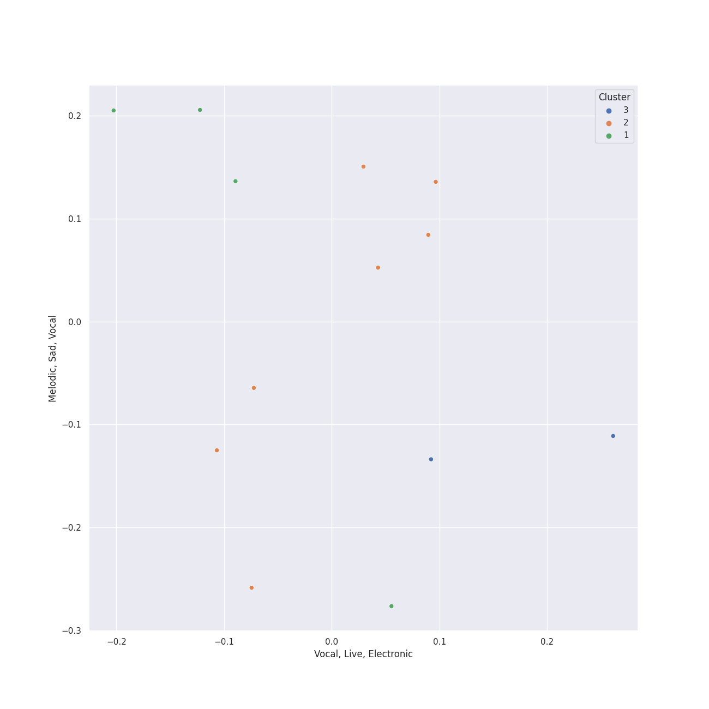

# Clusters in Lso Live

## Cluster #1

4 tracks

| Art | Track | Album | Artists | Label | Score | 💚 | 🔗 |
|:---|:---|:---|:---|:---|---:|:---|:---|
|  | Overture to "A Midsummer Night's Dream", Op. 21: Tempo primo | Mendelssohn: A Midsummer Night's Dream | Felix Mendelssohn, John Eliot Gardiner, [London Symphony Orchestra](../../../../artists/london_symphony_orchestra/overview.md) | [Lso Live](../..) | 0 | | [🔗](https://open.spotify.com/track/2idvFSH2im8mdSaMiE81vn) |
|  | A Midsummer Night's Dream, Incidental Music, Op. 61: No. 1, Scherzo | Mendelssohn: A Midsummer Night's Dream | Felix Mendelssohn, [London Symphony Orchestra](../../../../artists/london_symphony_orchestra/overview.md), Alexander Knox, John Eliot Gardiner | [Lso Live](../..) | 0 | | [🔗](https://open.spotify.com/track/359jW2zuaHCdC0gCJRcX5o) |
|  | A Midsummer Night's Dream, Incidental Music, Op. 61: No. 7, Nocturne. Con moto tranquillo | Mendelssohn: A Midsummer Night's Dream | Felix Mendelssohn, John Eliot Gardiner, [London Symphony Orchestra](../../../../artists/london_symphony_orchestra/overview.md) | [Lso Live](../..) | 0 | | [🔗](https://open.spotify.com/track/5lmp8r1rxxI6FuluNPBm82) |
|  | Overture to "A Midsummer Night's Dream", Op. 21: Allegro di molto | Mendelssohn: A Midsummer Night's Dream | Felix Mendelssohn, [London Symphony Orchestra](../../../../artists/london_symphony_orchestra/overview.md), John Eliot Gardiner | [Lso Live](../..) | 0 | | [🔗](https://open.spotify.com/track/7pz2npttELZeXmDgYfCDlE) |
## Cluster #2

4 tracks

| Art | Track | Album | Artists | Label | Score | 💚 | 🔗 |
|:---|:---|:---|:---|:---|---:|:---|:---|
|  | A Midsummer Night's Dream, Incidental Music, Op. 61: No. 3, Lied mit Chor | Mendelssohn: A Midsummer Night's Dream | Felix Mendelssohn, [London Symphony Orchestra](../../../../artists/london_symphony_orchestra/overview.md), Ceri-lyn Cissone, John Eliot Gardiner, The Monteverdi Choir | [Lso Live](../..) | 0 | | [🔗](https://open.spotify.com/track/1dDvLHCOPEVgNhHtVnB2is) |
|  | A Midsummer Night's Dream, Incidental Music, Op. 61: No. 9, Hochzeitmarsch "Wedding March" - No. 12, Allegro vivace come primo | Mendelssohn: A Midsummer Night's Dream | Felix Mendelssohn, [London Symphony Orchestra](../../../../artists/london_symphony_orchestra/overview.md), John Eliot Gardiner, Alexander Knox | [Lso Live](../..) | 0 | | [🔗](https://open.spotify.com/track/1ipR2jLKKgr7X9xJyd54Kx) |
|  | A Midsummer Night's Dream, Incidental Music, Op. 61: No. 5, Allegro appassionato | Mendelssohn: A Midsummer Night's Dream | Felix Mendelssohn, [London Symphony Orchestra](../../../../artists/london_symphony_orchestra/overview.md), Ceri-lyn Cissone, John Eliot Gardiner, Alexander Knox | [Lso Live](../..) | 0 | | [🔗](https://open.spotify.com/track/5XWKRz9i2PQWI3PsW0FmQj) |
|  | A Midsummer Night's Dream, Incidental Music, Op. 61: Finale. Allegro di molto | Mendelssohn: A Midsummer Night's Dream | Felix Mendelssohn, [London Symphony Orchestra](../../../../artists/london_symphony_orchestra/overview.md), John Eliot Gardiner, The Monteverdi Choir, Frankie Wakefield, Alexander Knox, Ceri-lyn Cissone | [Lso Live](../..) | 0 | | [🔗](https://open.spotify.com/track/5iGRKlJcFcSx0PA4OGpiYD) |
## Cluster #3

5 tracks

| Art | Track | Album | Artists | Label | Score | 💚 | 🔗 |
|:---|:---|:---|:---|:---|---:|:---|:---|
|  | A Midsummer Night's Dream, Incidental Music, Op. 61: "Ay Me! For Aught That I Could Ever Read" | Mendelssohn: A Midsummer Night's Dream | Felix Mendelssohn, John Eliot Gardiner, Alexander Knox | [Lso Live](../..) | 0 | | [🔗](https://open.spotify.com/track/1EGPsb3zw2L5Q6ocFc3G83) |
|  | A Midsummer Night's Dream, Incidental Music, Op. 61: No. 8, Andante | Mendelssohn: A Midsummer Night's Dream | Felix Mendelssohn, [London Symphony Orchestra](../../../../artists/london_symphony_orchestra/overview.md), John Eliot Gardiner, Frankie Wakefield, Alexander Knox, Ceri-lyn Cissone | [Lso Live](../..) | 0 | | [🔗](https://open.spotify.com/track/2QYtN5MiVrF7OJFpkJvLrS) |
|  | A Midsummer Night's Dream, Incidental Music, Op. 61: No. 2a, Allegro vivace | Mendelssohn: A Midsummer Night's Dream | Felix Mendelssohn, [London Symphony Orchestra](../../../../artists/london_symphony_orchestra/overview.md), Frankie Wakefield, Alexander Knox, John Eliot Gardiner | [Lso Live](../..) | 0 | | [🔗](https://open.spotify.com/track/58VxRBZ7XFR3vWgNwz5fYT) |
|  | A Midsummer Night's Dream, Incidental Music, Op. 61: No. 4, Andante | Mendelssohn: A Midsummer Night's Dream | Felix Mendelssohn, [London Symphony Orchestra](../../../../artists/london_symphony_orchestra/overview.md), Frankie Wakefield, John Eliot Gardiner, Ceri-lyn Cissone | [Lso Live](../..) | 0 | | [🔗](https://open.spotify.com/track/67eEYhol9DXQ65kUFt7jdk) |
|  | A Midsummer Night's Dream, Incidental Music, Op. 61: No. 2, L'istesso tempo | Mendelssohn: A Midsummer Night's Dream | Felix Mendelssohn, [London Symphony Orchestra](../../../../artists/london_symphony_orchestra/overview.md), John Eliot Gardiner, Alexander Knox, Ceri-lyn Cissone | [Lso Live](../..) | 0 | | [🔗](https://open.spotify.com/track/68afyO04jLHCK9Na8cgsGR) |