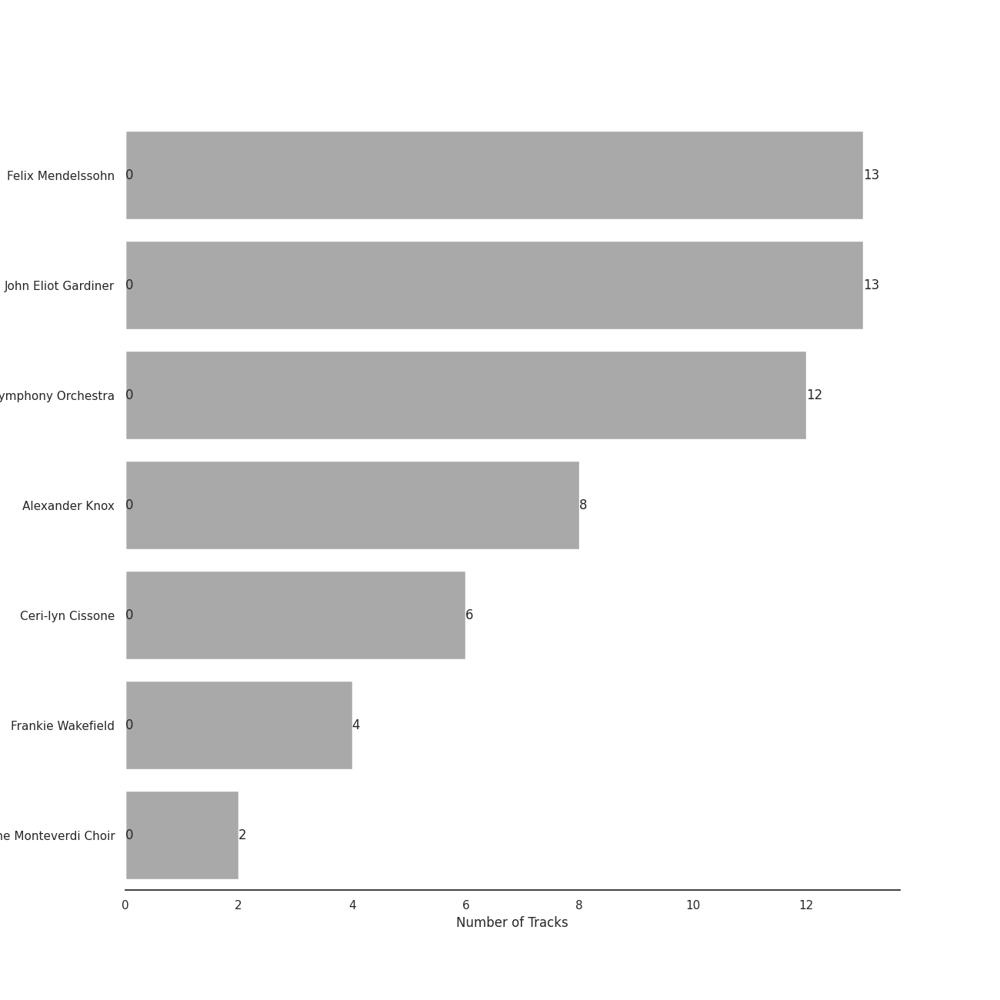
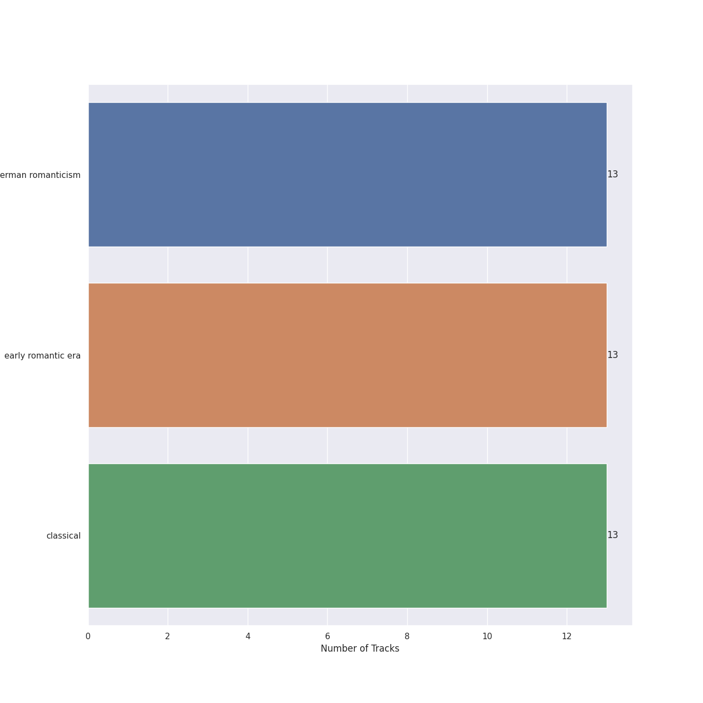

# Lso Live

13 songs

[See Track Features](audio_features.md)

[See Clusters](clusters/overview.md)

Appears as:
- Lso Live (13 tracks)

## Top Artists

| Art | Rank | Tracks | 💚 | Artist | 🔗 |
|:---|---:|---:|---:|:---|:---|
|  | 410 | 13 | 0 | Felix Mendelssohn | [🔗](https://open.spotify.com/artist/6MF58APd3YV72Ln2eVg710) |
|  | 410 | 13 | 0 | John Eliot Gardiner | [🔗](https://open.spotify.com/artist/1qIRoGEKXINqrCx5N1engi) |
|  | 410 | 12 | 0 | [London Symphony Orchestra](../../artists/london_symphony_orchestra/overview.md) | [🔗](https://open.spotify.com/artist/5yxyJsFanEAuwSM5kOuZKc) |
| | 410 | 8 | 0 | Alexander Knox | [🔗](https://open.spotify.com/artist/4vzwv4zzBTlG8qsFCqP2Yv) |
| | 410 | 6 | 0 | Ceri-lyn Cissone | [🔗](https://open.spotify.com/artist/6F3jOFmhUwRxRdWAZU6G1A) |
| | 410 | 4 | 0 | Frankie Wakefield | [🔗](https://open.spotify.com/artist/7jobsaZIFhejECE605yxx6) |
|  | 410 | 2 | 0 | The Monteverdi Choir | [🔗](https://open.spotify.com/artist/0Cqfz92flAzrp94pgN1jEW) |

## Top Albums

| Art | Rank | Tracks | 💚 | Album | Release Date | 🔗 |
|:---|---:|---:|---:|:---|:---|:---|
|  | 604 | 13 | 0 | Mendelssohn: A Midsummer Night's Dream | 2017-02-03 | [🔗](https://open.spotify.com/album/60J66evwnrnfH03HgDTrwN) |

## Genres

| Tracks | 💚 | Genre |
|---:|---:|:---|
| 13 | 0 | [german romanticism](../../genres/german_romanticism/overview.md) |
| 13 | 0 | [early romantic era](../../genres/early_romantic_era/overview.md) |
| 13 | 0 | [classical](../../genres/classical/overview.md) |

## Tracks released under Lso Live

| Art | Track | Album | Artists | Label | Rank | 💚 | 🔗 |
|:---|:---|:---|:---|:---|---:|:---|:---|
|  | A Midsummer Night's Dream, Incidental Music, Op. 61: "Ay Me! For Aught That I Could Ever Read" | Mendelssohn: A Midsummer Night's Dream | Felix Mendelssohn, John Eliot Gardiner, Alexander Knox | [Lso Live](.) | 909 | | [🔗](https://open.spotify.com/track/1EGPsb3zw2L5Q6ocFc3G83) |
|  | A Midsummer Night's Dream, Incidental Music, Op. 61: Finale. Allegro di molto | Mendelssohn: A Midsummer Night's Dream | Felix Mendelssohn, [London Symphony Orchestra](../../artists/london_symphony_orchestra/overview.md), John Eliot Gardiner, The Monteverdi Choir, Frankie Wakefield, Alexander Knox, Ceri-lyn Cissone | [Lso Live](.) | 909 | | [🔗](https://open.spotify.com/track/5iGRKlJcFcSx0PA4OGpiYD) |
|  | A Midsummer Night's Dream, Incidental Music, Op. 61: No. 1, Scherzo | Mendelssohn: A Midsummer Night's Dream | Felix Mendelssohn, [London Symphony Orchestra](../../artists/london_symphony_orchestra/overview.md), Alexander Knox, John Eliot Gardiner | [Lso Live](.) | 909 | | [🔗](https://open.spotify.com/track/359jW2zuaHCdC0gCJRcX5o) |
|  | A Midsummer Night's Dream, Incidental Music, Op. 61: No. 2, L'istesso tempo | Mendelssohn: A Midsummer Night's Dream | Felix Mendelssohn, [London Symphony Orchestra](../../artists/london_symphony_orchestra/overview.md), John Eliot Gardiner, Alexander Knox, Ceri-lyn Cissone | [Lso Live](.) | 909 | | [🔗](https://open.spotify.com/track/68afyO04jLHCK9Na8cgsGR) |
|  | A Midsummer Night's Dream, Incidental Music, Op. 61: No. 2a, Allegro vivace | Mendelssohn: A Midsummer Night's Dream | Felix Mendelssohn, [London Symphony Orchestra](../../artists/london_symphony_orchestra/overview.md), Frankie Wakefield, Alexander Knox, John Eliot Gardiner | [Lso Live](.) | 909 | | [🔗](https://open.spotify.com/track/58VxRBZ7XFR3vWgNwz5fYT) |
|  | A Midsummer Night's Dream, Incidental Music, Op. 61: No. 3, Lied mit Chor | Mendelssohn: A Midsummer Night's Dream | Felix Mendelssohn, [London Symphony Orchestra](../../artists/london_symphony_orchestra/overview.md), Ceri-lyn Cissone, John Eliot Gardiner, The Monteverdi Choir | [Lso Live](.) | 909 | | [🔗](https://open.spotify.com/track/1dDvLHCOPEVgNhHtVnB2is) |
|  | A Midsummer Night's Dream, Incidental Music, Op. 61: No. 4, Andante | Mendelssohn: A Midsummer Night's Dream | Felix Mendelssohn, [London Symphony Orchestra](../../artists/london_symphony_orchestra/overview.md), Frankie Wakefield, John Eliot Gardiner, Ceri-lyn Cissone | [Lso Live](.) | 909 | | [🔗](https://open.spotify.com/track/67eEYhol9DXQ65kUFt7jdk) |
|  | A Midsummer Night's Dream, Incidental Music, Op. 61: No. 5, Allegro appassionato | Mendelssohn: A Midsummer Night's Dream | Felix Mendelssohn, [London Symphony Orchestra](../../artists/london_symphony_orchestra/overview.md), Ceri-lyn Cissone, John Eliot Gardiner, Alexander Knox | [Lso Live](.) | 909 | | [🔗](https://open.spotify.com/track/5XWKRz9i2PQWI3PsW0FmQj) |
|  | A Midsummer Night's Dream, Incidental Music, Op. 61: No. 7, Nocturne. Con moto tranquillo | Mendelssohn: A Midsummer Night's Dream | Felix Mendelssohn, John Eliot Gardiner, [London Symphony Orchestra](../../artists/london_symphony_orchestra/overview.md) | [Lso Live](.) | 909 | | [🔗](https://open.spotify.com/track/5lmp8r1rxxI6FuluNPBm82) |
|  | A Midsummer Night's Dream, Incidental Music, Op. 61: No. 8, Andante | Mendelssohn: A Midsummer Night's Dream | Felix Mendelssohn, [London Symphony Orchestra](../../artists/london_symphony_orchestra/overview.md), John Eliot Gardiner, Frankie Wakefield, Alexander Knox, Ceri-lyn Cissone | [Lso Live](.) | 909 | | [🔗](https://open.spotify.com/track/2QYtN5MiVrF7OJFpkJvLrS) |

See all tracks

| Art | Track | Album | Artists | Label | Rank | 💚 | 🔗 |
|:---|:---|:---|:---|:---|---:|:---|:---|
|  | A Midsummer Night's Dream, Incidental Music, Op. 61: No. 9, Hochzeitmarsch "Wedding March" - No. 12, Allegro vivace come primo | Mendelssohn: A Midsummer Night's Dream | Felix Mendelssohn, [London Symphony Orchestra](../../artists/london_symphony_orchestra/overview.md), John Eliot Gardiner, Alexander Knox | [Lso Live](.) | 909 | | [🔗](https://open.spotify.com/track/1ipR2jLKKgr7X9xJyd54Kx) |
|  | Overture to "A Midsummer Night's Dream", Op. 21: Allegro di molto | Mendelssohn: A Midsummer Night's Dream | Felix Mendelssohn, [London Symphony Orchestra](../../artists/london_symphony_orchestra/overview.md), John Eliot Gardiner | [Lso Live](.) | 909 | | [🔗](https://open.spotify.com/track/7pz2npttELZeXmDgYfCDlE) |
|  | Overture to "A Midsummer Night's Dream", Op. 21: Tempo primo | Mendelssohn: A Midsummer Night's Dream | Felix Mendelssohn, John Eliot Gardiner, [London Symphony Orchestra](../../artists/london_symphony_orchestra/overview.md) | [Lso Live](.) | 909 | | [🔗](https://open.spotify.com/track/2idvFSH2im8mdSaMiE81vn) |

