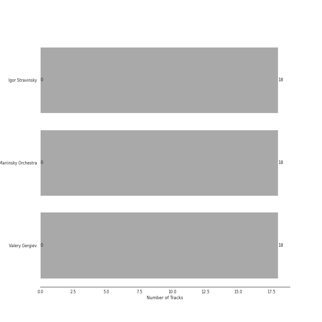
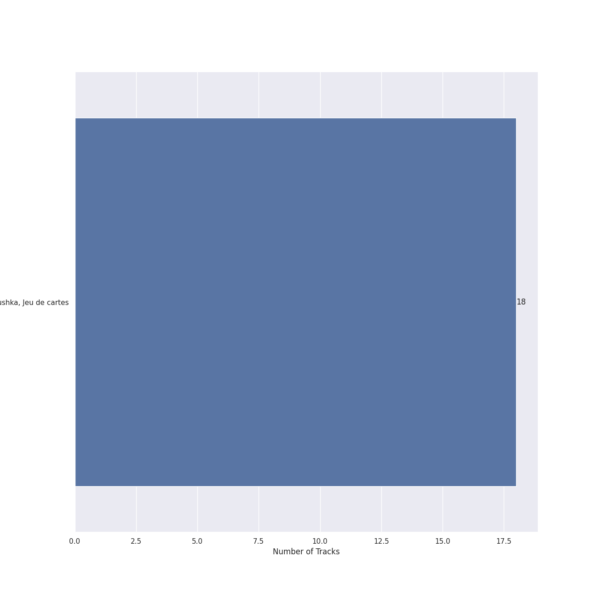

# Mariinsky

18 songs

## Top Artists

See all 3 artists

|   Number of Tracks | Art                                                                                              | Artist                                                   | 🔗                                                           |
|-------------------:|:-------------------------------------------------------------------------------------------------|:---------------------------------------------------------|:------------------------------------------------------------|
|                 18 |  | [Igor Stravinsky](../artists/igor_stravinsky.md)         | [🔗](https://open.spotify.com/artist/7ie36YytMoKtPiL7tUvmoE) |
|                 18 |  | [Mariinsky Orchestra](../artists/mariinsky_orchestra.md) | [🔗](https://open.spotify.com/artist/2rRUfv2w535SEUV1YO5SP6) |
|                 18 |  | [Valery Gergiev](../artists/valery_gergiev.md)           | [🔗](https://open.spotify.com/artist/2LxnoYPOe0FCLC82R3xgO2) |

## Top Albums

See all 1 albums

|   Number of Tracks | Art                                                                                              | Album                                | 🔗                                                          |
|-------------------:|:-------------------------------------------------------------------------------------------------|:-------------------------------------|:-----------------------------------------------------------|
|                 18 |  | Stravinsky: Petrushka, Jeu de cartes | [🔗](https://open.spotify.com/album/19fQbFNjlfXgBAFqftKzWA) |

## Tracks released under Mariinsky

| Art                                                                                              | Track                                                                                     | Album                                | Artists                                                                                                                                                    | Label     | 💚   | 🔗                                                          |
|:-------------------------------------------------------------------------------------------------|:------------------------------------------------------------------------------------------|:-------------------------------------|:-----------------------------------------------------------------------------------------------------------------------------------------------------------|:----------|:----|:-----------------------------------------------------------|
|  | Jeu de cartes: I. First Deal                                                              | Stravinsky: Petrushka, Jeu de cartes | [Igor Stravinsky](../artists/igor_stravinsky.md), [Valery Gergiev](../artists/valery_gergiev.md), [Mariinsky Orchestra](../artists/mariinsky_orchestra.md) | Mariinsky |     | [🔗](https://open.spotify.com/track/3GLlyHxs9jj5OJtRUw7krB) |
|  | Jeu de cartes: II. Second Deal                                                            | Stravinsky: Petrushka, Jeu de cartes | [Igor Stravinsky](../artists/igor_stravinsky.md), [Valery Gergiev](../artists/valery_gergiev.md), [Mariinsky Orchestra](../artists/mariinsky_orchestra.md) | Mariinsky |     | [🔗](https://open.spotify.com/track/01sFYbEnNAR4ZBChyKR1XG) |
|  | Jeu de cartes: III. Third Deal                                                            | Stravinsky: Petrushka, Jeu de cartes | [Igor Stravinsky](../artists/igor_stravinsky.md), [Valery Gergiev](../artists/valery_gergiev.md), [Mariinsky Orchestra](../artists/mariinsky_orchestra.md) | Mariinsky |     | [🔗](https://open.spotify.com/track/1RmGFbd7C1jv5oBNRHX7cv) |
|  | Petrushka: First Scene: I. The Shrovetide Fair (Introduction) (1911 original version)     | Stravinsky: Petrushka, Jeu de cartes | [Igor Stravinsky](../artists/igor_stravinsky.md), [Valery Gergiev](../artists/valery_gergiev.md), [Mariinsky Orchestra](../artists/mariinsky_orchestra.md) | Mariinsky |     | [🔗](https://open.spotify.com/track/0aRVTTqvik5P7H0WrUwIhu) |
|  | Petrushka: First Scene: II. The Crowds (1911 original version)                            | Stravinsky: Petrushka, Jeu de cartes | [Igor Stravinsky](../artists/igor_stravinsky.md), [Valery Gergiev](../artists/valery_gergiev.md), [Mariinsky Orchestra](../artists/mariinsky_orchestra.md) | Mariinsky |     | [🔗](https://open.spotify.com/track/2Rb1R3QTqNACnDrwZdt5Ic) |
|  | Petrushka: First Scene: III. The Conjuring Trick (1911 original version)                  | Stravinsky: Petrushka, Jeu de cartes | [Igor Stravinsky](../artists/igor_stravinsky.md), [Valery Gergiev](../artists/valery_gergiev.md), [Mariinsky Orchestra](../artists/mariinsky_orchestra.md) | Mariinsky |     | [🔗](https://open.spotify.com/track/5Ngr7bpBvlYNojEpw72eJ7) |
|  | Petrushka: First Scene: IV. Russian Dance (1911 original version)                         | Stravinsky: Petrushka, Jeu de cartes | [Igor Stravinsky](../artists/igor_stravinsky.md), [Valery Gergiev](../artists/valery_gergiev.md), [Mariinsky Orchestra](../artists/mariinsky_orchestra.md) | Mariinsky |     | [🔗](https://open.spotify.com/track/44YT5PBqXUE1mCPBZWX7J4) |
|  | Petrushka: Fourth Scene: I. The Shrovetide Fair (towards evening) (1911 original version) | Stravinsky: Petrushka, Jeu de cartes | [Igor Stravinsky](../artists/igor_stravinsky.md), [Valery Gergiev](../artists/valery_gergiev.md), [Mariinsky Orchestra](../artists/mariinsky_orchestra.md) | Mariinsky |     | [🔗](https://open.spotify.com/track/14GWS0o1EeFbGi10ZfdIHi) |
|  | Petrushka: Fourth Scene: II. Dance of the Wet-Nurses (1911 original version)              | Stravinsky: Petrushka, Jeu de cartes | [Igor Stravinsky](../artists/igor_stravinsky.md), [Valery Gergiev](../artists/valery_gergiev.md), [Mariinsky Orchestra](../artists/mariinsky_orchestra.md) | Mariinsky |     | [🔗](https://open.spotify.com/track/1doCWMqKSAD9mVLD2nulpq) |
|  | Petrushka: Fourth Scene: III. A Peasant Enters with a Bear (1911 original version)        | Stravinsky: Petrushka, Jeu de cartes | [Igor Stravinsky](../artists/igor_stravinsky.md), [Valery Gergiev](../artists/valery_gergiev.md), [Mariinsky Orchestra](../artists/mariinsky_orchestra.md) | Mariinsky |     | [🔗](https://open.spotify.com/track/2sieCbTqWHcEQwIRZyBIfQ) |
|  | Petrushka: Fourth Scene: IV. The Gypsy Girls Dance (1911 original version)                | Stravinsky: Petrushka, Jeu de cartes | [Igor Stravinsky](../artists/igor_stravinsky.md), [Valery Gergiev](../artists/valery_gergiev.md), [Mariinsky Orchestra](../artists/mariinsky_orchestra.md) | Mariinsky |     | [🔗](https://open.spotify.com/track/1AmGUA9QW34e9clnXYFdWn) |
|  | Petrushka: Fourth Scene: V. Dance of the Coachmen and Grooms (1911 original version)      | Stravinsky: Petrushka, Jeu de cartes | [Igor Stravinsky](../artists/igor_stravinsky.md), [Valery Gergiev](../artists/valery_gergiev.md), [Mariinsky Orchestra](../artists/mariinsky_orchestra.md) | Mariinsky |     | [🔗](https://open.spotify.com/track/0g12fQ8G4QUWX0Kbn2Q6r0) |
|  | Petrushka: Fourth Scene: VI. The Mummers (1911 original version)                          | Stravinsky: Petrushka, Jeu de cartes | [Igor Stravinsky](../artists/igor_stravinsky.md), [Valery Gergiev](../artists/valery_gergiev.md), [Mariinsky Orchestra](../artists/mariinsky_orchestra.md) | Mariinsky |     | [🔗](https://open.spotify.com/track/31pNUdNPljYjMahrE35C8h) |
|  | Petrushka: Fourth Scene: VII. Petrushka's Death (1911 original version)                   | Stravinsky: Petrushka, Jeu de cartes | [Igor Stravinsky](../artists/igor_stravinsky.md), [Valery Gergiev](../artists/valery_gergiev.md), [Mariinsky Orchestra](../artists/mariinsky_orchestra.md) | Mariinsky |     | [🔗](https://open.spotify.com/track/5vmh1dWU5B7GIt4gxcTiYy) |
|  | Petrushka: Second Scene: I. Petrushka's Cell (1911 original version)                      | Stravinsky: Petrushka, Jeu de cartes | [Igor Stravinsky](../artists/igor_stravinsky.md), [Valery Gergiev](../artists/valery_gergiev.md), [Mariinsky Orchestra](../artists/mariinsky_orchestra.md) | Mariinsky |     | [🔗](https://open.spotify.com/track/6g0qWuKnsE1js5mo4HAigx) |
|  | Petrushka: Third Scene: I. The Moor's Cell (1911 original version)                        | Stravinsky: Petrushka, Jeu de cartes | [Igor Stravinsky](../artists/igor_stravinsky.md), [Valery Gergiev](../artists/valery_gergiev.md), [Mariinsky Orchestra](../artists/mariinsky_orchestra.md) | Mariinsky |     | [🔗](https://open.spotify.com/track/0PFEP4Rom9u9D9kA8yTkYQ) |
|  | Petrushka: Third Scene: II. Dance of the Ballerina (1911 original version)                | Stravinsky: Petrushka, Jeu de cartes | [Igor Stravinsky](../artists/igor_stravinsky.md), [Valery Gergiev](../artists/valery_gergiev.md), [Mariinsky Orchestra](../artists/mariinsky_orchestra.md) | Mariinsky |     | [🔗](https://open.spotify.com/track/5CQt9zxHHZiABfdEQoUsAO) |
|  | Petrushka: Third Scene: III. Waltz (The Ballerina and the Moor) (1911 original version)   | Stravinsky: Petrushka, Jeu de cartes | [Igor Stravinsky](../artists/igor_stravinsky.md), [Valery Gergiev](../artists/valery_gergiev.md), [Mariinsky Orchestra](../artists/mariinsky_orchestra.md) | Mariinsky |     | [🔗](https://open.spotify.com/track/5Nz0PKTW9OgraAtvjYJvO9) |
