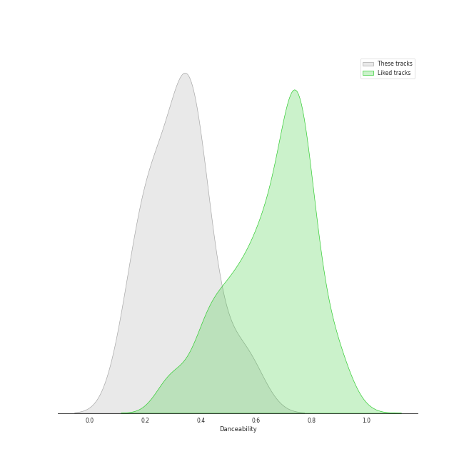
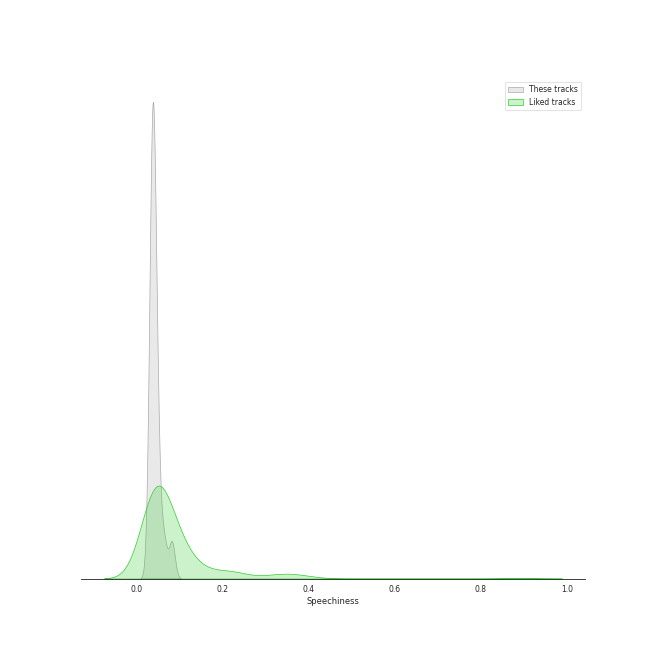
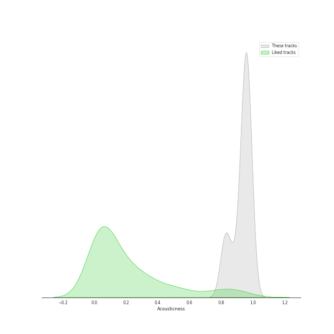
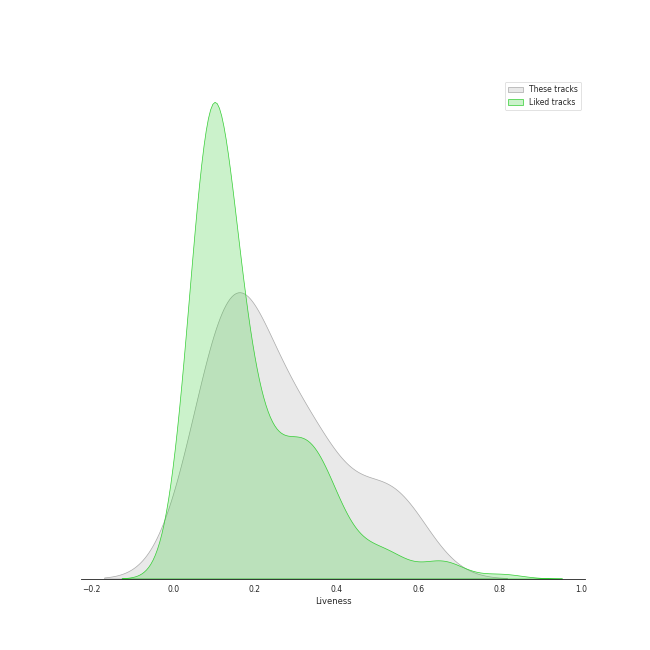
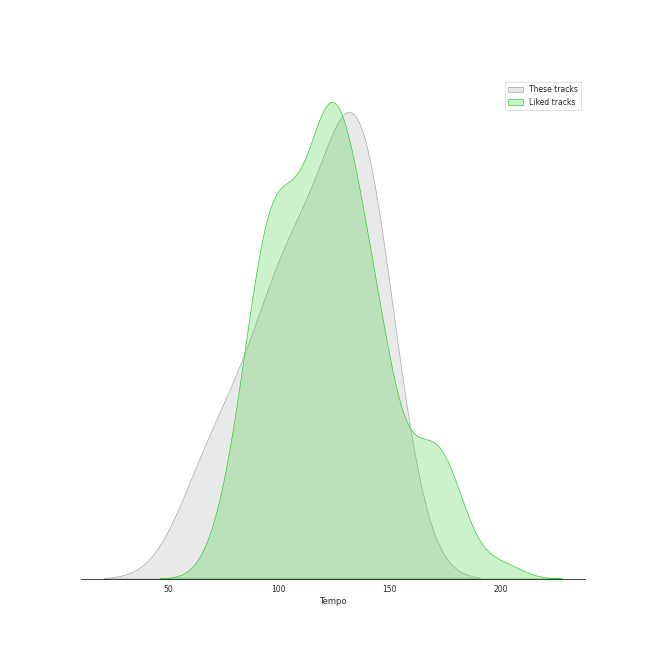

# Audio Features for Mariinsky

## Danceability

| 10 most Danceable tracks | 10 least Danceable tracks |
|:---|:---|
| Petrushka: Third Scene: II. Dance of the Ballerina (1911 original version) (0.58) | Petrushka: Fourth Scene: III. A Peasant Enters with a Bear (1911 original version) (0.138) |
| Petrushka: Fourth Scene: V. Dance of the Coachmen and Grooms (1911 original version) (0.51) | Petrushka: First Scene: III. The Conjuring Trick (1911 original version) (0.165) |
| Jeu de cartes: III. Third Deal (0.404) | Petrushka: Fourth Scene: I. The Shrovetide Fair (towards evening) (1911 original version) (0.205) |
| Jeu de cartes: II. Second Deal (0.398) | Petrushka: Third Scene: I. The Moor's Cell (1911 original version) (0.215) |
| Petrushka: First Scene: IV. Russian Dance (1911 original version) (0.394) | Petrushka: Fourth Scene: VII. Petrushka's Death (1911 original version) (0.215) |
| Petrushka: Fourth Scene: VI. The Mummers (1911 original version) (0.374) | Petrushka: Third Scene: III. Waltz (The Ballerina and the Moor) (1911 original version) (0.247) |
| Jeu de cartes: I. First Deal (0.354) | Petrushka: Second Scene: I. Petrushka's Cell (1911 original version) (0.292) |
| Petrushka: Fourth Scene: II. Dance of the Wet-Nurses (1911 original version) (0.353) | Petrushka: First Scene: I. The Shrovetide Fair (Introduction) (1911 original version) (0.302) |
| Petrushka: First Scene: II. The Crowds (1911 original version) (0.343) | Petrushka: Fourth Scene: IV. The Gypsy Girls Dance (1911 original version) (0.331) |
| Petrushka: Fourth Scene: IV. The Gypsy Girls Dance (1911 original version) (0.331) | Petrushka: First Scene: II. The Crowds (1911 original version) (0.343) |

## Energy

| 10 most Energetic tracks | 10 least Energetic tracks |
|:---|:---|
| Petrushka: Fourth Scene: I. The Shrovetide Fair (towards evening) (1911 original version) (0.453) | Petrushka: First Scene: III. The Conjuring Trick (1911 original version) (0.011) |
| Petrushka: Fourth Scene: VI. The Mummers (1911 original version) (0.359) | Petrushka: Fourth Scene: VII. Petrushka's Death (1911 original version) (0.0123) |
| Petrushka: First Scene: IV. Russian Dance (1911 original version) (0.331) | Jeu de cartes: II. Second Deal (0.0354) |
| Petrushka: Fourth Scene: V. Dance of the Coachmen and Grooms (1911 original version) (0.315) | Jeu de cartes: I. First Deal (0.0393) |
| Petrushka: Fourth Scene: II. Dance of the Wet-Nurses (1911 original version) (0.292) | Petrushka: Third Scene: I. The Moor's Cell (1911 original version) (0.043) |
| Petrushka: First Scene: I. The Shrovetide Fair (Introduction) (1911 original version) (0.278) | Jeu de cartes: III. Third Deal (0.102) |
| Petrushka: First Scene: II. The Crowds (1911 original version) (0.213) | Petrushka: Second Scene: I. Petrushka's Cell (1911 original version) (0.105) |
| Petrushka: Fourth Scene: IV. The Gypsy Girls Dance (1911 original version) (0.19) | Petrushka: Fourth Scene: III. A Peasant Enters with a Bear (1911 original version) (0.129) |
| Petrushka: Third Scene: III. Waltz (The Ballerina and the Moor) (1911 original version) (0.152) | Petrushka: Third Scene: II. Dance of the Ballerina (1911 original version) (0.144) |
| Petrushka: Third Scene: II. Dance of the Ballerina (1911 original version) (0.144) | Petrushka: Third Scene: III. Waltz (The Ballerina and the Moor) (1911 original version) (0.152) |

## Speechiness

| 10 most Speechy tracks | 10 least Speechy tracks |
|:---|:---|
| Petrushka: Fourth Scene: VI. The Mummers (1911 original version) (0.083) | Petrushka: Fourth Scene: III. A Peasant Enters with a Bear (1911 original version) (0.0313) |
| Petrushka: Third Scene: III. Waltz (The Ballerina and the Moor) (1911 original version) (0.0644) | Petrushka: Fourth Scene: I. The Shrovetide Fair (towards evening) (1911 original version) (0.0359) |
| Petrushka: Third Scene: II. Dance of the Ballerina (1911 original version) (0.0518) | Petrushka: Fourth Scene: VII. Petrushka's Death (1911 original version) (0.0362) |
| Jeu de cartes: III. Third Deal (0.049) | Petrushka: Fourth Scene: II. Dance of the Wet-Nurses (1911 original version) (0.0367) |
| Petrushka: Second Scene: I. Petrushka's Cell (1911 original version) (0.046) | Jeu de cartes: I. First Deal (0.0369) |
| Petrushka: Fourth Scene: IV. The Gypsy Girls Dance (1911 original version) (0.0426) | Jeu de cartes: II. Second Deal (0.0371) |
| Petrushka: First Scene: III. The Conjuring Trick (1911 original version) (0.0414) | Petrushka: Third Scene: I. The Moor's Cell (1911 original version) (0.0374) |
| Petrushka: First Scene: I. The Shrovetide Fair (Introduction) (1911 original version) (0.041) | Petrushka: First Scene: II. The Crowds (1911 original version) (0.0382) |
| Petrushka: First Scene: IV. Russian Dance (1911 original version) (0.0407) | Petrushka: Fourth Scene: V. Dance of the Coachmen and Grooms (1911 original version) (0.0392) |
| Petrushka: Fourth Scene: V. Dance of the Coachmen and Grooms (1911 original version) (0.0392) | Petrushka: First Scene: IV. Russian Dance (1911 original version) (0.0407) |

## Acousticness

| 10 most Acoustic tracks | 10 least Acoustic tracks |
|:---|:---|
| Petrushka: Fourth Scene: III. A Peasant Enters with a Bear (1911 original version) (0.983) | Petrushka: First Scene: III. The Conjuring Trick (1911 original version) (0.817) |
| Petrushka: Fourth Scene: II. Dance of the Wet-Nurses (1911 original version) (0.978) | Petrushka: Fourth Scene: VII. Petrushka's Death (1911 original version) (0.82) |
| Petrushka: First Scene: I. The Shrovetide Fair (Introduction) (1911 original version) (0.975) | Petrushka: Fourth Scene: V. Dance of the Coachmen and Grooms (1911 original version) (0.841) |
| Petrushka: Fourth Scene: IV. The Gypsy Girls Dance (1911 original version) (0.972) | Petrushka: Third Scene: I. The Moor's Cell (1911 original version) (0.873) |
| Jeu de cartes: I. First Deal (0.966) | Petrushka: Fourth Scene: VI. The Mummers (1911 original version) (0.926) |
| Petrushka: Third Scene: II. Dance of the Ballerina (1911 original version) (0.962) | Petrushka: Second Scene: I. Petrushka's Cell (1911 original version) (0.926) |
| Petrushka: First Scene: II. The Crowds (1911 original version) (0.961) | Petrushka: First Scene: IV. Russian Dance (1911 original version) (0.94) |
| Petrushka: Fourth Scene: I. The Shrovetide Fair (towards evening) (1911 original version) (0.959) | Petrushka: Third Scene: III. Waltz (The Ballerina and the Moor) (1911 original version) (0.945) |
| Jeu de cartes: III. Third Deal (0.955) | Jeu de cartes: II. Second Deal (0.949) |
| Jeu de cartes: II. Second Deal (0.949) | Jeu de cartes: III. Third Deal (0.955) |

## Instrumentalness

| 10 most Instrumental tracks | 10 least Instrumental tracks |
|:---|:---|
| Petrushka: Fourth Scene: II. Dance of the Wet-Nurses (1911 original version) (0.945) | Petrushka: First Scene: III. The Conjuring Trick (1911 original version) (0.000393) |
| Petrushka: First Scene: I. The Shrovetide Fair (Introduction) (1911 original version) (0.941) | Petrushka: Fourth Scene: VII. Petrushka's Death (1911 original version) (0.00603) |
| Petrushka: Fourth Scene: VI. The Mummers (1911 original version) (0.936) | Jeu de cartes: I. First Deal (0.561) |
| Petrushka: Fourth Scene: III. A Peasant Enters with a Bear (1911 original version) (0.933) | Petrushka: Third Scene: II. Dance of the Ballerina (1911 original version) (0.672) |
| Petrushka: Third Scene: I. The Moor's Cell (1911 original version) (0.933) | Petrushka: Second Scene: I. Petrushka's Cell (1911 original version) (0.678) |
| Petrushka: Fourth Scene: IV. The Gypsy Girls Dance (1911 original version) (0.897) | Petrushka: First Scene: IV. Russian Dance (1911 original version) (0.775) |
| Petrushka: Third Scene: III. Waltz (The Ballerina and the Moor) (1911 original version) (0.879) | Jeu de cartes: II. Second Deal (0.8) |
| Jeu de cartes: III. Third Deal (0.867) | Petrushka: Fourth Scene: V. Dance of the Coachmen and Grooms (1911 original version) (0.809) |
| Petrushka: First Scene: II. The Crowds (1911 original version) (0.861) | Petrushka: Fourth Scene: I. The Shrovetide Fair (towards evening) (1911 original version) (0.848) |
| Petrushka: Fourth Scene: I. The Shrovetide Fair (towards evening) (1911 original version) (0.848) | Petrushka: First Scene: II. The Crowds (1911 original version) (0.861) |

## Liveness

| 10 most Live tracks | 10 least Live tracks |
|:---|:---|
| Petrushka: First Scene: IV. Russian Dance (1911 original version) (0.558) | Petrushka: Third Scene: III. Waltz (The Ballerina and the Moor) (1911 original version) (0.0908) |
| Petrushka: Fourth Scene: V. Dance of the Coachmen and Grooms (1911 original version) (0.537) | Petrushka: Fourth Scene: VI. The Mummers (1911 original version) (0.0931) |
| Petrushka: Fourth Scene: I. The Shrovetide Fair (towards evening) (1911 original version) (0.505) | Petrushka: First Scene: III. The Conjuring Trick (1911 original version) (0.101) |
| Jeu de cartes: I. First Deal (0.366) | Jeu de cartes: II. Second Deal (0.122) |
| Petrushka: Fourth Scene: III. A Peasant Enters with a Bear (1911 original version) (0.343) | Jeu de cartes: III. Third Deal (0.137) |
| Petrushka: First Scene: I. The Shrovetide Fair (Introduction) (1911 original version) (0.328) | Petrushka: Fourth Scene: II. Dance of the Wet-Nurses (1911 original version) (0.151) |
| Petrushka: First Scene: II. The Crowds (1911 original version) (0.322) | Petrushka: Second Scene: I. Petrushka's Cell (1911 original version) (0.165) |
| Petrushka: Fourth Scene: VII. Petrushka's Death (1911 original version) (0.239) | Petrushka: Third Scene: II. Dance of the Ballerina (1911 original version) (0.172) |
| Petrushka: Third Scene: I. The Moor's Cell (1911 original version) (0.205) | Petrushka: Fourth Scene: IV. The Gypsy Girls Dance (1911 original version) (0.195) |
| Petrushka: Fourth Scene: IV. The Gypsy Girls Dance (1911 original version) (0.195) | Petrushka: Third Scene: I. The Moor's Cell (1911 original version) (0.205) |

## Valence

| 10 most Happy tracks | 10 least Happy tracks |
|:---|:---|
| Petrushka: Third Scene: II. Dance of the Ballerina (1911 original version) (0.907) | Petrushka: Fourth Scene: VII. Petrushka's Death (1911 original version) (0.0377) |
| Petrushka: Fourth Scene: II. Dance of the Wet-Nurses (1911 original version) (0.657) | Petrushka: Fourth Scene: III. A Peasant Enters with a Bear (1911 original version) (0.0379) |
| Petrushka: First Scene: IV. Russian Dance (1911 original version) (0.424) | Petrushka: Second Scene: I. Petrushka's Cell (1911 original version) (0.047) |
| Petrushka: Fourth Scene: IV. The Gypsy Girls Dance (1911 original version) (0.331) | Petrushka: Third Scene: III. Waltz (The Ballerina and the Moor) (1911 original version) (0.0494) |
| Jeu de cartes: III. Third Deal (0.316) | Jeu de cartes: I. First Deal (0.0951) |
| Petrushka: First Scene: I. The Shrovetide Fair (Introduction) (1911 original version) (0.253) | Petrushka: Third Scene: I. The Moor's Cell (1911 original version) (0.129) |
| Petrushka: Fourth Scene: VI. The Mummers (1911 original version) (0.235) | Petrushka: First Scene: III. The Conjuring Trick (1911 original version) (0.134) |
| Jeu de cartes: II. Second Deal (0.22) | Petrushka: First Scene: II. The Crowds (1911 original version) (0.146) |
| Petrushka: Fourth Scene: V. Dance of the Coachmen and Grooms (1911 original version) (0.167) | Petrushka: Fourth Scene: I. The Shrovetide Fair (towards evening) (1911 original version) (0.166) |
| Petrushka: Fourth Scene: I. The Shrovetide Fair (towards evening) (1911 original version) (0.166) | Petrushka: Fourth Scene: V. Dance of the Coachmen and Grooms (1911 original version) (0.167) |

## Tempo

| 10 most Fast tracks | 10 least Fast tracks |
|:---|:---|
| Jeu de cartes: III. Third Deal (148.121) | Petrushka: Fourth Scene: III. A Peasant Enters with a Bear (1911 original version) (63.584) |
| Petrushka: Fourth Scene: VI. The Mummers (1911 original version) (146.396) | Petrushka: Fourth Scene: I. The Shrovetide Fair (towards evening) (1911 original version) (73.84) |
| Petrushka: Fourth Scene: IV. The Gypsy Girls Dance (1911 original version) (141.274) | Petrushka: Third Scene: III. Waltz (The Ballerina and the Moor) (1911 original version) (84.435) |
| Petrushka: Fourth Scene: VII. Petrushka's Death (1911 original version) (136.681) | Petrushka: First Scene: III. The Conjuring Trick (1911 original version) (93.029) |
| Petrushka: First Scene: I. The Shrovetide Fair (Introduction) (1911 original version) (136.598) | Petrushka: Third Scene: I. The Moor's Cell (1911 original version) (100.115) |
| Petrushka: Fourth Scene: II. Dance of the Wet-Nurses (1911 original version) (134.745) | Petrushka: Second Scene: I. Petrushka's Cell (1911 original version) (105.903) |
| Petrushka: First Scene: II. The Crowds (1911 original version) (131.067) | Petrushka: Third Scene: II. Dance of the Ballerina (1911 original version) (106.172) |
| Jeu de cartes: II. Second Deal (129.783) | Jeu de cartes: I. First Deal (108.598) |
| Petrushka: Fourth Scene: V. Dance of the Coachmen and Grooms (1911 original version) (124.066) | Petrushka: First Scene: IV. Russian Dance (1911 original version) (121.095) |
| Petrushka: First Scene: IV. Russian Dance (1911 original version) (121.095) | Petrushka: Fourth Scene: V. Dance of the Coachmen and Grooms (1911 original version) (124.066) |
