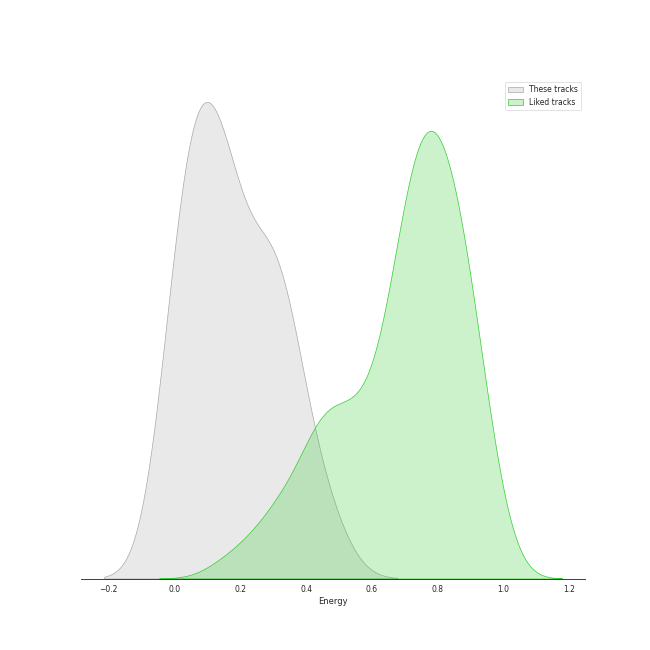
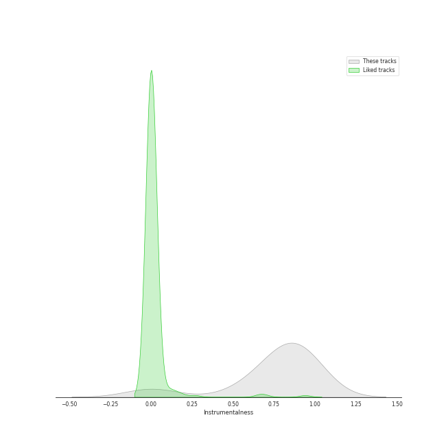
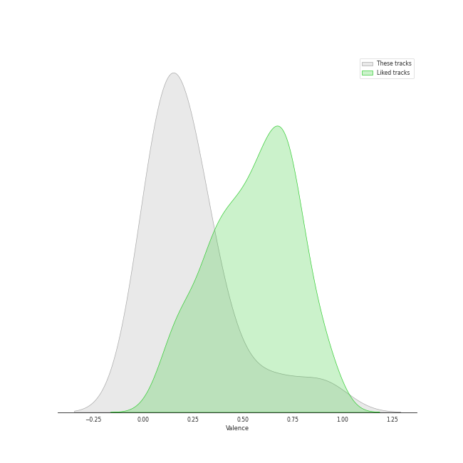

# Audio Features for Mariinsky

## Danceability

| ​ | 10 most Danceable tracks | ​​ | 10 least Danceable tracks |
|:---|:---|:---|:---|
|  | Petrushka: Third Scene: II. Dance of the Ballerina (1911 original version) (0.58) |  | Petrushka: Fourth Scene: III. A Peasant Enters with a Bear (1911 original version) (0.138) |
|  | Petrushka: Fourth Scene: V. Dance of the Coachmen and Grooms (1911 original version) (0.51) |  | Petrushka: First Scene: III. The Conjuring Trick (1911 original version) (0.165) |
|  | Jeu de cartes: III. Third Deal (0.404) |  | Petrushka: Fourth Scene: I. The Shrovetide Fair (towards evening) (1911 original version) (0.205) |
|  | Jeu de cartes: II. Second Deal (0.398) |  | Petrushka: Third Scene: I. The Moor's Cell (1911 original version) (0.215) |
|  | Petrushka: First Scene: IV. Russian Dance (1911 original version) (0.394) |  | Petrushka: Fourth Scene: VII. Petrushka's Death (1911 original version) (0.215) |
|  | Petrushka: Fourth Scene: VI. The Mummers (1911 original version) (0.374) |  | Petrushka: Third Scene: III. Waltz (The Ballerina and the Moor) (1911 original version) (0.247) |
|  | Jeu de cartes: I. First Deal (0.354) |  | Petrushka: Second Scene: I. Petrushka's Cell (1911 original version) (0.292) |
|  | Petrushka: Fourth Scene: II. Dance of the Wet-Nurses (1911 original version) (0.353) |  | Petrushka: First Scene: I. The Shrovetide Fair (Introduction) (1911 original version) (0.302) |
|  | Petrushka: First Scene: II. The Crowds (1911 original version) (0.343) |  | Petrushka: Fourth Scene: IV. The Gypsy Girls Dance (1911 original version) (0.331) |
|  | Petrushka: Fourth Scene: IV. The Gypsy Girls Dance (1911 original version) (0.331) |  | Petrushka: First Scene: II. The Crowds (1911 original version) (0.343) |

## Energy

| ​ | 10 most Energetic tracks | ​​ | 10 least Energetic tracks |
|:---|:---|:---|:---|
|  | Petrushka: Fourth Scene: I. The Shrovetide Fair (towards evening) (1911 original version) (0.453) |  | Petrushka: First Scene: III. The Conjuring Trick (1911 original version) (0.011) |
|  | Petrushka: Fourth Scene: VI. The Mummers (1911 original version) (0.359) |  | Petrushka: Fourth Scene: VII. Petrushka's Death (1911 original version) (0.0123) |
|  | Petrushka: First Scene: IV. Russian Dance (1911 original version) (0.331) |  | Jeu de cartes: II. Second Deal (0.0354) |
|  | Petrushka: Fourth Scene: V. Dance of the Coachmen and Grooms (1911 original version) (0.315) |  | Jeu de cartes: I. First Deal (0.0393) |
|  | Petrushka: Fourth Scene: II. Dance of the Wet-Nurses (1911 original version) (0.292) |  | Petrushka: Third Scene: I. The Moor's Cell (1911 original version) (0.043) |
|  | Petrushka: First Scene: I. The Shrovetide Fair (Introduction) (1911 original version) (0.278) |  | Jeu de cartes: III. Third Deal (0.102) |
|  | Petrushka: First Scene: II. The Crowds (1911 original version) (0.213) |  | Petrushka: Second Scene: I. Petrushka's Cell (1911 original version) (0.105) |
|  | Petrushka: Fourth Scene: IV. The Gypsy Girls Dance (1911 original version) (0.19) |  | Petrushka: Fourth Scene: III. A Peasant Enters with a Bear (1911 original version) (0.129) |
|  | Petrushka: Third Scene: III. Waltz (The Ballerina and the Moor) (1911 original version) (0.152) |  | Petrushka: Third Scene: II. Dance of the Ballerina (1911 original version) (0.144) |
|  | Petrushka: Third Scene: II. Dance of the Ballerina (1911 original version) (0.144) |  | Petrushka: Third Scene: III. Waltz (The Ballerina and the Moor) (1911 original version) (0.152) |

## Speechiness

| ​ | 10 most Speechy tracks | ​​ | 10 least Speechy tracks |
|:---|:---|:---|:---|
|  | Petrushka: Fourth Scene: VI. The Mummers (1911 original version) (0.083) |  | Petrushka: Fourth Scene: III. A Peasant Enters with a Bear (1911 original version) (0.0313) |
|  | Petrushka: Third Scene: III. Waltz (The Ballerina and the Moor) (1911 original version) (0.0644) |  | Petrushka: Fourth Scene: I. The Shrovetide Fair (towards evening) (1911 original version) (0.0359) |
|  | Petrushka: Third Scene: II. Dance of the Ballerina (1911 original version) (0.0518) |  | Petrushka: Fourth Scene: VII. Petrushka's Death (1911 original version) (0.0362) |
|  | Jeu de cartes: III. Third Deal (0.049) |  | Petrushka: Fourth Scene: II. Dance of the Wet-Nurses (1911 original version) (0.0367) |
|  | Petrushka: Second Scene: I. Petrushka's Cell (1911 original version) (0.046) |  | Jeu de cartes: I. First Deal (0.0369) |
|  | Petrushka: Fourth Scene: IV. The Gypsy Girls Dance (1911 original version) (0.0426) |  | Jeu de cartes: II. Second Deal (0.0371) |
|  | Petrushka: First Scene: III. The Conjuring Trick (1911 original version) (0.0414) |  | Petrushka: Third Scene: I. The Moor's Cell (1911 original version) (0.0374) |
|  | Petrushka: First Scene: I. The Shrovetide Fair (Introduction) (1911 original version) (0.041) |  | Petrushka: First Scene: II. The Crowds (1911 original version) (0.0382) |
|  | Petrushka: First Scene: IV. Russian Dance (1911 original version) (0.0407) |  | Petrushka: Fourth Scene: V. Dance of the Coachmen and Grooms (1911 original version) (0.0392) |
|  | Petrushka: Fourth Scene: V. Dance of the Coachmen and Grooms (1911 original version) (0.0392) |  | Petrushka: First Scene: IV. Russian Dance (1911 original version) (0.0407) |

## Acousticness

| ​ | 10 most Acoustic tracks | ​​ | 10 least Acoustic tracks |
|:---|:---|:---|:---|
|  | Petrushka: Fourth Scene: III. A Peasant Enters with a Bear (1911 original version) (0.983) |  | Petrushka: First Scene: III. The Conjuring Trick (1911 original version) (0.817) |
|  | Petrushka: Fourth Scene: II. Dance of the Wet-Nurses (1911 original version) (0.978) |  | Petrushka: Fourth Scene: VII. Petrushka's Death (1911 original version) (0.82) |
|  | Petrushka: First Scene: I. The Shrovetide Fair (Introduction) (1911 original version) (0.975) |  | Petrushka: Fourth Scene: V. Dance of the Coachmen and Grooms (1911 original version) (0.841) |
|  | Petrushka: Fourth Scene: IV. The Gypsy Girls Dance (1911 original version) (0.972) |  | Petrushka: Third Scene: I. The Moor's Cell (1911 original version) (0.873) |
|  | Jeu de cartes: I. First Deal (0.966) |  | Petrushka: Fourth Scene: VI. The Mummers (1911 original version) (0.926) |
|  | Petrushka: Third Scene: II. Dance of the Ballerina (1911 original version) (0.962) |  | Petrushka: Second Scene: I. Petrushka's Cell (1911 original version) (0.926) |
|  | Petrushka: First Scene: II. The Crowds (1911 original version) (0.961) |  | Petrushka: First Scene: IV. Russian Dance (1911 original version) (0.94) |
|  | Petrushka: Fourth Scene: I. The Shrovetide Fair (towards evening) (1911 original version) (0.959) |  | Petrushka: Third Scene: III. Waltz (The Ballerina and the Moor) (1911 original version) (0.945) |
|  | Jeu de cartes: III. Third Deal (0.955) |  | Jeu de cartes: II. Second Deal (0.949) |
|  | Jeu de cartes: II. Second Deal (0.949) |  | Jeu de cartes: III. Third Deal (0.955) |

## Instrumentalness

| ​ | 10 most Instrumental tracks | ​​ | 10 least Instrumental tracks |
|:---|:---|:---|:---|
|  | Petrushka: Fourth Scene: II. Dance of the Wet-Nurses (1911 original version) (0.945) |  | Petrushka: First Scene: III. The Conjuring Trick (1911 original version) (0.000393) |
|  | Petrushka: First Scene: I. The Shrovetide Fair (Introduction) (1911 original version) (0.941) |  | Petrushka: Fourth Scene: VII. Petrushka's Death (1911 original version) (0.00603) |
|  | Petrushka: Fourth Scene: VI. The Mummers (1911 original version) (0.936) |  | Jeu de cartes: I. First Deal (0.561) |
|  | Petrushka: Fourth Scene: III. A Peasant Enters with a Bear (1911 original version) (0.933) |  | Petrushka: Third Scene: II. Dance of the Ballerina (1911 original version) (0.672) |
|  | Petrushka: Third Scene: I. The Moor's Cell (1911 original version) (0.933) |  | Petrushka: Second Scene: I. Petrushka's Cell (1911 original version) (0.678) |
|  | Petrushka: Fourth Scene: IV. The Gypsy Girls Dance (1911 original version) (0.897) |  | Petrushka: First Scene: IV. Russian Dance (1911 original version) (0.775) |
|  | Petrushka: Third Scene: III. Waltz (The Ballerina and the Moor) (1911 original version) (0.879) |  | Jeu de cartes: II. Second Deal (0.8) |
|  | Jeu de cartes: III. Third Deal (0.867) |  | Petrushka: Fourth Scene: V. Dance of the Coachmen and Grooms (1911 original version) (0.809) |
|  | Petrushka: First Scene: II. The Crowds (1911 original version) (0.861) |  | Petrushka: Fourth Scene: I. The Shrovetide Fair (towards evening) (1911 original version) (0.848) |
|  | Petrushka: Fourth Scene: I. The Shrovetide Fair (towards evening) (1911 original version) (0.848) |  | Petrushka: First Scene: II. The Crowds (1911 original version) (0.861) |

## Liveness

| ​ | 10 most Live tracks | ​​ | 10 least Live tracks |
|:---|:---|:---|:---|
|  | Petrushka: First Scene: IV. Russian Dance (1911 original version) (0.558) |  | Petrushka: Third Scene: III. Waltz (The Ballerina and the Moor) (1911 original version) (0.0908) |
|  | Petrushka: Fourth Scene: V. Dance of the Coachmen and Grooms (1911 original version) (0.537) |  | Petrushka: Fourth Scene: VI. The Mummers (1911 original version) (0.0931) |
|  | Petrushka: Fourth Scene: I. The Shrovetide Fair (towards evening) (1911 original version) (0.505) |  | Petrushka: First Scene: III. The Conjuring Trick (1911 original version) (0.101) |
|  | Jeu de cartes: I. First Deal (0.366) |  | Jeu de cartes: II. Second Deal (0.122) |
|  | Petrushka: Fourth Scene: III. A Peasant Enters with a Bear (1911 original version) (0.343) |  | Jeu de cartes: III. Third Deal (0.137) |
|  | Petrushka: First Scene: I. The Shrovetide Fair (Introduction) (1911 original version) (0.328) |  | Petrushka: Fourth Scene: II. Dance of the Wet-Nurses (1911 original version) (0.151) |
|  | Petrushka: First Scene: II. The Crowds (1911 original version) (0.322) |  | Petrushka: Second Scene: I. Petrushka's Cell (1911 original version) (0.165) |
|  | Petrushka: Fourth Scene: VII. Petrushka's Death (1911 original version) (0.239) |  | Petrushka: Third Scene: II. Dance of the Ballerina (1911 original version) (0.172) |
|  | Petrushka: Third Scene: I. The Moor's Cell (1911 original version) (0.205) |  | Petrushka: Fourth Scene: IV. The Gypsy Girls Dance (1911 original version) (0.195) |
|  | Petrushka: Fourth Scene: IV. The Gypsy Girls Dance (1911 original version) (0.195) |  | Petrushka: Third Scene: I. The Moor's Cell (1911 original version) (0.205) |

## Valence

| ​ | 10 most Happy tracks | ​​ | 10 least Happy tracks |
|:---|:---|:---|:---|
|  | Petrushka: Third Scene: II. Dance of the Ballerina (1911 original version) (0.907) |  | Petrushka: Fourth Scene: VII. Petrushka's Death (1911 original version) (0.0377) |
|  | Petrushka: Fourth Scene: II. Dance of the Wet-Nurses (1911 original version) (0.657) |  | Petrushka: Fourth Scene: III. A Peasant Enters with a Bear (1911 original version) (0.0379) |
|  | Petrushka: First Scene: IV. Russian Dance (1911 original version) (0.424) |  | Petrushka: Second Scene: I. Petrushka's Cell (1911 original version) (0.047) |
|  | Petrushka: Fourth Scene: IV. The Gypsy Girls Dance (1911 original version) (0.331) |  | Petrushka: Third Scene: III. Waltz (The Ballerina and the Moor) (1911 original version) (0.0494) |
|  | Jeu de cartes: III. Third Deal (0.316) |  | Jeu de cartes: I. First Deal (0.0951) |
|  | Petrushka: First Scene: I. The Shrovetide Fair (Introduction) (1911 original version) (0.253) |  | Petrushka: Third Scene: I. The Moor's Cell (1911 original version) (0.129) |
|  | Petrushka: Fourth Scene: VI. The Mummers (1911 original version) (0.235) |  | Petrushka: First Scene: III. The Conjuring Trick (1911 original version) (0.134) |
|  | Jeu de cartes: II. Second Deal (0.22) |  | Petrushka: First Scene: II. The Crowds (1911 original version) (0.146) |
|  | Petrushka: Fourth Scene: V. Dance of the Coachmen and Grooms (1911 original version) (0.167) |  | Petrushka: Fourth Scene: I. The Shrovetide Fair (towards evening) (1911 original version) (0.166) |
|  | Petrushka: Fourth Scene: I. The Shrovetide Fair (towards evening) (1911 original version) (0.166) |  | Petrushka: Fourth Scene: V. Dance of the Coachmen and Grooms (1911 original version) (0.167) |

## Tempo

| ​ | 10 most Fast tracks | ​​ | 10 least Fast tracks |
|:---|:---|:---|:---|
|  | Jeu de cartes: III. Third Deal (148.121) |  | Petrushka: Fourth Scene: III. A Peasant Enters with a Bear (1911 original version) (63.584) |
|  | Petrushka: Fourth Scene: VI. The Mummers (1911 original version) (146.396) |  | Petrushka: Fourth Scene: I. The Shrovetide Fair (towards evening) (1911 original version) (73.84) |
|  | Petrushka: Fourth Scene: IV. The Gypsy Girls Dance (1911 original version) (141.274) |  | Petrushka: Third Scene: III. Waltz (The Ballerina and the Moor) (1911 original version) (84.435) |
|  | Petrushka: Fourth Scene: VII. Petrushka's Death (1911 original version) (136.681) |  | Petrushka: First Scene: III. The Conjuring Trick (1911 original version) (93.029) |
|  | Petrushka: First Scene: I. The Shrovetide Fair (Introduction) (1911 original version) (136.598) |  | Petrushka: Third Scene: I. The Moor's Cell (1911 original version) (100.115) |
|  | Petrushka: Fourth Scene: II. Dance of the Wet-Nurses (1911 original version) (134.745) |  | Petrushka: Second Scene: I. Petrushka's Cell (1911 original version) (105.903) |
|  | Petrushka: First Scene: II. The Crowds (1911 original version) (131.067) |  | Petrushka: Third Scene: II. Dance of the Ballerina (1911 original version) (106.172) |
|  | Jeu de cartes: II. Second Deal (129.783) |  | Jeu de cartes: I. First Deal (108.598) |
|  | Petrushka: Fourth Scene: V. Dance of the Coachmen and Grooms (1911 original version) (124.066) |  | Petrushka: First Scene: IV. Russian Dance (1911 original version) (121.095) |
|  | Petrushka: First Scene: IV. Russian Dance (1911 original version) (121.095) |  | Petrushka: Fourth Scene: V. Dance of the Coachmen and Grooms (1911 original version) (124.066) |
