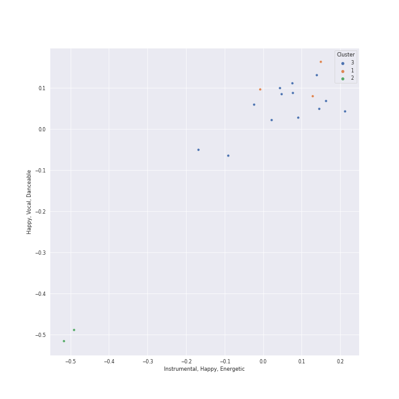

# Clusters in Mariinsky

## Cluster #1

3 tracks

| Art | Track | Album | Artists | Label | 💚 | 🔗 |
|:---|:---|:---|:---|:---|:---|:---|
|  | Petrushka: First Scene: IV. Russian Dance (1911 original version) | Stravinsky: Petrushka, Jeu de cartes | Valery Gergiev, Mariinsky Orchestra, Igor Stravinsky | [Mariinsky](../..) | | [🔗](https://open.spotify.com/track/44YT5PBqXUE1mCPBZWX7J4) |
|  | Petrushka: Fourth Scene: II. Dance of the Wet-Nurses (1911 original version) | Stravinsky: Petrushka, Jeu de cartes | Valery Gergiev, Mariinsky Orchestra, Igor Stravinsky | [Mariinsky](../..) | | [🔗](https://open.spotify.com/track/1doCWMqKSAD9mVLD2nulpq) |
|  | Petrushka: Third Scene: II. Dance of the Ballerina (1911 original version) | Stravinsky: Petrushka, Jeu de cartes | Valery Gergiev, Mariinsky Orchestra, Igor Stravinsky | [Mariinsky](../..) | | [🔗](https://open.spotify.com/track/5CQt9zxHHZiABfdEQoUsAO) |
## Cluster #2

2 tracks

| Art | Track | Album | Artists | Label | 💚 | 🔗 |
|:---|:---|:---|:---|:---|:---|:---|
|  | Petrushka: First Scene: III. The Conjuring Trick (1911 original version) | Stravinsky: Petrushka, Jeu de cartes | Valery Gergiev, Mariinsky Orchestra, Igor Stravinsky | [Mariinsky](../..) | | [🔗](https://open.spotify.com/track/5Ngr7bpBvlYNojEpw72eJ7) |
|  | Petrushka: Fourth Scene: VII. Petrushka's Death (1911 original version) | Stravinsky: Petrushka, Jeu de cartes | Valery Gergiev, Mariinsky Orchestra, Igor Stravinsky | [Mariinsky](../..) | | [🔗](https://open.spotify.com/track/5vmh1dWU5B7GIt4gxcTiYy) |
## Cluster #3

13 tracks

| Art | Track | Album | Artists | Label | 💚 | 🔗 |
|:---|:---|:---|:---|:---|:---|:---|
|  | Jeu de cartes: II. Second Deal | Stravinsky: Petrushka, Jeu de cartes | Valery Gergiev, Mariinsky Orchestra, Igor Stravinsky | [Mariinsky](../..) | | [🔗](https://open.spotify.com/track/01sFYbEnNAR4ZBChyKR1XG) |
|  | Jeu de cartes: III. Third Deal | Stravinsky: Petrushka, Jeu de cartes | Valery Gergiev, Mariinsky Orchestra, Igor Stravinsky | [Mariinsky](../..) | | [🔗](https://open.spotify.com/track/1RmGFbd7C1jv5oBNRHX7cv) |
|  | Petrushka: First Scene: I. The Shrovetide Fair (Introduction) (1911 original version) | Stravinsky: Petrushka, Jeu de cartes | Valery Gergiev, Mariinsky Orchestra, Igor Stravinsky | [Mariinsky](../..) | | [🔗](https://open.spotify.com/track/0aRVTTqvik5P7H0WrUwIhu) |
|  | Petrushka: First Scene: II. The Crowds (1911 original version) | Stravinsky: Petrushka, Jeu de cartes | Valery Gergiev, Mariinsky Orchestra, Igor Stravinsky | [Mariinsky](../..) | | [🔗](https://open.spotify.com/track/2Rb1R3QTqNACnDrwZdt5Ic) |
|  | Petrushka: Fourth Scene: III. A Peasant Enters with a Bear (1911 original version) | Stravinsky: Petrushka, Jeu de cartes | Valery Gergiev, Mariinsky Orchestra, Igor Stravinsky | [Mariinsky](../..) | | [🔗](https://open.spotify.com/track/2sieCbTqWHcEQwIRZyBIfQ) |
|  | Petrushka: Fourth Scene: IV. The Gypsy Girls Dance (1911 original version) | Stravinsky: Petrushka, Jeu de cartes | Valery Gergiev, Mariinsky Orchestra, Igor Stravinsky | [Mariinsky](../..) | | [🔗](https://open.spotify.com/track/1AmGUA9QW34e9clnXYFdWn) |
|  | Petrushka: Fourth Scene: VI. The Mummers (1911 original version) | Stravinsky: Petrushka, Jeu de cartes | Valery Gergiev, Mariinsky Orchestra, Igor Stravinsky | [Mariinsky](../..) | | [🔗](https://open.spotify.com/track/31pNUdNPljYjMahrE35C8h) |
|  | Petrushka: Second Scene: I. Petrushka's Cell (1911 original version) | Stravinsky: Petrushka, Jeu de cartes | Valery Gergiev, Mariinsky Orchestra, Igor Stravinsky | [Mariinsky](../..) | | [🔗](https://open.spotify.com/track/6g0qWuKnsE1js5mo4HAigx) |
|  | Petrushka: Third Scene: I. The Moor's Cell (1911 original version) | Stravinsky: Petrushka, Jeu de cartes | Valery Gergiev, Mariinsky Orchestra, Igor Stravinsky | [Mariinsky](../..) | | [🔗](https://open.spotify.com/track/0PFEP4Rom9u9D9kA8yTkYQ) |
|  | Petrushka: Third Scene: III. Waltz (The Ballerina and the Moor) (1911 original version) | Stravinsky: Petrushka, Jeu de cartes | Valery Gergiev, Mariinsky Orchestra, Igor Stravinsky | [Mariinsky](../..) | | [🔗](https://open.spotify.com/track/5Nz0PKTW9OgraAtvjYJvO9) |