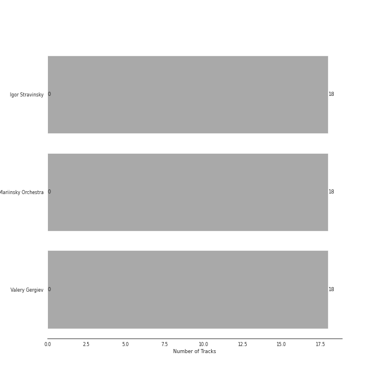
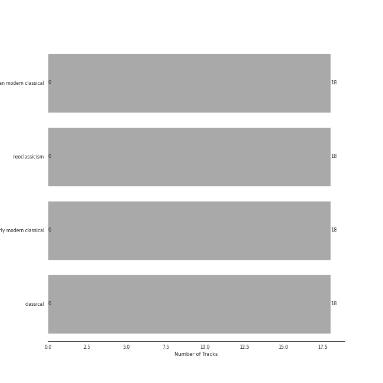

# Mariinsky

18 songs

[See Track Features](audio_features.md)

[See Clusters](clusters/overview.md)

Appears as:
- Mariinsky (18 tracks)

## Top Artists

| Art | Rank | Tracks | 💚 | Artist | 🔗 |
|:---|---:|---:|---:|:---|:---|
|  | 429 | 18 | 0 | Igor Stravinsky | [🔗](https://open.spotify.com/artist/7ie36YytMoKtPiL7tUvmoE) |
|  | 429 | 18 | 0 | Mariinsky Orchestra | [🔗](https://open.spotify.com/artist/2rRUfv2w535SEUV1YO5SP6) |
|  | 429 | 18 | 0 | Valery Gergiev | [🔗](https://open.spotify.com/artist/2LxnoYPOe0FCLC82R3xgO2) |

## Top Albums

| Art | Rank | Tracks | 💚 | Album | Release Date | 🔗 |
|:---|---:|---:|---:|:---|:---|:---|
|  | 637 | 18 | 0 | Stravinsky: Petrushka, Jeu de cartes | 2018-10-19 | [🔗](https://open.spotify.com/album/19fQbFNjlfXgBAFqftKzWA) |

## Genres

| Tracks | 💚 | Genre |
|---:|---:|:---|
| 18 | 0 | [russian modern classical](../../genres/russian_modern_classical/overview.md) |
| 18 | 0 | [neoclassicism](../../genres/neoclassicism/overview.md) |
| 18 | 0 | [early modern classical](../../genres/early_modern_classical/overview.md) |
| 18 | 0 | [classical](../../genres/classical/overview.md) |

## Tracks released under Mariinsky

| Art | Track | Album | Artists | Label | Rank | 💚 | 🔗 |
|:---|:---|:---|:---|:---|---:|:---|:---|
|  | Jeu de cartes: I. First Deal | Stravinsky: Petrushka, Jeu de cartes | Igor Stravinsky, Valery Gergiev, Mariinsky Orchestra | [Mariinsky](.) | 964 | | [🔗](https://open.spotify.com/track/3GLlyHxs9jj5OJtRUw7krB) |
|  | Jeu de cartes: II. Second Deal | Stravinsky: Petrushka, Jeu de cartes | Igor Stravinsky, Valery Gergiev, Mariinsky Orchestra | [Mariinsky](.) | 964 | | [🔗](https://open.spotify.com/track/01sFYbEnNAR4ZBChyKR1XG) |
|  | Jeu de cartes: III. Third Deal | Stravinsky: Petrushka, Jeu de cartes | Igor Stravinsky, Valery Gergiev, Mariinsky Orchestra | [Mariinsky](.) | 964 | | [🔗](https://open.spotify.com/track/1RmGFbd7C1jv5oBNRHX7cv) |
|  | Petrushka: First Scene: I. The Shrovetide Fair (Introduction) (1911 original version) | Stravinsky: Petrushka, Jeu de cartes | Igor Stravinsky, Valery Gergiev, Mariinsky Orchestra | [Mariinsky](.) | 964 | | [🔗](https://open.spotify.com/track/0aRVTTqvik5P7H0WrUwIhu) |
|  | Petrushka: First Scene: II. The Crowds (1911 original version) | Stravinsky: Petrushka, Jeu de cartes | Igor Stravinsky, Valery Gergiev, Mariinsky Orchestra | [Mariinsky](.) | 964 | | [🔗](https://open.spotify.com/track/2Rb1R3QTqNACnDrwZdt5Ic) |
|  | Petrushka: First Scene: III. The Conjuring Trick (1911 original version) | Stravinsky: Petrushka, Jeu de cartes | Igor Stravinsky, Valery Gergiev, Mariinsky Orchestra | [Mariinsky](.) | 964 | | [🔗](https://open.spotify.com/track/5Ngr7bpBvlYNojEpw72eJ7) |
|  | Petrushka: First Scene: IV. Russian Dance (1911 original version) | Stravinsky: Petrushka, Jeu de cartes | Igor Stravinsky, Valery Gergiev, Mariinsky Orchestra | [Mariinsky](.) | 964 | | [🔗](https://open.spotify.com/track/44YT5PBqXUE1mCPBZWX7J4) |
|  | Petrushka: Fourth Scene: I. The Shrovetide Fair (towards evening) (1911 original version) | Stravinsky: Petrushka, Jeu de cartes | Igor Stravinsky, Valery Gergiev, Mariinsky Orchestra | [Mariinsky](.) | 964 | | [🔗](https://open.spotify.com/track/14GWS0o1EeFbGi10ZfdIHi) |
|  | Petrushka: Fourth Scene: II. Dance of the Wet-Nurses (1911 original version) | Stravinsky: Petrushka, Jeu de cartes | Igor Stravinsky, Valery Gergiev, Mariinsky Orchestra | [Mariinsky](.) | 964 | | [🔗](https://open.spotify.com/track/1doCWMqKSAD9mVLD2nulpq) |
|  | Petrushka: Fourth Scene: III. A Peasant Enters with a Bear (1911 original version) | Stravinsky: Petrushka, Jeu de cartes | Igor Stravinsky, Valery Gergiev, Mariinsky Orchestra | [Mariinsky](.) | 964 | | [🔗](https://open.spotify.com/track/2sieCbTqWHcEQwIRZyBIfQ) |

See all tracks

| Art | Track | Album | Artists | Label | Rank | 💚 | 🔗 |
|:---|:---|:---|:---|:---|---:|:---|:---|
|  | Petrushka: Fourth Scene: IV. The Gypsy Girls Dance (1911 original version) | Stravinsky: Petrushka, Jeu de cartes | Igor Stravinsky, Valery Gergiev, Mariinsky Orchestra | [Mariinsky](.) | 964 | | [🔗](https://open.spotify.com/track/1AmGUA9QW34e9clnXYFdWn) |
|  | Petrushka: Fourth Scene: V. Dance of the Coachmen and Grooms (1911 original version) | Stravinsky: Petrushka, Jeu de cartes | Igor Stravinsky, Valery Gergiev, Mariinsky Orchestra | [Mariinsky](.) | 964 | | [🔗](https://open.spotify.com/track/0g12fQ8G4QUWX0Kbn2Q6r0) |
|  | Petrushka: Fourth Scene: VI. The Mummers (1911 original version) | Stravinsky: Petrushka, Jeu de cartes | Igor Stravinsky, Valery Gergiev, Mariinsky Orchestra | [Mariinsky](.) | 964 | | [🔗](https://open.spotify.com/track/31pNUdNPljYjMahrE35C8h) |
|  | Petrushka: Fourth Scene: VII. Petrushka's Death (1911 original version) | Stravinsky: Petrushka, Jeu de cartes | Igor Stravinsky, Valery Gergiev, Mariinsky Orchestra | [Mariinsky](.) | 964 | | [🔗](https://open.spotify.com/track/5vmh1dWU5B7GIt4gxcTiYy) |
|  | Petrushka: Second Scene: I. Petrushka's Cell (1911 original version) | Stravinsky: Petrushka, Jeu de cartes | Igor Stravinsky, Valery Gergiev, Mariinsky Orchestra | [Mariinsky](.) | 964 | | [🔗](https://open.spotify.com/track/6g0qWuKnsE1js5mo4HAigx) |
|  | Petrushka: Third Scene: I. The Moor's Cell (1911 original version) | Stravinsky: Petrushka, Jeu de cartes | Igor Stravinsky, Valery Gergiev, Mariinsky Orchestra | [Mariinsky](.) | 964 | | [🔗](https://open.spotify.com/track/0PFEP4Rom9u9D9kA8yTkYQ) |
|  | Petrushka: Third Scene: II. Dance of the Ballerina (1911 original version) | Stravinsky: Petrushka, Jeu de cartes | Igor Stravinsky, Valery Gergiev, Mariinsky Orchestra | [Mariinsky](.) | 964 | | [🔗](https://open.spotify.com/track/5CQt9zxHHZiABfdEQoUsAO) |
|  | Petrushka: Third Scene: III. Waltz (The Ballerina and the Moor) (1911 original version) | Stravinsky: Petrushka, Jeu de cartes | Igor Stravinsky, Valery Gergiev, Mariinsky Orchestra | [Mariinsky](.) | 964 | | [🔗](https://open.spotify.com/track/5Nz0PKTW9OgraAtvjYJvO9) |

