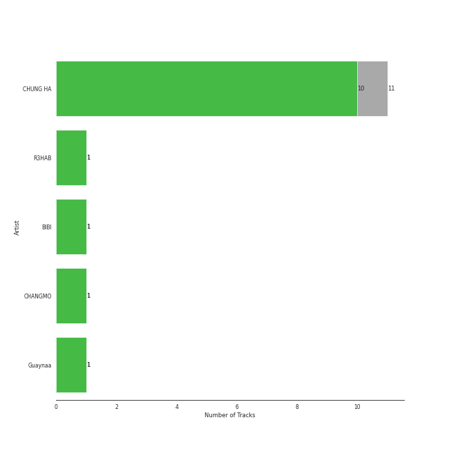
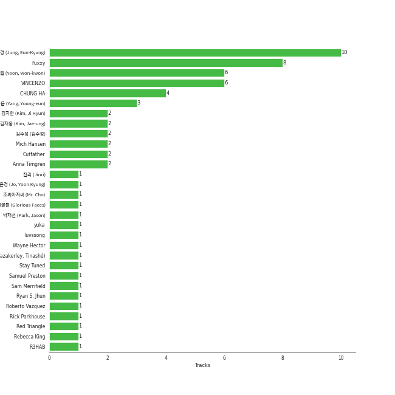

# MNH ENTERTAINMENT

11 songs

[See Track Features](audio_features.md)

[See Clusters](clusters/overview.md)

Appears as:
- MNH ENTERTAINMENT (11 tracks)

## Top Artists

| Art | Rank | Tracks | 💚 | Artist | 🔗 |
|:---|---:|---:|---:|:---|:---|
|  | 14 | 10 | 9 | [CHUNG HA](../../artists/chung_ha/overview.md) | [🔗](https://open.spotify.com/artist/2PSJ6YriU7JsFucxACpU7Y) |
| | 416 | 1 | 1 | CHUNG HA | [🔗](https://open.spotify.com/artist/73tdwqQJWnBdf1jyUeMwyu) |
|  | 161 | 1 | 1 | R3HAB | [🔗](https://open.spotify.com/artist/6cEuCEZu7PAE9ZSzLLc2oQ) |
|  | 71 | 1 | 1 | [BIBI](../../artists/bibi/overview.md) | [🔗](https://open.spotify.com/artist/6UbmqUEgjLA6jAcXwbM1Z9) |
|  | 102 | 1 | 1 | CHANGMO | [🔗](https://open.spotify.com/artist/3hvinNZRzTLoREmqFiKr1b) |
|  | 236 | 1 | 1 | Guaynaa | [🔗](https://open.spotify.com/artist/0BqURncJM5B1BBu7UM51eq) |

## Top Albums

| Art | Rank | Tracks | 💚 | Album | Release Date | 🔗 |
|:---|---:|---:|---:|:---|:---|:---|
|  | 165 | 7 | 7 | Querencia | 2021-02-15 | [🔗](https://open.spotify.com/album/1p2OBhqq0d1N8awjHV9xA3) |
|  | 613 | 3 | 2 | Bare&Rare, Pt. 1 | 2022-07-11 | [🔗](https://open.spotify.com/album/0fgLDYoqdQw5bhzPFWvclR) |
|  | 613 | 1 | 1 | Killing Me | 2021-11-29 | [🔗](https://open.spotify.com/album/21jf5kUkK5nHYTuZ5GRZVW) |

## Genres

| Tracks | 💚 | Genre |
|---:|---:|:---|
| 10 | 9 | [k-pop](../../genres/k-pop/overview.md) |

## Top Producers

| Art | Producer | Tracks | Credit Types |
|:---|:---|---:|:---|
| | [정은경 (Jung, Eun-Kyung)](../../producers/정은경_(jung,_eun-kyung)/overview.md) | 10 | Producer |
| | [Fuxxy](../../producers/fuxxy/overview.md) | 8 | Lyricist, Songwriter, Arranger |
| | [VINCENZO](../../producers/vincenzo/overview.md) | 6 | Arranger, Lyricist, Songwriter |
| | 윤원권 (Yoon, Won-kwon) | 6 | Producer |
|  | [CHUNG HA](../../artists/chung_ha/overview.md) | 4 | Lyricist |
| | [양영은 (Yang, Young-eun)](../../producers/양영은_(yang,_young-eun)/overview.md) | 3 | Producer |
| | Cutfather | 2 | Arranger |
| | 김지현 (Kim, Ji Hyun) | 2 | Producer |
| | 김재웅 (Kim, Jae-ung) | 2 | Arranger, Lyricist, Songwriter |
| | Anna Timgren | 2 | Lyricist, Songwriter |

View all

| Art | Producer | Tracks | Credit Types |
|:---|:---|---:|:---|
| | Mich Hansen | 2 | Songwriter, Lyricist |
| | 김수정 (김수정) | 2 | Producer |
| | Jeremy G | 1 | Songwriter |
| | 박재선 (Park, Jason) | 1 | Producer |
|  | R3HAB | 1 | Producer |
| | Roberto Vazquez | 1 | Producer |
| | DRK | 1 | Producer |
| | Stay Tuned | 1 | Producer |
| | Sam Merrifield | 1 | Songwriter |
| | Daniel Davidsen | 1 | Arranger, Lyricist, Songwriter |
| | Celine Svanbäck (Svanbäck, Celine) | 1 | Songwriter |
| | 진리 (Jinri) | 1 | Lyricist, Songwriter |
| | KLOË (KLOE) | 1 | Lyricist, Songwriter |
| | Rick Parkhouse | 1 | Lyricist, Songwriter |
| | Michael Fatkin | 1 | Arranger, Songwriter |
| | Daniel Mirza Salcedo | 1 | Arranger, Lyricist, Songwriter |
|  | CHANGMO | 1 | Lyricist, Producer, Songwriter |
| | Daniel Kim | 1 | Arranger, Songwriter |
| | Lao Ra | 1 | Lyricist, Songwriter |
| | Jeppe London Bilsby | 1 | Arranger, Songwriter |
| | Rebecca King | 1 | Lyricist |
| | Prime Time | 1 | Songwriter |
| | Peter Hanna | 1 | Lyricist |
| | Lucas | 1 | Lyricist, Songwriter |
|  | [BIBI](../../artists/bibi/overview.md) | 1 | Lyricist |
| | Red Triangle | 1 | Arranger |
| | Alawn | 1 | Producer |
| | 영광의 얼굴들 (Glorious Faces) | 1 | Arranger, Songwriter |
| | George Tizzard | 1 | Lyricist, Songwriter |
| | Musikality | 1 | Arranger, Songwriter |
| | Dawn Elektra | 1 | Songwriter |
| | luvssong | 1 | Lyricist |
| | Tinashé Fazakerley (Fazakerley, Tinashé) | 1 | Arranger, Lyricist, Songwriter |
| | Wayne Hector | 1 | Lyricist, Songwriter |
| | 조씨아저씨 (Mr. Cho) | 1 | Producer |
|  | Guaynaa | 1 | Lyricist |
| | [Ryan S. Jhun](../../producers/ryan_s__jhun/overview.md) | 1 | Arranger, Lyricist, Songwriter |
| | BXN | 1 | Arranger, Lyricist, Songwriter |
| | [조윤경 (Jo, Yoon Kyung)](../../producers/조윤경_(jo,_yoon_kyung)/overview.md) | 1 | Lyricist |
| | Samuel Preston | 1 | Lyricist, Songwriter |
| | yuka | 1 | Arranger, Songwriter |

## Tracks released under MNH ENTERTAINMENT

| Art | Track | Album | Artists | Label | Rank | 💚 | 🔗 |
|:---|:---|:---|:---|:---|---:|:---|:---|
|  | Dream of You (with R3HAB) | Querencia | [CHUNG HA](../../artists/chung_ha/overview.md), R3HAB | [MNH ENTERTAINMENT](.) | 285 | 💚 | [🔗](https://open.spotify.com/track/1d8Arh7PushRWWJRs41rSa) |
|  | Demente (feat. Guaynaa) | Querencia | [CHUNG HA](../../artists/chung_ha/overview.md), Guaynaa | [MNH ENTERTAINMENT](.) | 383 | 💚 | [🔗](https://open.spotify.com/track/0NhHFXC06r5kK1rTUuOjxM) |
|  | Bicycle | Querencia | [CHUNG HA](../../artists/chung_ha/overview.md) | [MNH ENTERTAINMENT](.) | 390 | 💚 | [🔗](https://open.spotify.com/track/7wDVvxMUdW5MtJUqFtuXUz) |
|  | Stay Tonight | Querencia | [CHUNG HA](../../artists/chung_ha/overview.md) | [MNH ENTERTAINMENT](.) | 500 | 💚 | [🔗](https://open.spotify.com/track/7Cn6R7YB4EjQkfci9DdceG) |
|  | Flying on Faith | Querencia | [CHUNG HA](../../artists/chung_ha/overview.md) | [MNH ENTERTAINMENT](.) | 925 | 💚 | [🔗](https://open.spotify.com/track/34v3Sm3KEc7DtGPP50jyrl) |
|  | Masquerade | Querencia | [CHUNG HA](../../artists/chung_ha/overview.md) | [MNH ENTERTAINMENT](.) | 925 | 💚 | [🔗](https://open.spotify.com/track/0AABiBAIYQCMpLI0ODbDDL) |
|  | PLAY (feat. Changmo) | Querencia | [CHUNG HA](../../artists/chung_ha/overview.md), CHANGMO | [MNH ENTERTAINMENT](.) | 925 | 💚 | [🔗](https://open.spotify.com/track/6UM5HKVVm1cjOQhUJB4Ft3) |
|  | Killing Me | Killing Me | CHUNG HA | [MNH ENTERTAINMENT](.) | 925 | 💚 | [🔗](https://open.spotify.com/track/3QD0Y1tTngihByjdWC99lG) |
|  | Crazy Like You (feat. BIBI) | Bare&Rare, Pt. 1 | [CHUNG HA](../../artists/chung_ha/overview.md), [BIBI](../../artists/bibi/overview.md) | [MNH ENTERTAINMENT](.) | 925 | 💚 | [🔗](https://open.spotify.com/track/0oUK4m2wNIBPfejlcB1N9k) |
|  | Good Night My Princess | Bare&Rare, Pt. 1 | [CHUNG HA](../../artists/chung_ha/overview.md) | [MNH ENTERTAINMENT](.) | 925 | | [🔗](https://open.spotify.com/track/12QoF5mIoZ1ZrVZFoc2Nwl) |

See all tracks

| Art | Track | Album | Artists | Label | Rank | 💚 | 🔗 |
|:---|:---|:---|:---|:---|---:|:---|:---|
|  | Sparkling | Bare&Rare, Pt. 1 | [CHUNG HA](../../artists/chung_ha/overview.md) | [MNH ENTERTAINMENT](.) | 925 | 💚 | [🔗](https://open.spotify.com/track/6TzU11huC8Hz4FVEsvCeE7) |

