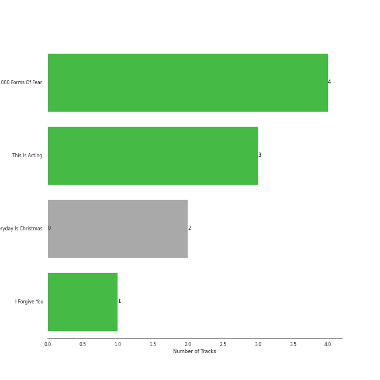
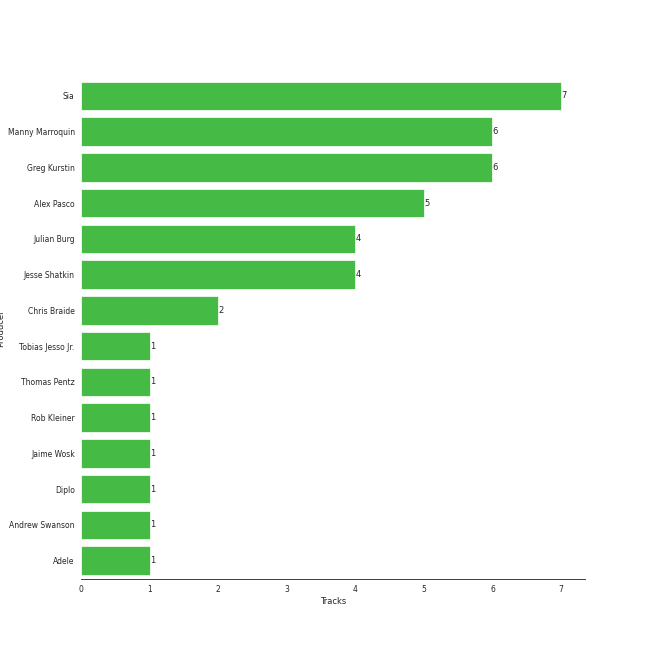

# Monkey Puzzle

10 songs

Appears as:
- Monkey Puzzle Records/RCA Records (7 tracks)
- Monkey Puzzle/Atlantic (3 tracks)

## Top Artists

| Art | Rank | Tracks | 💚 | Artist | 🔗 |
|:---|---:|---:|---:|:---|:---|
|  | 159 | 10 | 8 | [Sia](../../artists/sia/overview.md) | [🔗](https://open.spotify.com/artist/5WUlDfRSoLAfcVSX1WnrxN) |

## Top Albums

| Art | Rank | Tracks | 💚 | Album | Release Date | 🔗 |
|:---|---:|---:|---:|:---|:---|:---|
|  | 591 | 4 | 4 | 1000 Forms Of Fear (Deluxe Version) | 2015-05-04 | [🔗](https://open.spotify.com/album/6FdNvoO5sF4EKwCX9je1MH) |
|  | 591 | 3 | 3 | This Is Acting (Deluxe Version) | 2016-10-21 | [🔗](https://open.spotify.com/album/2eV6DIPDnGl1idcjww6xyX) |
|  | 319 | 2 | 0 | Everyday Is Christmas (Deluxe Edition) | 2018-11-01 | [🔗](https://open.spotify.com/album/2vcGYJcPfXUmCdcXXqqukg) |
|  | 591 | 1 | 1 | I Forgive You | 2024-04-12 | [🔗](https://open.spotify.com/album/3RPlxsjui6dOA6qMDBH70E) |

## Genres

| Tracks | 💚 | Genre |
|---:|---:|:---|
| 10 | 8 | [pop](../../genres/pop/overview.md) |
| 10 | 8 | australian dance |

## Top Producers

| Art | Producer | Tracks | Credit Types |
|:---|:---|---:|:---|
|  | [Sia](../../artists/sia/overview.md) | 7 | Producer, Songwriter |
| | [Manny Marroquin](../../producers/manny_marroquin/overview.md) | 6 | Producer |
| | [Greg Kurstin](../../producers/greg_kurstin/overview.md) | 6 | Producer, Songwriter |
| | Alex Pasco | 5 | Producer |
| | Jesse Shatkin | 4 | Producer, Songwriter |
| | Julian Burg | 4 | Producer |
| | Chris Braide | 2 | Producer, Songwriter |
| | Jaime Wosk | 1 | Producer |
| | Tobias Jesso Jr. | 1 | Songwriter |
| | Rob Kleiner | 1 | Producer |

View all

| Art | Producer | Tracks | Credit Types |
|:---|:---|---:|:---|
| | Thomas Pentz | 1 | Songwriter |
|  | Diplo | 1 | Producer |
|  | [Adele](../../artists/adele/overview.md) | 1 | Songwriter |
| | Andrew Swanson | 1 | Producer, Songwriter |

## Tracks released under Monkey Puzzle

| Art | Track | Album | Artists | Label | Rank | 💚 | 🔗 |
|:---|:---|:---|:---|:---|---:|:---|:---|
|  | Santa's Coming for Us | Everyday Is Christmas (Deluxe Edition) | [Sia](../../artists/sia/overview.md) | [Atlantic Records](../atlantic_records), [Monkey Puzzle](.) | 447 | | [🔗](https://open.spotify.com/track/1N1ZpYUJc9fwrqk53FGgWv) |
|  | Big Girls Cry | 1000 Forms Of Fear (Deluxe Version) | [Sia](../../artists/sia/overview.md) | [Monkey Puzzle](.), [RCA Records Label](../rca_records_label) | 880 | 💚 | [🔗](https://open.spotify.com/track/7zE6pyXLjUCOy8PG0UL5SZ) |
|  | Chandelier | 1000 Forms Of Fear (Deluxe Version) | [Sia](../../artists/sia/overview.md) | [Monkey Puzzle](.), [RCA Records Label](../rca_records_label) | 880 | 💚 | [🔗](https://open.spotify.com/track/2s1sdSqGcKxpPr5lCl7jAV) |
|  | Elastic Heart | 1000 Forms Of Fear (Deluxe Version) | [Sia](../../artists/sia/overview.md) | [Monkey Puzzle](.), [RCA Records Label](../rca_records_label) | 880 | 💚 | [🔗](https://open.spotify.com/track/5S9lfZu1YF8xKkgSsqL2Bd) |
|  | Eye of the Needle | 1000 Forms Of Fear (Deluxe Version) | [Sia](../../artists/sia/overview.md) | [Monkey Puzzle](.), [RCA Records Label](../rca_records_label) | 880 | 💚 | [🔗](https://open.spotify.com/track/6H8UxS43KArEIu2vGZI9Dj) |
|  | Alive | This Is Acting (Deluxe Version) | [Sia](../../artists/sia/overview.md) | [Monkey Puzzle](.), [RCA Records Label](../rca_records_label) | 880 | 💚 | [🔗](https://open.spotify.com/track/25R5Tdr4K7ENb6umHzdCXn) |
|  | Bird Set Free | This Is Acting (Deluxe Version) | [Sia](../../artists/sia/overview.md) | [Monkey Puzzle](.), [RCA Records Label](../rca_records_label) | 880 | 💚 | [🔗](https://open.spotify.com/track/6MowG7MRVgPfGlCMsXKMJ2) |
|  | Cheap Thrills | This Is Acting (Deluxe Version) | [Sia](../../artists/sia/overview.md) | [Monkey Puzzle](.), [RCA Records Label](../rca_records_label) | 880 | 💚 | [🔗](https://open.spotify.com/track/3S4px9f4lceWdKf0gWciFu) |
|  | Snowman | Everyday Is Christmas (Deluxe Edition) | [Sia](../../artists/sia/overview.md) | [Atlantic Records](../atlantic_records), [Monkey Puzzle](.) | 880 | | [🔗](https://open.spotify.com/track/7uoFMmxln0GPXQ0AcCBXRq) |
|  | I Forgive You | I Forgive You | [Sia](../../artists/sia/overview.md) | [Atlantic Records](../atlantic_records), [Monkey Puzzle](.) | 880 | 💚 | [🔗](https://open.spotify.com/track/2jh0kJheW38ljJucWMoaG6) |
