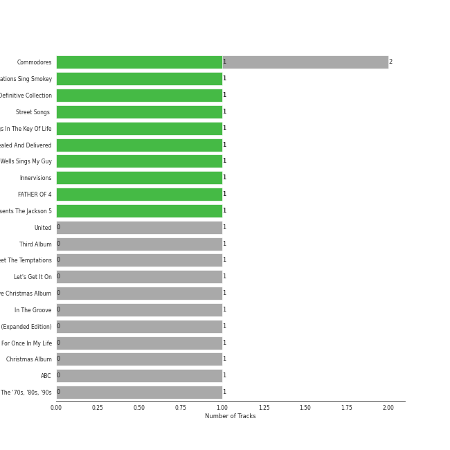

# MOTOWN

13 songs

Appears as:
- UNI/MOTOWN (8 tracks)
- Motown (5 tracks)

## Top Artists

See all 5 artists

|   Number of Tracks | Art                                                                                              | Artist          | 🔗                                                           |
|-------------------:|:-------------------------------------------------------------------------------------------------|:----------------|:------------------------------------------------------------|
|                  4 |  | Stevie Wonder   | [🔗](https://open.spotify.com/artist/7guDJrEfX3qb6FEbdPA5qi) |
|                  4 |  | The Temptations | [🔗](https://open.spotify.com/artist/3RwQ26hR2tJtA8F9p2n7jG) |
|                  3 |  | The Jackson 5   | [🔗](https://open.spotify.com/artist/2iE18Oxc8YSumAU232n4rW) |
|                  1 |  | Commodores      | [🔗](https://open.spotify.com/artist/6twIAGnYuIT1pncMAsXnEm) |
|                  1 |  | Mary Wells      | [🔗](https://open.spotify.com/artist/1cjZk1xXn3YCToNg3uJpA7) |

## Top Albums

See all 13 albums

|   Number of Tracks | Art                                                                                              | Album                                                                                                   | 🔗                                                          |
|-------------------:|:-------------------------------------------------------------------------------------------------|:--------------------------------------------------------------------------------------------------------|:-----------------------------------------------------------|
|                  1 |  | Third Album                                                                                             | [🔗](https://open.spotify.com/album/5d6X8oegJmu9XKn9UBAswG) |
|                  1 |  | The Temptations Sing Smokey                                                                             | [🔗](https://open.spotify.com/album/45tweuKI0zdh8zgKo05cTw) |
|                  1 |  | The Definitive Collection                                                                               | [🔗](https://open.spotify.com/album/4E1itnJOhTMRSATNaxh0Sq) |
|                  1 |  | Songs In The Key Of Life                                                                                | [🔗](https://open.spotify.com/album/6YUCc2RiXcEKS9ibuZxjt0) |
|                  1 |  | Signed, Sealed And Delivered                                                                            | [🔗](https://open.spotify.com/album/54ootLtDyMZFr9obtWQvvO) |
|                  1 |  | Meet The Temptations                                                                                    | [🔗](https://open.spotify.com/album/199rfdL0k6q5ReLA7V4KMt) |
|                  1 |  | Mary Wells Sings My Guy                                                                                 | [🔗](https://open.spotify.com/album/6pUoPt9A6P1G8YJ5vw6GBP) |
|                  1 |  | Gettin' Ready (Expanded Edition)                                                                        | [🔗](https://open.spotify.com/album/3RE8NUULcBzFvVtCmlI4lb) |
|                  1 |  | For Once In My Life                                                                                     | [🔗](https://open.spotify.com/album/3pPBbp1Nl9n1AM9xFpdKtZ) |
|                  1 |  | Diana Ross Presents The Jackson 5                                                                       | [🔗](https://open.spotify.com/album/51uoKRa8vT5SULrlF8s2t1) |
|                  1 |  | Commodores                                                                                              | [🔗](https://open.spotify.com/album/2tzbNCAUTmW4MIM2Ulvrwl) |
|                  1 |  | ABC                                                                                                     | [🔗](https://open.spotify.com/album/3btVhknqDeGAEd1Qj7lL57) |
|                  1 |  | 20th Century Masters: The Millennium Collection: Best Of The Temptations, Vol. 2 - The '70s, '80s, '90s | [🔗](https://open.spotify.com/album/2kzUxFepw1uLjbgqV537eP) |

## Genres

See all 10 genres

|   Number of Tracks | Genre                                           |
|-------------------:|:------------------------------------------------|
|                 12 | motown                                          |
|                 10 | soul                                            |
|                  9 | funk                                            |
|                  8 | [adult standards](../genres/adult_standards.md) |
|                  5 | quiet storm                                     |
|                  5 | classic soul                                    |
|                  4 | memphis soul                                    |
|                  1 | [soft rock](../genres/soft_rock.md)             |
|                  1 | [mellow gold](../genres/mellow_gold.md)         |
|                  1 | disco                                           |

## Tracks released under MOTOWN

| Art                                                                                              | Track                                     | Album                                                                                                   | Artists         | Label                | 💚   | 🔗                                                          |
|:-------------------------------------------------------------------------------------------------|:------------------------------------------|:--------------------------------------------------------------------------------------------------------|:----------------|:---------------------|:----|:-----------------------------------------------------------|
|  | Easy                                      | Commodores                                                                                              | Commodores      | [Motown](motown.md)  | 💚   | [🔗](https://open.spotify.com/track/1JQ6Xm1JrvHfvAqhl5pwaA) |
|  | My Guy                                    | Mary Wells Sings My Guy                                                                                 | Mary Wells      | [UNI/MOTOWN](uni.md) | 💚   | [🔗](https://open.spotify.com/track/4591VqUIXysNlmI5NcAIUd) |
|  | For Once In My Life                       | For Once In My Life                                                                                     | Stevie Wonder   | [Motown](motown.md)  |     | [🔗](https://open.spotify.com/track/4kP69y3GKHi9tXckfgp4bK) |
|  | Signed, Sealed, Delivered (I'm Yours)     | Signed, Sealed And Delivered                                                                            | Stevie Wonder   | [UNI/MOTOWN](uni.md) | 💚   | [🔗](https://open.spotify.com/track/2eF8pWbiivYsYRpbntYsnc) |
|  | Isn't She Lovely                          | Songs In The Key Of Life                                                                                | Stevie Wonder   | [UNI/MOTOWN](uni.md) |     | [🔗](https://open.spotify.com/track/6RANU8AS5ICU5PEHh8BYtH) |
|  | Superstition - Single Version             | The Definitive Collection                                                                               | Stevie Wonder   | [UNI/MOTOWN](uni.md) | 💚   | [🔗](https://open.spotify.com/track/1h2xVEoJORqrg71HocgqXd) |
|  | I Want You Back                           | Diana Ross Presents The Jackson 5                                                                       | The Jackson 5   | [UNI/MOTOWN](uni.md) | 💚   | [🔗](https://open.spotify.com/track/5LxvwujISqiB8vpRYv887S) |
|  | ABC                                       | ABC                                                                                                     | The Jackson 5   | [Motown](motown.md)  |     | [🔗](https://open.spotify.com/track/6wDviYDtmSDZ0S6TVMM9Vc) |
|  | I'll Be There                             | Third Album                                                                                             | The Jackson 5   | [UNI/MOTOWN](uni.md) | 💚   | [🔗](https://open.spotify.com/track/5RdhBLmB4DyFHLglRrfx63) |
|  | The Way You Do The Things You Do          | Meet The Temptations                                                                                    | The Temptations | [Motown](motown.md)  |     | [🔗](https://open.spotify.com/track/3496rr5XSGD6n1Z1OKXovb) |
|  | My Girl                                   | The Temptations Sing Smokey                                                                             | The Temptations | [UNI/MOTOWN](uni.md) | 💚   | [🔗](https://open.spotify.com/track/745H5CctFr12Mo7cqa1BMH) |
|  | Ain't Too Proud To Beg                    | Gettin' Ready (Expanded Edition)                                                                        | The Temptations | [Motown](motown.md)  |     | [🔗](https://open.spotify.com/track/4CoGNqLap7UGU5Q3VdKug0) |
|  | Papa Was A Rollin' Stone - Single Version | 20th Century Masters: The Millennium Collection: Best Of The Temptations, Vol. 2 - The '70s, '80s, '90s | The Temptations | [UNI/MOTOWN](uni.md) |     | [🔗](https://open.spotify.com/track/7MiLmLbwNoyf47xQ4TCVYp) |
