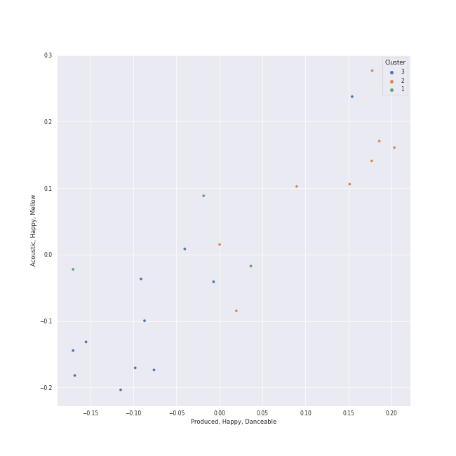

# Clusters in MOTOWN

## Cluster #1

5 tracks

| Art | Track | Album | Artists | Label | Rank | 💚 | 🔗 |
|:---|:---|:---|:---|:---|---:|:---|:---|
|  | I'll Be There | Third Album | The Jackson 5 | [MOTOWN](../..), [UNI](../../../uni) | nan | | [🔗](https://open.spotify.com/track/5RdhBLmB4DyFHLglRrfx63) |
|  | Easy | Commodores | Commodores | [Motown](../..) | nan | 💚 | [🔗](https://open.spotify.com/track/1JQ6Xm1JrvHfvAqhl5pwaA) |
|  | I Heard It Through The Grapevine | In The Groove | Marvin Gaye | [Motown](../..) | nan | | [🔗](https://open.spotify.com/track/1tqT6DhmsrtQgyCKUwotiw) |
|  | My Girl | The Temptations Sing Smokey | The Temptations | [MOTOWN](../..), [UNI](../../../uni) | nan | 💚 | [🔗](https://open.spotify.com/track/745H5CctFr12Mo7cqa1BMH) |
|  | Clout (feat. Cardi B) | FATHER OF 4 | Offset, Cardi B | [Quality Control Music/Motown Records](../..) | nan | 💚 | [🔗](https://open.spotify.com/track/59ywHNwwchG4nZJMLyxSzd) |
## Cluster #2

7 tracks

| Art | Track | Album | Artists | Label | Rank | 💚 | 🔗 |
|:---|:---|:---|:---|:---|---:|:---|:---|
|  | Santa Claus Is Coming To Town | Jackson Five Christmas Album | The Jackson 5 | [MOTOWN](../..), [UNI](../../../uni) | nan | | [🔗](https://open.spotify.com/track/4rMWDm28mERZcRPc1f3yir) |
|  | ABC | ABC | The Jackson 5 | [Motown](../..) | nan | | [🔗](https://open.spotify.com/track/6D8kc7RO0rqBLSo2YPflJ5) |
|  | Ain't No Mountain High Enough | United | Marvin Gaye, Tammi Terrell | [MOTOWN](../..), [UNI](../../../uni) | nan | | [🔗](https://open.spotify.com/track/7tqhbajSfrz2F7E1Z75ASX) |
|  | Super Freak | Street Songs (Deluxe Edition) | Rick James | [Motown](../..) | nan | 💚 | [🔗](https://open.spotify.com/track/2dCmGcEOQrMQhMMS8Vj7Ca) |
|  | Ain't Too Proud To Beg | Gettin' Ready (Expanded Edition) | The Temptations | [Motown](../..) | nan | | [🔗](https://open.spotify.com/track/4CoGNqLap7UGU5Q3VdKug0) |
|  | Papa Was A Rollin' Stone - Single Version | 20th Century Masters: The Millennium Collection: Best Of The Temptations, Vol. 2 - The '70s, '80s, '90s | The Temptations | [MOTOWN](../..), [UNI](../../../uni) | nan | | [🔗](https://open.spotify.com/track/7MiLmLbwNoyf47xQ4TCVYp) |
|  | My Guy | Mary Wells Sings My Guy | Mary Wells | [MOTOWN](../..), [UNI](../../../uni) | nan | 💚 | [🔗](https://open.spotify.com/track/4591VqUIXysNlmI5NcAIUd) |
## Cluster #3

10 tracks

| Art | Track | Album | Artists | Label | Rank | 💚 | 🔗 |
|:---|:---|:---|:---|:---|---:|:---|:---|
|  | Higher Ground | Innervisions | Stevie Wonder | [Motown](../..) | nan | 💚 | [🔗](https://open.spotify.com/track/0dMd4rilfd6gPbXaLpNYhu) |
|  | Superstition - Single Version | The Definitive Collection | Stevie Wonder | [MOTOWN](../..), [UNI](../../../uni) | nan | 💚 | [🔗](https://open.spotify.com/track/1h2xVEoJORqrg71HocgqXd) |
|  | Signed, Sealed, Delivered (I'm Yours) | Signed, Sealed And Delivered | Stevie Wonder | [MOTOWN](../..), [UNI](../../../uni) | nan | 💚 | [🔗](https://open.spotify.com/track/2eF8pWbiivYsYRpbntYsnc) |
|  | For Once In My Life | For Once In My Life | Stevie Wonder | [Motown](../..) | nan | | [🔗](https://open.spotify.com/track/4kP69y3GKHi9tXckfgp4bK) |
|  | Isn't She Lovely | Songs In The Key Of Life | Stevie Wonder | [MOTOWN](../..), [UNI](../../../uni) | nan | 💚 | [🔗](https://open.spotify.com/track/6RANU8AS5ICU5PEHh8BYtH) |
|  | I Saw Mommy Kissing Santa Claus | Christmas Album | The Jackson 5 | [MOTOWN](../..), [UNI](../../../uni) | nan | | [🔗](https://open.spotify.com/track/15sxLiiChE5dCW3Y756oas) |
|  | I Want You Back | Diana Ross Presents The Jackson 5 | The Jackson 5 | [MOTOWN](../..), [UNI](../../../uni) | nan | 💚 | [🔗](https://open.spotify.com/track/5LxvwujISqiB8vpRYv887S) |
|  | Brick House | Commodores | Commodores | [Motown](../..) | nan | | [🔗](https://open.spotify.com/track/5VJjhHyG8NZ5xdgG6uTb3P) |
|  | Let's Get It On | Let's Get It On | Marvin Gaye | [Motown](../..) | nan | | [🔗](https://open.spotify.com/track/627teoJpK7qZOxRRY8TNnv) |
|  | The Way You Do The Things You Do | Meet The Temptations | The Temptations | [Motown](../..) | nan | | [🔗](https://open.spotify.com/track/3496rr5XSGD6n1Z1OKXovb) |