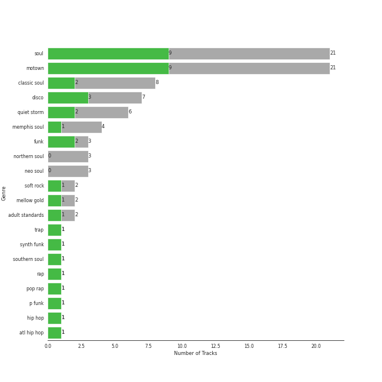

# MOTOWN

22 songs

[See Track Features](audio_features.md)

[See Clusters](clusters/overview.md)

Appears as:
- UNI/MOTOWN (11 tracks)
- Motown (10 tracks)
- Quality Control Music/Motown Records (1 tracks)

## Top Artists

| Art | Tracks | 💚 | Artist | 🔗 |
|:---|---:|---:|:---|:---|
|  | 5 | 3 | Stevie Wonder | [🔗](https://open.spotify.com/artist/7guDJrEfX3qb6FEbdPA5qi) |
|  | 5 | 1 | The Jackson 5 | [🔗](https://open.spotify.com/artist/2iE18Oxc8YSumAU232n4rW) |
|  | 4 | 1 | The Temptations | [🔗](https://open.spotify.com/artist/3RwQ26hR2tJtA8F9p2n7jG) |
|  | 3 | 1 | Marvin Gaye | [🔗](https://open.spotify.com/artist/3koiLjNrgRTNbOwViDipeA) |
|  | 2 | 1 | Commodores | [🔗](https://open.spotify.com/artist/6twIAGnYuIT1pncMAsXnEm) |
|  | 1 | 1 | Cardi B | [🔗](https://open.spotify.com/artist/4kYSro6naA4h99UJvo89HB) |
|  | 1 | 1 | Offset | [🔗](https://open.spotify.com/artist/4DdkRBBYG6Yk9Ka8tdJ9BW) |
|  | 1 | 1 | Mary Wells | [🔗](https://open.spotify.com/artist/1cjZk1xXn3YCToNg3uJpA7) |
|  | 1 | 1 | Rick James | [🔗](https://open.spotify.com/artist/0FrpdcVlJQqibaz5HfBUrL) |
|  | 1 | 0 | Tammi Terrell | [🔗](https://open.spotify.com/artist/75jNCko3SnEMI5gwGqrbb8) |

## Top Albums

| Art | Tracks | 💚 | Album | Release Date | 🔗 |
|:---|---:|---:|:---|:---|:---|
|  | 2 | 1 | Commodores | 1977-01-01 | [🔗](https://open.spotify.com/album/2tzbNCAUTmW4MIM2Ulvrwl) |
|  | 1 | 1 | The Temptations Sing Smokey | 1965-03-22 | [🔗](https://open.spotify.com/album/45tweuKI0zdh8zgKo05cTw) |
|  | 1 | 1 | The Definitive Collection | 2002-10-29 | [🔗](https://open.spotify.com/album/4E1itnJOhTMRSATNaxh0Sq) |
|  | 1 | 1 | Street Songs (Deluxe Edition) | 1981-04-07 | [🔗](https://open.spotify.com/album/2DBFUBBqJQvfXpodPi2WP5) |
|  | 1 | 1 | Signed, Sealed And Delivered | 1970-08-07 | [🔗](https://open.spotify.com/album/54ootLtDyMZFr9obtWQvvO) |
|  | 1 | 1 | Mary Wells Sings My Guy | 1964 | [🔗](https://open.spotify.com/album/6pUoPt9A6P1G8YJ5vw6GBP) |
|  | 1 | 1 | Let's Get It On | 1973-08-28 | [🔗](https://open.spotify.com/album/1oIICL75sMuInkEhX8jj3b) |
|  | 1 | 1 | Innervisions | 1973-08-03 | [🔗](https://open.spotify.com/album/5jgI8Eminx9MmLBontDWq8) |
|  | 1 | 1 | FATHER OF 4 | 2019-02-22 | [🔗](https://open.spotify.com/album/6bPpXqJRpjwy0hLyUGtzYc) |
|  | 1 | 1 | Diana Ross Presents The Jackson 5 | 1969-12-18 | [🔗](https://open.spotify.com/album/51uoKRa8vT5SULrlF8s2t1) |

See all 21 albums

| Art | Tracks | 💚 | Album | Release Date | 🔗 |
|:---|---:|---:|:---|:---|:---|
|  | 1 | 0 | United | 1967-08-29 | [🔗](https://open.spotify.com/album/5LqviduT0g0J0ypFrFSwCE) |
|  | 1 | 0 | Third Album | 1970-09-08 | [🔗](https://open.spotify.com/album/5d6X8oegJmu9XKn9UBAswG) |
|  | 1 | 0 | Songs In The Key Of Life | 1976-09-28 | [🔗](https://open.spotify.com/album/6YUCc2RiXcEKS9ibuZxjt0) |
|  | 1 | 0 | Meet The Temptations | 1964 | [🔗](https://open.spotify.com/album/199rfdL0k6q5ReLA7V4KMt) |
|  | 1 | 0 | Jackson Five Christmas Album | 1970-01-01 | [🔗](https://open.spotify.com/album/6J7kk80VywP59lPn8E5Cal) |
|  | 1 | 0 | In The Groove | 1968-08-26 | [🔗](https://open.spotify.com/album/36VMWZPLjg9rucvMxdA2Pz) |
|  | 1 | 0 | Gettin' Ready (Expanded Edition) | 1966 | [🔗](https://open.spotify.com/album/3RE8NUULcBzFvVtCmlI4lb) |
|  | 1 | 0 | For Once In My Life | 1968-12-01 | [🔗](https://open.spotify.com/album/3pPBbp1Nl9n1AM9xFpdKtZ) |
|  | 1 | 0 | Christmas Album | 1970-10-15 | [🔗](https://open.spotify.com/album/5M8U1qYKvRQHJJVHmPY7QD) |
|  | 1 | 0 | ABC | 1970-05-08 | [🔗](https://open.spotify.com/album/3btVhknqDeGAEd1Qj7lL57) |
|  | 1 | 0 | 20th Century Masters: The Millennium Collection: Best Of The Temptations, Vol. 2 - The '70s, '80s, '90s | 2000-01-11 | [🔗](https://open.spotify.com/album/2kzUxFepw1uLjbgqV537eP) |

## Genres

| Tracks | 💚 | Genre |
|---:|---:|:---|
| 21 | 9 | [soul](../../genres/soul/overview.md) |
| 21 | 9 | motown |
| 8 | 3 | classic soul |
| 6 | 3 | quiet storm |
| 3 | 2 | funk |
| 3 | 2 | disco |
| 4 | 1 | memphis soul |
| 3 | 1 | northern soul |
| 3 | 1 | neo soul |
| 2 | 1 | [soft rock](../../genres/soft_rock/overview.md) |

See all 20 genres

| Tracks | 💚 | Genre |
|---:|---:|:---|
| 2 | 1 | [mellow gold](../../genres/mellow_gold/overview.md) |
| 2 | 1 | [adult standards](../../genres/adult_standards/overview.md) |
| 1 | 1 | trap |
| 1 | 1 | synth funk |
| 1 | 1 | southern soul |
| 1 | 1 | [rap](../../genres/rap/overview.md) |
| 1 | 1 | pop rap |
| 1 | 1 | p funk |
| 1 | 1 | hip hop |
| 1 | 1 | atl hip hop |

## Top Producers

| Art | Producer | Tracks | Credit Types |
|:---|:---|---:|:---|
|  | Stevie Wonder | 3 | Arranger, Lyricist, Producer, Songwriter |
| | Berry Gordy | 2 | Songwriter |
| | Smokey Robinson | 2 | Lyricist, Songwriter |
|  | Offset | 1 | Lyricist, Songwriter |
| | Freddie Perren | 1 | Songwriter |
| | Hal Davis | 1 | Songwriter |
| | James Anthony Carmichael | 1 | Producer |
| | Southside | 1 | Producer, Songwriter |
| | CuBeatz | 1 | Producer |
| | Tim Gomringer | 1 | Songwriter |

View all

| Art | Producer | Tracks | Credit Types |
|:---|:---|---:|:---|
|  | Marvin Gaye | 1 | Producer, Songwriter |
| | Ronald White | 1 | Songwriter |
| | Kevin Gomringer | 1 | Songwriter |
| | Willie Hutch | 1 | Songwriter |
| | Deke Richards | 1 | Songwriter |
| | Bob West | 1 | Songwriter |
| | Ed Townsend | 1 | Producer, Songwriter |
| | Jordan Thorpe | 1 | Songwriter |
| | Lionel Richie | 1 | Lyricist, Songwriter |
|  | Cardi B | 1 | Songwriter |
| | The Corporation | 1 | Producer |
| | Fonce Mizell | 1 | Songwriter |

## Tracks released under MOTOWN

| Art | Track | Album | Artists | Label | Score | 💚 | 🔗 |
|:---|:---|:---|:---|:---|---:|:---|:---|
|  | My Guy | Mary Wells Sings My Guy | Mary Wells | [MOTOWN](.), [UNI](../uni) | 0 | 💚 | [🔗](https://open.spotify.com/track/4591VqUIXysNlmI5NcAIUd) |
|  | The Way You Do The Things You Do | Meet The Temptations | The Temptations | [Motown](.) | 0 | | [🔗](https://open.spotify.com/track/3496rr5XSGD6n1Z1OKXovb) |
|  | My Girl | The Temptations Sing Smokey | The Temptations | [MOTOWN](.), [UNI](../uni) | 0 | 💚 | [🔗](https://open.spotify.com/track/745H5CctFr12Mo7cqa1BMH) |
|  | Ain't Too Proud To Beg | Gettin' Ready (Expanded Edition) | The Temptations | [Motown](.) | 0 | | [🔗](https://open.spotify.com/track/4CoGNqLap7UGU5Q3VdKug0) |
|  | Ain't No Mountain High Enough | United | Marvin Gaye, Tammi Terrell | [MOTOWN](.), [UNI](../uni) | 0 | | [🔗](https://open.spotify.com/track/7tqhbajSfrz2F7E1Z75ASX) |
|  | I Heard It Through The Grapevine | In The Groove | Marvin Gaye | [Motown](.) | 0 | | [🔗](https://open.spotify.com/track/1tqT6DhmsrtQgyCKUwotiw) |
|  | For Once In My Life | For Once In My Life | Stevie Wonder | [Motown](.) | 0 | | [🔗](https://open.spotify.com/track/4kP69y3GKHi9tXckfgp4bK) |
|  | I Want You Back | Diana Ross Presents The Jackson 5 | The Jackson 5 | [MOTOWN](.), [UNI](../uni) | 0 | 💚 | [🔗](https://open.spotify.com/track/5LxvwujISqiB8vpRYv887S) |
|  | Santa Claus Is Coming To Town | Jackson Five Christmas Album | The Jackson 5 | [MOTOWN](.), [UNI](../uni) | 0 | | [🔗](https://open.spotify.com/track/4rMWDm28mERZcRPc1f3yir) |
|  | ABC | ABC | The Jackson 5 | [Motown](.) | 0 | | [🔗](https://open.spotify.com/track/6wDviYDtmSDZ0S6TVMM9Vc) |

See all tracks

| Art | Track | Album | Artists | Label | Score | 💚 | 🔗 |
|:---|:---|:---|:---|:---|---:|:---|:---|
|  | Signed, Sealed, Delivered (I'm Yours) | Signed, Sealed And Delivered | Stevie Wonder | [MOTOWN](.), [UNI](../uni) | 0 | 💚 | [🔗](https://open.spotify.com/track/2eF8pWbiivYsYRpbntYsnc) |
|  | I'll Be There | Third Album | The Jackson 5 | [MOTOWN](.), [UNI](../uni) | 0 | | [🔗](https://open.spotify.com/track/5RdhBLmB4DyFHLglRrfx63) |
|  | I Saw Mommy Kissing Santa Claus | Christmas Album | The Jackson 5 | [MOTOWN](.), [UNI](../uni) | 0 | | [🔗](https://open.spotify.com/track/15sxLiiChE5dCW3Y756oas) |
|  | Higher Ground | Innervisions | Stevie Wonder | [Motown](.) | 0 | 💚 | [🔗](https://open.spotify.com/track/0dMd4rilfd6gPbXaLpNYhu) |
|  | Let's Get It On | Let's Get It On | Marvin Gaye | [Motown](.) | 0 | 💚 | [🔗](https://open.spotify.com/track/627teoJpK7qZOxRRY8TNnv) |
|  | Isn't She Lovely | Songs In The Key Of Life | Stevie Wonder | [MOTOWN](.), [UNI](../uni) | 0 | | [🔗](https://open.spotify.com/track/6RANU8AS5ICU5PEHh8BYtH) |
|  | Brick House | Commodores | Commodores | [Motown](.) | 0 | | [🔗](https://open.spotify.com/track/5VJjhHyG8NZ5xdgG6uTb3P) |
|  | Easy | Commodores | Commodores | [Motown](.) | 0 | 💚 | [🔗](https://open.spotify.com/track/1JQ6Xm1JrvHfvAqhl5pwaA) |
|  | Super Freak | Street Songs (Deluxe Edition) | Rick James | [Motown](.) | 0 | 💚 | [🔗](https://open.spotify.com/track/2dCmGcEOQrMQhMMS8Vj7Ca) |
|  | Papa Was A Rollin' Stone - Single Version | 20th Century Masters: The Millennium Collection: Best Of The Temptations, Vol. 2 - The '70s, '80s, '90s | The Temptations | [MOTOWN](.), [UNI](../uni) | 0 | | [🔗](https://open.spotify.com/track/7MiLmLbwNoyf47xQ4TCVYp) |
|  | Superstition - Single Version | The Definitive Collection | Stevie Wonder | [MOTOWN](.), [UNI](../uni) | 0 | 💚 | [🔗](https://open.spotify.com/track/1h2xVEoJORqrg71HocgqXd) |
|  | Clout (feat. Cardi B) | FATHER OF 4 | Offset, Cardi B | [Quality Control Music/Motown Records](.) | 0 | 💚 | [🔗](https://open.spotify.com/track/59ywHNwwchG4nZJMLyxSzd) |

